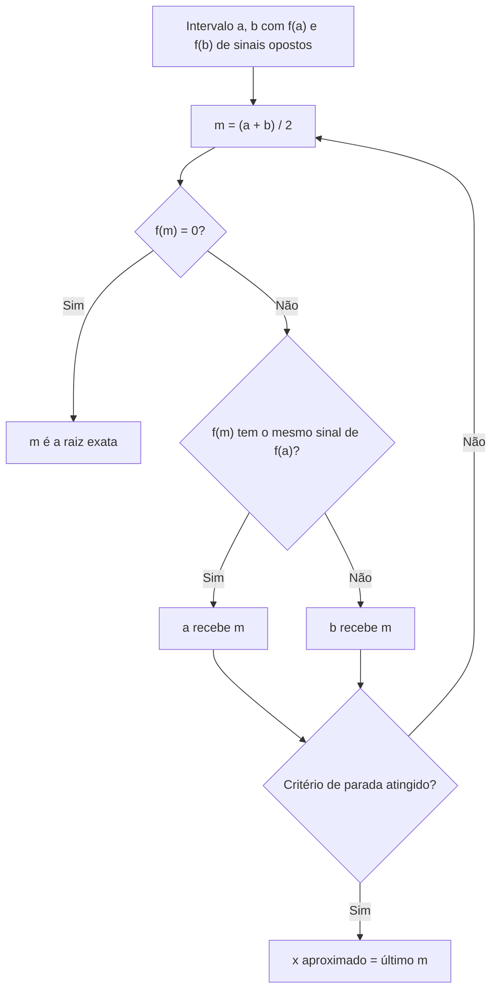

---

materia: Cálculo Numérico 
fonte: Fotos da lousa — aulas de 15/09 e 22/09 (e aula seguinte) 
tags:

- resumo
- zeros-de-funcoes
- metodos-iterativos

---
# 📝 Zeros de Funções — Bolzano, Bisseção e Newton-Raphson

## 👁️ Visão geral

Achar uma **raiz** (ou **zero**) de $f$ é achar $x$ com $f(x) = 0$. Para funções do 1º e 2º grau existe fórmula; para a maioria das outras, não — e aí entra o cálculo numérico, em duas etapas: **isolar** a raiz num intervalo (Teorema de Bolzano, 15/09) e **refiná-la** com um método iterativo: **Bisseção** (15/09) ou **Newton-Raphson** (22/09). As questões discursivas sobre o tema estão em [[Atividade — Erros e Zeros de Funções]].

## 🎯 Raízes de uma função

A **raiz** (ou **zero**) de $f$ é todo $x$ em que $f(x) = 0$ — no gráfico, onde a curva **cruza (ou toca) o eixo $x$**.

| Tipo de função                           | Exemplo da lousa                  | Como achar a raiz                                                                  |
| :--------------------------------------- | :-------------------------------- | :--------------------------------------------------------------------------------- |
| **1º grau**                              | $f(x) = 2x - 4$                   | Isolar $x$: $2x - 4 = 0 \Rightarrow x = 2$. Uma raiz (a reta corta o eixo uma vez) |
| **2º grau**                              | Parábola com raízes $x_1$ e $x_2$ | Fórmula de Bhaskara (até duas raízes)                                              |
| **3º grau em diante, ou não polinomial** | $x^3 - 9x + 3$, $x^5 - x$         | Sem fórmula prática → **métodos numéricos**                                        |

O método numérico não dá a raiz exata, e sim uma **aproximação** $\bar{x}$, tão boa quanto o número de iterações permitir.

## 📍 Isolamento de raízes: Teorema de Bolzano

> [!info] Teorema de Bolzano (como na lousa) Se $f$ é **contínua** em $[a, b]$ e $$f(a) \cdot f(b) < 0$$ (sinais **opostos** nas pontas), então **existe pelo menos uma raiz entre $a$ e $b$**.

![[bolzano-tres-casos-sinal-nas-pontas-lousa.png|300]] _Os três casos desenhados na lousa. **Em cima:** $f(a) > 0$ e $f(b) < 0$ → $f(a) \cdot f(b) < 0$ e a curva cruza o eixo uma vez. **No meio:** sinais opostos nas pontas também, mas a curva cruza **três** vezes — o teorema garante "pelo menos uma", não "exatamente uma". **Embaixo:** $f(a)$ e $f(b)$ do mesmo lado → $f(a) \cdot f(b) > 0$, e a curva não cruza o eixo._

**Como se usa para isolar:** calcula-se $f$ em alguns pontos (tabela de sinais) e procura-se onde o sinal **troca** entre dois pontos vizinhos. Esse par de pontos é o intervalo que vai para a Bisseção ou para o Newton.

> [!warning] $f(a) \cdot f(b) > 0$ não prova que não há raiz No desenho de baixo não há raiz, mas uma curva que desce, cruza o eixo e volta a subir também dá $f(a) \cdot f(b) > 0$, com **duas** raízes dentro. Sinais iguais nas pontas = **zero ou um número par** de raízes.

### Exemplos de isolamento (15/09)

**① $f(x) = x^3 - 9x + 3$**

|$x$|Conta|$f(x)$|Sinal|
|:-:|:--|:-:|:-:|
|$-1$|$(-1)^3 - 9(-1) + 3 = -1 + 9 + 3$|$11$|$+$|
|$0$|$0^3 - 9 \cdot 0 + 3$|$3$|$+$|
|$1$|$1^3 - 9 \cdot 1 + 3 = 1 - 9 + 3$|$-5$|$-$|

Troca de sinal entre $0$ e $1$ → raiz em **$[0, 1]$**.

> [!tip] Essa função tem mais raízes A lousa só tabelou de $-1$ a $1$. Continuando: $f(-4) = -25$ e $f(-3) = 3$ → outra raiz em $[-4, -3]$; $f(2) = -7$ e $f(3) = 3$ → outra em $[2, 3]$. Uma cúbica pode ter até 3 raízes reais: tabele um intervalo largo antes de concluir.

**② $f(x) = x^2 - 3$**

- **Analiticamente:** $x^2 - 3 = 0 \Rightarrow x^2 = 3 \Rightarrow x = \pm\sqrt{3} \approx \pm 1{,}732$.
- **No cálculo numérico** (fingindo que não sabemos a fórmula): $f(1) = 1 - 3 = -2$ ($-$) e $f(2) = 4 - 3 = 1$ ($+$) → raiz positiva em **$[1, 2]$**. (A negativa estaria em $[-2, -1]$.)

É um bom exemplo para **conferir** o método, porque sabemos a resposta: $\sqrt{3} \approx 1{,}7321$.

## ✂️ Método da Bisseção

**Ideia:** partir de $[a, b]$ com troca de sinal, cortar o intervalo **ao meio** e ficar com a metade onde a troca de sinal continua. A cada iteração o intervalo cai pela metade e a raiz continua presa dentro dele.

$$m = \frac{a + b}{2}$$

### Qual ponta o $m$ substitui

Na lousa, as setas diziam "**assume b**" (quando $f(m)$ deu negativo) e "**assume a**" (quando deu positivo). Isso vale **naquele exemplo**, em que $f(a) > 0$ e $f(b) < 0$. A regra geral, que funciona sempre:

> [!tip] Regra geral ==**$m$ substitui a ponta que tem o MESMO sinal de $f(m)$.**== Assim as pontas continuam com sinais opostos. Equivalente: se $f(a) \cdot f(m) < 0$, a raiz está em $[a, m]$ → $b = m$; senão, está em $[m, b]$ → $a = m$.

### Exemplo da lousa: $f(x) = x^3 - 9x + 3$ em $[0, 1]$

Sinais nas pontas: $f(0) = 3 > 0$ e $f(1) = -5 < 0$.

|Iteração|$a$|$b$|$m$|$f(m)$|Novo intervalo|
|:-:|:-:|:-:|:-:|:-:|:-:|
|1|0|1|0,5|$-1{,}375$ ($-$)|$[0;\ 0{,}5]$ — "assume b"|
|2|0|0,5|0,25|$+0{,}766$ ($+$)|$[0{,}25;\ 0{,}5]$ — "assume a"|
|3|0,25|0,5|0,375|$-0{,}322$ ($-$)|$[0{,}25;\ 0{,}375]$|
|4|0,25|0,375|0,3125|$+0{,}218$ ($+$)|$[0{,}3125;\ 0{,}375]$|
|5|0,3125|0,375|**0,34375**|||

$$\bar{x} = 0{,}34375$$

(A lousa anotou só o sinal de $f(m)$; os valores foram calculados por mim.) A raiz verdadeira é $\approx 0{,}3376$: erro $\approx 0{,}006$, dentro do limite garantido, que é metade do último intervalo: $(0{,}375 - 0{,}3125)/2 = 0{,}03125$.

> [!note] Quanto a Bisseção melhora por iteração O intervalo começa com tamanho $b - a$ e, depois de $n$ iterações, tem $\dfrac{b-a}{2^n}$. Por isso ela é **lenta** (ganha um dígito decimal a cada ~3,3 iterações), mas **sempre converge** se houver troca de sinal.

## 📐 Método de Newton-Raphson (22/09)

$$x_{n+1} = x_n - \frac{f(x_n)}{f'(x_n)}$$

onde $x_n$ = aproximação atual, $f(x_n)$ = valor da função nela, $f'(x_n)$ = valor da **derivada** nela, e $x_{n+1}$ = próxima aproximação.

Na lousa: é um **método iterativo** (cada resultado alimenta o próximo passo) e **usa a derivada**. Parte de um único ponto $x_0$ — não precisa de intervalo com troca de sinal, mas o intervalo isolado ajuda a escolher $x_0$.

> [!info] Contexto externo — de onde vem a fórmula $x_{n+1}$ é o ponto onde a **reta tangente** ao gráfico em $x_n$ corta o eixo $x$. Por isso o método "desliza pela tangente" até a raiz, e por isso falha quando a tangente é horizontal ($f'(x_n) = 0$). Ver também a Questão 6 de [[Atividade — Erros e Zeros de Funções]].

### Derivadas necessárias (revisadas na lousa)

|Regra|Exemplo|
|:--|:--|
|$(k)' = 0$ (constante)|$(-1)' = 0$|
|$(x)' = 1$|$x' = 1 \cdot x^0 = 1$|
|$(x^n)' = n \cdot x^{n-1}$|$(x^3)' = 3x^2$|
|$(c \cdot x^n)' = c \cdot n \cdot x^{n-1}$|$(3x^5)' = 3 \cdot 5x^4 = 15x^4$|
|Derivada da soma = soma das derivadas|$(x^3 - x - 1)' = 3x^2 - 1$|

### Como montar a tabela

Colunas: iteração | $x$ | $f(x)$ | $f'(x)$ | $x_{n+1}$. O $x_{n+1}$ de uma linha vira o $x$ da linha seguinte. Nos exemplos da aula, tudo com **4 casas decimais**, e para-se quando **$x_{n+1}$ repete $x_n$** nas 4 casas.

### Exemplo 1 (22/09): $f(x) = x^3 - x - 1$ em $[0, 2]$, 4 casas decimais

$f'(x) = 3x^2 - 1$; ponto inicial $x_0 = 1$.

Primeira linha, conta por conta (como na lousa): $f(1) = 1^3 - 1 - 1 = -1$; $f'(1) = 3 \cdot 1^2 - 1 = 2$; $x_1 = 1 - \dfrac{-1}{2} = 1 + 0{,}5 = 1{,}5$.

|Iteração|$x$|$f(x)$|$f'(x)$|$x_{n+1}$|
|:-:|:-:|:-:|:-:|:-:|
|0|1|$-1$|2|1,5|
|1|1,5|0,875|5,75|1,3478|
|2|1,3478|0,1006|4,4497|1,3252|
|3|1,3252|0,0021|4,2685|1,3247|
|4|1,3247|$\approx 0$||1,3247|

$$\text{raiz} \approx 1{,}3247$$

Na linha 3 a lousa tem $f(x) = 0{,}0020$; a conta dá $0{,}00206 \approx 0{,}0021$. Não muda o $x_{n+1}$.

> [!warning] $f'(1{,}5)$ numa das fotos Numa foto anterior, a linha 1 aparece com $f'(1{,}5) = 3 \cdot 1{,}5^2 - 1 = 8{,}9225$; na foto seguinte está corrigido para **5,75**. A conta certa: $1{,}5^2 = 2{,}25$; $3 \cdot 2{,}25 = 6{,}75$; $6{,}75 - 1 = 5{,}75$. Faça a potência **antes** de multiplicar.

### Exemplo 2: $f(x) = x^3 - 2x - 5$, 4 casas decimais

**Isolar primeiro:** $f(0) = -5$, $f(1) = -6$, $f(2) = -1$, $f(3) = 16$ → troca de sinal em **$(2, 3)$**. Derivada: $f'(x) = 3x^2 - 2$. Ponto inicial $x_0 = 2$: $f(2) = 8 - 4 - 5 = -1$ e $f'(2) = 3 \cdot 4 - 2 = 10$.

|Iteração|$x$|$f(x)$|$f'(x)$|
|:-:|:-:|:-:|:-:|
|0|2|$-1$|10|
|1|2,1|0,061|11,23|
|2|2,0945|$-0{,}0006$|11,16|
|3|2,0946|0,0005|11,16|
|4|**2,0946**|||

Contas das duas primeiras linhas: $x_1 = 2 - \frac{-1}{10} = 2{,}1$; $f(2{,}1) = 9{,}261 - 4{,}2 - 5 = 0{,}061$; $f'(2{,}1) = 3 \cdot 4{,}41 - 2 = 11{,}23$.

$$\text{raiz} \approx 2{,}0946$$

> [!note] Newton se autocorrige $x_2 = 2{,}1 - \frac{0{,}061}{11{,}23} = 2{,}09457\ldots$, que arredondado em 4 casas é **2,0946**; a lousa anotou 2,0945 (cortou em vez de arredondar). Mesmo assim, a iteração seguinte voltou para 2,0946. Como cada passo só depende do $x$ atual, um pequeno erro no meio do caminho é corrigido nos passos seguintes — coisa que a Bisseção não tem.

## ⚖️ Bisseção × Newton nos exemplos da aula

| Bisseção              |Newton-Raphson|
|:--|:--|:--|
| **Precisa de**        |Intervalo $[a, b]$ com troca de sinal|Um ponto $x_0$ e a derivada $f'$|
| **Cada passo**        |$m = \frac{a+b}{2}$ e escolher a metade|$x_{n+1} = x_n - f(x_n)/f'(x_n)$|
| **Resultado na aula** |5 iterações → $0{,}34375$ (erro $\approx 0{,}006$)|4 iterações → 4 casas decimais corretas|
| **Velocidade**        |Lenta (intervalo cai pela metade)|Rápida perto da raiz|
| **Garantia**          |Sempre converge com troca de sinal|Pode falhar ($f' \approx 0$, chute ruim)|

A comparação completa (tipo, taxa e garantia de convergência) está na Questão 5 de [[Atividade — Erros e Zeros de Funções]].

## 📝 Questões

**1. (lousa, 15/09)** Determine intervalos que contenham as raízes de $f(x) = x^5 - x$.

> [!question]- Resposta (resolvida por mim, confira) **Numericamente**, tabelando nos pontos $\pm 1{,}5$ e $\pm 0{,}5$:
> 
> |$x$|$-1{,}5$|$-0{,}5$|$0{,}5$|$1{,}5$|
> |:-:|:-:|:-:|:-:|:-:|
> |$f(x)$|$-6{,}09$|$+0{,}47$|$-0{,}47$|$+6{,}09$|
> 
> Três trocas de sinal → raízes em $[-1{,}5;\ -0{,}5]$, $[-0{,}5;\ 0{,}5]$ e $[0{,}5;\ 1{,}5]$.
> 
> **Conferindo analiticamente:** $x^5 - x = x(x^4 - 1) = x(x^2 - 1)(x^2 + 1)$ → raízes $-1$, $0$ e $1$, uma em cada intervalo ✔.
> 
> Cuidado: tabelar nos inteiros ($-1, 0, 1$) cai **exatamente** nas raízes ($f = 0$), e aí não há troca de sinal para ver — por isso usei pontos "entre" elas.

**2. (lousa, exercício de Bisseção)** Faça 3 iterações do Método da Bisseção para $f(x) = x^2 - 3$ em $[1, 2]$.

> [!question]- Resposta (resolvida por mim, confira) Sinais nas pontas: $f(1) = -2$ ($-$) e $f(2) = 1$ ($+$). Aqui **$f(a)$ é negativo** — o contrário do exemplo anterior.
> 
> |Iteração|$a$|$b$|$m$|$f(m)$|Novo intervalo|
> |:-:|:-:|:-:|:-:|:-:|:-:|
> |1|1|2|1,5|$-0{,}75$ ($-$)|$[1{,}5;\ 2]$|
> |2|1,5|2|1,75|$+0{,}0625$ ($+$)|$[1{,}5;\ 1{,}75]$|
> |3|1,5|1,75|1,625|$-0{,}359$ ($-$)|$[1{,}625;\ 1{,}75]$|
> 
> $\bar{x} = 1{,}625$ após 3 iterações (e a raiz está garantida em $[1{,}625;\ 1{,}75]$). Conferência: $\sqrt{3} \approx 1{,}7321$ está nesse intervalo ✔.
> 
> ⚠️ Na foto da lousa, a tabela foi para $[1;\ 1{,}5]$ na 1ª iteração e terminou em $\bar{x} = 1{,}125$. Isso é o que acontece aplicando a regra do exemplo anterior ("$f(m)$ negativo → assume b"), que só valia porque lá $f(a) > 0$. Aqui $f(1{,}5)$ tem o **mesmo sinal de $f(1)$**, então $m$ substitui o **$a$**. Sinal de alerta: $f(1{,}125) \approx -1{,}73$, longe de zero, e $\sqrt{3}$ nem está em $[1;\ 1{,}5]$. Pode ter sido corrigido depois da foto — confira no caderno.

**3. (lousa, "para fazer")** Encontre a raiz de $f(x) = x^5 - x - 1$ pelo Método de Newton-Raphson, com 4 casas decimais.

> [!question]- Resposta (resolvida por mim, confira) **Isolar:** $f(1) = 1 - 1 - 1 = -1$ e $f(2) = 32 - 2 - 1 = 29$ → raiz em $[1, 2]$. Ponto inicial $x_0 = 1$. **Derivada:** $f'(x) = 5x^4 - 1$.
> 
> |Iteração|$x$|$f(x)$|$f'(x)$|$x_{n+1}$|
> |:-:|:-:|:-:|:-:|:-:|
> |0|1|$-1$|4|1,25|
> |1|1,25|0,8018|11,2070|1,1785|
> |2|1,1785|0,0948|8,6447|1,1675|
> |3|1,1675|0,0016|8,2896|1,1673|
> |4|1,1673|$\approx 0$||1,1673|
> 
> **Raiz $\approx 1{,}1673$.** Primeira linha: $x_1 = 1 - \frac{-1}{4} = 1{,}25$. Segunda: $f(1{,}25) = 1{,}25^5 - 1{,}25 - 1 = 3{,}0518 - 2{,}25 = 0{,}8018$; $f'(1{,}25) = 5 \cdot 2{,}4414 - 1 = 11{,}2070$; $x_2 = 1{,}25 - 0{,}0715 = 1{,}1785$.

> [!abstract]- Gabarito rápido
> 
> |Questão|Resposta|
> |:-:|:--|
> |1|$[-1{,}5; -0{,}5]$, $[-0{,}5; 0{,}5]$, $[0{,}5; 1{,}5]$ (raízes $-1, 0, 1$)|
> |2|$\bar{x} = 1{,}625$; intervalo $[1{,}625; 1{,}75]$|
> |3|$\approx 1{,}1673$|

## ⚠️ Pegadinhas e erros comuns

- ==**Bisseção: $m$ substitui a ponta com o MESMO sinal de $f(m)$**==. "Negativo → assume b" só vale quando $f(a) > 0$.
- **Bolzano garante "pelo menos uma"** raiz, não exatamente uma; e sinais iguais nas pontas **não** provam que não há raiz.
- **Tabelar um intervalo largo**: $x^3 - 9x + 3$ tem três raízes, e a tabela de $-1$ a $1$ só mostra uma.
- **Newton: potência antes da multiplicação** em $f'$ ($3 \cdot 1{,}5^2 = 3 \cdot 2{,}25$).
- **Arredondar (não cortar)** nas 4 casas em cada passo, e parar quando $x_{n+1}$ repetir $x_n$.
- **Conferir o resultado**: $f(\bar{x})$ tem que dar perto de zero. Se não der, algum passo escolheu o lado errado.

## 💡 Fechamento

Sempre em duas etapas: **Bolzano** para prender a raiz num intervalo (tabela de sinais) e um **método iterativo** para apertar. A Bisseção é o método seguro e lento, que só exige olhar sinais; o Newton é o rápido, que exige a derivada e um bom ponto de partida. Na prova, a conta errada mais comum é a escolha do subintervalo na Bisseção — confira os sinais das duas pontas a cada linha.