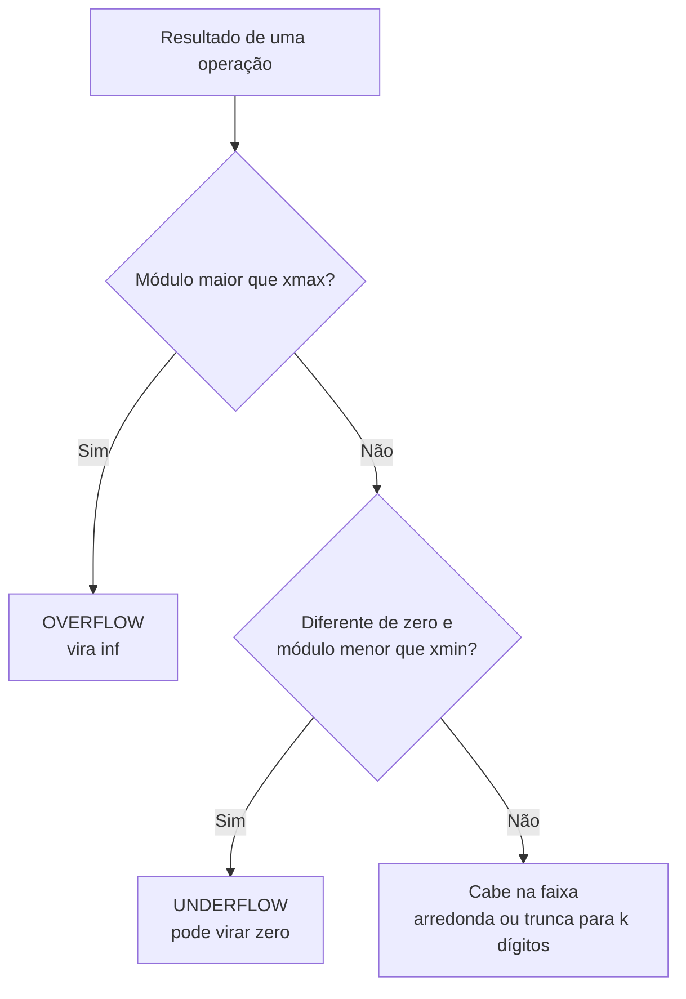

---

materia: Cálculo Numérico 
fonte: material_calculo_numerico.pdf + fotos da lousa (aulas sobre ponto flutuante e de 03/09) 
tags:

- resumo
- ponto-flutuante
- analise-de-erros

---
# 📝 Aritmética de Ponto Flutuante

## 👁️ Visão geral
O computador tem memória finita, então não consegue guardar todos os números reais: ele usa um **sistema de ponto flutuante**, com uma quantidade finita de números. Todo real que não cabe exatamente precisa ser aproximado (**truncamento** ou **arredondamento**), o que gera **erros** (absoluto e relativo). Além disso, as **operações** feitas nesse sistema perdem propriedades da matemática exata (a ordem da soma passa a importar) e podem gerar **overflow**, **underflow** e **cancelamento catastrófico**. A nota junta o PDF de apoio com o que foi dado na lousa — e ==as duas fontes usam convenções diferentes para a mantissa==, o que muda as fórmulas de menor e maior número (ver [[#Duas convenções para a mantissa]]). A base teórica de dígitos e potências está em [[Sistemas de Numeração e Mudança de Base]].

## 🔢 Sistema de ponto flutuante

### Os quatro parâmetros

| Lousa | PDF | Nome | O que define |
| :---: | :---: | :--- | :--- |
| $b$ | $\beta$ | **Base** | Em que base os dígitos são escritos (2, 10…) |
| $k$ ou $t$ | $k$ | **Nº de algarismos da mantissa** | A **precisão**: quantos dígitos significativos cabem |
| $l$ | $m$ | **Menor expoente** | Limite **inferior** do expoente |
| $u$ | $M$ | **Maior expoente** | Limite **superior** do expoente |

Na lousa o sistema aparece como $F(b, k, l, u)$ (e numa recapitulação como $F(b, t, l, u)$); no PDF, como $F(\beta, k, m, M)$. É o mesmo sistema com letras diferentes. Exemplo da lousa: $F(10, 4, -3, 3)$ = base 10, 4 algarismos, expoente de $-3$ a $3$.

### Duas convenções para a mantissa

**Convenção da lousa** (a que a professora usa):

$$\bar{x} = \pm\, d_1{,}d_2 d_3 \dots d_k \times b^{e}, \qquad d_1 \neq 0, \qquad l \le e \le u$$

A vírgula fica **depois do primeiro dígito**, como na notação científica. Ex.: $2{,}314 \cdot 10^2$.

**Convenção do PDF:**

$$x = \pm\, 0{,}d_1 d_2 \dots d_k \times \beta^{e}, \qquad d_1 \neq 0, \qquad m \le e \le M$$

A vírgula fica **antes do primeiro dígito**. Ex.: $0{,}2314 \cdot 10^3$.

Nos dois casos:
- $d_1 \neq 0$ é o que torna a representação **normalizada** (cada número tem **uma única** forma de ser escrito);
- $d_1$ vai de $1$ a $b-1$ e os demais dígitos de $0$ a $b-1$;
- o expoente tem que ficar dentro do intervalo, **inclusive** nas pontas.

> [!warning] As convenções mudam o expoente em 1
> O mesmo número tem expoente **uma unidade menor** na convenção da lousa: $2{,}314 \cdot 10^{2} = 0{,}2314 \cdot 10^{3}$. Os **dígitos** da mantissa são os mesmos, então arredondamento, erros e operações dão o mesmo resultado nas duas. O que muda é tudo que depende do **limite do expoente**: $x_{min}$, $x_{max}$, overflow e underflow. ==Na prova, siga o formato do enunciado.== O **resumo de revisão** (material em que a prova deve se basear) usa $0{,}d_1 d_2\dots$, com mantissa $1/b \le m < 1$ — a mesma convenção do PDF. A lousa usa $d_1{,}d_2\dots$. Se o enunciado não deixar claro, use a do resumo de revisão e escreva o número no formato que usou.

> [!warning] "< b − 1" na lousa
> Na lousa as condições aparecem como $0 < d_1 < b-1$ e $d_1, d_2, \dots, d_k < b-1$. O certo é **$\le$**: em base 10 o dígito 9 ($= b - 1$) é permitido — tanto que a própria contagem da lousa usa **9** opções para $d_1$ e o máximo é $9{,}999 \cdot 10^3$.

### Menor e maior número positivo

| | Convenção da lousa ($d_1{,}d_2\dots$) | Convenção do PDF ($0{,}d_1 d_2\dots$) |
| :--- | :--- | :--- |
| **Maior** ($x_{max}$) | todos os dígitos $= b-1$, expoente $u$: $(b - b^{1-k}) \cdot b^{u}$ | $(1 - \beta^{-k}) \cdot \beta^{M}$ |
| **Menor** ($x_{min}$, em módulo) | $1{,}00\dots0 \cdot b^{l} = b^{\,l}$ | $0{,}10\dots0 \cdot \beta^{m} = \beta^{\,m-1}$ |
| $F(10, 4, -2, 3)$: maior | $9{,}999 \cdot 10^3 = 9999$ | $0{,}9999 \cdot 10^3 = 999{,}9$ |
| $F(10, 4, -2, 3)$: menor | $1{,}000 \cdot 10^{-2} = 0{,}01$ | $0{,}1000 \cdot 10^{-2} = 0{,}001$ |

Na prática, não precisa decorar a fórmula: **monte o número** com a maior mantissa possível (tudo 9, em base 10) e o maior expoente, ou com a menor mantissa ($1{,}000$ na lousa, $0{,}1000$ no PDF) e o menor expoente.

### Quantos números o sistema tem

A contagem **é a mesma nas duas convenções**. Monta-se como na lousa, casa por casa:

$$N = \underbrace{2}_{\pm} \cdot \underbrace{(b-1)}_{d_1} \cdot \underbrace{b^{\,k-1}}_{d_2 \dots d_k} \cdot \underbrace{(u - l + 1)}_{\text{expoentes}} + \underbrace{1}_{\text{zero}}$$

- **2**: sinal $+$ ou $-$;
- **$b - 1$**: opções para $d_1$ (não pode ser 0);
- **$b$** para cada um dos outros $k - 1$ dígitos;
- **$u - l + 1$**: quantidade de expoentes (intervalo **fechado**);
- **$+1$**: o **zero**, que não tem forma normalizada (nenhum $d_1 \ne 0$ dá zero) e é contado à parte.

> [!example] Lousa — $F(10, 4, -2, 3)$
> Expoentes possíveis: $-2, -1, 0, 1, 2, 3$ → **6**.
> $$N = 2 \cdot 9 \cdot 10 \cdot 10 \cdot 10 \cdot 6 = 108\,000$$
> $$N = 108\,000 + 1 \ (\text{zero}) = \mathbf{108\,001}$$
> Máximo: $9{,}999 \cdot 10^3$. Mínimo (em módulo): $1{,}000 \cdot 10^{-2}$.

### Regiões da reta: onde dá underflow e overflow

![[ponto-flutuante-reta-underflow-overflow-lousa.png]]
*Reta desenhada na lousa: os números representáveis ficam entre $-M$ e $-m$ e entre $m$ e $M$ (aqui $M$ = maior e $m$ = menor positivo). A faixa em volta do zero, entre $-m$ e $m$, é a região de **underflow**; além de $\pm M$, a de **overflow**.*

Atenção à notação desse desenho: ali $M$ e $m$ são o **maior e o menor número** do sistema, não os expoentes (que no PDF também se chamam $M$ e $m$).

## ✂️ Truncamento e arredondamento

Quando o número tem mais dígitos do que os $k$ da mantissa, ele precisa ser cortado para caber. Primeiro **normalize**, depois corte:

| Técnica | Regra | $2/3 = 6{,}66666\ldots \cdot 10^{-1}$ com $k = 4$ |
| :--- | :--- | :--- |
| **Truncamento (corte)** | Descarta **todos** os dígitos depois do $k$-ésimo, sem olhar para eles | $6{,}666 \cdot 10^{-1}$ |
| **Arredondamento (regra do PDF)** | Olha o $(k+1)$-ésimo dígito: se for **$\ge b/2$** (em base 10, $\ge 5$), soma 1 ao $k$-ésimo | 5º dígito $= 6$ → $6{,}667 \cdot 10^{-1}$ |

### Arredondamento pela ABNT (regra usada na lousa)

A lousa usou a regra da **ABNT**, que só difere da regra do PDF quando o dígito descartado é **exatamente 5**:

| Dígito descartado | O que fazer | Exemplos da lousa (2 casas) |
| :--- | :--- | :--- |
| **Maior que 5** | Sobe 1 | $12{,}37\,\vert\,6 \to 12{,}38$ |
| **Menor que 5** | Mantém | $12{,}37\,\vert\,4 \to 12{,}37$ |
| **Igual a 5**, dígito anterior **ímpar** | Sobe 1 (fica par) | $12{,}37\,\vert\,5 \to 12{,}38$ (7 é ímpar) |
| **Igual a 5**, dígito anterior **par** | Mantém | $12{,}36\,\vert\,5 \to 12{,}36$ (6 é par) |

> [!tip] Macete
> No empate (5), o resultado **sempre termina em par**. $12{,}375 \to 12{,}38$ (8 par); $12{,}365 \to 12{,}36$ (6 par).

> [!info] Contexto externo
> Pela norma (ABNT NBR 5891), a regra do par só vale quando o 5 é o **último** dígito (ou é seguido só de zeros). Se depois do 5 vier qualquer dígito não nulo ($12{,}3651$), o número está acima da metade e **sobe** normalmente.

> [!warning] A diferença cai em conta
> Na lousa, $a = 87{,}45$ em $F(10, 3, -5, 5)$ virou $8{,}74 \cdot 10^1$ (descarta 5, anterior 4 é par → mantém). Pela regra simples do PDF seria $8{,}75 \cdot 10^1$. Já $b = 3{,}515$ virou $3{,}52$ nas duas regras (anterior 1 é ímpar → sobe).

**Arredondamento erra menos que truncamento:** no exemplo de $2/3$ (ver [[#PDF — Exercício 2 (arredondamento vs truncamento)]]), o erro relativo do arredondamento ($\approx 0{,}005$%) é **metade** do do truncamento ($\approx 0{,}01$%).

i have a script to generate ai images, i need prompt ideas, based on this prompt of mine give me more (format correctly so i just need to paste under it), in order to have some good variety of poses, styles, features, etc. like this one is just 1girl, do create many variations for this one girl, but also try 1girl, 2girls (yuri), 1girl 1boy (het), etc. just keep the main girl with the same features of [loli,twintail,black hair, red eyes, small body]. Im using sdxl model#;[ # 💻 Padrão IEEE 754

É o padrão que os computadores reais usam, em **base 2**. Cada número é guardado em três campos: **sinal**, **expoente** e **mantissa**.

| Tipo | Tamanho | Sinal | Expoente | Mantissa | Precisão decimal |
| :--- | :---: | :---: | :---: | :---: | :---: |
| **Precisão simples** (`float`) | 32 bits | 1 bit | 8 bits | 23 bits | ~7 dígitos |
| **Precisão dupla** (`double`) | 64 bits | 1 bit | 11 bits | 52 bits | ~16 dígitos |

Confira que fecha a soma: $1 + 8 + 23 = 32$ e $1 + 11 + 52 = 64$.

Mais bits de **mantissa** → mais **precisão**. Mais bits de **expoente** → **faixa** maior (números maiores e menores antes de overflow/underflow). O `double` ganha nos dois.

## 📏 Análise de erros

Seja $x$ o valor **exato** e $\bar{x}$ a **aproximação** (notação da lousa e do PDF).

$$EA = |\bar{x} - x| \qquad\qquad E_r = \frac{|\bar{x} - x|}{|x|} \quad (x \neq 0)$$

A lousa escreve $EA = |\bar{x} - x|$ e o PDF $E_a = |x - \bar{x}|$ — dá no mesmo, por causa do módulo.

| Erro | O que mede | Unidade | Quando usar |
| :--- | :--- | :--- | :--- |
| **Absoluto** $EA$ | Distância entre exato e aproximado | Mesma do valor | Quando a escala do número é conhecida |
| **Relativo** $E_r$ | Erro **em proporção** ao tamanho do valor exato | Adimensional (vira %) | Para comparar precisão entre números de tamanhos diferentes |

> [!example] Lousa (03/09) — $F(10, 4, -5, 5)$, $x = 4{,}37589 \cdot 10^3$
> 1. Cortar em 4 algarismos: $4{,}375\,|\,89$. O dígito descartado é 8 (> 5) → sobe: $\bar{x} = 4{,}376 \cdot 10^3$.
> 2. $EA = |4{,}376 \cdot 10^3 - 4{,}37589 \cdot 10^3| = 0{,}00011 \cdot 10^3 = \mathbf{0{,}11}$
> 3. (Extra, não estava na lousa) $E_r = 0{,}11 / 4375{,}89 \approx 2{,}5 \cdot 10^{-5} \approx 0{,}0025$%.

> [!warning] Divide pelo **exato**
> No erro relativo, o denominador é $|x|$ (o valor **exato**), não $|\bar{x}|$. E ele não existe para $x = 0$.

## ➕ Operações em ponto flutuante

Toda operação é feita em dois tempos: **opera** e depois **arredonda o resultado** para $k$ algarismos. Na soma e na subtração, antes de operar é preciso **alinhar os expoentes pelo maior** (deslocar a vírgula do número menor). Isso tem duas consequências cobradas na aula:

1. **A soma deixa de ser associativa**: a ordem das parcelas muda o resultado. Um número pequeno somado a um grande pode "sumir" no arredondamento.
2. **Expressões algebricamente iguais dão resultados diferentes**: $(a-b)^2$ e $a^2 - 2ab + b^2$ são a mesma coisa na matemática, mas não no computador.

Os dois exemplos da lousa estão em [[#Lousa — Ordem da soma muda o resultado]] e [[#Lousa — (a − b)² calculado de dois jeitos]]. O caso extremo, a subtração de números muito próximos, é o **cancelamento catastrófico** (abaixo).

> [!tip] Na prova
> Para somar muitos números: **some os pequenos primeiro** (em ordem crescente de módulo). Para escolher entre duas fórmulas equivalentes: prefira a que faz **menos operações** e **evita subtrair números próximos**.

## 🚨 Anomalias computacionais

| Anomalia | O que acontece | Consequência |
| :--- | :--- | :--- |
| **Overflow** | O resultado, em módulo, é **maior que $x_{max}$** | Vira `inf` (ou `NaN` em operações seguintes) |
| **Underflow** | O resultado é **não nulo**, mas em módulo **menor que $x_{min}$** | Pode ser **zerado** |
| **Cancelamento catastrófico** | Subtração de dois números **muito próximos** | Os dígitos iguais se cancelam e sobram poucos (ou nenhum) dígitos **significativos** confiáveis |

> [!warning] Cancelamento catastrófico não é overflow nem underflow
> O resultado **cabe** na faixa do sistema — o problema é de **precisão**, não de tamanho. Os zeros que aparecem ao renormalizar o resultado são "enchimento": não carregam informação real.

**Como contornar o cancelamento:** reescrever a expressão algebricamente para **trocar a subtração por uma soma** (ex.: racionalização). Ver [[#PDF — Exercício 4 (cancelamento catastrófico)]].

## 🧮 Fórmulas

| Fórmula | Para quê |
| :--- | :--- |
| $\bar{x} = \pm\, d_1{,}d_2\dots d_k \cdot b^e$, $d_1 \neq 0$, $l \le e \le u$ | Forma normalizada (**lousa**) |
| $x = \pm\, 0{,}d_1\dots d_k \cdot \beta^e$, $d_1 \neq 0$, $m \le e \le M$ | Forma normalizada (**PDF**) |
| Lousa: $x_{max} = (b-1){,}(b-1)\dots \cdot b^{u}$ ; $x_{min} = b^{\,l}$ | Maior / menor positivo (lousa) |
| PDF: $x_{max} = (1-\beta^{-k})\,\beta^{M}$ ; $x_{min} = \beta^{\,m-1}$ | Maior / menor positivo (PDF) |
| $N = 2\,(b-1)\,b^{k-1}\,(u-l+1) + 1$ | Quantidade de números (igual nas duas) |
| Arredonda para cima se dígito $k+1 \ge b/2$ | Regra de arredondamento (PDF) |
| Empate em 5 → resultado termina em **par** | Regra ABNT (lousa) |
| $EA = \lvert \bar{x}-x \rvert$ | Erro absoluto |
| $E_r = \lvert \bar{x}-x \rvert / \lvert x \rvert$ | Erro relativo |

## ✏️ Exemplos resolvidos

### Lousa — Ordem da soma muda o resultado
**Em $F(10, 4, -5, 5)$, calcule $S_1 = 42450 + \sum_{i=1}^{4} 3$ e $S_2 = \sum_{i=1}^{4} 3 + 42450$.**

Valor exato das duas: $42450 + 12 = 42462$.

**$S_1$ (o grande primeiro, somando 3 de cada vez):**
1. $42450 = 4{,}245 \cdot 10^4$ e $3 = 0{,}0003 \cdot 10^4$ (alinhado pelo maior expoente).
2. $4{,}2450 + 0{,}0003 = 4{,}2453 \cdot 10^4$ → 4 algarismos: $4{,}245\,|\,3$ → descarta 3 → $4{,}245 \cdot 10^4 = 42450$.
3. O "+3" sumiu. Repetindo mais três vezes, acontece o mesmo.

$$S_1 = 42450$$

**$S_2$ (os pequenos primeiro):**
1. $3 + 3 = 6$; $6 + 3 = 9$; $9 + 3 = 12$ — todas exatas.
2. $12 = 0{,}0012 \cdot 10^4$; $0{,}0012 + 4{,}2450 = 4{,}2462 \cdot 10^4$ → $4{,}246\,|\,2$ → $4{,}246 \cdot 10^4$.

$$S_2 = 4{,}246 \cdot 10^4 = 42460$$

| | Resultado | $EA$ |
| :--- | :---: | :---: |
| $S_1$ (grande primeiro) | 42450 | 12 |
| $S_2$ (pequenos primeiro) | 42460 | 2 |

Somando os pequenos antes, eles se acumulam num valor grande o bastante para "aparecer" nos 4 algarismos.

### Lousa — (a − b)² calculado de dois jeitos
**Em $F(10, 3, -5, 5)$, com $a = 87{,}45$ e $b = 3{,}515$, calcule $(a-b)^2$ direto e pela forma expandida $a^2 - 2ab + b^2$.**

**Representar $a$ e $b$ com 3 algarismos (ABNT):**
- $a = 8{,}74\,|\,5 \cdot 10^1$ → descarta 5, anterior 4 é **par** → $a = 8{,}74 \cdot 10^1$
- $b = 3{,}51\,|\,5 \cdot 10^0$ → descarta 5, anterior 1 é **ímpar** → $b = 3{,}52 \cdot 10^0$

**Jeito 1 — direto (feito na lousa):**
1. Alinhar: $b = 3{,}52 \cdot 10^0 = 0{,}35 \cdot 10^1$ (só cabem as casas dos 3 algarismos do $a$; o 2 que sobra cai fora).
2. $a - b = 8{,}74 \cdot 10^1 - 0{,}35 \cdot 10^1 = 8{,}39 \cdot 10^1$
3. $(a-b)^2 = (8{,}39 \cdot 10^1)^2 = 70{,}3921 \cdot 10^2 = 7{,}03921 \cdot 10^3$ → $7{,}03\,|\,921$ → sobe → $\mathbf{7{,}04 \cdot 10^3}$

**Jeito 2 — expandido (a foto corta o resultado; refiz a conta):**
1. $a^2 = (8{,}74 \cdot 10^1)^2 = 76{,}3876 \cdot 10^2 = 7{,}63876 \cdot 10^3$ → $7{,}64 \cdot 10^3$
2. $b^2 = (3{,}52)^2 = 12{,}3904 = 1{,}23904 \cdot 10^1$ → $1{,}24 \cdot 10^1$
3. $2ab = 2 \cdot 8{,}74 \cdot 10^1 \cdot 3{,}52 \cdot 10^0 = 61{,}5296 \cdot 10^1 = 6{,}15296 \cdot 10^2$ → $6{,}15 \cdot 10^2$
4. $a^2 - 2ab = 7{,}64 \cdot 10^3 - 0{,}615 \cdot 10^3 = 7{,}025 \cdot 10^3$ → descarta 5, anterior 2 é par → $7{,}02 \cdot 10^3$
5. $+\,b^2$: $7{,}02 \cdot 10^3 + 0{,}0124 \cdot 10^3 = 7{,}0324 \cdot 10^3$ → $\mathbf{7{,}03 \cdot 10^3}$

| | Resultado |
| :--- | :---: |
| Jeito 1: $(a-b)^2$ | $7{,}04 \cdot 10^3$ |
| Jeito 2: $a^2 - 2ab + b^2$ | $7{,}03 \cdot 10^3$ |
| Exato com $a = 87{,}45$ e $b = 3{,}515$ | $7045{,}08\ldots \approx 7{,}05 \cdot 10^3$ |

O jeito direto faz **menos operações** (menos arredondamentos) e ficou mais perto do exato.

> [!warning] Confira no seu caderno
> Pela foto, a lousa mostra $a^2 = 76{,}3876 \cdot 10^1 = 7{,}64 \cdot 10^2$ e $2ab = 62{,}5856 \cdot 10^1$. Pelas contas: $(10^1)^2 = 10^{2}$, então $a^2 = 76{,}3876 \cdot 10^{\mathbf{2}} = 7{,}64 \cdot 10^{\mathbf{3}}$ (afinal $a \approx 87$ e $87^2 \approx 7600$); e $2 \cdot 8{,}74 \cdot 3{,}52 = 61{,}5296$, não $62{,}5856$. Pode ser erro na leitura da foto ou algo corrigido depois.

### PDF — Exercício 1 (limites e total de números)
**Dado $F(10, 3, -2, 2)$, determine o menor e o maior positivo e a quantidade total de números.**

Convenção do PDF ($0{,}d_1 d_2 d_3$):
1. $x_{min} = 0{,}100 \cdot 10^{-2} = 0{,}001$
2. $x_{max} = 0{,}999 \cdot 10^{2} = 99{,}9$
3. $N_{pos} = 9 \cdot 10^{2} \cdot 5 = 4500$; total $= 2 \cdot 4500 + 1 = 9001$

Na convenção da lousa, o mesmo sistema daria $x_{min} = 1{,}00 \cdot 10^{-2} = 0{,}01$ e $x_{max} = 9{,}99 \cdot 10^{2} = 999$. O total **continua** 9001.

### PDF — Exercício 2 (arredondamento vs truncamento)
**Represente $x = 2/3$ em $F(10, 4, -5, 5)$ por truncamento e por arredondamento, e calcule os erros relativos.**

$x = 0{,}666666\ldots \cdot 10^0$ (PDF) $= 6{,}66666\ldots \cdot 10^{-1}$ (lousa) — mesmos dígitos.
- **Truncamento:** $\bar{x}_T = 0{,}6666$ → $E_r = \dfrac{|2/3 - 0{,}6666|}{2/3} = \dfrac{0{,}0000667}{0{,}6666\ldots} = 0{,}0001 = 0{,}01$%
- **Arredondamento:** 5º dígito $= 6 \ge 5$ → $\bar{x}_A = 0{,}6667$ → $E_r = \dfrac{|2/3 - 0{,}6667|}{2/3} = \dfrac{0{,}0000333}{0{,}6666\ldots} = 0{,}00005 = 0{,}005$%

### PDF — Exercício 3 (soma com alinhamento)
**Efetue $x + y$ em $F(10, 3, -5, 5)$ com arredondamento, sendo $x = 0{,}425 \cdot 10^3$ e $y = 0{,}184 \cdot 10^1$.**

1. **Alinhar pelo maior expoente** ($e = 3$): $y = 0{,}00184 \cdot 10^3$
2. **Somar as mantissas:** $0{,}425 + 0{,}00184 = 0{,}42684 \cdot 10^3$
3. **Normalizar:** já está.
4. **Arredondar para 3 dígitos:** 4º dígito $= 8$ → $0{,}427 \cdot 10^3 = 427$ (exato: $426{,}84$)

### PDF — Exercício 4 (cancelamento catastrófico)
**Avalie $f(x) = \sqrt{x+1} - \sqrt{x}$ para $x = 500$ com 4 dígitos significativos e contorne a perda de precisão.**

**Direto (ruim):** $\sqrt{501} \approx 22{,}3830 \to 22{,}38$; $\sqrt{500} \approx 22{,}3606 \to 22{,}36$; subtração: $22{,}38 - 22{,}36 = 0{,}02000$. Os três primeiros dígitos se cancelaram: sobrou **um** dígito significativo real; os zeros são enchimento.

**Racionalizando:**
$$f(x) = \frac{(x+1) - x}{\sqrt{x+1} + \sqrt{x}} = \frac{1}{\sqrt{x+1} + \sqrt{x}}$$
Denominador: $22{,}38 + 22{,}36 = 44{,}74$ → $f(500) \approx 1/44{,}74 \approx 0{,}02235$. O verdadeiro é $\approx 0{,}022349$: a forma racionalizada acerta os 4 dígitos; a direta errava cerca de $10$%.

## 📝 Questões

**Q1 (lousa).** No sistema $F(10, 3, -4, 4)$, quantos números existem, qual é o maior e qual é o menor positivo?

> [!question]- Resposta (resolvida por mim, confira)
> Expoentes: de $-4$ a $4$ → $4 - (-4) + 1 = 9$.
> - $N = 2 \cdot 9 \cdot 10 \cdot 10 \cdot 9 + 1 = 16\,200 + 1 = \mathbf{16\,201}$
> - Maior (lousa): $9{,}99 \cdot 10^4 = \mathbf{99\,900}$
> - Menor positivo (lousa): $1{,}00 \cdot 10^{-4} = \mathbf{0{,}0001}$
>
> (Na convenção do PDF seriam $0{,}999 \cdot 10^4 = 9990$ e $0{,}100 \cdot 10^{-4} = 0{,}00001$; o $N$ não muda.)

**Q2 (lousa).** No sistema $F(10, 4, -3, 3)$, o número $2{,}314 \cdot 10^2$ é representável? Quantos números o sistema tem, e quais são o maior e o menor positivo?

> [!question]- Resposta (resolvida por mim, confira)
> - $2{,}314 \cdot 10^2$: $d_1 = 2 \neq 0$, 4 algarismos, expoente $2 \in [-3, 3]$ → **é representável**.
> - Expoentes: $-3$ a $3$ → 7. $N = 2 \cdot 9 \cdot 10^3 \cdot 7 + 1 = \mathbf{126\,001}$
> - Maior: $9{,}999 \cdot 10^3$; menor positivo: $1{,}000 \cdot 10^{-3}$.

**Q3 (lousa, 03/09).** Em $F(10, 3, -5, 5)$, represente $x = 1{,}375 \cdot 10^4$ e calcule o erro absoluto.

> [!question]- Resposta (resolvida por mim, confira)
> 1. 3 algarismos: $1{,}37\,|\,5$. O descartado é **exatamente 5** e o anterior (7) é **ímpar** → pela ABNT, sobe: $\bar{x} = \mathbf{1{,}38 \cdot 10^4}$. (A regra simples do PDF dá o mesmo aqui.)
> 2. $EA = |1{,}38 \cdot 10^4 - 1{,}375 \cdot 10^4| = 0{,}005 \cdot 10^4 = \mathbf{50}$
>
> Em uma das fotos o exercício aparece só como $x = 1{,}375$ (sem o $10^4$): a representação fica $1{,}38$ e o $EA = 0{,}005$.
> Por truncamento seria $1{,}37 \cdot 10^4$, com $EA = 50$ também, mas para o outro lado.

**Q4 (PDF).** No sistema $F(10, 3, -4, 4)$ com arredondamento, qual é a representação de $x = 12{,}385$?

> [!success]- Resposta
> **$0{,}124 \cdot 10^2$ (PDF) $= 1{,}24 \cdot 10^1$ (lousa) $= 12{,}4$.**
> Normalizar e cortar em 3 dígitos: $0{,}123\,|\,85$. O 4º dígito é $8 \ge 5$ → sobe. (Não é empate em 5, então ABNT e regra simples concordam.)
>
> Armadilha: arredondar pelas casas decimais de $12{,}385$ (daria $12{,}39$) — o corte é nos **3 algarismos significativos**.

**Q5 (PDF).** Valor exato $v = 2{,}71828$, aproximado $\bar{v} = 2{,}71800$. Calcule os erros absoluto e relativo.

> [!success]- Resposta
> **$EA = 0{,}00028$; $E_r \approx 0{,}000103$ ($0{,}0103$%).**
> $EA = |2{,}71800 - 2{,}71828| = 0{,}00028$; $E_r = 0{,}00028 / 2{,}71828 \approx 0{,}000103$ — dividindo pelo **exato**.

**Q6 (PDF).** Em $F(2, 4, -2, 2)$, qual é o maior número positivo, em decimal?

> [!success]- Resposta
> **Convenção do PDF: $3{,}75$.**
> Maior mantissa $(0{,}1111)_2 = \tfrac{15}{16} = 0{,}9375$; maior expoente $2^2 = 4$ → $0{,}9375 \times 4 = 3{,}75$.
>
> ⚠️ Na **convenção da lousa** a resposta muda: maior mantissa $(1{,}111)_2 = 1 + \tfrac12 + \tfrac14 + \tfrac18 = 1{,}875$; $x_{max} = 1{,}875 \times 2^2 = \mathbf{7{,}5}$. Se cair na prova, veja em que formato o enunciado escreve a mantissa.

**Q7 (PDF).** Que fenômeno ocorre em $(1{,}0 \cdot 10^{-30}) \times (1{,}0 \cdot 10^{-30})$ num sistema com menor expoente $-50$?

> [!success]- Resposta
> **Underflow.**
> O produto é $1{,}0 \cdot 10^{-60}$: **não nulo**, mas com expoente $-60 < -50$. Na convenção da lousa ($d_1{,}d_2\dots$), é exatamente esse o expoente, como o material diz. (Na convenção $0{,}d_1\dots$ seria $0{,}1 \cdot 10^{-59}$; $-59 < -50$ também, então a conclusão é a mesma.)
> Não é overflow: o número é **pequeno demais**, não grande demais.

> [!abstract]- Gabarito rápido
>
> | Questão | Resposta |
> | :---: | :--- |
> | Q1 | $N = 16\,201$; máx $9{,}99 \cdot 10^4$; mín $1{,}00 \cdot 10^{-4}$ |
> | Q2 | Sim; $N = 126\,001$; máx $9{,}999 \cdot 10^3$; mín $1{,}000 \cdot 10^{-3}$ |
> | Q3 | $1{,}38 \cdot 10^4$; $EA = 50$ |
> | Q4 | $1{,}24 \cdot 10^1 = 12{,}4$ |
> | Q5 | $EA = 0{,}00028$; $E_r \approx 0{,}0103$% |
> | Q6 | $3{,}75$ (PDF) / $7{,}5$ (lousa) |
> | Q7 | Underflow |
>

## ⚠️ Pegadinhas e erros comuns

- ==**Convenção da mantissa**==: lousa $d_1{,}d_2\dots$ vs PDFs e resumo de revisão $0{,}d_1 d_2\dots$ ($1/b \le m < 1$) — o expoente muda em 1 e, com ele, $x_{min}$ e $x_{max}$. A contagem $N$ é igual.
- **Dígitos vão até $b - 1$ inclusive** ($\le$, não $<$ como aparece na lousa).
- **Contagem de expoentes é $u - l + 1$** (intervalo fechado): de $-2$ a $3$ são 6.
- **Não esquecer o zero** ($+1$) nem o sinal ($\times 2$) no total.
- **$d_1$ tem $b - 1$ opções**; os demais, $b$.
- **Normalizar antes de arredondar/truncar**: o corte é nos $k$ algarismos **significativos**.
- **ABNT no empate (5)**: resultado termina em **par** ($87{,}45 \to 87{,}4$ com 3 algarismos, não $87{,}5$).
- **Soma: alinhar pelo maior expoente**; somar os **pequenos primeiro**.
- **$(a - b)^2 \ne a^2 - 2ab + b^2$ no computador**: equivalentes na álgebra, diferentes em ponto flutuante.
- **Ao elevar ao quadrado, o expoente dobra**: $(8{,}74 \cdot 10^1)^2 = 76{,}3876 \cdot 10^{2}$.
- **Erro relativo divide pelo exato**, e não existe para $x = 0$.
- **Underflow ≠ cancelamento catastrófico**: um é falta de **faixa**, o outro, perda de **dígitos significativos**.

## 💡 Fechamento
O sistema $F(b, k, l, u)$ tem dois limites: o **$k$** limita a **precisão** (e gera erros de arredondamento, medidos por $EA$ e $E_r$, que se acumulam a cada operação e fazem a ordem das contas importar), e o **par $l, u$** limita a **faixa** (e gera underflow/overflow). Na hora da prova, confira sempre a convenção da mantissa e a regra de arredondamento em uso.