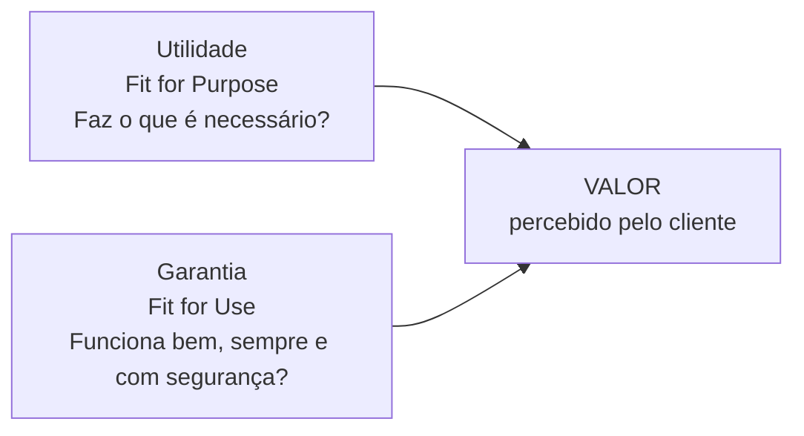
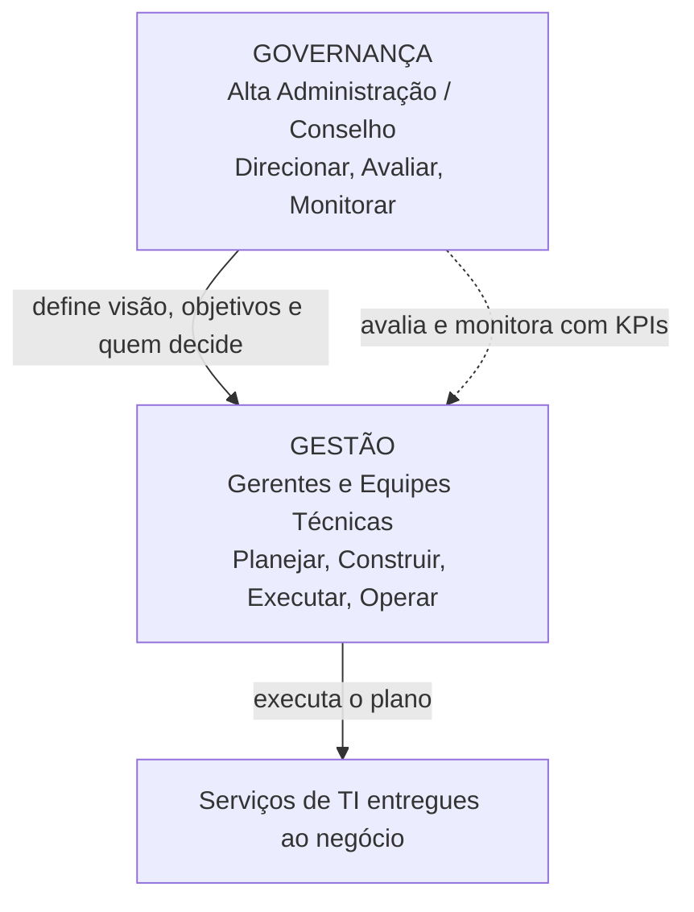
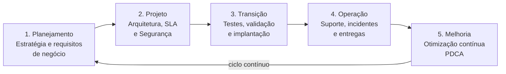

---

materia: Gestão de Serviços de TI 
fonte: Aula 1 - Introdução à Gestão de Serviços de TI.pdf 
tags:

- resumo
- gsti
- itil
- governanca

---
# 📝 Introdução à Gestão de Serviços de TI

## 👁️ Visão geral

Primeira aula da **Unidade 1 — Fundamentos e Governança**. A ideia central é que a TI deixou de ser um centro de custos e virou parceira estratégica do negócio. A partir disso a aula define **GSTI**, **serviço** e **valor** (Utilidade + Garantia), separa **Governança** de **Gestão**, percorre as **cinco fases do ciclo de vida** do serviço e termina mostrando quanto custa uma falha de TI, com um estudo de caso de Black Friday.

---

## 🔄 A evolução da Tecnologia da Informação

### Da visão operacional à visão estratégica

| Aspecto | TI no passado (**visão operacional**) | TI no presente (**visão estratégica**) |
| :--- | :--- | :--- |
| Como é vista | Puramente como **Centro de Custos** | **Parceira Estratégica** principal |
| Foco | Exclusivamente suporte técnico e manutenção de computadores | Agente fundamental de **inovação** e **Transformação Digital** |
| Postura | **Reativa** às solicitações da empresa | Geração **contínua** de valor de negócio |
| Relação com o negócio | **Isolada** dos objetivos de negócio | **Alinhada** diretamente às metas de faturamento e expansão |

**Centro de custos** é a área que a empresa enxerga só como despesa: algo necessário, mas que não gera receita e que deve custar o mínimo possível. Nessa visão, a TI "conserta computador quando alguém liga". Na visão **estratégica**, a TI participa das decisões do negócio e ajuda diretamente a ganhar dinheiro e crescer.

### Transformação digital

A transformação digital redefiniu radicalmente a TI: ==ela deixou de apenas **dar suporte** ao negócio para se tornar a **própria essência** dos negócios modernizados==.

Exemplos citados na aula: **Bancos Digitais**, **E-commerce**, **Inteligência Artificial**, **Computação em Nuvem**, **Big Data Analytics** e **Internet das Coisas (IoT)**.

> [!example] Por que "essência" e não "suporte"
> Um banco digital não tem agência: o aplicativo **é** o banco. Uma loja de e-commerce sem site no ar simplesmente não vende. Nesses negócios, se a TI para, o negócio inteiro para — é isso que a aula quer dizer com TI como essência.

---

## ⚙️ Conceito de GSTI

> [!info] Definição
> **Gestão de Serviços de TI (GSTI)** é o **conjunto de capacidades organizacionais especializadas em prover valor aos clientes na forma de serviços**.

Em outras palavras: GSTI é a maneira como a organização se estrutura para transformar tecnologia em **serviços** que entregam valor. O foco não é o equipamento nem o software em si, e sim o **serviço** que o cliente recebe.

O material usa GSTI tanto como **Gestão** quanto como **Gerenciamento** de Serviços de TI — são a mesma coisa.

A aula apresenta a GSTI em **4 etapas**:

| Etapa | O que se faz |
| :--- | :--- |
| **1. Planejar** | Compreender os objetivos do negócio e desenhar a estratégia ideal de TI |
| **2. Desenvolver** | Criar, codificar ou adquirir soluções tecnológicas estruturadas |
| **3. Entregar** | Implantar os serviços no ambiente produtivo de forma transparente e segura |
| **4. Operar & Melhorar** | Garantir sustentabilidade operacional diária e evolução contínua |

> [!warning] Cuidado
> Essas **4 etapas** da GSTI não são as **5 fases do ciclo de vida** do serviço (Planejamento, Projeto, Transição, Operação, Melhoria), que aparecem mais adiante. As ideias se parecem, mas as listas são diferentes — veja [[#🔁 O ciclo de vida dos serviços de TI]].

---

## 🧩 O que é um serviço de TI

> [!quote] Definição
> "Serviço é um meio de **entregar valor** ao cliente, **facilitando os resultados** que ele deseja alcançar, **sem que ele precise assumir custos e riscos específicos**."

A definição tem três partes:

1. **Entregar valor** — o serviço existe para gerar benefício ao cliente.
2. **Facilitar resultados** — o cliente quer o **resultado final** (se comunicar, vender, guardar dados), não a ferramenta.
3. **Sem assumir custos e riscos específicos** — a complexidade técnica e a infraestrutura ficam com o provedor.

Ao contratar um serviço de TI, o cliente busca o **resultado final** do uso da ferramenta, **delegando** a complexidade técnica e a infraestrutura do ecossistema.

### Exemplos clássicos de serviços

| Serviço | O que entrega |
| :--- | :--- |
| **E-mail Corporativo** | Comunicação contínua **sem gerenciar servidores de e-mail** |
| **Sistema ERP** | Gestão empresarial integrada e automatizada |
| **Conectividade/Internet** | Link de alta velocidade redundante |
| **Backup em Nuvem** | Proteção e recuperação de dados críticos |
| **Service Desk** | Suporte técnico especializado ao usuário |

> [!example] Aplicando a definição ao e-mail corporativo
> O resultado que a empresa quer é **se comunicar**. Ela não quer comprar servidor, instalar, atualizar, fazer backup e lidar com quedas. Contratando o serviço de e-mail, esses **custos e riscos específicos** passam para o provedor.

> [!info] Contexto externo
> **ERP** (*Enterprise Resource Planning*) é o sistema que integra as áreas da empresa (financeiro, estoque, vendas, RH) numa base única.

### Produto x Serviço

Compreender a diferença funcional entre produto e serviço é indispensável para a governança moderna de TI.

| Atributo | Produto | Serviço |
| :--- | :--- | :--- |
| **Tangibilidade** | **Tangível** (físico, palpável) | **Intangível** (experiência, capacidade) |
| **Estocagem** | Pode ser armazenado e estocado | Consumido à medida que é utilizado |
| **Produção vs. Uso** | Produzido **antes** do momento de uso | Produzido e consumido **simultaneamente** |
| **Propriedade** | **Transferência de posse** do bem | Acesso a benefícios **sem transferência de posse** |
| **Exemplo prático** | Notebook, Servidor Físico, Licença em disco | Suporte Técnico, Cloud Computing, SLA |

Traduzindo cada linha:

- **Tangibilidade**: dá para pegar um notebook; não dá para pegar "suporte técnico".
- **Estocagem**: um servidor pode ficar guardado no almoxarifado. Já as horas de suporte que não foram usadas ontem não ficam "guardadas" para hoje.
- **Produção vs. uso**: o notebook é fabricado antes de alguém usá-lo; o atendimento do suporte acontece **no mesmo momento** em que o usuário é atendido.
- **Propriedade**: ao comprar o servidor físico, ele passa a ser seu. Na nuvem (*cloud computing*) você usa a capacidade do servidor, mas ==ele continua sendo do provedor==.

**SLA** aparece como exemplo de serviço porque representa um **nível de serviço contratado** (ver [[#2. Projeto (Desenho) do serviço]]), e não um bem físico.

### Exemplo prático: produto + serviço

| | **O Produto** | **O Serviço Associado** |
| :--- | :--- | :--- |
| Item | Notebook de Alta Performance | Suporte Técnico 24/7 (3 anos) |
| Descrição | Vendido e entregue ao cliente. Por si só, o hardware possui **capacidade** | Manutenção preventiva, **substituição de peças em até 4h** e garantia de disponibilidade |
| Risco | Sem suporte e manutenção, o **risco de paradas recai integralmente sobre o comprador** | O risco passa a ser compartilhado com o provedor |
| Onde está o valor | — | ==É aqui que o cliente percebe o real valor do investimento== |

> [!tip] Conclusão do slide
> **O cliente adquire o produto, mas obtém o valor contínuo por meio dos serviços associados.**

Repare que o exemplo fecha com a definição de serviço: o suporte tira do comprador os **riscos específicos** (parada do equipamento) que, sem ele, seriam só dele.

---

## 💎 Conceito de valor em serviços

**Valor** representa o **conjunto de benefícios percebidos pelo cliente**. Na visão do **ITIL** (*Information Technology Infrastructure Library*), valor é a **combinação de Utilidade e Garantia**:

$$\text{Valor} = \text{Utilidade} + \text{Garantia}$$

> [!info] Contexto externo
> O **ITIL** é o conjunto de boas práticas mais usado no mundo para Gestão de Serviços de TI. Grande parte do vocabulário desta disciplina (valor, utilidade, garantia, ciclo de vida, CSI) vem dele.

| Componente | Pergunta-chave | O que envolve |
| :--- | :--- | :--- |
| **Utilidade** (*Fit for Purpose* — adequado ao **propósito**) | O serviço **faz o que é necessário**? | Remove restrições ou melhora o desempenho do negócio. É **o que** o serviço faz |
| **Garantia** (*Fit for Use* — adequado ao **uso**) | O serviço é **executado adequadamente**? | **Disponibilidade**, **capacidade**, **segurança** e **continuidade**. É **quão bem** o serviço entrega |
| **Percepção do Cliente** | Quem define o valor? | ==O valor **não** é determinado pelo provedor de TI, mas pela **percepção de resultado** obtido pelo cliente== |

> [!example] Por que precisa dos dois
> - Um e-commerce com todas as funções que o negócio precisa (**utilidade alta**), mas que cai toda semana (**garantia baixa**) → não entrega valor.
> - Um sistema estável, rápido e seguro (**garantia alta**), mas que não faz o que o negócio precisa (**utilidade baixa**) → também não entrega valor.

> [!tip] Macete
> ***Purpose*** = **propósito** = **o que** o serviço faz → **Utilidade**.
> ***Use*** = **uso** = funciona **quando eu uso** → **Garantia**.

### Mecanismos de geração de valor

A TI **deixa de ser despesa e passa a gerar valor direto** quando atua nestas frentes:

| Frente | Como gera valor |
| :--- | :--- |
| **Automação de Processos** | Redução drástica de erros manuais e ganho de velocidade em rotinas operacionais |
| **Redução de Custos Operacionais** | Otimização de recursos e eliminação de desperdícios de infraestrutura |
| **Aumento de Produtividade** | Ferramentas ágeis que permitem à equipe realizar mais em menos tempo |
| **Melhoria da Experiência do Cliente** | Sistemas fluidos, intuitivos, seguros e com atendimento ágil |
| **Apoio a Decisões Estratégicas** | Dados e relatórios em tempo real (**Business Intelligence** — BI) para os executivos |

### Valor prático por setor

| Setor | Exemplo de valor gerado pela TI |
| :--- | :--- |
| **Logística** | Rastreamento de frotas em tempo real e previsão de entregas otimizada |
| **Saúde / Hospitalar** | Prontuário eletrônico unificado, acessível instantaneamente pelos médicos |
| **Setor Bancário** | Sistema **PIX** com liquidação instantânea disponível 24h por dia, 7 dias por semana |
| **E-commerce** | Check-out em um clique com recomendação personalizada por IA |

### O que o cliente espera do serviço

| Expectativa | Significado |
| :--- | :--- |
| **Disponibilidade** | O serviço precisa estar acessível **sempre que necessário** |
| **Rapidez / Desempenho** | Respostas imediatas e sem lentidões |
| **Segurança & Privacidade** | Proteção total contra vazamento de dados |
| **Facilidade de Uso** | Interface simples e sem atritos operacionais |

Disponibilidade, desempenho (capacidade) e segurança são justamente dimensões da **Garantia** vistas acima.

> [!danger] Regra de Ouro da GSTI
> "Não basta o sistema funcionar **ocasionalmente**. Ele precisa funcionar **sempre**, com **consistência e estabilidade**!"

---

## 🏛️ O papel da Governança de TI

> [!info] Definição
> A **Governança de TI** especifica os **direitos de decisão** e o **arcabouço de responsabilidades** para **encorajar comportamentos desejáveis** no uso da TI.

Ou seja: governança define **quem pode decidir o quê** sobre TI e **quem responde por quê**, para que o uso da TI vá na direção que a empresa quer.

| Papel | Objetivo |
| :--- | :--- |
| **Alinhamento Estratégico** | Garantir que os projetos de TI estejam **100% alinhados** aos objetivos da empresa |
| **Controle e Métricas** | Estabelecer indicadores de desempenho (**KPIs**) e monitorar entregas |
| **Gestão de Riscos** | Mapear, mitigar e tratar riscos **cibernéticos** e **operacionais** de TI |
| **Conformidade (Compliance)** | Assegurar o cumprimento de leis como a **LGPD**, **ISO 27001** e normas do setor |

> [!info] Contexto externo — siglas
> - **KPI** (*Key Performance Indicator*): indicador-chave de desempenho — ex.: % de disponibilidade no mês, tempo médio de atendimento.
> - **LGPD**: Lei Geral de Proteção de Dados (Lei nº 13.709/2018), que regula o tratamento de dados pessoais no Brasil.
> - **ISO 27001**: norma internacional de gestão de segurança da informação. A rigor é uma **norma**, não uma lei — o slide agrupa as duas como exigências de conformidade.

### Diferença: Governança x Gestão

| Aspecto | **Governança de TI** | **Gestão de TI** |
| :--- | :--- | :--- |
| **Foco** | ==**Direcionar, Avaliar e Monitorar**== | ==**Planejar, Construir, Executar e Operar**== |
| O que faz | **Define** a visão estratégica e os objetivos | **Executa** o plano alinhado às diretrizes |
| Pergunta que responde | Determina **QUEM** toma as decisões | Determina **COMO** as atividades são feitas |
| Responsável | **Alta Administração / Conselho** | **Gerentes e Equipes Técnicas** |
| Em uma frase | Orienta e decide | Executa e opera |

> [!example] Exemplo
> O **conselho** decide que a empresa vai migrar o e-commerce para a nuvem para suportar a expansão, com determinado orçamento e respeitando a LGPD → **governança** (direção, objetivos, quem decide).
> A **equipe de TI** escolhe o provedor, desenha a arquitetura, faz a migração e mantém o serviço rodando → **gestão** (como fazer).

> [!info] Contexto externo
> Esses verbos vêm do **COBIT** / ISO 38500, que você deve ver mais à frente. No COBIT a gestão aparece como *Plan, Build, Run, Monitor* (Planejar, Construir, Executar, **Monitorar**). Para esta aula, use a versão do slide: Planejar, Construir, Executar e **Operar**.

---

## 🔁 O ciclo de vida dos serviços de TI

A gestão estruturada exige que o serviço passe por **cinco fases interligadas e contínuas**:

| Fase | Resumo |
| :--- | :--- |
| **1. Planejamento** | Estratégia e requisitos de negócio |
| **2. Projeto** | Arquitetura, **SLA** (*Service Level Agreement*, Acordo de Nível de Serviço) e Segurança |
| **3. Transição** | Testes, validação e implantação |
| **4. Operação** | Suporte, incidentes e entregas |
| **5. Melhoria** | Otimização contínua (**PDCA** — *Plan, Do, Check, Act* / Planejar, Fazer, Verificar e Agir) |

> [!info] Contexto externo
> Esse ciclo corresponde ao ciclo de vida do **ITIL v3**: Estratégia de Serviço → Desenho de Serviço → Transição de Serviço → Operação de Serviço → Melhoria Contínua de Serviço. Por isso o material alterna entre "Projeto" e "Desenho" na fase 2.

### 1. Planejamento

Nesta etapa inicial, a organização **define as diretrizes estratégicas** e **analisa se o serviço proposto traz real valor comercial**.

Objetivos da fase:

- Entender detalhadamente as **necessidades do negócio**.
- Definir **requisitos funcionais e não-funcionais**.
- Identificar **riscos estratégicos e de mercado**.
- Estimar **custos, orçamento e ROI** (Retorno sobre Investimento).

> [!info] Contexto externo — requisitos
> - **Funcional**: **o que** o serviço deve fazer. Ex.: "o site deve permitir pagar com PIX".
> - **Não-funcional**: **como / quão bem** deve fazer. Ex.: "o checkout deve suportar 50 mil acessos simultâneos e responder em menos de 2 segundos".
>
> Dá para ligar com o conceito de valor: requisitos funcionais tendem a descrever a **Utilidade**; os não-funcionais, a **Garantia**.

> [!warning] Princípio-chave
> "Um erro no Planejamento custa ==**100 vezes mais**== para ser corrigido quando o serviço já estiver em **Operação**."

> [!example] Exemplo
> Prever no planejamento que o site precisa aguentar o pico da Black Friday custa uma linha no documento de requisitos. Descobrir isso na operação custa horas fora do ar no dia mais importante do ano (ver [[#🎯 Estudo de caso — Black Friday]]).

### 2. Projeto (Desenho) do serviço

Na fase de **Desenho/Projeto**, **transforma-se a estratégia em planos concretos e arquiteturas técnicas**.

| Componente | O que é definido |
| :--- | :--- |
| **Arquitetura** | Hardware, software, banco de dados e integração de redes |
| **SLA (Acordo)** | Definição **formal** de níveis de serviço, **metas de disponibilidade** e **tempos de resposta** |
| **Segurança** | Políticas de controle de acesso, criptografia e proteção cibernética |
| **Processos** | Mapeamento de procedimentos de suporte, **escalonamento** e manutenção |

> [!example] Exemplo de SLA
> "Disponibilidade mínima de 99,9% ao mês; chamados críticos atendidos em até 15 minutos." Descumprir um SLA gera **multas contratuais** — por isso ele reaparece em [[#💥 Impacto das falhas de TI nos negócios]].

**Escalonamento** é o caminho que um chamado percorre quando o primeiro nível de suporte não resolve: ele sobe para uma equipe mais especializada.

### 3. Transição

> [!info] Objetivo da Transição
> Garantir que serviços **novos, modificados ou reconfigurados** sejam colocados em produção com o **mínimo de impacto** e o **máximo de segurança**.

**Especificação de qualidade**: validação rigorosa de **critérios de aceitação** (**DoD** — *Definition of Done*, a definição de "pronto"), verificação de **conformidade regulatória**, **testes de estresse em ambiente homologado** e **aprovação formal pelos stakeholders** de negócio.

| Atividade | O que é |
| :--- | :--- |
| **Testes Rigorosos** | Testes de **carga**, **estresse** e **segurança** |
| **Treinamento** | Capacitação das equipes de suporte **e** dos usuários |
| **Homologação** | ==**Aceite formal por parte da área de negócio**== |
| **Implantação (Deployment)** | Publicação **controlada** do novo serviço |

> [!info] Contexto externo — carga x estresse
> **Teste de carga**: simula o volume de uso **esperado** para ver se o serviço aguenta. **Teste de estresse**: empurra o serviço **além** do esperado para descobrir onde e como ele quebra.

> [!warning] Cuidado
> **Homologação** não é um teste técnico feito pela TI: é o **aceite formal da área de negócio**, que confirma que o serviço atende ao que foi pedido.

### 4. Operação

A **Operação** é a fase onde o **valor do serviço é efetivamente realizado** pelo cliente no dia a dia. ==É a fase **mais visível**== — é nela que o usuário usa o serviço e percebe quando algo dá errado.

| Componente | Função |
| :--- | :--- |
| **Service Desk** | **Ponto único de contato** entre os usuários e a equipe técnica de TI |
| **Monitoramento** | Acompanhamento **24/7** da infraestrutura, links de rede e servidores |
| **Gestão de Incidentes** | **Restauração rápida** da operação normal do serviço **após uma falha** |
| **Suporte Técnico** | Resolução de **requisições de serviço**, acessos e correções táticas |

> [!example] Incidente x requisição
> "O sistema de vendas caiu" → houve uma **falha** → **Gestão de Incidentes** (restaurar rápido).
> "Preciso de acesso à pasta do financeiro" → nada quebrou, é um **pedido** → **Suporte Técnico** (requisição de serviço).

### 5. Melhoria contínua

A **Melhoria Contínua do Serviço (CSI)** garante que os serviços de TI **se adaptem constantemente às mudanças das necessidades do negócio**.

Objetivos:

- **Eliminar recorrências** de falhas.
- **Reduzir custos** operacionais contínuos.
- **Otimizar** velocidade e desempenho.
- **Elevar** o grau de satisfação dos usuários.

É baseada no **ciclo PDCA**:

| Etapa | Nome | O que se faz *(contexto externo)* |
| :---: | :--- | :--- |
| **P** | *Plan* — Planejar | Identificar o problema ou oportunidade e planejar a melhoria |
| **D** | *Do* — Fazer | Executar o que foi planejado, de preferência em escala controlada |
| **C** | *Check* — Checar / Verificar | Medir o resultado e comparar com o esperado |
| **A** | *Act* — Agir | Padronizar o que funcionou ou corrigir o que não funcionou, e recomeçar o ciclo |

> [!info] Contexto externo
> **CSI** vem do inglês *Continual Service Improvement*. O material traduz o "C" do PDCA como **Verificar** (slide do ciclo de vida) e como **Checar** (slide da melhoria contínua) — é a mesma etapa.

> [!tip] Incidente x melhoria
> A **Gestão de Incidentes** (Operação) **restaura** o serviço depois que ele falhou. A **Melhoria Contínua** trabalha para que a falha **não se repita** (eliminar recorrências).

---

## 💥 Impacto das falhas de TI nos negócios

Uma indisponibilidade ==**não é apenas um problema técnico**==, mas um **evento grave** com consequências **operacionais e mercadológicas**.

| Impacto | O que acontece |
| :--- | :--- |
| **Perda Financeira** | Interrupção direta de faturamento, vendas perdidas e contratos cancelados |
| **Dano à Reputação** | Perda de confiança na marca, exposição negativa e cancelamento de assinaturas |
| **Multas e Penas** | Penalidades regulatórias por descumprimento de **SLA**, **LGPD** ou obrigações legais |
| **Paralisação** | Funcionários impedidos de trabalhar, resultando em horas ociosas e prejuízo acumulado |

### Casos reais de indisponibilidade

| Caso | O que acontece | Consequência |
| :--- | :--- | :--- |
| **Banking on-line off-line** | A queda do app de um grande banco impede transações via PIX e pagamento de contas **por horas** | Enxurrada de reclamações nas redes e **sanções do BACEN** (Banco Central) |
| **Redes sociais indisponíveis** | Apagões em grandes plataformas digitais | Paralisam milhares de pequenos comércios que dependem **exclusivamente** de suporte e vendas por mensagens instantâneas |
| **E-commerce em datas festivas** | Lojas virtuais fora do ar no Natal ou na Black Friday | Perdem faturamento milionário **por minuto** e perdem clientes **definitivos** para concorrentes |
| **Hospitais sem sistema** | Indisponibilidade dos prontuários eletrônicos | Paralisa triagens, adia cirurgias e coloca **vidas humanas em risco** pela falta do histórico do paciente |

### Quanto custa a indisponibilidade

Estimativa de **custo acumulado** de parada técnica por tempo de indisponibilidade (empresa de médio/grande porte):

| Momento | Custo | Descrição |
| :--- | :--- | :--- |
| **Custos de indisponibilidade** | **Perda de Produtividade** | Horas paradas de funcionários e equipes operacionais |
| | **Perda de Receita Direta** | Transações de e-commerce e vendas interrompidas |
| | **Impacto Regulatório / SLA** | Multas contratuais por quebra de acordos de nível de serviço |
| **Consequências de longo prazo** | **Danos à Reputação da Marca** | Perda de confiança dos clientes e migração para concorrentes |
| | **Custo de Recuperação (Recovery)** | Esforços extras de TI e **remediação forense** pós-incidente |

**Remediação forense** é a investigação feita depois do incidente para descobrir o que aconteceu, reunir evidências e corrigir a causa — comum, por exemplo, após um ataque.

> [!danger] Tempo de Indisponibilidade (Downtime) = Prejuízo Direto e Cumulativo!
> Cada minuto fora do ar **escala geometricamente** o impacto financeiro e operacional.

"Geometricamente" quer dizer que o prejuízo **não cresce em linha reta**: a segunda hora fora do ar custa mais que a primeira, porque clientes começam a migrar para a concorrência, a repercussão nas redes cresce e a fila de atendimento se acumula.

---

## 🛡️ Prevenção e boas práticas

Como a GSTI se prepara para evitar uma catástrofe de indisponibilidade:

| Prática | Descrição do material | Explicação |
| :--- | :--- | :--- |
| **1. Alta Disponibilidade** | Clusters redundantes e *auto-scaling* em nuvem | **Cluster redundante**: vários servidores fazendo o mesmo trabalho; se um cai, outro assume. **Auto-scaling**: a nuvem adiciona servidores automaticamente quando a demanda sobe |
| **2. Testes de Estresse** | Simulação de acessos massivos **antes** da data | Descobrir o limite do sistema antes que o cliente descubra |
| **3. Monitoramento Proativo** | Alertas **antecipados** de picos de consumo de CPU/memória | Agir **antes** da queda, e não depois dela |
| **4. Backup & Restauração** | **RPO** e **RTO** definidos | Ver callout abaixo |
| **5. Plano de Continuidade** | Procedimentos claros em caso de desastres operacionais | Todo mundo sabe o que fazer quando algo dá errado, sem improviso |
| **6. Comitê de Plantão** | Equipe técnica **sênior** de prontidão durante o evento | Tempo de reação mínimo no momento crítico |

> [!info] RPO e RTO
> - **RPO** — *Recovery Point Objective* (Objetivo de Ponto de Recuperação)
> - **RTO** — *Recovery Time Objective* (Objetivo de Tempo de Recuperação)
>
> *Contexto externo:* o **RPO** mede **quantos dados** a empresa aceita perder, expresso em tempo — até que ponto no passado dá para voltar. O **RTO** mede **quanto tempo** o serviço pode ficar fora do ar até ser restaurado.
> Exemplo: backup a cada 1 hora → RPO de 1h (no pior caso, perde-se a última hora de dados). Meta de voltar ao ar em 30 minutos → RTO de 30 min.

> [!tip] Macete
> RP**O** → **P**onto → **dados** perdidos. RT**O** → **T**empo → **tempo** parado.

---

## ⚠️ Pegadinhas e erros comuns

| Confusão comum | O certo |
| :--- | :--- |
| Misturar as etapas da GSTI com as fases do ciclo de vida | GSTI: **4 etapas** (Planejar, Desenvolver, Entregar, Operar & Melhorar). Ciclo de vida: **5 fases** (Planejamento, Projeto, Transição, Operação, Melhoria) |
| Trocar *Fit for Purpose* e *Fit for Use* | **Utilidade** = *Fit for **Purpose*** (faz o que precisa). **Garantia** = *Fit for **Use*** (disponibilidade, capacidade, segurança, continuidade) |
| Achar que o provedor define o valor | O valor é definido pela **percepção de resultado do cliente** |
| Achar que "planejar" é verbo da governança | Governança = **Direcionar, Avaliar, Monitorar**. **Planejar**, Construir, Executar, Operar = **Gestão** |
| Governança "faz" as coisas | Governança decide **QUEM** decide (Alta Administração/Conselho). Gestão define **COMO** fazer (gerentes e equipes técnicas) |
| Serviço transfere a posse | Serviço dá **acesso a benefícios sem transferência de posse**; é **intangível**, **não estocável** e produzido e consumido **simultaneamente** |
| O valor está no produto | O cliente **adquire o produto**, mas obtém o **valor contínuo** pelos **serviços associados** |
| Gestão de incidentes resolve a causa de vez | Gestão de incidentes **restaura rapidamente** a operação. Eliminar **recorrências** é papel da **Melhoria Contínua** (e, como a aula 4 detalha, do **Gerenciamento de Problemas**) |
| Homologação é teste da TI | Homologação é o **aceite formal da área de negócio** |
| A fase mais visível é o planejamento ou a transição | A fase **mais visível** é a **Operação**, onde o valor é efetivamente realizado |
| Erro de planejamento custa "um pouco mais" depois | Custa **100 vezes mais** para corrigir na Operação |
| Prejuízo do downtime cresce de forma linear | Escala **geometricamente** — é **direto e cumulativo** |
| RPO e RTO medem a mesma coisa | **RPO** = quanto de **dado** pode ser perdido. **RTO** = quanto **tempo** até restaurar |
| Service Desk é só "mais um canal" | Service Desk é o **ponto único de contato** entre usuários e TI |

---

## 📝 Questões

### 🎯 Estudo de caso — Black Friday

> [!abstract] O cenário do desastre
> Um grande portal de e-commerce planejou uma campanha agressiva de Black Friday. Às **00h01**, no **pico de acessos simultâneos**, o **servidor do checkout cai** e permanece fora do ar por **2 horas consecutivas**.

**1.** Quais são as consequências **imediatas** e **de longo prazo** para o negócio em termos **financeiros, operacionais e reputacionais**?

> [!success]- Resposta
> **Impactos imediatos** (slide de análise do material):
> - Milhares de transações e vendas **perdidas instantaneamente**.
> - **Migração em massa** de clientes para a concorrência.
> - **Sobrecarga imediata** nos canais de atendimento e no **Service Desk**.
>
> **Consequências de longo prazo:**
> - **Trending Topics negativos** e destruição da reputação nas redes.
> - **Queda drástica no faturamento trimestral** estimado.
> - **Perda de confiança permanente** por parte do consumidor.
>
> Organizando pelas três dimensões que a questão pede:
>
> | Dimensão | Imediato | Longo prazo |
> | :--- | :--- | :--- |
> | **Financeira** | Vendas e transações perdidas | Queda drástica no faturamento trimestral |
> | **Operacional** | Sobrecarga do atendimento e do Service Desk | Esforço de recuperação (*recovery*) e remediação pós-incidente |
> | **Reputacional** | Clientes migrando para a concorrência | Trending Topics negativos e perda de confiança permanente |
>
> O agravante do caso é o **momento**: a queda aconteceu no pico da data mais importante do ano, então cada minuto fora do ar pesa muito mais — é o "escala geometricamente" do slide de custos.

**2.** Como a Gestão de Serviços de TI deveria ter se preparado para evitar a catástrofe da Black Friday?

> [!success]- Resposta
> As seis boas práticas do material:
> 1. **Alta Disponibilidade** — clusters redundantes e *auto-scaling* em nuvem: com a demanda subindo, novos servidores entrariam automaticamente e, se um checkout caísse, outro assumiria.
> 2. **Testes de Estresse** — simular acessos massivos **antes** da data, descobrindo o limite do checkout com antecedência.
> 3. **Monitoramento Proativo** — alertas antecipados de picos de CPU/memória, para reagir antes da queda.
> 4. **Backup & Restauração** — RPO e RTO definidos: saber quanto dado se pode perder e em quanto tempo o serviço precisa voltar (2 horas certamente estouraria qualquer RTO razoável para esse evento).
> 5. **Plano de Continuidade** — procedimentos claros para desastres operacionais, sem improviso às 00h01.
> 6. **Comitê de Plantão** — equipe técnica sênior de prontidão durante o evento.
>
> **Análise extra (minha, ligando com o ciclo de vida):** a falha começa no **Planejamento** (o pico não virou requisito não-funcional de capacidade), passa pelo **Projeto** (arquitetura sem redundância) e pela **Transição** (faltou teste de estresse) e explode na **Operação**. É o princípio de que o erro de planejamento custa 100 vezes mais na operação.

### 👥 Atividade prática em grupo

*Formato da aula: 20 minutos de discussão nos grupos de TCC; depois cada grupo tem 5 minutos para sintetizar e apresentar as conclusões à turma.*

**1.** Quais serviços de TI são vitais para o funcionamento de uma **Universidade**?

> [!question]- Resposta (resolvida por mim, confira)
> | Serviço | Por que é vital |
> | :--- | :--- |
> | **Sistema acadêmico** (matrícula, notas, frequência, histórico) | É o registro oficial da vida acadêmica do aluno |
> | **Ambiente virtual de aprendizagem** (AVA/EAD) | Aulas, materiais, entregas de trabalhos e provas on-line |
> | **Rede, Wi-Fi e internet** | Base de quase todos os outros serviços |
> | **Autenticação / login institucional** | Se o login cai, o aluno não entra em nenhum sistema |
> | **E-mail e comunicação institucional** | Comunicação oficial com alunos, professores e funcionários |
> | **Sistema financeiro** (boletos, mensalidades, bolsas) | Receita da instituição |
> | **Biblioteca digital** e **laboratórios** (máquinas e licenças de software) | Estudo e aulas práticas |
> | **Service Desk** | Ponto único de contato para os usuários resolverem problemas |
> | **Backup** dos dados acadêmicos | Proteção de notas, históricos e documentos |
>
> Bom argumento para a apresentação: vários desses são exemplos diretos da lista de "serviços clássicos" da aula (e-mail corporativo, ERP, conectividade, backup em nuvem, Service Desk).
>
> ⚠️ **Síntese oficial da turma:** a professora depois divulgou a síntese das respostas ([[Atividade — Serviços de TI em Universidades]]). Ela inclui um item que ficou de fora aqui: o **controle de acesso físico** (catracas integradas nos campi).

**2.** O que aconteceria se esses serviços ficassem **indisponíveis por 24 horas**?

> [!question]- Resposta (resolvida por mim, confira)
> Usando as quatro categorias de impacto da aula:
>
> | Impacto | Na universidade |
> | :--- | :--- |
> | **Paralisação** | Aulas on-line e laboratórios param, provas e entregas de trabalho precisam ser adiadas, professores não lançam notas nem frequência, funcionários ficam ociosos |
> | **Perda financeira** | Boletos não emitidos ou não pagos, matrículas e rematrículas perdidas, custo de horas paradas e de recuperação |
> | **Dano à reputação** | Reclamações de alunos nas redes, perda de confiança, impacto na captação de novos alunos |
> | **Multas e penas** | Descumprimento de prazos acadêmicos e contratuais; se a falha envolver vazamento de dados de alunos, risco de sanções pela **LGPD** |
>
> O impacto depende muito do **momento**, como no caso da Black Friday: 24h fora do ar em semana de provas, de matrícula ou de fechamento de notas é muito pior que num fim de semana de férias. E, como o downtime escala geometricamente, 24h causam bem mais que 24 vezes o estrago de 1h.

**3.** Quais medidas de GSTI reduziriam esses riscos?

> [!question]- Resposta (resolvida por mim, confira)
> **Prevenção (boas práticas da aula):**
> - **Alta disponibilidade**: servidores redundantes e/ou nuvem com *auto-scaling* para sistema acadêmico e AVA.
> - **Testes de estresse** antes dos picos (matrícula, semana de provas, divulgação de notas).
> - **Monitoramento proativo** 24/7 de rede, servidores e links.
> - **Backup com RPO e RTO definidos** para os dados acadêmicos e financeiros.
> - **Plano de continuidade**: o que fazer se o AVA cair em dia de prova (prorrogação de prazos, canal alternativo de comunicação).
> - **Plantão técnico** nos períodos críticos.
>
> **Pelo ciclo de vida:**
> - **Projeto**: **SLAs** claros com fornecedores de internet e da plataforma EAD (metas de disponibilidade e tempo de resposta — com fornecedor externo, tecnicamente um **UC**, visto na aula 4); **segurança** (controle de acesso, criptografia).
> - **Operação**: **Service Desk** como ponto único de contato e **gestão de incidentes** para restaurar rápido.
> - **Melhoria contínua (PDCA)**: analisar cada falha para **eliminar recorrências**.
>
> **Pela governança:** alinhamento dos investimentos de TI aos períodos críticos do calendário acadêmico, **gestão de riscos** e **conformidade com a LGPD** (a universidade guarda dados pessoais de milhares de alunos).

---

## 💡 Fechamento

Principais aprendizados da aula:

- **TI é estratégica**: foi superada a visão ultrapassada da TI como centro de custos operacional.
- **Serviços entregam valor**: o foco está nos **resultados facilitados ao cliente** (Utilidade + Garantia).
- **Governança vs. Gestão**: governança **orienta e decide**; gestão **executa e opera**.
- **Falhas afetam o negócio**: a indisponibilidade traz prejuízos financeiros e danos reais à marca.

> [!quote] Mensagem final da aula
> "A tecnologia, sozinha, não gera valor. O verdadeiro diferencial está na capacidade de transformar tecnologia em **serviços** que atendam às necessidades do negócio com **qualidade, segurança e inovação**."