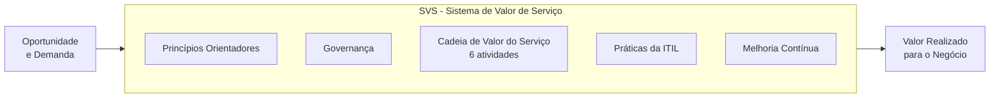
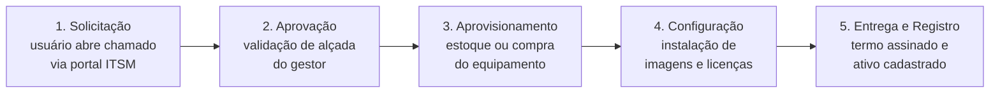

---

materia: Gestão de Serviços de TI 
fonte: Aula 2 - ITIL v4 - Sistema de Valor de Serviço.pdf 
tags:

- resumo
- itil
- svs

---
# 📝 ITIL 4 e o Sistema de Valor de Serviço

## 👁️ Visão geral

Segunda aula da **Unidade 1 — Fundamentos e Governança de Serviços de TI**. Apresenta a **ITIL**, sua evolução até a **v4** e o modelo central da v4: o **Sistema de Valor de Serviço (SVS)**. O SVS tem **5 componentes**; um deles, a **Cadeia de Valor**, tem **6 atividades**; tudo isso é sustentado por **4 dimensões** e guiado por **7 princípios orientadores**. A aula fecha com exemplos práticos (solicitação de notebook, reset de senha) e uma atividade de mapeamento. Retoma conceitos de [[Introdução à Gestão de Serviços de TI]] (valor, utilidade, garantia, ciclo de vida).

> [!tip] Macete dos números: 4 — 5 — 6 — 7 **4** dimensões · **5** componentes do SVS · **6** atividades da cadeia de valor · **7** princípios orientadores.

---

## 📚 O que é a ITIL

A **ITIL** (_Information Technology Infrastructure Library_) é o **framework globalmente mais reconhecido e adotado** para a **Gestão de Serviços de TI** (**ITSM**).

> [!warning] Sigla no slide O slide expande ITSM como "_Information Technology Service Manager_". O correto é _**Information Technology Service Management**_ — gestão (_management_) de serviços, não "gerente" (_manager_).

**Framework** é um conjunto estruturado de boas práticas que a organização **adapta** à sua realidade — não é uma norma a ser seguida ao pé da letra.

Objetivos da ITIL:

- **Padronizar** processos operacionais de TI.
- **Elevar continuamente** a qualidade dos serviços.
- **Aumentar a satisfação** dos clientes e usuários.
- **Gerar valor mensurável** para o negócio.
- **Promover a cultura de melhoria contínua**.

### Evolução histórica da ITIL

|Versão|Época|Marca da versão|
|:--|:--|:--|
|**ITIL v1**|Anos 80|Foco total na **padronização** de processos e rotinas técnicas operacionais|
|**ITIL v2**|Anos 2000|Estruturação por **disciplinas**: _Service Support_ & _Service Delivery_|
|**ITIL v3**|2007/2011|Introdução do **Ciclo de Vida do Serviço** em **5 estágios** estratégicos|
|**ITIL v4**|Atualidade|**Sistema de Valor de Serviço (SVS)**, **Agilidade**, **Lean** e **DevOps**|

> [!info] Contexto externo
> 
> - Na v2, _**Service Support**_ agrupava os processos do dia a dia (central de serviços, incidentes, problemas, mudanças) e _**Service Delivery**_ os de nível tático (níveis de serviço, disponibilidade, capacidade, continuidade, finanças).
> - Os **5 estágios da v3** são justamente as 5 fases do ciclo de vida vistas na aula 1 (Estratégia/Planejamento, Desenho/Projeto, Transição, Operação, Melhoria Contínua) — ver [[Introdução à Gestão de Serviços de TI#🔁 O ciclo de vida dos serviços de TI]].
> - A ITIL 4 foi lançada em **2019**.

### O que mudou na ITIL v4

|Mudança|O que significa|
|:--|:--|
|**Visão Holística**|**Fim dos silos departamentais**. Integração completa entre **tecnologia, pessoas e processos**|
|**Agilidade & Adaptabilidade**|Integração nativa com práticas modernas como **Agile, Lean, Scrum e DevOps**|
|**Co-criação de Valor**|Foco direto na **experiência do cliente (CX)** e na facilidade de adaptação organizacional|

**Silo departamental** é quando cada área trabalha isolada, com seus próprios objetivos, sem enxergar o todo (ex.: a equipe de infraestrutura muda um servidor sem avisar a equipe de sistemas).

> [!info] Contexto externo — termos
> 
> - **Agile / Scrum**: entregar em ciclos curtos e incrementais, com feedback frequente (Scrum é um dos métodos ágeis).
> - **Lean**: eliminar desperdícios e tudo que não gera valor.
> - **DevOps**: integração entre desenvolvimento (_Dev_) e operação (_Ops_) para entregar mudanças com rapidez e estabilidade.
> - **Co-criação de valor**: o valor não é "entregue pronto" pelo provedor; ele surge da **interação** entre provedor e cliente. Casa com a ideia da aula 1 de que o valor é definido pela **percepção do cliente**.

---

## 💎 Valor na ITIL v4

> [!info] Definição **Valor** é a **importância, utilidade e benefício percebido pelo cliente** a partir da **experiência** com um serviço.

|Componente|Pergunta|O que envolve|
|:--|:--|:--|
|**Utilidade** (_Fit for Purpose_)|**O que** o serviço faz|**Adequação ao propósito**: o serviço atende às necessidades do cliente e melhora o desempenho?|
|**Garantia** (_Fit for Use_)|**Como** o serviço se comporta|**Disponibilidade**, **capacidade**, **continuidade** e **segurança da informação** requeridas|

É o mesmo par Utilidade + Garantia da aula anterior ([[Introdução à Gestão de Serviços de TI#💎 Conceito de valor em serviços]]). A diferença de ênfase da v4 está na palavra ==**experiência**==: o valor é percebido pelo cliente ao **usar** o serviço.

> [!tip] Macete Utilidade = **o que** faz (_purpose_, propósito). Garantia = **como** se comporta (_use_, uso).

---

## 🧭 Sistema de Valor de Serviço (SVS)

> [!info] Definição O **SVS** (_Service Value System_) descreve **como todos os componentes e atividades da organização trabalham juntos para criar valor**.

- **Entrada**: ==**Oportunidade e Demanda**==
- **Saída**: ==**Valor Realizado para o Negócio**==

O SVS **garante flexibilidade** e **previne que a TI trabalhe de forma isolada do negócio**.

**Oportunidade** é uma possibilidade de gerar valor ou melhorar algo (ex.: uma nova tecnologia que reduziria custos). **Demanda** é a necessidade de serviços vinda de clientes internos ou externos (ex.: a área comercial precisa de um CRM).

### Os 5 componentes do SVS

|Componente|Definição|
|:--|:--|
|**Princípios Orientadores**|Recomendações fundamentais para **guiar** a organização|
|**Governança**|**Sistema pelo qual a organização é dirigida e controlada**|
|**Cadeia de Valor do Serviço**|Conjunto **interconectado** de **atividades operacionais**|
|**Práticas da ITIL**|Conjunto de **recursos organizacionais** estruturados para **execução**|
|**Melhoria Contínua**|Atividade **recorrente** que garante o alinhamento constante com expectativas|

> [!note] Governança: duas definições no curso
> 
> - **Aula 1**: governança especifica os **direitos de decisão** e o **arcabouço de responsabilidades** para encorajar comportamentos desejáveis no uso da TI.
> - **Aula 2 (ITIL 4)**: governança é o **sistema pelo qual a organização é dirigida e controlada**.
> 
> Não se contradizem: as duas falam de **direção e controle**. Se a questão for sobre o SVS/ITIL 4, use a segunda. O diagrama do slide 4 coloca a governança como um anel externo com alinhamento estratégico, gerenciamento de riscos, otimização de valor e conformidade — os mesmos papéis vistos na aula 1.

> [!info] Contexto externo — práticas A ITIL 4 descreve **34 práticas**, divididas em práticas de **gerenciamento geral**, de **gerenciamento de serviço** e de **gerenciamento técnico**. Os diagramas da aula citam algumas: gestão de incidentes, gestão de mudanças, gestão de nível de serviço, gestão do conhecimento, gestão de ativos, gestão de riscos e melhoria contínua.

---

## 🧱 As quatro dimensões

Para entregar serviços com **qualidade e eficácia**, é essencial **equilibrar** 4 dimensões. Se uma delas for ignorada, o serviço falha mesmo que as outras estejam boas.

|Dimensão|Abrange|
|:--|:--|
|**1. Organizações e Pessoas**|Cultura, liderança, papéis, competências e comunicação|
|**2. Informação e Tecnologia**|Sistemas, aplicações, dados, nuvem e segurança|
|**3. Parceiros e Fornecedores**|Contratos, terceiros, consultorias e provedores|
|**4. Fluxos de Valor e Processos**|Procedimentos, automação e indicadores operacionais|

> [!example] Por que equilibrar Uma empresa compra a melhor ferramenta de chamados do mercado (**tecnologia**), mas não treina a equipe (**pessoas**), não define o fluxo de atendimento (**processos**) e o contrato com o fornecedor não tem SLA (**parceiros**). A ferramenta sozinha não entrega valor.

### Dimensão 1: Organizações e Pessoas

Aborda a **estrutura organizacional formal**, a **cultura corporativa**, os **papéis**, as **responsabilidades** e as **competências individuais**.

- Definição clara de **papéis e autoridades**.
- **Cultura** de colaboração e aprendizado.
- **Capacitação técnica** e **liderança** positiva.
- **Comunicação transparente** em todos os níveis.

|Exemplo|Descrição|
|:--|:--|
|**Service Desk Capacitado**|Equipe treinada em atendimento ao cliente, empatia e resolução rápida de incidentes|
|**Plano de Carreira**|Treinamentos contínuos e certificações estruturadas para o time técnico|
|**Matriz RACI**|Papéis e responsabilidades **formalmente definidos** para evitar conflitos operacionais|

> [!info] Contexto externo — Matriz RACI Tabela que cruza **atividades × pessoas** e marca o papel de cada uma:
> 
> - **R** — _Responsible_ (**executa** a tarefa)
> - **A** — _Accountable_ (**responde** pelo resultado e aprova; deve haver **um só** por atividade)
> - **C** — _Consulted_ (é **consultado** antes)
> - **I** — _Informed_ (é **informado** depois)

### Dimensão 2: Informação e Tecnologia

Refere-se à **informação criada e gerenciada**, juntamente com as **tecnologias** que oferecem suporte aos serviços de TI.

- Infraestrutura local e **Computação em Nuvem**.
- Sistemas de gestão de **banco de dados** e **aplicações**.
- Arquitetura de **Segurança da Informação**.
- **Ferramentas de ITSM** e **automação**.

|Exemplo|Descrição|
|:--|:--|
|**Ferramentas ITSM**|ServiceNow, Jira Service Management ou InvGate para **gestão de chamados**|
|**Plataformas de Nuvem**|Microsoft Azure, AWS e Google Cloud Platform sustentando o ambiente operacional|
|**Monitoramento Ativo**|Ferramentas de **observabilidade** para métricas de servidores e infraestrutura|
|**Backup & Redundância**|Sistemas automatizados para proteção e recuperação contínua de dados|

**Observabilidade** é a capacidade de entender o que acontece dentro dos sistemas a partir dos dados que eles geram (métricas, logs, alertas).

### Dimensão 3: Parceiros e Fornecedores

Envolve os **relacionamentos da organização com terceiros** que participam do **design, entrega e melhoria contínua** dos serviços.

- Provedores de **Software como Serviço (SaaS)**.
- **Fabricantes de hardware** e **operadoras de telecom**.
- Gestão eficaz de **contratos de nível de serviço (SLA)**.
- **Alinhamento estratégico** com parceiros estratégicos.

|Categoria de parceiro|Exemplos de fornecedores|Impacto no serviço de TI|
|:--|:--|:--|
|**Provedores de Nuvem**|Microsoft (Azure / M365), AWS, GCP|Garantia de **alta disponibilidade** e **escalabilidade**|
|**Telecomunicações**|Operadoras de links dedicados|**Conectividade ininterrupta** com a internet e filiais|
|**Consultorias Especializadas**|Empresas de segurança / Suporte **N3**|Atendimento técnico especializado em **demandas complexas**|

> [!info] Contexto externo
> 
> - **SaaS**: software usado pela internet, sem instalar nem manter servidor (ex.: Microsoft 365).
> - **N3** (nível 3): o nível mais especializado do suporte. O N1 faz o primeiro atendimento, o N2 resolve casos técnicos mais complexos e o N3 trata o que exige especialista — muitas vezes o próprio fabricante ou uma consultoria.

### Dimensão 4: Fluxos de Valor e Processos

Define as **atividades, fluxos de trabalho, procedimentos e controles** necessários para **transformar insumos em valor real**.

- **Mapeamento ponta a ponta** dos fluxos de trabalho.
- **Eliminação de desperdícios** e etapas redundantes.
- **Automação** de rotinas manuais.
- Definição de **indicadores-chave de desempenho (KPIs)**.

**Fluxo de valor** é a sequência de passos que a organização executa para levar uma demanda até o valor entregue (ex.: do pedido do notebook até o colaborador trabalhando com ele).

#### Automação para eficiência operacional

A aula ilustra essa dimensão com um infográfico sobre o ciclo moderno de automação.

![[itil-automacao-ciclo-moderno-descobrir-otimizar.png|650]] _Infográfico do material: as 5 etapas do ciclo moderno de automação e os fatores que o tornam eficaz._

|Etapa|Objetivo|O que se faz|
|:--|:--|:--|
|**1. Descobrir**|Identificar os fluxos de trabalho **reais**|Mapear sistemas, equipes e fluxo de dados|
|**2. Desenhar**|Redesenhar para a **simplicidade**|Remover desperdícios, otimizar a lógica|
|**3. Priorizar**|Selecionar candidatos de **alto valor**|Comparar valor de negócio × viabilidade|
|**4. Implementar**|Aplicar automação de IA e fluxo de trabalho|Combinar fluxo de trabalho, IA e integração de sistemas|
|**5. Otimizar**|**Melhoria contínua**|Refinar o desempenho com base em dados|

Os três quadros de baixo do infográfico resumem a ideia:

- **Por que a definição importa**: fluxos claros, regras otimizadas, dados precisos, responsabilidade e alinhamento com o negócio ==**previnem a aceleração da ineficiência**==.
- **Diferenciador real**: definir e priorizar **processos, não apenas ferramentas** — o que traz eficiência escalável, melhor CX e vantagem de longo prazo.
- **Fatores de sucesso**: definição estratégica e disciplina contínua — ==**não é um projeto de única vez**==.

> [!tip] Liga com o princípio 7 Repare que **desenhar/simplificar vem antes de implementar a automação**. É o princípio **Otimizar e Automatizar**: automatizar um processo ruim só faz o erro acontecer mais rápido.

#### Exemplo prático: solicitação de notebook

- **Alçada**: o limite de autoridade de quem aprova (ex.: o gestor pode aprovar compras até determinado valor).
- **Imagem**: cópia padrão do sistema operacional já configurado, com os programas da empresa, instalada de uma vez no equipamento novo.
- **Ativo cadastrado**: o notebook é registrado no inventário da empresa, com o responsável por ele.

### Estudo de caso: as 4 dimensões no novo notebook

O mesmo serviço (novo notebook para um colaborador) visto pelas 4 dimensões:

|Dimensão|No caso do notebook|
|:--|:--|
|**Organizações e Pessoas** (pessoas envolvidas)|Usuário final, gestor solicitante, técnico de Service Desk e analista de compras|
|**Informação e Tecnologia** (tecnologias utilizadas)|Portal de chamados ITSM, **Active Directory**, gerenciador de ativos e software de imagem|
|**Parceiros e Fornecedores**|Fabricante de hardware (ex.: Dell/HP), provedor de software e transportadora|
|**Fluxos de Valor e Processos**|Solicitação → Aprovação → Compra/Estoque → Imagem → Entrega física e Aceite|

> [!info] Contexto externo **Active Directory (AD)** é o serviço da Microsoft que guarda os usuários, computadores e permissões da rede da empresa. O notebook novo precisa entrar no domínio (AD) para o colaborador fazer login com sua conta corporativa.

---

## ⭐ Os sete princípios orientadores

> [!info] Definição **Princípios orientadores** são **recomendações universais e duradouras** que orientam as decisões de uma organização **em qualquer circunstância**.

|Nº|Princípio|Ideia central|
|:-:|:--|:--|
|**1**|**Foco no Valor**|Toda atividade deve estar, direta ou indiretamente, vinculada à geração de valor para clientes e stakeholders|
|**2**|**Comece de Onde Você Está**|Não descarte o que já existe sem analisar; reaproveite o que funciona|
|**3**|**Progredir Iterativamente com Feedback**|Divida iniciativas grandes em etapas menores e colete feedback a cada iteração|
|**4**|**Colaborar e Promover Visibilidade**|Silos prejudicam o resultado; envolva as pessoas certas e seja transparente|
|**5**|**Pensar e Trabalhar Holisticamente**|Nenhum serviço funciona isoladamente; considere o impacto em toda a organização|
|**6**|**Manter Simples e Prático**|Elimine passos burocráticos sem valor|
|**7**|**Otimizar e Automatizar**|==Otimize o processo **primeiro**; **depois** automatize==|

### 1. Foco no Valor

Toda e qualquer atividade realizada pela organização deve estar **direta ou indiretamente vinculada à geração de valor** para os clientes e stakeholders.

> [!abstract] Pergunta-chave do princípio "**Como esta atividade gera valor para o usuário final ou para a organização?**" Se a resposta for "**nenhum**", a atividade deve ser **reavaliada ou eliminada**.

Exemplo: um relatório semanal que a TI produz há anos e que ninguém lê não gera valor → deve ser reavaliado ou cortado.

### 2. Comece de Onde Você Está

- **Avaliar o cenário atual**: não descarte o que já existe sem antes analisar. Identifique serviços, processos e ferramentas atuais que **funcionam bem e podem ser reaproveitados**.
- **Evitar desperdícios**: **recriar processos do zero gera alto custo e resistência cultural**. Use **dados e métricas reais** para tomar decisões de melhoria embasadas.

Exemplo: antes de trocar a ferramenta de chamados, verificar o que a atual já faz bem e quais dados ela já tem.

### 3. Progredir Iterativamente com Feedback

**Divida iniciativas grandes em etapas menores e gerenciáveis.** Colete **feedback constante ao final de cada iteração** para ajustar o rumo.

Exemplo: implantar o portal de autoatendimento primeiro só para reset de senha, ouvir os usuários, ajustar e só depois ampliar para outros serviços — em vez de lançar tudo de uma vez.

### 4. Colaborar e Promover Visibilidade

**Trabalhar em silos prejudica o resultado.** Envolva as **pessoas certas**, **compartilhe dados abertamente** e promova **transparência** nos processos.

Exemplo: um painel de chamados visível para as áreas de negócio, mostrando filas e prazos.

### 5. Pensar e Trabalhar Holisticamente

**Nenhum serviço funciona isoladamente.** Considere o **impacto em toda a organização**.

Exemplo: antes de mudar a política de senhas, considerar o impacto no Service Desk (mais chamados), nos usuários e nos sistemas integrados.

### 6. Manter Simples e Prático

**Elimine passos burocráticos sem valor.** Se um processo não produz resultados, **simplifique-o**.

Exemplo: um pedido de mouse que exige três aprovações pode ter as aprovações eliminadas.

### 7. Otimizar e Automatizar

**Otimize o processo primeiro; depois** aplique tecnologia para **automatizar tarefas repetitivas**.

Exemplo: primeiro remover as etapas inúteis do fluxo de criação de usuário; depois automatizar o que sobrou (ex.: conta criada automaticamente quando o RH cadastra a admissão).

---

## 🔗 Cadeia de Valor do Serviço

> [!info] Definição A **Cadeia de Valor do Serviço** (_Service Value Chain_) é o **modelo operacional do SVS** que define as **6 atividades principais** para **responder à demanda** e **viabilizar a criação de valor**.

> [!warning] Não linear É um ==**modelo flexível e não linear**==: as atividades **podem se conectar em múltiplos fluxos de valor personalizados**. Cada serviço percorre as atividades na combinação e na ordem de que precisa — diferente da ideia de uma sequência fixa de fases (ciclo de vida da v3).

No diagrama do material, a cadeia fica no centro, recebe **Demanda e Oportunidade** e gera **Valor entregue**; embaixo aparecem os **elementos de suporte**: **princípios orientadores**, **governança** e **práticas**.

### As 6 atividades da cadeia de valor

|Atividade|Propósito|Exemplos de conteúdo (diagrama do material)|
|:--|:--|:--|
|**Planejar**|Garantir **compreensão compartilhada da visão e direção estratégica**|Alinhamento estratégico, planejamento tático, portfólio de serviços|
|**Melhorar**|Assegurar a **melhoria contínua** de serviços e práticas **em todos os níveis**|Otimização contínua, avaliação de desempenho, inovação de serviços|
|**Engajar**|Proporcionar **bom entendimento e relacionamento com partes interessadas**|Interação com stakeholders, compreensão da demanda, gestão de relacionamento|
|**Desenhar e Transitar**|Garantir que os serviços atendam às **expectativas de qualidade e custo**|Criação de novos serviços, mudanças, gerenciamento de liberação e implantação|
|**Obter / Construir**|Garantir **disponibilidade de componentes de serviço** conforme o necessário|Aquisição de componentes, desenvolvimento de software, gestão de configuração|
|**Entregar e Suportar**|Garantir a **entrega e o suporte** de serviços **de acordo com os acordos**|Fornecimento de serviços, gestão de incidentes, nível de serviço, suporte ao usuário|

> [!tip] Como não confundir
> 
> - **Engajar** = falar com as pessoas (entender a demanda, relacionamento).
> - **Obter/Construir** = conseguir as "peças" (comprar, desenvolver, configurar).
> - **Desenhar e Transitar** = projetar o serviço e colocá-lo em produção (qualidade e custo).
> - **Entregar e Suportar** = o serviço rodando no dia a dia, conforme os acordos (SLA).

### Exemplo: serviço de reset de senha na cadeia de valor

|Atividade|No reset de senha|
|:--|:--|
|**Planejar**|Definir **política e padrão de segurança** para senhas|
|**Engajar**|Usuário solicita a troca pelo **portal de autoatendimento**|
|**Desenhar & Transitar**|Definir o **fluxo seguro** de redefinição|
|**Obter / Construir**|Implementar a **ferramenta de autenticação**|
|**Entregar & Suportar**|Enviar a credencial e **resolver eventual falha**|
|**Melhorar**|**Analisar chamados** e otimizar a experiência do usuário|

O slide ilustra com a tela de redefinição de senha do Windows por **perguntas de segurança** — um exemplo de autoatendimento.

---

## ⚠️ Pegadinhas e erros comuns

|Confusão comum|O certo|
|:--|:--|
|Trocar os números|**4** dimensões, **5** componentes do SVS, **6** atividades da cadeia, **7** princípios|
|SVS e Cadeia de Valor são a mesma coisa|O **SVS** é o sistema inteiro (5 componentes). A **Cadeia de Valor** é **um** desses componentes: o modelo **operacional**, com 6 atividades|
|Entrada e saída do SVS|Entrada: **Oportunidade e Demanda**. Saída: **Valor Realizado** para o negócio|
|A cadeia de valor é uma sequência fixa|É **flexível e não linear**, com **múltiplos fluxos de valor**|
|Cadeia de valor da v4 = ciclo de vida da v3|O **ciclo de vida em 5 estágios** é da **v3**; a v4 trouxe o **SVS** e a cadeia de valor|
|Melhoria contínua aparece uma vez só|Ela é **componente do SVS** **e** também atividade da cadeia (**Melhorar**)|
|Governança é uma das 4 dimensões|Governança é um dos **5 componentes do SVS**, não uma dimensão|
|"Organizações e Pessoas" é só gente|Inclui estrutura formal, cultura, papéis, responsabilidades e competências|
|Utilidade = como funciona|**Utilidade = o que faz**; **Garantia = como se comporta** (disponibilidade, capacidade, continuidade, segurança da informação)|
|Automatizar primeiro para ganhar tempo|**Otimizar primeiro, depois automatizar** — senão se acelera a ineficiência|
|"Comece de onde você está" = não mudar nada|Significa **avaliar o que existe e reaproveitar** o que funciona, em vez de recriar do zero|
|"Holístico" é só um princípio|Aparece em três lugares: mudança da v4 (**visão holística**), princípio 5 (**pensar e trabalhar holisticamente**) e as **4 dimensões** (garantem a visão holística)|
|ITSM = _Service Manager_|ITSM = _IT Service **Management**_|
|Matriz RACI é da dimensão de processos|No material ela é exemplo de **Organizações e Pessoas** (papéis e responsabilidades)|
|SLA é da dimensão de tecnologia|No material, **gestão de SLA** aparece em **Parceiros e Fornecedores** (contratos com terceiros)|

---

## 📝 Questões

### 👥 Atividade prática em grupo

**Passo 1 — Escolha um serviço de TI.** Exemplos sugeridos para os grupos:

- Reset de senha de usuário
- Criação de novo usuário no domínio
- Instalação de software homologado
- Acesso remoto via VPN corporativa

**Passo 2 — Mapeamento integrado.** Para o serviço escolhido, detalhe:

- As **4 Dimensões da Gestão** envolvidas.
- Pelo menos **3 Princípios Orientadores** aplicados.
- O fluxo do serviço na **Cadeia de Valor**.

Abaixo, o mapeamento de cada um dos quatro serviços sugeridos. Tente fazer antes de abrir.

**a) Reset de senha de usuário**

> [!question]- Resposta (resolvida por mim, confira) **4 Dimensões**
> 
> |Dimensão|No reset de senha|
> |:--|:--|
> |**Organizações e Pessoas**|Usuário, analista do Service Desk (quando o autoatendimento falha), equipe de segurança que define a política|
> |**Informação e Tecnologia**|Portal de autoatendimento, Active Directory, ferramenta de autenticação (perguntas de segurança, MFA)|
> |**Parceiros e Fornecedores**|Fornecedor da ferramenta ITSM/autenticação (ex.: Microsoft)|
> |**Fluxos de Valor e Processos**|Solicitação no portal → verificação de identidade → redefinição → confirmação; KPI: tempo médio de reset, % resolvido sem atendente|
> 
> **Princípios**
> 
> - **Foco no valor**: o usuário volta a trabalhar em minutos.
> - **Otimizar e automatizar**: fluxo simplificado e depois automatizado no autoatendimento, sem ligar para o suporte.
> - **Manter simples e prático**: poucos passos, sem burocracia.
> - **Progredir iterativamente**: lançar o autoatendimento para um grupo, coletar feedback e ampliar.
> 
> **Cadeia de valor** (mapeamento do próprio material)
> 
> |Atividade|Ação|
> |:--|:--|
> |Planejar|Definir política e padrão de segurança para senhas|
> |Engajar|Usuário solicita a troca pelo portal de autoatendimento|
> |Desenhar & Transitar|Definir o fluxo seguro de redefinição|
> |Obter / Construir|Implementar a ferramenta de autenticação|
> |Entregar & Suportar|Enviar a credencial e resolver eventual falha|
> |Melhorar|Analisar chamados e otimizar a experiência do usuário|

**b) Criação de novo usuário no domínio**

> [!question]- Resposta (resolvida por mim, confira) **4 Dimensões**
> 
> |Dimensão|Na criação de usuário|
> |:--|:--|
> |**Organizações e Pessoas**|RH (informa a admissão), gestor (define os acessos), analista de Service Desk/administrador do AD|
> |**Informação e Tecnologia**|Active Directory, portal ITSM, e-mail/Microsoft 365, sistema de RH|
> |**Parceiros e Fornecedores**|Microsoft (licenças do M365), fornecedor da ferramenta ITSM|
> |**Fluxos de Valor e Processos**|Admissão no RH → chamado → aprovação do gestor → criação da conta com perfil padrão do cargo → licenças → entrega da credencial; KPI: tempo até o novo colaborador conseguir trabalhar|
> 
> **Princípios**
> 
> - **Otimizar e automatizar**: primeiro padronizar perfis por cargo; depois criar a conta automaticamente a partir do cadastro do RH.
> - **Colaborar e promover visibilidade**: RH, gestor e TI enxergando o andamento do mesmo chamado.
> - **Manter simples e prático**: perfis prontos por cargo em vez de pedir acesso a acesso.
> - **Pensar holisticamente**: criar a conta envolve também e-mail, licenças e acessos a sistemas, não só o login.
> 
> **Cadeia de valor**
> 
> |Atividade|Ação|
> |:--|:--|
> |Planejar|Política de nomes de usuário, perfis de acesso por cargo e regras de segurança|
> |Engajar|RH/gestor solicita a conta e informa cargo e data de início|
> |Desenhar & Transitar|Desenhar o fluxo de _onboarding_ e os modelos de perfil; testar|
> |Obter / Construir|Garantir licenças disponíveis; construir scripts/automação de criação|
> |Entregar & Suportar|Criar a conta e entregar a credencial no primeiro dia; atender problemas de acesso|
> |Melhorar|Medir o tempo de criação e os chamados de "acesso faltando" para ajustar os perfis|

**c) Instalação de software homologado**

> [!question]- Resposta (resolvida por mim, confira) **4 Dimensões**
> 
> |Dimensão|Na instalação de software|
> |:--|:--|
> |**Organizações e Pessoas**|Usuário, gestor (aprova se houver custo de licença), Service Desk, equipe que homologa o software|
> |**Informação e Tecnologia**|Catálogo de software no portal ITSM, ferramenta de distribuição remota de software, gerenciador de ativos/licenças|
> |**Parceiros e Fornecedores**|Fabricante do software (licença, atualizações, suporte), revenda|
> |**Fluxos de Valor e Processos**|Pedido no catálogo → verificação de licença → aprovação (se necessária) → instalação remota → registro da licença no ativo; KPI: tempo de atendimento, licenças em uso × compradas|
> 
> **Princípios**
> 
> - **Foco no valor**: o usuário recebe a ferramenta de que precisa para trabalhar.
> - **Otimizar e automatizar**: software homologado disponível no autoatendimento, instalado sem técnico.
> - **Comece de onde você está**: aproveitar a lista de softwares já homologados e as licenças existentes.
> - **Manter simples e prático**: software gratuito e homologado dispensa aprovação.
> 
> **Cadeia de valor**
> 
> |Atividade|Ação|
> |:--|:--|
> |Planejar|Definir a política de software permitido e o processo de homologação|
> |Engajar|Usuário escolhe o software no catálogo|
> |Desenhar & Transitar|Homologar o software (testes de compatibilidade e segurança) e publicá-lo no catálogo|
> |Obter / Construir|Adquirir as licenças e empacotar o instalador|
> |Entregar & Suportar|Instalar remotamente e resolver falhas de instalação|
> |Melhorar|Analisar os softwares mais pedidos e os chamados de erro para ajustar o catálogo|

**d) Acesso remoto via VPN corporativa**

> [!question]- Resposta (resolvida por mim, confira) **4 Dimensões**
> 
> |Dimensão|No acesso via VPN|
> |:--|:--|
> |**Organizações e Pessoas**|Usuário remoto, gestor que aprova, equipe de redes/segurança, Service Desk|
> |**Informação e Tecnologia**|Servidor/concentrador de VPN, cliente VPN no notebook, firewall, Active Directory, autenticação multifator (MFA)|
> |**Parceiros e Fornecedores**|Operadora do link de internet (SLA de disponibilidade), fabricante do firewall/VPN, provedor do MFA|
> |**Fluxos de Valor e Processos**|Solicitação → aprovação do gestor → liberação do acesso (grupo no AD) → configuração do cliente → teste de conexão; KPI: disponibilidade da VPN, chamados de falha de conexão|
> 
> **Princípios**
> 
> - **Foco no valor**: permitir trabalho remoto com segurança.
> - **Pensar e trabalhar holisticamente**: o acesso envolve segurança, rede, capacidade do link e suporte ao mesmo tempo.
> - **Otimizar e automatizar**: após a aprovação, o acesso é liberado automaticamente pelo grupo do AD.
> - **Colaborar e promover visibilidade**: redes, segurança e Service Desk alinhados sobre quem tem acesso.
> 
> **Cadeia de valor**
> 
> |Atividade|Ação|
> |:--|:--|
> |Planejar|Definir a política de acesso remoto e os requisitos de segurança (ex.: MFA obrigatório)|
> |Engajar|Usuário solicita o acesso; gestor aprova|
> |Desenhar & Transitar|Desenhar os perfis de acesso e o fluxo de liberação; testar antes de liberar a todos|
> |Obter / Construir|Adquirir licenças de VPN, configurar o concentrador e integrar com AD e MFA|
> |Entregar & Suportar|Liberar o acesso, enviar instruções e resolver falhas de conexão|
> |Melhorar|Monitorar capacidade e chamados para ajustar o serviço (ex.: mais licenças, link maior)|

---

## 💡 Fechamento

Principais aprendizados da aula:

- **SVS integrado**: o Sistema de Valor conecta **governança, práticas e melhoria** para **transformar demanda em valor**.
- **Visão holística**: as **4 Dimensões** garantem equilíbrio entre **Pessoas, Tecnologia, Parceiros e Processos**.
- **Tomada de decisão**: os **7 Princípios Orientadores** guiam a **adaptação prática** do framework na organização.
- **Operação flexível**: a **Cadeia de Valor** dinamiza a criação de serviços focados na **experiência do cliente**.

> [!quote] Mensagem final da aula "A excelência na Gestão de Serviços de TI não depende apenas da tecnologia, mas da **integração entre pessoas, processos, parceiros e inovação**, sempre com **foco na geração de valor para o cliente**."