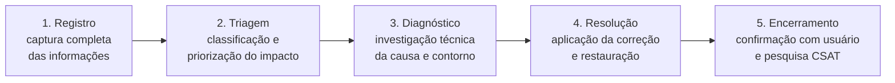
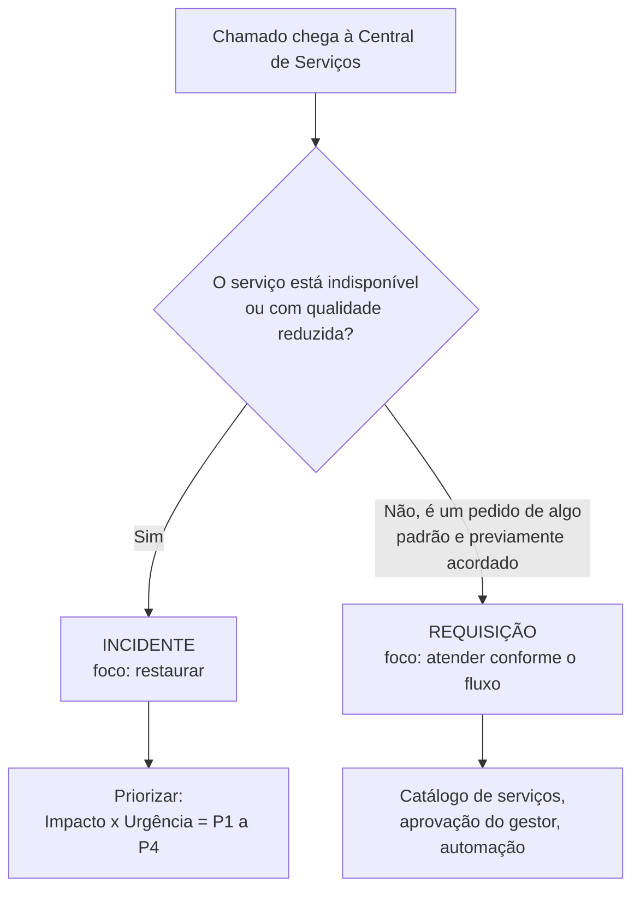

---

materia: Gestão de Serviços de TI 
fonte: Aula 03 - Práticas Operacionais ITIL.pdf 
tags:

- resumo
- itil
- service-desk
- incidentes

---

# 📝 Central de Serviços, Incidentes e Requisições

## 👁️ Visão geral

Terceira aula da **Unidade 1**. Desce do modelo geral da ITIL 4 ([[ITIL 4 e o Sistema de Valor de Serviço]]) para três **práticas operacionais** do dia a dia: a **Central de Serviços** (*Service Desk*), o **Gerenciamento de Incidentes** e as **Requisições de Serviço**. O eixo da aula é saber **distinguir incidente de requisição** e **priorizar** incidentes pela fórmula **Prioridade = Impacto × Urgência**, com a matriz P1–P4. Fecha com catálogo de serviços, automação, KPIs e um estudo de caso de triagem.

> [!info] Contexto externo
> Na ITIL 4, Central de Serviços, Gerenciamento de Incidentes e Gerenciamento de Requisições de Serviço são **práticas** — um dos 5 componentes do SVS (ver [[ITIL 4 e o Sistema de Valor de Serviço#Os 5 componentes do SVS]]). Na cadeia de valor, elas atuam principalmente em **Engajar** e **Entregar e Suportar**.

---

## 🎧 Central de Serviços (Service Desk)

> [!info] Definição
> A **Central de Serviços** (*Service Desk*) é o ==**Single Point of Contact (SPOC)**== — o **ponto único de contato** — entre os **usuários** e a **equipe de TI**.

"Ponto único" significa que o usuário tem **uma só porta de entrada** para tudo que precisa da TI (falhas, pedidos, dúvidas), em vez de ligar direto para o técnico que conhece. Já aparecia na aula 1 como componente da fase de Operação ([[Introdução à Gestão de Serviços de TI#4. Operação]]).

### Funções

| Função | O que faz |
| :--- | :--- |
| **Receber e Registrar** | Capturar **todas** as demandas |
| **Resolver Incidentes** | Restaurar a operação normal |
| **Encaminhar** | **Escalar** chamados para o **Nível 2/3** |
| **Comunicar** | Manter o usuário informado sobre o **status** |
| **Medir Satisfação** | Coletar feedback contínuo |

> [!info] Contexto externo — níveis e escalonamento
> - **N1** é o primeiro atendimento (a própria Central de Serviços). **N2** são equipes técnicas mais especializadas. **N3** são especialistas, fabricantes ou consultorias (ver [[ITIL 4 e o Sistema de Valor de Serviço#🧱 As quatro dimensões]]).
> - **Escalonamento funcional**: passar o chamado para uma equipe com **mais conhecimento técnico** (N1 → N2 → N3). **Escalonamento hierárquico**: envolver **gestores** quando o caso é grave ou o prazo está em risco. O slide fala do funcional.

### Objetivos do Service Desk

| Objetivo | Descrição |
| :--- | :--- |
| **Restauração Rápida** | Minimizar o tempo de indisponibilidade e restaurar serviços no **menor tempo possível** |
| **Experiência do Usuário** | Atendimento **empático, transparente e eficiente**, garantindo alta satisfação |
| **Continuidade de Negócio** | Garantir que as interrupções de TI **não prejudiquem as operações críticas** da organização |
| **Apoio à ITIL v4** | Servir de **base** para o Gerenciamento de **Problemas**, **Mudanças** e **Ativos** de TI |

O último objetivo significa que os registros da Central (o que falhou, quando, com quem) viram matéria-prima para outras práticas: por exemplo, muitos incidentes iguais apontam para um **problema** a investigar.

### Benefícios para a organização

| Benefício | Descrição |
| :--- | :--- |
| **Padronização e Controle** | Processos claros e centralizados evitam **"atendimentos informais"** e garantem **rastreabilidade completa** de todas as solicitações |
| **Indicadores de Desempenho** | Dados e relatórios sobre **volume de chamados**, **tempo de resposta** e **cumprimento de SLA** |
| **Comunicação Efetiva** | **Interface única** de diálogo com o cliente, reduzindo ruídos e falsas expectativas e aumentando a confiança do negócio na TI |
| **Base de Conhecimento** | Registro histórico de soluções que **acelera a resolução de incidentes recorrentes** e **possibilita autoatendimento** |

**Atendimento informal** é o "me ajuda rapidinho" no corredor ou pelo WhatsApp do técnico: resolve na hora, mas não fica registrado, não entra nos indicadores e não gera conhecimento reutilizável.

---

## 🏢 Estruturas da Central de Serviços

Modelos organizacionais segundo a ITIL: **Local**, **Centralizada** e **Virtual**.

### Service Desk Local

- **Característica**: equipes de suporte alocadas **presencialmente em cada unidade física** ou prédio da organização.
- **Vantagens**: **proximidade física** com o usuário, atendimento presencial rápido e forte **conhecimento da rotina local**.
- **Desvantagens**: **maior custo operacional** (mão de obra **duplicada**) e maior risco de **despadronização** de processos.

### Service Desk Centralizado

- **Conceito**: todos os chamados de múltiplos locais ou filiais são direcionados e atendidos por uma ==**única equipe consolidada**== em **um local físico específico**.
- **Vantagens**: **redução drástica de custos** operacionais, facilidade de **padronização** dos processos ITIL, **gestão centralizada de KPIs** e melhor **compartilhamento de conhecimentos**.

### Service Desk Virtual

- **Característica**: equipes **geograficamente distribuídas** atuando como ==**uma única unidade lógica**== por meio de **tecnologia em nuvem**.
- **Benefícios**: **cobertura 24/7** (***Follow-the-Sun***), alta flexibilidade operacional, **resiliência** e redução de **custos imobiliários**.
- **Desafio**: exige forte dependência de **ferramentas de colaboração** e **conectividade** de alta qualidade.

> [!info] Contexto externo — *Follow-the-Sun*
> Equipes em fusos horários diferentes "passam o bastão" ao fim do expediente: quando a equipe do Brasil encerra o dia, a da Ásia assume, depois a da Europa. O atendimento fica 24h sem ninguém trabalhar de madrugada.

### Comparativo dos modelos

| Modelo | Características principais | Vantagens | Desvantagens / riscos |
| :--- | :--- | :--- | :--- |
| **Local** | Equipe **presencial por unidade** geográfica | Proximidade e suporte presencial imediato | **Custo elevado** e pulverização de padrões |
| **Centralizado** | **Equipe única** atende toda a empresa | Padronização, controle e eficiência de custos | **Menor contato presencial** com usuários |
| **Virtual** | **Analistas remotos** usando plataforma comum | Cobertura 24/7, flexibilidade e alta escala | **Dependência total da infraestrutura de rede** |

> [!warning] Centralizado × Virtual
> Os dois atuam como uma equipe só. A diferença está no **lugar**: o **centralizado** fica **fisicamente num único local**; o **virtual** está **espalhado geograficamente** e só é "único" **logicamente**, pela tecnologia.

A escolha do modelo **depende dos objetivos organizacionais** — não existe um modelo melhor em qualquer situação.

---

## 🚨 Incidentes

> [!info] Definição (ITIL v4)
> **Incidente** é "uma **interrupção não planejada** de um serviço de TI **ou** a **redução da qualidade** de um serviço de TI".

Repare nas duas metades: o serviço **não precisa estar parado** para haver incidente. **Lentidão** (qualidade reduzida) também é incidente.

### Exemplos práticos de incidentes

| Incidente | O que aconteceu |
| :--- | :--- |
| **Sistema ERP Indisponível** | Falha no banco de dados impede faturamento |
| **Estação não Liga** | Estação de trabalho com falha de hardware |
| **Queda de Conexão** | Link de internet da filial fora do ar |
| **E-mail Corporativo** | Impossibilidade de enviar/receber mensagens |
| **VPN Inacessível** | Bloqueio generalizado do acesso remoto |

O slide também traz um infográfico de um incidente de exemplo, com um registro de chamado (ID *INC-2026-0001*, serviço afetado: Sistema de Vendas, prioridade alta, status aberto, impacto alto) e o objetivo de **restaurar o serviço o mais rápido possível, minimizando o impacto no negócio**.

### Ciclo de vida do incidente

| Etapa | O que acontece |
| :--- | :--- |
| **1. Registro** | Captura completa das informações do chamado |
| **2. Triagem** | **Classificação** e **priorização** do impacto |
| **3. Diagnóstico** | Investigação técnica da **causa** e **contorno** |
| **4. Resolução** | Aplicação da correção e **restauração** |
| **5. Encerramento** | **Confirmação com o usuário** e pesquisa **CSAT** |

> [!info] Contexto externo
> - **Contorno** (*workaround*): solução paliativa que **devolve o serviço ao usuário** sem eliminar a causa. Ex.: a impressora do RH quebrou → o usuário imprime na do andar de cima enquanto o técnico não chega.
> - **CSAT** (*Customer Satisfaction Score*): pesquisa de satisfação feita ao encerrar o chamado.

> [!warning] Nomes diferentes no infográfico
> O infográfico do slide de exemplos usa outros nomes para as etapas (**Detectar → Registrar → Investigar → Resolver → Encerrar**) e descreve "Investigar" como **análise da causa raiz**. Para a prova, use o ciclo oficial da aula (**Registro → Triagem → Diagnóstico → Resolução → Encerramento**). E lembre que, pelo próprio material, a **causa-raiz** é tarefa do **Gerenciamento de Problemas**; o incidente foca em **restaurar**.

Encerrar exige **confirmação com o usuário**: o técnico achar que resolveu não basta.

### Objetivos do gerenciamento de incidentes

| Objetivo | Descrição |
| :--- | :--- |
| **Velocidade** | Restaurar a operação normal **o mais rapidamente possível conforme os SLAs** acordados |
| **Mitigação** | Minimizar o impacto negativo nas operações de negócio e os prejuízos financeiros |
| **Registro Histórico** | Alimentar dados para que o ==**Gerenciamento de Problemas** investigue a **causa-raiz**== |

> [!tip] Incidente × Problema
> **Incidente** = apagar o incêndio agora (restaurar). **Problema** = descobrir por que pega fogo sempre (causa-raiz). O registro bem feito dos incidentes é o que permite ao gerenciamento de problemas encontrar o padrão.

---

## 🎯 Determinação da prioridade

$$\text{Prioridade} = \text{Impacto} \times \text{Urgência}$$

| Fator | Mede | O que avalia |
| :--- | :--- | :--- |
| **Impacto** (**extensão**) | A **gravidade** da interrupção sob a perspectiva do **negócio** | O **número de usuários afetados** ou o volume de processos financeiros interrompidos |
| **Urgência** (**tempo**) | A **velocidade** com que a solução é exigida | O **tempo máximo suportável** antes que o incidente cause prejuízos graves ao negócio |

> [!tip] Macete
> **Impacto** = **quanto** / **quem** é atingido (extensão). **Urgência** = **em quanto tempo** precisa estar resolvido (tempo).

O "×" da fórmula não é uma multiplicação de números: indica que a prioridade sai do **cruzamento** dos dois fatores na matriz abaixo.

### Matriz de prioridade ITIL

| Impacto \ Urgência | **Alta** | **Média** | **Baixa** |
| :--- | :---: | :---: | :---: |
| **Alto** | 🔴 **P1 — Crítica** | 🟠 **P2 — Alta** | 🟡 **P3 — Média** |
| **Médio** | 🟠 **P2 — Alta** | 🟡 **P3 — Média** | 🟢 **P4 — Baixa** |
| **Baixo** | 🟡 **P3 — Média** | 🟢 **P4 — Baixa** | 🟢 **P4 — Baixa** |

> [!warning] Slide com rótulos faltando
> No slide da matriz, os rótulos das linhas (impacto) e parte dos rótulos das colunas (urgência) não aparecem — só as prioridades. A tabela acima reconstrói a matriz com o layout padrão (alto → baixo nas linhas, alta → baixa nas colunas). Os valores são exatamente os do slide. Como a matriz é **simétrica**, trocar linhas por colunas não muda nenhum resultado.

> [!tip] Macete para montar a matriz de cabeça
> Dê nota **1** para Alto/Alta, **2** para Médio/Média e **3** para Baixo/Baixa. Some as duas notas e **subtraia 1**; o resultado é o número da prioridade (**no máximo P4**).
> Ex.: impacto médio (2) + urgência alta (1) − 1 = **P2**. Impacto baixo (3) + urgência baixa (3) − 1 = 5 → limita em **P4**.

### Exemplos de priorização

| Prioridade | Caso | Por quê |
| :--- | :--- | :--- |
| 🔴 **P1 — Crítica** | **ERP inoperante** | Servidor central inativo. **Afeta todos os departamentos** e paralisa vendas e faturamento |
| 🟠 **P2 — Alta** | **Lentidão no FS** (servidor de arquivos) | Prejudica a equipe de projetos, mas com **operação parcial** |
| 🟡 **P3 — Média** | **Impressora do RH** | Equipamento do setor inoperante. **Existe alternativa** em outro andar próximo |
| 🟢 **P4 — Baixa** | **Papel de parede** | Ajuste estético no computador de **um usuário**. **Sem impacto produtivo** |

Note como a **alternativa** (impressora de outro andar) derruba a **urgência**: o negócio aguenta esperar. E como a **operação parcial** do FS o deixa abaixo do ERP: dá para continuar trabalhando, só que pior — lembrando que degradação também é incidente.

---

## 📋 Requisições de serviço

> [!info] Definição (ITIL v4)
> **Requisição de serviço** é uma **solicitação de um usuário ou de seu representante** que **autoriza ou inicia** uma ação de serviço ==**previamente acordada e rotineira**==.
> **Não representa uma falha ou incidente de TI!**

Exemplos típicos:

- Criação e concessão de **novo usuário**.
- Instalação de **software homologado**.
- **Alteração ou redefinição de senha**.
- Solicitação de **novo notebook**.

**"Previamente acordada"** quer dizer que a TI já definiu que aquele pedido faz parte do serviço, com um fluxo padrão (quem aprova, prazo, como executar). Por isso requisição é **rotina**, não emergência.

### Incidente × Requisição

| Critério | **Incidente de TI** | **Requisição de Serviço** |
| :--- | :--- | :--- |
| **Natureza do chamado** | **Falha**, erro ou interrupção **não planejada** | **Solicitação** de novo recurso ou padrão |
| **Estado do serviço** | **Indisponível ou degradado** | **Operando normalmente** |
| **Foco da ação** | **Restaurar** a operação com rapidez | **Atender ao pedido** conforme o fluxo |
| **Fluxo de aprovação** | **Imediato** (não exige aprovação prévia) | **Geralmente exige aprovação** de gestor |

> [!example] Mesmo assunto, tipos diferentes
> - "Esqueci minha senha e quero trocar" → **requisição** (o serviço de login funciona; é um pedido rotineiro).
> - "Ninguém da empresa consegue fazer login desde as 8h" → **incidente** (o serviço falhou).

### O catálogo de serviços

**Catálogo de serviços** é uma **visão estruturada e pública de todos os serviços de TI disponíveis** para os usuários da organização.

| Característica | O que garante |
| :--- | :--- |
| **Transparência** | O usuário sabe **exatamente o que pode solicitar** |
| **Padronização** | **Formulários específicos** para cada tipo de pedido |
| **Prazos Claros** | Exibe o **SLA estimado** para cada requisição |

![[itsm-portal-autoatendimento-catalogo-servicos.png|600]]
*Portal de autoatendimento de uma ferramenta ITSM (SimpleOne), mostrado no slide do catálogo. Repare na separação: "Service Catalog" (pedidos/requisições) × "Report an incident" (falhas), além da base de conhecimento, dos avisos de manutenção e das aprovações pendentes do gestor.*

### Automação de requisições

| Automação | Como funciona |
| :--- | :--- |
| **Reset de Senha** | Portal **self-service** com **verificação em duas etapas** faz o reset **automático em segundos** |
| **Aprovação Digital** | **Workflows** enviam notificações automáticas ao **gestor** para **aprovação de custos** |
| **Provisionamento** | **Scripts** criam acessos e ativam licenças em nuvem **sem intervenção humana** |

Como requisições são **previamente acordadas e rotineiras**, são as melhores candidatas à automação — aplicação direta do princípio **Otimizar e Automatizar** ([[ITIL 4 e o Sistema de Valor de Serviço#7. Otimizar e Automatizar]]).

---

## 📊 Indicadores de desempenho (KPIs)

| KPI | O que mede *(contexto externo)* | Valor no gráfico do slide | Melhor quando |
| :--- | :--- | :---: | :---: |
| **Resolução em 1º Contato (FCR)** | % de chamados resolvidos já no primeiro contato, sem escalar | 78% | ⬆️ maior |
| **Conformidade com SLA** | % de chamados atendidos dentro do prazo acordado | 92% | ⬆️ maior |
| **Satisfação do Usuário (CSAT)** | Nota da pesquisa de satisfação no encerramento | 95% | ⬆️ maior |
| **Chamados Automatizados** | % de chamados resolvidos por automação/autoatendimento | 45% | ⬆️ maior |

Métricas essenciais citadas no slide:

- **TMA** — **Tempo Médio de Atendimento**.
- **MTTR** — **Tempo Médio para Reparo** (*Mean Time To Repair*): quanto tempo, em média, leva para restaurar o serviço.

Nesses dois, ⬇️ **menor é melhor**. Os percentuais do gráfico são valores de exemplo, não metas oficiais da ITIL.

> [!info] Contexto externo
> **FCR** vem de *First Contact Resolution* (ou *First Call Resolution*).

---

## 🛠️ Plataformas ITSM principais

Sistemas modernos apoiam a **gestão do ciclo de vida dos chamados**, a **automação de SLA** e as **bases de conhecimento**.

| Plataforma | Destaque |
| :--- | :--- |
| **ServiceNow** | Líder de mercado **enterprise** |
| **Jira Service Management** | Foco em **agilidade** |
| **ManageEngine & GLPI** | Opções **versáteis** e **Open Source** |

> [!info] Contexto externo
> Entre as duas últimas, o **GLPI** é o open source. O ManageEngine é comercial (tem versões gratuitas limitadas). O slide as agrupa.

---

## ⚠️ Pegadinhas e erros comuns

| Confusão comum | O certo |
| :--- | :--- |
| Só é incidente se o serviço parar | Incidente = interrupção **ou redução da qualidade** — lentidão também é incidente |
| Reset de senha é incidente | É **requisição** (pedido rotineiro); no estudo de caso vai para **autoatendimento** |
| Requisição recebe P1–P4 como incidente | No gabarito do estudo de caso, requisições vão para **fila padrão** ou **autoatendimento**, não para a matriz P1–P4. Quando a atividade pede prioridade para todos os chamados (Atividade 3), a requisição padrão fica em **P3/P4** — e só sobe com prazo ou risco de segurança |
| Incidente precisa de aprovação do gestor | Incidente é **imediato**, sem aprovação prévia. **Requisição** é que geralmente exige aprovação |
| Impacto = tempo | **Impacto = extensão** (quantos usuários/processos). **Urgência = tempo** (quanto o negócio aguenta esperar) |
| Gestão de incidentes descobre a causa-raiz | Incidente **restaura**; a **causa-raiz** é do **Gerenciamento de Problemas** (o incidente alimenta com o registro histórico) |
| Diagnóstico = só achar a causa | Diagnóstico investiga a **causa e o contorno** (*workaround*) |
| Encerrar = técnico resolveu | Encerramento exige **confirmação com o usuário** e **pesquisa CSAT** |
| Centralizado e virtual são iguais | **Centralizado**: um **local físico**. **Virtual**: distribuído, unidade **lógica** via nuvem |
| Desvantagem do local é "pouca proximidade" | Desvantagens do local: **custo** (mão de obra duplicada) e **despadronização** |
| Service Desk virtual não tem riscos | Depende **totalmente** da rede, das ferramentas de colaboração e da conectividade |
| Impacto individual sempre dá P3 ou P4 | Pela matriz, impacto baixo × urgência alta = **P3**; mas o gabarito dá **P2** ao notebook do **diretor** (ver estudo de caso) |
| Existe alternativa → prioridade não muda | Alternativa disponível **reduz a urgência** (ex.: impressora do RH → P3) |
| MTTR alto é bom | MTTR e TMA: **quanto menor, melhor** |

---

## 📝 Questões

### 🗂️ Estudo de caso: Segunda-feira 8h

A fila de chamados recebidos pela Central de Serviços:

1. ERP indisponível para toda a empresa.
2. Impressora do departamento de RH não imprime.
3. Solicitação de instalação do Microsoft Office.
4. Redefinição de senha de usuário.
5. Notebook do Diretor de Operações não liga.

**Desafio de triagem:** como a equipe do Service Desk deve classificar cada demanda entre **Incidente vs Requisição** e definir as **Prioridades P1 a P4**?

> [!success]- Resposta
> Gabarito do material:
>
> | Chamado | Tipo ITIL | Prioridade | Justificativa |
> | :--- | :--- | :--- | :--- |
> | **ERP indisponível** | Incidente | 🔴 **P1 — Crítica** | Alto impacto no negócio e alta urgência |
> | **Notebook do diretor** | Incidente | 🟠 **P2 — Alta** | Impacto individual, mas **alta urgência executiva** |
> | **Impressora do RH** | Incidente | 🟡 **P3 — Média** | Impacto localizado; **existem alternativas** no local |
> | **Instalação do Office** | Requisição | **Fila Padrão** | Procedimento planejado e padronizado |
> | **Reset de senha** | Requisição | **Autoatendimento** | Fluxo automatizado no portal |
>
> **Por que cada um:**
> - **ERP**: serviço parado (incidente) para **toda a empresa** (impacto alto) e com vendas/faturamento travados (urgência alta) → alto × alta = **P1**.
> - **Impressora**: equipamento falhou (incidente), atinge só o setor (impacto localizado) e há impressora em outro andar (urgência reduzida) → **P3**.
> - **Office** e **senha**: nada quebrou; são pedidos rotineiros e previamente acordados → **requisições**, tratadas por fluxo (fila padrão) ou automação (portal), **fora da matriz P1–P4**.
>
> ⚠️ **Sobre o notebook do diretor:** aplicando a matriz ao pé da letra, impacto **baixo** (um usuário) × urgência **alta** daria **P3**. O material atribui **P2**, justificando pela "urgência executiva" — ou seja, trata o cargo do usuário como algo que eleva o peso do caso (na prática, equivale a considerar o impacto como **médio**: médio × alta = P2). Na prova, siga o gabarito da professora (**P2**) e saiba explicar essa justificativa.

### 💬 Debates e reflexões

**1. Diferenciação:** todos os incidentes devem receber a mesma velocidade de atendimento? Por quê?

> [!question]- Resposta (resolvida por mim, confira)
> **Não.** A equipe e o tempo são limitados, e os incidentes têm pesos muito diferentes para o negócio. Por isso a ITIL prioriza pela fórmula **Prioridade = Impacto × Urgência**: um ERP parado para toda a empresa (P1) precisa de atenção imediata; um ajuste de papel de parede (P4) pode esperar sem prejuízo.
> Tratar tudo com a mesma velocidade significa, na prática, atender por **ordem de chegada** — e o incidente crítico que chegou depois ficaria esperando atrás dos triviais. Cada prioridade costuma ter seu próprio **SLA** (tempo de resposta e de resolução), justamente para refletir essa diferença.

**2. Impacto nos SLAs:** como a priorização incorreta compromete os contratos de nível de serviço (SLA)?

> [!question]- Resposta (resolvida por mim, confira)
> - **Subestimar** um incidente (ex.: classificar como P3 algo que é P1) faz com que ele seja atendido devagar. O prazo acordado **estoura**, gerando **multas contratuais**, perda financeira e dano à reputação (os impactos de falha vistos na aula 1).
> - **Superestimar** chamados (tudo vira "urgente") ocupa a equipe com casos de baixo valor. A fila cresce e os incidentes realmente críticos esperam — também estourando o SLA.
> - Nos dois casos, o indicador **conformidade com SLA** cai e os relatórios deixam de mostrar a realidade, prejudicando decisões.
>
> A matriz de prioridade existe para garantir o **alinhamento com as prioridades reais do negócio**.

**3. Potencial de automação:** quais atividades rotineiras da sua empresa poderiam ser automatizadas hoje?

> [!question]- Resposta (resolvida por mim, confira)
> Resposta pessoal, mas os candidatos mais fortes são as **requisições** — rotineiras e previamente acordadas:
> - **Reset de senha** por portal self-service com verificação em duas etapas.
> - **Criação de usuário e acessos** (*onboarding*) por scripts de provisionamento, a partir do cadastro do RH.
> - **Aprovações** do gestor por workflow com notificação automática.
> - **Instalação de software homologado** pelo catálogo, sem técnico.
> - **Avisos de status** ao usuário a cada mudança no chamado.
> - **Base de conhecimento** para o usuário resolver dúvidas comuns sozinho.
>
> Lembre do princípio **Otimizar e Automatizar**: primeiro simplificar o fluxo, depois automatizar — senão se automatiza a ineficiência.

### 👥 Atividade prática em grupo

Cada grupo recebe um **lote de 5 tickets fictícios** e analisa as demandas com base nas práticas da ITIL v4. **Entregáveis:**

- **Distinguir Incidente vs Requisição**: classificar corretamente cada chamado conforme a taxonomia ITIL.
- **Atribuir o nível de prioridade (P1 a P4)**: avaliar impacto e urgência de forma estruturada.
- **Justificar a decisão para a turma**: preparar uma síntese rápida para apresentação e debate.

Os tickets usados em aula não estão no material (a lista TKT-61 a TKT-90 e a correção da professora vieram depois — ver [[Atividade — Triagem de Chamados e Priorização]]). Para treinar, aqui vai um lote de 5 tickets criados por mim — classifique cada um (tipo + prioridade, quando couber) antes de abrir a resposta.

**Ticket 1.** O sistema de folha de pagamento está fora do ar. Hoje é o último dia para processar os salários da empresa inteira.

> [!question]- Resposta (resolvida por mim, confira)
> **Incidente — P1.** O serviço está indisponível (falha). Impacto **alto** (atinge o pagamento de todos os funcionários) e urgência **alta** (prazo termina hoje). Alto × alta = **P1**.

**Ticket 2.** Um estagiário começa amanhã e o gestor pede a criação da conta de rede, do e-mail e do acesso ao sistema de vendas.

> [!question]- Resposta (resolvida por mim, confira)
> **Requisição.** Nada falhou: é um pedido rotineiro e previamente acordado (criação de novo usuário). Segue o **fluxo padrão**, com aprovação do gestor — e é uma ótima candidata a provisionamento automático. Não entra na matriz P1–P4.

**Ticket 3.** O link de internet da filial Norte caiu. Os 40 funcionários da filial estão sem acesso aos sistemas, e hoje é dia de fechamento de pedidos. A matriz e as outras filiais funcionam normalmente.

> [!question]- Resposta (resolvida por mim, confira)
> **Incidente — P2.** Serviço interrompido. Impacto **médio** (uma filial, não a empresa toda) e urgência **alta** (fechamento hoje). Médio × alta = **P2**.
> Se o link da **matriz** tivesse caído e parado a empresa inteira, o impacto seria alto e a prioridade subiria para P1.

**Ticket 4.** Um vendedor não consegue entrar no CRM (os demais vendedores acessam normalmente). Ele tem uma reunião com cliente em 1 hora e precisa dos dados.

> [!question]- Resposta (resolvida por mim, confira)
> **Incidente — P3** pela matriz. Houve falha no acesso (não é um pedido novo). Impacto **baixo** (um usuário) e urgência **alta** (reunião em 1 hora). Baixo × alta = **P3**.
> Compare com o notebook do diretor no estudo de caso, que o gabarito coloca em P2 pela "urgência executiva": se o grupo decidir tratar o vendedor da mesma forma, precisa justificar por que o caso pesa mais que o normal.

**Ticket 5.** O Wi-Fi de uma sala de reunião está lento. Há ponto de rede cabeado na sala e outras salas disponíveis no mesmo andar.

> [!question]- Resposta (resolvida por mim, confira)
> **Incidente — P4.** Lentidão é **redução da qualidade** do serviço, logo é incidente. Impacto **baixo** (uma sala) e urgência **baixa** (há alternativas imediatas). Baixo × baixa = **P4**.

> [!abstract]- Gabarito rápido do treino
> | Ticket | Tipo | Prioridade |
> | :---: | :--- | :---: |
> | 1 | Incidente | P1 |
> | 2 | Requisição | Fila padrão |
> | 3 | Incidente | P2 |
> | 4 | Incidente | P3 |
> | 5 | Incidente | P4 |

---

## 💡 Fechamento

Principais aprendizados da aula:

- **Ponto Único de Contato**: o Service Desk é vital para integrar usuários e operações de TI.
- **Estruturas Flexíveis**: a escolha entre Local, Centralizado e Virtual depende dos objetivos organizacionais.
- **Clareza Conceitual**: ==**incidentes exigem restauração; requisições exigem cumprimento padronizado**==.
- **Matriz de Prioridade**: garantia de alinhamento com as prioridades reais do negócio.
- **Catálogo e Automação**: pilares fundamentais para escalabilidade e eficiência operacional.

> [!quote] Mensagem final da aula
> "Uma Central de Serviços eficiente não se limita a registrar chamados: ela **conecta pessoas, processos e tecnologia** para garantir **continuidade, qualidade e geração de valor** ao negócio."