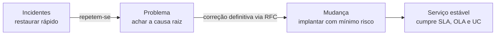
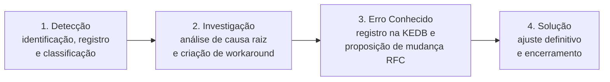
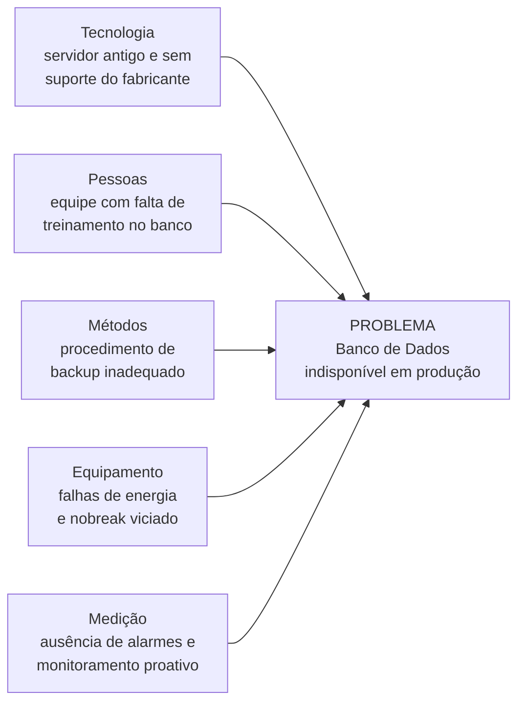
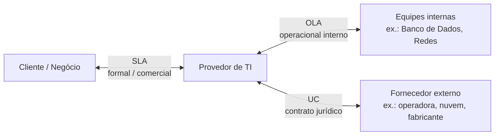

---

materia: Gestão de Serviços de TI 
fonte: Aula 04 - Práticas Táticas ITIL v4.pdf 
tags:

- resumo
- itil
- problemas
- mudancas
- sla

---

# 📝 Problemas, Mudanças e Acordos de Nível de Serviço

## 👁️ Visão geral

Quarta aula da **Unidade 1**. Depois das práticas operacionais ([[Central de Serviços, Incidentes e Requisições]]), sobe para três **práticas táticas** da ITIL 4: **Gerenciamento de Problemas** (achar e eliminar a **causa raiz**, com **5 Porquês** e **Ishikawa**), **Habilitação de Mudanças** (*Change Enablement*: mudanças **padrão, normal e emergencial**, com o **CAB**) e **Gerenciamento de Nível de Serviço** (**SLA**, **OLA** e **UC**). As três se encadeiam: incidentes repetidos viram **problema**, a correção definitiva vira uma **mudança**, e tudo isso existe para cumprir os **acordos** de nível de serviço.



---

## 🔍 Gerenciamento de Problemas

### O que é

| Objetivos principais | |
| :--- | :--- |
| **Identificar as causas fundamentais** | dos incidentes **ocorridos ou potenciais** na infraestrutura de TI |
| **Evitar a recorrência** de falhas | e minimizar os impactos negativos nos serviços de negócio |

Repare no "**ou potenciais**": o gerenciamento de problemas não espera o incidente acontecer. Ele também atua **antes**, investigando riscos percebidos (ex.: um disco dando sinais de desgaste).

### Incidente × Problema

| Atributo | **Incidente** | **Problema** |
| :--- | :--- | :--- |
| **Definição** | Evento **não planejado** que **interrompe ou reduz a qualidade** | **Causa subjacente** de **um ou mais** incidentes ocorridos |
| **Foco de atuação** | **Restauração imediata** do serviço afetado | **Prevenção e eliminação da causa raiz** |
| **Modo de resposta** | Resposta rápida / **solução de contorno** (*workaround*) | **Investigação detalhada** e diagnóstico estruturado |
| **Horizonte** | **Curto prazo** (visão **reativa**) | **Médio e longo prazo** (visão **preventiva**) |

> [!example] Exemplo prático do material: ERP fora do ar
> - **Visão do incidente**: o ERP corporativo fica completamente indisponível no horário de pico. **Ação imediata**: a equipe **reinicia o servidor** e o ERP volta a funcionar rapidamente.
> - **Visão do problema**: **por que** o servidor do ERP caiu inesperadamente? **Ação investigativa**: a análise de **logs** identifica **falhas físicas recorrentes na memória RAM** do equipamento.
>
> Reiniciar resolveu o **incidente**, mas não o **problema**: com a RAM defeituosa, o ERP vai cair de novo.

Na aula anterior, um dos objetivos do gerenciamento de incidentes era justamente alimentar o gerenciamento de problemas com o **registro histórico** ([[Central de Serviços, Incidentes e Requisições#Objetivos do gerenciamento de incidentes]]). Aqui está quem usa esses registros.

### Erro conhecido

Os objetivos da aula pedem a distinção entre **incidente, problema e erro conhecido**, mas os slides só citam o erro conhecido no ciclo de problemas (etapa 3). A definição:

> [!info] Contexto externo — erro conhecido
> **Erro conhecido** (*known error*) é um **problema que já foi analisado** — a causa raiz foi identificada e, em geral, há um *workaround* documentado — **mas que ainda não foi resolvido definitivamente**. Ele fica registrado na **KEDB** (*Known Error Database*, base de dados de erros conhecidos) para que a Central de Serviços aplique o contorno rápido quando o incidente se repetir.

| Conceito | Em uma frase | No exemplo do ERP |
| :--- | :--- | :--- |
| **Incidente** | O serviço **falhou agora** | "O ERP caiu às 10h" |
| **Problema** | A **causa desconhecida** por trás de um ou mais incidentes | "Por que o ERP cai?" |
| **Erro conhecido** | Problema com **causa identificada**, ainda **não eliminada** | "É a RAM com defeito; até trocar, reinicie o servidor" |

### Ciclo do Gerenciamento de Problemas



| Etapa | O que acontece |
| :--- | :--- |
| **1. Detecção** | Identificação, registro e classificação do problema |
| **2. Investigação** | **Análise de causa raiz** e criação de ***workaround*** |
| **3. Erro Conhecido** | Registro na **KEDB** e **proposição de mudança (RFC)** |
| **4. Solução** | Implementação do **ajuste definitivo** e encerramento |

A etapa 3 é a ponte com a próxima prática: a correção definitiva quase sempre exige alterar algo no ambiente, então vira uma **RFC** (solicitação de mudança) e segue o fluxo de [[#🔄 Habilitação de Mudanças (Change Enablement)]].

> [!warning] Workaround aparece nas duas práticas
> O *workaround* é a resposta típica do **incidente** (restaurar rápido). Mas é o **gerenciamento de problemas** que, na etapa de investigação, **cria e documenta** o contorno para que ele seja reaproveitado. Contorno **não é** solução definitiva.

> [!info] Contexto externo
> **RCA** = *Root Cause Analysis* (análise de causa raiz). Na ITIL 4, as fases do gerenciamento de problemas se chamam **identificação** do problema, **controle** do problema e **controle** de erro — equivalem, grosso modo, às etapas 1, 2 e 3–4 do slide.

---

## 🌱 Causa raiz e técnicas de análise

> [!info] Definição
> A **causa raiz** é o **fator primordial que desencadeou toda a cadeia de eventos** que resultou no incidente.

- Atuar **apenas nos sintomas mascara o defeito** e garante que o incidente **volte a ocorrer em breve**.
- O **objetivo central** da prática de Gerenciamento de Problemas é **diagnosticar e eliminar definitivamente** essa causa.

### Técnica dos 5 Porquês

| Característica | Descrição |
| :--- | :--- |
| **Conceito simples** | Perguntar "**Por quê?**" iterativamente (==**geralmente** cinco vezes==) diante de um problema |
| **Cadeia de causalidade** | **Cada resposta serve de base para a pergunta seguinte**, aprofundando a análise |
| **Transição de sintoma a causa** | Ultrapassa os sintomas superficiais e atinge **falhas de processo ou gestão** |
| **Foco em processos** | **Evita a culpabilização individual** e direciona o foco à melhoria das práticas operacionais |

#### Exemplo prático do material

| Nível | Pergunta | Resposta diagnóstica |
| :--- | :--- | :--- |
| **Problema** | O banco de dados ficou completamente indisponível. | — |
| **1º Por quê?** | Por que ficou indisponível? | O servidor desligou subitamente. |
| **2º Por quê?** | Por que o servidor desligou? | Ocorreu um superaquecimento interno. |
| **3º Por quê?** | Por que ocorreu superaquecimento? | O sistema de refrigeração falhou. |
| **4º Por quê?** | Por que o sistema falhou? | A manutenção preventiva não foi realizada. |
| **5º Por quê? (Raiz)** | Por que não foi realizada? | ==**Ausência de cronograma de manutenção preventiva formalizado.**== |

Repare que a causa raiz **não** é "o servidor desligou" nem "a refrigeração falhou" — esses são **sintomas intermediários**. A raiz é uma **falha de processo** (não havia cronograma). Trocar o ar-condicionado resolveria só esta vez; criar o cronograma evita que se repita. E ninguém foi culpado: o foco está no **processo**.

#### Benefícios

| Benefício | Por quê |
| :--- | :--- |
| **Fácil aplicação** | Ferramenta leve, não exige softwares complexos nem treinamento extenso |
| **Baixo custo** | Eficaz em problemas do dia a dia, com discussões ricas a **custo zero** |
| **Melhoria contínua** | Identifica **falhas estruturais de processo**, evitando remendos temporários |

### Diagrama de Ishikawa (Espinha de Peixe)

Também chamado de **Diagrama de Espinha de Peixe** ou **de Causa e Efeito**. **Organiza visualmente as causas potenciais** divididas em **categorias padronizadas**, facilitando o **brainstorming de equipes multifuncionais**. É ideal para **problemas complexos**, em que **múltiplos fatores** podem estar interagindo.

![[ishikawa-espinha-de-peixe-categorias-6m.png|550]]
*Diagrama de Ishikawa mostrado na aula (fonte: ASQ): o problema fica na "cabeça" do peixe e cada "espinha" é uma categoria de causas. As categorias da figura estão em inglês — ver a correspondência na tabela abaixo.*

#### Categorias do Ishikawa

| Grupo no slide | Categoria | O que entra |
| :--- | :--- | :--- |
| **Pessoas & Métodos** | **Pessoas** | Treinamento, capacitação e falhas humanas |
| | **Métodos** | Processos, procedimentos e fluxos institucionais |
| **Tecnologia & Equipamento** | **Tecnologia** | Softwares, sistemas e licenças |
| | **Equipamentos** | Hardware, servidores, redes e capacidade física |
| **Ambiente & Medição** | **Ambiente** | Climatização, energia e estrutura |
| | **Medição** | Métricas, monitoramento e métricas ausentes |

> [!info] Contexto externo — os 6M
> O Ishikawa clássico usa os **6M**: **M**étodo, **M**áquina, **M**ão de obra, **M**aterial, **M**eio ambiente e **M**edida. A figura da aula traz a versão em inglês e o slide adapta para TI:
>
> | Figura (inglês) | 6M | Slide (TI) |
> | :--- | :--- | :--- |
> | People | Mão de obra | Pessoas |
> | Processes | Método | Métodos |
> | Machines | Máquina | Equipamentos |
> | Materials | Material | Tecnologia *(minha leitura: softwares e licenças são os "insumos" da TI)* |
> | Environment | Meio ambiente | Ambiente |
> | Measurements | Medida | Medição |

#### Aplicação do material: banco de dados indisponível em produção

Análise preventiva e diagnóstica distribuída por múltiplos eixos da operação de TI:



> [!note] Duas observações sobre este slide
> - A categoria **Ambiente** não aparece nas causas mapeadas — nem toda categoria precisa ter causa em todo problema.
> - "Falhas de **energia**" foi colocada em **Equipamento**, junto com o **nobreak viciado**. Pela tabela de categorias, energia é de **Ambiente**; o nobreak (o aparelho) é que é equipamento. Numa questão que peça para classificar "falta de energia", a resposta pela definição do slide 13 é **Ambiente**.

### 5 Porquês × Ishikawa

| | **5 Porquês** | **Ishikawa** |
| :--- | :--- | :--- |
| Forma | **Cadeia linear** de perguntas | **Mapa visual** de causas por categoria |
| Melhor para | Problemas do dia a dia, com uma linha de causa | **Problemas complexos**, com **vários fatores** interagindo |
| Como se usa junto | Aprofunda **uma** causa até a raiz | Levanta **muitas** causas possíveis; depois se aplica os 5 Porquês nas mais prováveis |

---

## 🔄 Habilitação de Mudanças (Change Enablement)

> [!info] Objetivo da prática
> Garantir que as alterações nos serviços tragam **valor máximo ao negócio** com o **mínimo risco operacional**.

> [!info] Contexto externo
> Em textos mais antigos da ITIL 4, a mesma prática aparece como **Controle de Mudanças** (*Change Control*). Na ITIL v3, era **Gerenciamento de Mudanças**.

### Definição de mudança

> [!info] Definição (ITIL v4)
> **Mudança** é a **adição, modificação ou remoção de qualquer elemento** que possa **afetar direta ou indiretamente** os serviços de TI.

A prática busca **equilibrar** a **agilidade** de inovação do negócio com a **estabilidade** operacional: mudar rápido o suficiente para inovar, sem derrubar o que funciona.

Exemplos comuns:

- Atualização de versão de software/ERP.
- Substituição de ativos de hardware.
- Alteração de regras de firewall/rede.
- Implantação de novos sistemas corporativos.
- Modificação de esquemas em banco de dados.

### Classificação das mudanças

| Tipo | Risco / natureza | Aprovação | Exemplos do material |
| :--- | :--- | :--- | :--- |
| **Padrão** (*Standard*) | **Baixo risco**, impacto **testado e totalmente conhecido**, **procedimento documentado** e rotineiro | ==**Pré-aprovada**==: **não passa pelo CAB a cada execução**; executada via **Service Request** detalhado | Instalar impressora em estação; criar usuário no Active Directory; atualização rotineira de antivírus; liberação padronizada de espaço em disco |
| **Normal** (*Normal*) | Exige **análise de risco**, custos e impacto; **agendamento** | **RFC** + **aprovação formal** pela autoridade de mudança adequada (conforme o impacto); **CAB** nas de médio/alto impacto | Migração de servidores para a nuvem; atualização do ERP ou CRM; alteração na arquitetura de switches e roteadores |
| **Emergencial** (*Emergency*) | **Urgente**: resolver **incidente crítico/grave** ou **brecha de segurança/vulnerabilidade iminente** | Fluxo **simplificado** pelo **ECAB**; documentação detalhada e testes **podem ser finalizados após** a implementação | Patch para vulnerabilidade **zero-day**; restauração urgente pós-ataque de **ransomware**; correção de falha grave que paralisou a produção comercial |

**Requisitos do fluxo da mudança normal**, em detalhe:

1. Submissão de **Solicitação de Mudança** (**RFC** — *Request for Change*).
2. **Avaliação detalhada** de riscos, custos e impacto operacional.
3. **Plano de testes** e **plano de retorno** (***rollback***).
4. **Aprovação formal** pela autoridade de mudança adequada.

> [!info] Contexto externo — termos
> - ***Rollback*** (plano de retorno): o passo a passo para **desfazer a mudança** e voltar ao estado anterior se ela der errado.
> - **Zero-day**: vulnerabilidade explorada antes de o fabricante ter lançado correção — não há "dia zero" de margem.
> - **Ransomware**: ataque que sequestra (criptografa) os dados e cobra resgate.
> - **Janela de manutenção**: período combinado com o negócio, de menor uso, em que mudanças podem ser executadas (ex.: domingo de madrugada).

> [!example] Roteiro de decisão do tipo de mudança *(meu, a partir das definições)*
> ```mermaid
> flowchart TD
>     A["Mudança proposta"] --> B{"Baixo risco, rotineira,<br>procedimento documentado<br>e já pré-autorizada?"}
>     B -->|"Sim"| C["PADRÃO<br>executa via service request<br>sem ir ao CAB"]
>     B -->|"Não"| D{"Precisa ser feita já para<br>resolver incidente grave ou<br>vulnerabilidade iminente?"}
>     D -->|"Sim"| E["EMERGENCIAL<br>aprovação pelo ECAB<br>documenta e testa depois"]
>     D -->|"Não"| F["NORMAL<br>RFC, análise de risco, testes,<br>rollback e aprovação formal/CAB"]
> ```

> [!tip] Mudança padrão e requisição
> Na aula 3, **criar usuário** e **instalar software homologado** eram **requisições de serviço**. Aqui, "criação de novo usuário no Active Directory" é exemplo de **mudança padrão**. Não há contradição: a mudança padrão é justamente a alteração **pré-aprovada e rotineira** que é **executada por meio de uma requisição** (service request).

### Comitê de Mudanças (CAB)

> [!info] Definição
> O **CAB** (*Change Advisory Board*, **Comitê Consultivo de Mudanças**) é um **grupo multidisciplinar** encarregado de **avaliar, priorizar e autorizar mudanças normais de médio/alto impacto**.

**Responsabilidades**: avaliar o **impacto no negócio**, analisar o **plano de mitigação de riscos** e verificar a **disponibilidade de janela de manutenção**.

O **ECAB** (*Emergency Change Advisory Board*) é a versão enxuta do comitê, acionada para **mudanças emergenciais**, que não podem esperar a reunião normal do CAB.

| Tipo de mudança | Quem autoriza |
| :--- | :--- |
| Padrão | **Ninguém a cada execução** — já é pré-aprovada |
| Normal | **Autoridade de mudança adequada**; o **CAB** nas de médio/alto impacto |
| Emergencial | **ECAB** |

### Fluxo genérico de aprovação

| Etapa | O que acontece |
| :--- | :--- |
| **1. RFC** | Solicitação **registrada e categorizada** |
| **2. Análise CAB** | Avaliação de **riscos e impactos** |
| **3. Execução** | Implementação e **testes na janela** de manutenção |
| **4. PIR** | **Revisão pós-implementação** e fechamento |

> [!info] Contexto externo
> **PIR** = *Post-Implementation Review*. É a checagem, **depois** de implantar, de que a mudança atingiu o objetivo sem efeitos colaterais — e de lições aprendidas para as próximas.

---

## 📜 Gerenciamento de Nível de Serviço

> [!info] Objetivo da prática
> Garantir que os serviços entregues **atendam às metas acordadas** com os **clientes** e com o **negócio**, num **alinhamento contínuo** das expectativas de TI com os objetivos organizacionais.



O SLA é a promessa feita **para fora** (ao cliente). OLA e UC são os acordos que **sustentam** essa promessa **por dentro** (equipes internas) e **por fora** (fornecedores).

### SLA — Service Level Agreement

> [!info] Acordo de Nível de Serviço
> **Acordo formal documentado** entre o **Provedor de TI** e o **Cliente/Negócio**. Define claramente as **expectativas de entrega** do serviço e as **metas de desempenho** a serem atingidas.

| Parâmetro típico | Exemplo do material |
| :--- | :--- |
| **Disponibilidade** | **99,9%** no mês |
| **Tempo de resposta** | Atendimento em até **15 min** |
| **Tempo de resolução** | Solução em até **4 horas** |
| **Penalidades** | **Descontos** em caso de descumprimento |

> [!example] Quanto é 99,9% de disponibilidade? *(cálculo meu)*
> Num mês de 30 dias:
> $$(1 - 0{,}999) \times 30 \times 24 \times 60 = 43{,}2 \text{ min}$$
> Ou seja, o serviço pode ficar **no máximo cerca de 43 minutos** fora do ar no mês. Uma única queda de 1 hora já **quebra** o SLA.

> [!warning] Atender ≠ resolver
> **Tempo de resposta** = quanto demora para **começar** o atendimento (15 min). **Tempo de resolução** = quanto demora para **resolver** (4 h). São metas diferentes do mesmo SLA.

### OLA — Operational Level Agreement

> [!info] Acordo de Nível Operacional
> **Acordo interno** entre o **Provedor de TI** e **outras unidades/equipes internas** da organização. **Sustenta a capacidade da TI interna** em cumprir os compromissos externos firmados no SLA.

> [!example] Exemplo operacional do material
> Para cumprir um **SLA de resolução de 2 horas** com o cliente, a **equipe de Banco de Dados** compromete-se (via **OLA**) a atuar e resolver chamados internos repassados em **no máximo 30 minutos**.

As metas da OLA precisam ser **mais apertadas** que as do SLA: se a equipe de BD pudesse levar 3 horas, o SLA de 2 horas seria impossível de cumprir.

### UC — Underpinning Contract

> [!info] Contrato de Apoio Subjacente
> **Contrato juridicamente vinculante** firmado entre a **Organização** e um **Fornecedor Externo** de serviços. **Garante o suporte externo** de infraestrutura, links de dados ou softwares necessários.

Exemplos de terceiros:

- Contrato de **link redundante** com operadora de telecom.
- Contrato de **hospedagem e suporte em nuvem** (AWS/Azure).
- **Manutenção preventiva e substituição de hardware** pelo fabricante.

"Subjacente" (*underpinning*) quer dizer que o contrato fica **por baixo** do SLA, dando sustentação a ele.

### Matriz de comparação dos acordos

| Acordo | Partes envolvidas | Natureza | Objetivo central |
| :--- | :--- | :--- | :--- |
| **SLA** (*Service Level Agreement*) | **Provedor de TI × Cliente do negócio** | **Formal / Comercial** | Definir metas de entrega de serviços e expectativas do cliente |
| **OLA** (*Operational Level Agreement*) | **Equipe de TI × Equipe interna de TI** | **Operacional interno** | Garantir que as equipes internas **sustentem o cumprimento do SLA** |
| **UC** (*Underpinning Contract*) | **Empresa / TI × Fornecedor terceirizado** | **Contrato jurídico** | Garantir que fornecedores externos entreguem insumos **adequados ao SLA** |

> [!tip] Macete
> **S**LA = **S**ervice → para o **cliente**. **O**LA = **O**peracional → **dentro** de casa. **U**C = contrato com o **fornecedor de fora** (o único juridicamente vinculante com terceiro).

Na aula 2, "gestão eficaz de contratos de nível de serviço" aparecia na dimensão **Parceiros e Fornecedores** ([[ITIL 4 e o Sistema de Valor de Serviço#🧱 As quatro dimensões]]) — é o terreno dos **UCs**.

---

## ⚠️ Pegadinhas e erros comuns

| Confusão comum | O certo |
| :--- | :--- |
| Incidente e problema são a mesma coisa | **Incidente** = o evento (restaurar rápido, curto prazo, reativo). **Problema** = a **causa subjacente** de um ou mais incidentes (eliminar, médio/longo prazo, preventivo) |
| Problema só existe depois de um incidente | O gerenciamento de problemas também trata causas de incidentes **potenciais** |
| Erro conhecido = problema resolvido | Erro conhecido tem **causa identificada** mas **ainda não eliminada**; fica na **KEDB** com o *workaround* |
| *Workaround* resolve o problema | *Workaround* **contorna**; a **solução definitiva** vem na etapa 4, normalmente via **mudança (RFC)** |
| 5 Porquês = sempre exatamente 5 perguntas | "**Geralmente**" cinco — pergunta-se até chegar à raiz |
| A raiz do exemplo é "a refrigeração falhou" | A raiz é a **ausência de cronograma de manutenção preventiva** — uma falha de **processo** |
| 5 Porquês serve para achar culpados | Evita **culpabilização individual**; o foco é o **processo** |
| Ishikawa é para problemas simples | É ideal para problemas **complexos**, com **múltiplos fatores** |
| Energia é da categoria Equipamento | Pela tabela de categorias, **energia** é **Ambiente** (o slide de aplicação mistura com o nobreak) |
| Mudança padrão passa pelo CAB | É **pré-aprovada**: **não** passa pelo CAB a cada execução |
| Mudança emergencial não tem aprovação | Tem, mas **simplificada**, pelo **ECAB**; documentação e testes podem ser concluídos depois |
| O CAB aprova todas as mudanças | O CAB avalia mudanças **normais de médio/alto impacto**. Padrão é pré-aprovada; emergencial vai ao **ECAB** |
| *Rollback* é opcional | É **requisito** da mudança **normal** (plano de testes + plano de retorno) e, como cobra a Revisão (Q48), essencial também na **emergencial** — é o que restaura o serviço se a mudança falhar |
| PIR acontece antes de implantar | **PIR** = revisão **pós**-implementação |
| OLA é com fornecedor externo | **OLA** é **interno** (entre equipes de TI). Com fornecedor externo é **UC** |
| SLA é interno | **SLA** é entre **Provedor de TI e cliente/negócio** |
| OLA pode ter prazo igual ou maior que o SLA | OLA precisa ser **mais curta** para o SLA ser viável (ex.: SLA 2 h, OLA 30 min) |
| Tempo de resposta = tempo de resolução | **Resposta** = começar a atender; **resolução** = resolver |

---

## 📝 Questões

### 🗄️ Estudo de caso e atividade prática: quedas recorrentes no BD

> [!abstract] Cenário
> Uma **empresa varejista** enfrenta **paralisações diárias do banco de dados** no **horário das vendas principais**.

**Desafio:** aplicar a investigação de causa raiz, definir o tipo de mudança necessária e identificar quais SLAs, OLAs e UCs estão ameaçados. A atividade em grupo divide o desafio em três entregas (o formulário completo da Atividade 4, sobre o mesmo caso, está em [[Atividade — Quedas Recorrentes no Banco de Dados]]):

**1. Diagnóstico.** Aplique a técnica dos **5 Porquês** e estruture o **Diagrama de Ishikawa** para o estudo de caso.

> [!question]- Resposta (resolvida por mim, confira)
> O cenário não traz logs nem dados, então a cadeia abaixo é uma **hipótese plausível** — na prática, cada resposta precisa ser confirmada com evidências (logs, métricas, monitoramento).
>
> **5 Porquês**
>
> | Nível | Pergunta | Resposta (hipótese) |
> | :--- | :--- | :--- |
> | Problema | O BD para todo dia no horário de pico de vendas. | — |
> | 1º | Por que o BD para? | O servidor esgota a memória e a CPU e deixa de responder. |
> | 2º | Por que esgota os recursos justo nesse horário? | O volume de transações de venda cresceu e, ao mesmo tempo, rodam relatórios pesados e o backup. |
> | 3º | Por que essas rotinas pesadas rodam no pico? | Foram agendadas há anos, quando o volume era menor, e ninguém revisou. |
> | 4º | Por que ninguém percebeu que a capacidade ficou insuficiente? | Não há monitoramento de capacidade nem alertas de CPU/memória. |
> | 5º (raiz) | Por que não há esse monitoramento? | **Não existe processo de planejamento de capacidade** acompanhando o crescimento do negócio. |
>
> Como no exemplo do material, a raiz é uma **falha de processo**, não "o servidor caiu".
>
> **Ishikawa**
>
> | Categoria | Causas possíveis |
> | :--- | :--- |
> | **Pessoas** | DBAs sem treinamento em otimização (*tuning*) do banco |
> | **Métodos** | Backup e relatórios agendados no horário de pico; ausência de gestão de capacidade |
> | **Tecnologia** | Versão do banco desatualizada ou sem suporte; consultas mal otimizadas |
> | **Equipamentos** | Servidor subdimensionado para o volume atual; discos lentos |
> | **Ambiente** | Climatização ou energia instáveis no datacenter nos horários de maior carga |
> | **Medição** | Sem alertas de CPU, memória e conexões; sem histórico de desempenho |
>
> Na sequência, aplica-se os 5 Porquês às causas mais prováveis levantadas no Ishikawa — foi o que a cadeia acima fez com Métodos e Medição.

**2. Mudança.** Defina se a intervenção exigirá **Mudança Padrão, Normal ou Emergencial**, detalhando o **plano de rollback**.

> [!question]- Resposta (resolvida por mim, confira)
> **Mudança Normal**, na maioria dos cenários.
> - **Não é padrão**: mexer no banco de produção de um varejista (redimensionar servidor, reagendar rotinas, atualizar versão, migrar) **não** é rotineiro, de baixo risco e pré-aprovado.
> - **Normal** porque exige **RFC**, **análise de risco e impacto**, **plano de testes**, **rollback** e **aprovação do CAB** (é de alto impacto), executada numa **janela de manutenção fora do horário de vendas**.
> - **Enquanto isso**, as quedas diárias continuam sendo tratadas como **incidentes** (restaurar rápido) com um **workaround** registrado na KEDB — por exemplo, suspender os relatórios no horário de pico.
> - **Seria emergencial** se não desse para esperar o ciclo normal — por exemplo, se a queda estivesse causada por uma vulnerabilidade sendo explorada ou se a próxima parada fosse inaceitável para o negócio. Aí a aprovação iria ao **ECAB** e a documentação seria completada depois.
>
> **Plano de rollback** (exemplo para "migrar o BD para um servidor maior e reagendar as rotinas"):
> 1. Antes da mudança: **backup completo** e *snapshot* do servidor atual; manter o servidor antigo intacto.
> 2. Definir **critérios de sucesso** (ex.: BD responde em menos de X segundos com carga simulada) e um **prazo-limite** para decidir o rollback dentro da janela.
> 3. Se os testes falharem: **reapontar a aplicação para o servidor antigo** e restaurar a configuração anterior.
> 4. Validar que o sistema de vendas voltou a funcionar e **comunicar** o negócio.
> 5. Registrar tudo e fazer a **PIR** (revisão pós-implementação), tenha a mudança dado certo ou não.

**3. Acordos.** Identifique quais **SLAs, OLAs e UCs** devem ser revisados e apresente a solução.

> [!question]- Resposta (resolvida por mim, confira)
> | Acordo | Qual está ameaçado | Por quê / o que revisar |
> | :--- | :--- | :--- |
> | **SLA** | SLA do **sistema de vendas** entre a TI e a área comercial (disponibilidade e tempo de resolução) | Quedas diárias no pico estouram qualquer meta de disponibilidade (com 99,9% ao mês, sobram ~43 min). Revisar metas, penalidades e incluir janelas de manutenção acordadas |
> | **OLA** | Entre a **Central de Serviços** e a **equipe de Banco de Dados**, e entre BD e **infraestrutura/servidores** | Os tempos internos de atuação precisam caber no SLA. Revisar prazos de resposta no horário de pico e o plantão da equipe de BD |
> | **UC** | Com o **fabricante do hardware** (manutenção e troca de peças), com o **fornecedor do banco de dados** (suporte da versão) e, se houver, com o **provedor de nuvem/hospedagem** | Se o servidor não tem mais suporte do fabricante ou o contrato não cobre o horário de pico, o SLA fica sem sustentação. Revisar cobertura, prazos de atendimento e níveis de suporte |
>
> **Solução integrada:** tratar as quedas como incidentes com *workaround* → abrir um **problema** e fazer a RCA → registrar o **erro conhecido** na KEDB → implantar a correção definitiva por **mudança normal** aprovada pelo CAB → revisar **SLA, OLAs e UCs** para que as metas externas e os compromissos internos e de fornecedores fiquem coerentes.

---

## 💡 Fechamento

A aula liga três práticas num mesmo fio: o **gerenciamento de problemas** aprende com os incidentes e encontra a causa raiz; a **habilitação de mudanças** implanta a correção com risco controlado, na medida certa para cada tipo de mudança; e o **gerenciamento de nível de serviço** define, com SLA, OLA e UC, o que precisa ser cumprido e quem sustenta cada compromisso.

> [!quote] Síntese da aula
> "A maturidade na Gestão de Serviços de TI depende da capacidade de **aprender com os incidentes**, **controlar mudanças** de forma estruturada e **cumprir acordos** que assegurem a entrega contínua de valor." — ITIL v4 Framework