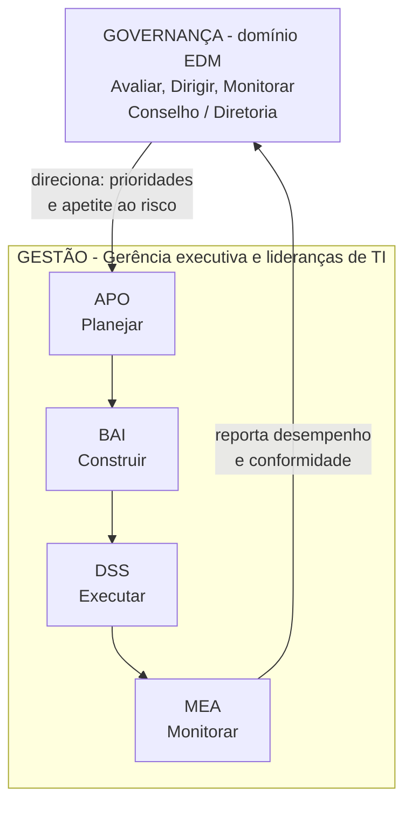

---

materia: Gestão de Serviços de TI 
fonte: Aula 5 - Governança Corporativa de TI e Framework COBIT 2019.pdf 
tags:

- resumo
- governanca
- cobit

---
# 📝 Governança Corporativa de TI e COBIT 2019

## 👁️ Visão geral

Quinta aula da **Unidade 1**. Sai das práticas de serviço da ITIL e sobe ao nível de **governança**: o que é **governança corporativa**, como a **governança de TI** se encaixa nela e como o **COBIT 2019** organiza tudo. O eixo da aula é a separação entre **Governança** (domínio **EDM**: Avaliar, Dirigir, Monitorar — "fazer as coisas certas") e **Gestão** (domínios **APO, BAI, DSS, MEA** — "fazer as coisas da forma correta"). Fecha com os princípios do COBIT 2019, os objetivos EDM01–EDM05 e um estudo de caso sobre prazo × capacidade da TI.

A distinção governança × gestão já apareceu na aula 1 ([[Introdução à Gestão de Serviços de TI#🏛️ O papel da Governança de TI]]); aqui ela ganha o modelo formal do COBIT.

---

## 🏛️ Governança Corporativa

> [!info] Definição **Governança Corporativa** é o **sistema pelo qual as organizações são dirigidas, monitoradas e controladas** — o "sistema diretor" da organização.

**Pilares fundamentais**, para a geração contínua de valor:

|Pilar|Significado|
|:--|:--|
|**Transparência**|Informações claras e disponíveis para quem tem interesse legítimo nelas|
|**Responsabilidade**|Cuidar da continuidade e da viabilidade da organização no longo prazo|
|**Prestação de contas** (_Accountability_)|Quem decide responde pelas decisões e pelos resultados|
|**Equidade**|Tratamento justo de todos os sócios e partes interessadas|
|**Sustentabilidade**|Gerar valor de forma duradoura, sem comprometer o futuro|

_(Os nomes dos pilares são do slide; a coluna "significado" é explicação minha.)_

> [!note] Três definições de governança no curso
> 
> - **Aula 1** (governança de TI): especifica os **direitos de decisão** e o **arcabouço de responsabilidades** para encorajar comportamentos desejáveis no uso da TI.
> - **Aula 2** (ITIL 4): sistema pelo qual a organização é **dirigida e controlada**.
> - **Aula 5** (governança corporativa): sistema pelo qual as organizações são **dirigidas, monitoradas e controladas**.
> 
> O núcleo é o mesmo — **direção e controle**. A versão desta aula acrescenta **monitoradas**.

---

## 💻 Governança de TI

A **Governança de TI** é ==**parte integrante da Governança Corporativa**==, focada no **direcionamento estratégico do uso das tecnologias da informação e comunicação**.

Garantias centrais que ela oferece:

- **Alinhamento** direto das soluções com a **estratégia**.
- Geração **real e mensurável de valor** ao negócio.
- Gestão **proativa e prudente** de **riscos tecnológicos**.
- **Otimização** e uso eficiente dos **recursos** de TI.

Guarde esses quatro itens: **alinhamento, valor, risco e recursos** reaparecem nos objetivos do COBIT e nos objetivos EDM.

### Evolução da governança de TI

||**Passado operacional**|**Presente estratégico**|
|:--|:--|:--|
|Foco|Exclusivo em **suporte técnico** e gestão de infraestrutura rígida|Agente de **inovação**, liderança da **transformação digital**|
|Como a TI é vista|Mero **centro de custos**|Fonte de **inteligência de negócios** e **vantagem competitiva sustentável**|

É a mesma virada da aula 1 (TI de centro de custos a parceira estratégica). O slide ilustra com um quadro de estratégia de transformação digital com cinco pilares: visão e objetivos de negócio, pilares estratégicos da transformação, roteiro de transformação digital, **governança e liderança** e medição de impacto — a governança aparece como um dos pilares da transformação.

---

## 🧭 O Framework COBIT

> [!info] Definição **COBIT** (_Control Objectives for Information and Related Technologies_) é o **framework de referência mundialmente reconhecido** para **governança e gestão da informação e tecnologia corporativa**. É desenvolvido pela **ISACA**.

O COBIT **conecta as metas de negócio aos processos de TI**, assegurando **gestão de riscos**, **otimização de recursos** e **valor**.

> [!info] Contexto externo
> 
> - **ISACA** é a associação internacional de profissionais de auditoria, governança e segurança de TI.
> - O COBIT 2019 usa a sigla **I&T** (_Information and Technology_, informação e tecnologia) em vez de "TI", para deixar claro que a governança cobre **toda** informação e tecnologia da empresa, não só o departamento de TI.

### Evolução do COBIT

|Versão|Marca da versão|
|:--|:--|
|**COBIT 4.1**|Foco expressivo em **auditoria**, **controle interno** e processos técnicos de TI|
|**COBIT 5**|Visão **integrada** de governança corporativa, introduzindo os _**enablers**_ (habilitadores) e a **diferenciação clara entre governança e gestão**|
|**COBIT 2019**|**Aberto, modular, adaptável**, com **fatores de design** e alinhamento às exigências digitais|

> [!info] Contexto externo
> 
> - Datas: COBIT 4.1 (2007), COBIT 5 (2012), COBIT 2019 (lançado no fim de 2018).
> - **Enablers** do COBIT 5 são os elementos que viabilizam a governança (processos, estruturas, cultura, informação etc.). No COBIT 2019 eles viraram os **componentes do sistema de governança** (ver [[#Componentes do sistema de governança]]).
> - **Fatores de design** são as características da empresa que definem como o sistema de governança deve ser montado. O COBIT 2019 lista **11**, entre eles a estratégia da empresa, as metas, o perfil de risco, os requisitos de conformidade, o papel da TI, o modelo de _sourcing_ (terceirização) e o tamanho da empresa.

### Objetivos do COBIT 2019

|Objetivo|O que busca|
|:--|:--|
|**Alinhamento**|Conectar intimamente a **estratégia corporativa** com o **ecossistema tecnológico**|
|**Benefícios & Riscos**|**Maximizar a geração de valor** enquanto **minimiza e otimiza a exposição a riscos**|
|**Desempenho**|Elevar a **eficiência dos recursos** e manter sólida **conformidade regulatória**|
|**Tomada de Decisão**|Oferecer **dados precisos** para apoiar as decisões estratégicas da liderança|

---

## ⚖️ Governança × Gestão

Embora **profundamente complementares**, Governança e Gestão possuem **papéis, responsabilidades e estruturas organizacionais estritamente distintas**.

### O papel da Governança

|Aspecto|Descrição|
|:--|:--|
|**Direcionamento**|Responde: ==**"Estamos fazendo as coisas certas para a empresa?"**==|
|**Geração de valor**|Avalia se os **investimentos em TI** estão gerando **resultados reais**|
|**Apetite ao risco**|Define os **níveis aceitáveis de risco** e conformidade|
|**Responsabilidade**|Atribuição **direta e indelegável** da **Alta Administração / Conselho**|

**Apetite ao risco** é quanto risco a organização aceita correr para buscar seus objetivos. Um banco tem apetite baixo para risco de segurança; uma startup pode aceitar mais risco de prazo para lançar antes da concorrência.

**Indelegável** quer dizer que o conselho pode pedir ajuda e análises, mas **não pode transferir** a responsabilidade pela governança para a equipe de TI.

### Modelo EDM da Governança

|Verbo|O que faz|
|:--|:--|
|**Avaliar** (_Evaluate_)|Examina as **necessidades presentes e futuras dos stakeholders** e o ambiente interno/externo|
|**Dirigir** (_Direct_)|Estipula **diretrizes, prioridades e estratégias** corporativas de alto nível|
|**Monitorar** (_Monitor_)|Acompanha continuamente os **resultados**, o **desempenho** e a **conformidade** perante as metas|

A ordem é a da sigla: **E**valuate → **D**irect → **M**onitor. Primeiro se entende a situação (avaliar), depois se decide o rumo (dirigir), depois se acompanha se o rumo está sendo seguido (monitorar) — e o que o monitoramento revela alimenta uma nova avaliação.

### O papel da Gestão

|Aspecto|Descrição|
|:--|:--|
|**Execução prática**|Responde: ==**"Estamos fazendo as coisas da forma correta?"**==|
|**Ciclo operacional**|**Planejar, Construir, Executar e Monitorar** as operações diárias|
|**Transformação tática**|**Converte as diretrizes estratégicas** fixadas pela governança em **planos e entregas tangíveis**|
|**Liderança**|Sob responsabilidade dos **executivos, gerentes e equipes operacionais**|

> [!tip] Macete **Governança** = fazer as **coisas certas** (escolher **o quê** e **para quê**). **Gestão** = fazer as coisas **do jeito certo** (decidir **como**).

### Domínios de Gestão do COBIT

|Domínio|Sigla em inglês|Foco|
|:--|:--|:--|
|**APO**|_Align, Plan & Organize_ — Alinhar, Planejar e Organizar|Estratégia, arquitetura, riscos e inovação|
|**BAI**|_Build, Acquire & Implement_ — Construir, Adquirir e Implementar|Desenvolvimento e gestão de mudanças|
|**DSS**|_Deliver, Service & Support_ — Entregar, Servir e Suportar|Operações, suporte e segurança de dados|
|**MEA**|_Monitor, Evaluate & Assess_ — Monitorar, Avaliar e Analisar|**Controles internos** e **auditoria**|

> [!tip] Macete — cada domínio é um verbo do ciclo da gestão _(contexto externo)_
> 
> |Ciclo da gestão|Domínio|
> |:--|:--|
> |**Planejar** (_Plan_)|**APO**|
> |**Construir** (_Build_)|**BAI**|
> |**Executar** (_Run_)|**DSS**|
> |**Monitorar** (_Monitor_)|**MEA**|

### Comparativo: Governança × Gestão

|Dimensão|**Governança (EDM)**|**Gestão (APO, BAI, DSS, MEA)**|
|:--|:--|:--|
|**Foco principal**|**Avaliar, Dirigir e Monitorar**|**Planejar, Construir, Executar e Monitorar**|
|**Orientação**|**Estratégica** (**o quê** e **para quê**)|**Tática e operacional** (**como fazer**)|
|**Responsáveis**|**Conselho de Administração / Diretoria**|**Gerência Executiva / Lideranças de TI**|
|**Decisão**|**Define** prioridades e apetite ao risco|**Implementa** ações e opera soluções|

> [!warning] "Monitorar" aparece dos dois lados A **governança** monitora (o **M** de **EDM**): acompanha se os **resultados** e a **conformidade** estão de acordo com as **metas** que ela definiu. A **gestão** também monitora (o domínio **MEA**): acompanha o **desempenho das operações**, os **controles internos** e a **auditoria**, e **reporta** para a governança.

> [!warning] Aula 1 × Aula 5 Na aula 1, os verbos apareceram como "Direcionar, Avaliar e Monitorar" (governança) e "Planejar, Construir, Executar e **Operar**" (gestão). O COBIT usa **Avaliar, Dirigir, Monitorar** (nessa ordem, **EDM**) e "Planejar, Construir, Executar e **Monitorar**". Numa questão sobre COBIT, use a versão desta aula.

### Componentes do sistema de governança

|Componente|O que é|
|:--|:--|
|**Processos & Estruturas**|Práticas organizadas e **órgãos decisórios** estruturados|
|**Políticas & Informação**|**Diretrizes formais** e **dados de qualidade** para governar|
|**Cultura & Pessoas**|**Comportamento ético**, competências e habilidades|
|**Serviços & Infra**|**Aplicações e infraestrutura** que sustentam os serviços|

> [!info] Contexto externo O COBIT 2019 lista **7 componentes**: processos; estruturas organizacionais; princípios, políticas e procedimentos; informação; cultura, ética e comportamento; pessoas, habilidades e competências; e serviços, infraestrutura e aplicações. O slide os agrupa em 4 pares.

---

## 📐 Princípios de governança do COBIT 2019

Diretrizes fundamentais para estruturar um sistema de governança **dinâmico, holístico e sob medida** para a empresa.

|Nº|Princípio|Ideia central|
|:-:|:--|:--|
|**1**|**Partes interessadas** (gerar valor)|Transformar objetivos corporativos em metas de I&T, equilibrando **benefícios, riscos e recursos**|
|**2**|**Ponta a ponta**|A governança de TI **não é exclusiva do departamento de TI**; cobre a empresa inteira e o ecossistema|
|**3**|**Sistema dinâmico**|Mudou um fator de design → o sistema de governança **se readapta**|
|**4**|**Distinção** governança × gestão|Separação **rigorosa** entre **EDM** e **APO, BAI, DSS, MEA**|
|**5**|**Sob medida** (_Tailored_)|Ajustado ao **porte, setor regulatório, estratégia, perfil de risco e cultura** da organização|

### Princípio 1: Partes interessadas — gerar valor

O sistema de governança deve **transformar os objetivos corporativos em metas concretas de I&T**, equilibrando continuamente o **equilíbrio triplo de valor**:

|Elemento|Significado|
|:--|:--|
|**Realização de benefícios**|Entregar **resultados tangíveis**|
|**Otimização de riscos**|Manter a exposição em **níveis seguros**|
|**Otimização de recursos**|Usar **capital e pessoas** com máxima eficácia|

Os três puxam em direções diferentes: acelerar para gerar benefício aumenta risco; reduzir risco consome recursos. Governar é **equilibrar** — não maximizar um deles a qualquer custo.

### Princípio 2: Ponta a ponta

- **Visão holística**: a governança de TI ==**não é responsabilidade exclusiva do departamento de TI**==.
- **Ativos abrangentes**: integra processamento de dados, tecnologias digitais, pessoas e fluxos **em qualquer área** da empresa.
- **Ecossistema estendido**: inclui **parceiros, fornecedores** e prestadores externos de serviços digitais.

Exemplo: uma planilha crítica mantida pelo financeiro, ou um sistema contratado direto pelo marketing sem passar pela TI, também está sob a governança de I&T.

### Princípio 3: Sistema dinâmico

- **Mudança constante**: cada alteração nos **fatores de design** — como **mudança de estratégia**, surgimento de **novas tecnologias** ou **novas regulamentações** — exige que o sistema de governança **se readapte**.
- **Evolução contínua**: a governança **não é estática**. Ela reavalia constantemente se a arquitetura, os controles e as metas continuam adequados ao novo cenário.

Exemplo: a entrada em vigor da LGPD obrigou empresas a revisar políticas, controles e responsabilidades sobre dados pessoais.

### Princípios 4 e 5

- **Princípio 4 — Distinção**: separação **conceitual e prática rigorosa** entre as atividades e estruturas de **Governança (EDM)** e **Gestão (APO, BAI, DSS, MEA)**.
- **Princípio 5 — Sob medida** (_Tailored_): ajustado de acordo com o **porte**, o **setor regulatório**, a **estratégia competitiva**, o **perfil de risco** e a **cultura** específica da organização.

Exemplo do princípio 5: um banco (setor muito regulado) e uma startup de 20 pessoas não montam a mesma estrutura de governança — o COBIT se adapta a cada um.

> [!info] Contexto externo — princípios oficiais O COBIT 2019 oficial lista **6 princípios do sistema de governança**: (1) prover valor às partes interessadas, (2) **abordagem holística**, (3) sistema de governança dinâmico, (4) governança distinta da gestão, (5) adaptado às necessidades da empresa e (6) sistema de governança **ponta a ponta**. O material condensa em **5**, juntando "holística" e "ponta a ponta" no princípio 2. Para a prova da disciplina, siga os **5 do slide**; se aparecer "6 princípios", é a lista oficial. O COBIT 2019 também tem **3 princípios do framework** (baseado em modelo conceitual; aberto e flexível; alinhado aos principais padrões), que não são cobrados no material.

---

## 🎯 Objetivos de governança e gestão

> [!info] Contexto externo O COBIT 2019 tem **40 objetivos** de governança e gestão: **EDM 5**, **APO 14**, **BAI 11**, **DSS 6** e **MEA 4**. Cada um tem um código (domínio + número).

### Objetivos do domínio EDM (governança)

|Código|Objetivo|Descrição|
|:--|:--|:--|
|**EDM01**|**Modelo de Governança**|Assegurar o **estabelecimento e a manutenção** do sistema de governança|
|**EDM02**|**Entrega de Benefícios**|**Otimizar o valor** gerado pelos investimentos digitais|
|**EDM03**|**Otimização de Riscos**|Garantir que os riscos de I&T **não excedam a tolerância**|
|**EDM04**|**Otimização de Recursos**|Assegurar **capacidades adequadas** e **custos eficientes**|
|**EDM05**|**Transparência**|Garantir **reporte transparente** aos stakeholders|

Repare que **EDM02, EDM03 e EDM04** são exatamente o **equilíbrio triplo** do princípio 1: **benefícios, riscos e recursos**.

> [!info] Contexto externo No COBIT 2019 oficial, o EDM05 se chama **"Engajamento das partes interessadas assegurado"**; "Transparência para as partes interessadas" era o nome no COBIT 5. A ideia central — manter os stakeholders informados — é a mesma.

### Domínios do sistema de gestão

|Domínio|Foco principal|Exemplos de objetivos|Liga com|
|:--|:--|:--|:--|
|**APO**|Alinhamento e Estratégia|**APO09** (Acordos de Serviço), **APO12** (Gestão de Riscos)|APO09 ↔ SLA/OLA/UC ([[Problemas, Mudanças e Acordos de Nível de Serviço#📜 Gerenciamento de Nível de Serviço]])|
|**BAI**|Construção e Mudanças|**BAI06** (Gestão de Mudanças), **BAI10** (Gestão de Configuração)|BAI06 ↔ habilitação de mudanças ([[Problemas, Mudanças e Acordos de Nível de Serviço#🔄 Habilitação de Mudanças (Change Enablement)]])|
|**DSS**|Entrega e Operações|**DSS01** (Operações), **DSS02** (Incidentes e Serviços)|DSS02 ↔ incidentes e requisições ([[Central de Serviços, Incidentes e Requisições]])|
|**MEA**|Avaliação e Conformidade|**MEA01** (Desempenho), **MEA03** (Requisitos Externos)|MEA03 ↔ conformidade com leis como a LGPD|

_(A coluna "Liga com" é minha, ligando aos resumos anteriores.)_

**Gestão de configuração** (BAI10) é manter o inventário atualizado dos componentes de TI (servidores, softwares, versões) e de como eles se relacionam — o que permite avaliar o impacto de uma mudança antes de fazê-la.

---

## 🧩 Benefícios e integração com outros frameworks

### Benefícios do COBIT 2019

|Benefício|Descrição|
|:--|:--|
|**Alinhamento**|Estratégias digitais **integradas** aos objetivos corporativos|
|**Mitigação**|Redução sistemática de **riscos operacionais** e **falhas de segurança**|
|**Conformidade**|Apoio no cumprimento de **leis, regulação e auditorias**|
|**ROI em TI**|Otimização comprovada dos **investimentos tecnológicos**|

### Integração de frameworks

|Área|Frameworks|Para quê|
|:--|:--|:--|
|**Serviços**|**ITIL / ISO 20000**|Operação detalhada de **gestão de serviços de TI**|
|**Segurança**|**ISO 27001 / NIST**|**Segurança da informação** e cibersegurança|
|**Projetos**|**PMBOK / PRINCE2**|Governança e gestão formal de **projetos**|
|**Agilidade**|**Scrum / Agile / DevOps**|**Entrega contínua** e ágil de software|

> [!tip] COBIT × ITIL Os frameworks **não competem**: o **COBIT** diz **o que** precisa ser governado e controlado (ex.: "BAI06 — mudanças precisam ser gerenciadas"); a **ITIL** detalha **como** operar isso no dia a dia (ex.: tipos de mudança, CAB, RFC — ver [[Problemas, Mudanças e Acordos de Nível de Serviço]]). O COBIT funciona como o "guarda-chuva" que integra os outros.

> [!info] Contexto externo **ISO 20000** é a norma internacional de gestão de serviços de TI (certificável, próxima da ITIL). **NIST** é o instituto de padrões dos EUA, cujo _Cybersecurity Framework_ é muito usado em segurança. **PMBOK** e **PRINCE2** são referências de gestão de projetos.

---

## ⚠️ Pegadinhas e erros comuns

|Confusão comum|O certo|
|:--|:--|
|Governança de TI é separada da corporativa|É **parte integrante** da governança corporativa|
|Governança de TI é assunto do departamento de TI|Princípio **ponta a ponta**: envolve **toda a empresa** e o ecossistema; responsabilidade **indelegável** da Alta Administração/Conselho|
|"Coisas certas" = gestão|**Coisas certas** = **governança**. **Forma correta** = **gestão**|
|EDM = Executar, Dirigir, Monitorar|EDM = **Avaliar** (_Evaluate_), **Dirigir** (_Direct_), **Monitorar** (_Monitor_)|
|EDM é um domínio de gestão|EDM é o domínio de **governança**. Os de **gestão** são **APO, BAI, DSS, MEA**|
|Monitorar é só da governança|A **gestão** também monitora (**MEA**), e reporta à governança|
|Auditoria e controles internos ficam no EDM|Ficam no **MEA** (gestão)|
|Gestão de mudanças fica no DSS|Mudanças ficam no **BAI** (**BAI06**); incidentes é que ficam no **DSS** (**DSS02**)|
|Acordos de serviço ficam no DSS|Ficam no **APO** (**APO09**)|
|DSS = só operação de infraestrutura|DSS = operações, suporte **e segurança de dados**|
|Enablers e distinção governança × gestão surgiram no COBIT 2019|Surgiram no **COBIT 5**. O **2019** trouxe os **fatores de design** e a modularidade|
|COBIT 4.1 era focado em governança corporativa|4.1 = foco em **auditoria e controle interno**|
|O COBIT 2019 tem 5 princípios|No **material**, 5. Na lista **oficial**, **6** (holística e ponta a ponta separados)|
|EDM02, 03 e 04 não têm relação com os princípios|São o **equilíbrio triplo** do princípio 1: **benefícios, riscos, recursos**|
|Quem decide o prazo no estudo de caso é a TI|Quem decide é a **Diretoria**, que **assume o risco**, respaldada pela avaliação da governança|
|COBIT substitui a ITIL|**Integra-se** a ela: COBIT = o quê; ITIL = como|

---

## 📝 Questões

### ⏱️ Estudo de caso: o dilema do prazo digital

> [!abstract] Cenário A **Diretoria Executiva** determina o lançamento de uma **nova plataforma digital crítica** em apenas **2 meses**. **Dilema:** a área de TI alerta que, devido às **limitações de equipe e infraestrutura**, o prazo seguro é de **no mínimo 6 meses**. **Desafio:** como alinhar a **urgência estratégica do negócio** à **capacidade real da TI**?

**1.** Quais **riscos** estão envolvidos em lançar em 2 meses?

> [!success]- Resposta Pelo material: **sobrecarga** da equipe, **falhas de segurança**, **débitos técnicos** e **interrupção do sistema**. **Débito técnico** é o "atalho" feito para ganhar tempo (código sem testes, arquitetura provisória) que vai cobrar juros depois, em retrabalho e instabilidade. Numa plataforma **crítica**, uma interrupção logo após o lançamento pode destruir justamente o valor que a pressa queria capturar (ver os impactos de falha na aula 1).

**2.** **Quem decide** se o lançamento acontece em 2 meses?

> [!success]- Resposta A **Diretoria** decide e **assume o risco**, **respaldada pela avaliação da governança**. Não é a TI quem decide: a TI **informa a capacidade e os riscos**; a decisão sobre **aceitar o risco** é da alta administração, porque a responsabilidade da governança é **indelegável** e o **apetite ao risco** é definido por ela.

**3.** Qual é o **papel da Governança** nesse caso?

> [!success]- Resposta **Avaliar o _trade-off_ entre valor comercial e risco** e **orientar a decisão**. É o **EDM** em ação: **avaliar** (qual o ganho de lançar em 2 meses × qual o risco para o negócio), **dirigir** (definir prioridade, escopo aceitável e nível de risco tolerado) e **monitorar** (acompanhar a execução e os riscos até o lançamento). Em termos de objetivos: **EDM02** (benefícios), **EDM03** (riscos) e **EDM04** (recursos) — o equilíbrio triplo.

**4.** Qual é o **papel da Gestão** nesse caso?

> [!success]- Resposta **Planejar um MVP**, **contratar serviços adicionais** e **gerenciar a execução**. **MVP** (_Minimum Viable Product_, produto mínimo viável) é lançar primeiro só as funções essenciais, dentro do prazo, e evoluir depois — reduz escopo sem abrir mão da segurança. Contratar serviços adicionais (reforço de equipe, nuvem) aumenta a capacidade. É a gestão transformando a diretriz da governança em **plano e entrega** (APO → BAI → DSS, com MEA acompanhando).

### 👥 Atividade prática em grupo

A partir do mesmo estudo de caso, o grupo deve: **(1) mapear** os objetivos estratégicos do negócio e da TI, apontando os conflitos; **(2) propor ações de governança** (avaliar prazos, aceitação de risco, priorização); **(3) propor ações de gestão** (escopo reduzido/MVP, reforço de equipe, _cloud agility_); e **(4) apresentar** a solução para a turma (tempo sugerido: 25 minutos).

**1. Mapeamento.** Quais são os objetivos estratégicos do negócio e da TI, e onde eles entram em conflito?

> [!question]- Resposta (resolvida por mim, confira)
> 
> |Lado|Objetivos|
> |:--|:--|
> |**Negócio**|Lançar rápido para capturar mercado, gerar receita nova, sair na frente da concorrência|
> |**TI**|Entregar uma plataforma **segura, estável e sustentável**, sem esgotar a equipe nem comprometer os outros serviços em operação|
> 
> **Conflitos:**
> 
> - **Prazo × qualidade/segurança**: 2 meses exigem atalhos (débito técnico, testes reduzidos).
> - **Prazo × capacidade**: a equipe e a infraestrutura atuais não suportam o volume de trabalho.
> - **Novo projeto × operação existente**: deslocar a equipe para o lançamento pode degradar os serviços que já estão no ar.
> - Pelo equilíbrio triplo: o negócio está maximizando **benefícios**, enquanto **riscos** e **recursos** ficam desequilibrados.

**2. Governança.** Que ações de governança o grupo propõe?

> [!question]- Resposta (resolvida por mim, confira)
> 
> - **Avaliar** (EDM) o valor real de lançar em 2 meses × 6 meses: quanto se perde esperando? Existe uma data de mercado que não pode ser perdida?
> - **Definir o apetite ao risco**: quais riscos a diretoria aceita (ex.: menos funções no lançamento) e quais **não** aceita (ex.: falha de segurança com dados de clientes, por causa da LGPD).
> - **Priorizar**: decidir se o projeto vale mais que outras iniciativas em andamento e liberar recursos (orçamento para reforço/nuvem).
> - **Dirigir** com uma decisão formal e documentada: por exemplo, lançamento de um **MVP em 2–3 meses** com as funções essenciais, e a versão completa em 6.
> - **Monitorar** com marcos (_checkpoints_) e indicadores de risco, com autorização para rever o prazo se um risco crítico se materializar.
> - Objetivos COBIT envolvidos: **EDM02, EDM03, EDM04** e **EDM05** (reporte transparente aos stakeholders sobre o que será entregue e quando).

**3. Gestão.** Que ações de gestão o grupo propõe?

> [!question]- Resposta (resolvida por mim, confira)
> 
> - **Escopo reduzido / MVP** (APO): priorizar as funções que geram valor imediato; o resto entra nas versões seguintes.
> - **Reforço de equipe** (APO/BAI): contratar serviços de desenvolvimento, consultoria ou profissionais temporários — com **contratos (UC)** que garantam prazos e qualidade.
> - _**Cloud agility**_ (BAI): usar serviços de nuvem para não depender da compra e instalação de infraestrutura própria, que levaria meses.
> - **Gestão de riscos** (APO12): mapear os riscos de segurança e estabilidade e definir mitigação — ex.: testes de segurança mínimos obrigatórios antes do lançamento.
> - **Gestão de mudanças** (BAI06): colocar a plataforma em produção de forma controlada, com plano de _rollback_.
> - **Operação e suporte** (DSS): preparar Service Desk, monitoramento e processo de incidentes para o pós-lançamento.
> - **Monitoramento** (MEA): acompanhar desempenho e conformidade e **reportar à governança** nos marcos combinados.

---

## 💡 Fechamento

Principais aprendizados da aula:

- **Geração de valor**: a governança de TI assegura que a tecnologia **apoie e alavanque** o negócio.
- **Distinção**: **Governança (EDM)** e **Gestão (APO, BAI, DSS, MEA)** têm responsabilidades bem separadas.
- **COBIT 2019**: provê um modelo **dinâmico e flexível** para conectar **estratégia, riscos e resultados**.

> [!quote] Mensagem final da aula "Governança de TI **não significa controlar a tecnologia**, mas garantir que cada investimento, processo e decisão tecnológica **contribua para os objetivos estratégicos** da organização, gerando **valor sustentável**."