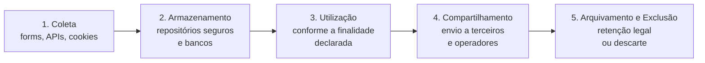
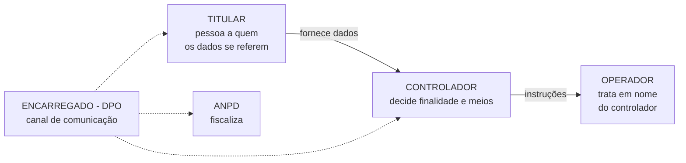

---

materia: Gestão de Serviços de TI 
fonte: Aula 07 - Legislação, Governança de Dados e LGPD.pdf 
tags:

- resumo
- lgpd
- privacidade

---
# 📝 Legislação, Governança de Dados e LGPD

## 👁️ Visão geral

Aula 7, segunda da **Unidade 2 — Segurança & Privacidade**. Apresenta a **LGPD (Lei nº 13.709/2018)**: os tipos de dado (**pessoal**, **sensível**, **anonimizado**, **pseudonimizado**), o que conta como **tratamento**, os **agentes** (controlador, operador, encarregado/DPO), as **10 bases legais**, os **princípios** e as abordagens **Privacy by Design** e **Privacy by Default**. Fecha com um estudo de caso de app de saúde e uma atividade prática.

Continua a aula anterior ([[Tríade CID e Princípios de Segurança da Informação]]): lá, _como_ proteger a informação; aqui, _o que a lei exige_ sobre dados pessoais. A atividade avaliativa desta unidade está em [[Atividade — Auditoria e Adequação à LGPD]].

---

## ⚖️ O que é a LGPD

> [!info] Definição A **Lei Geral de Proteção de Dados (Lei nº 13.709/2018)** regulamenta o **tratamento de dados pessoais** no Brasil e se aplica aos **setores público e privado**.

**Objetivos centrais:**

- Proteção dos **direitos fundamentais de liberdade e privacidade**.
- Garantia da **transparência** nas relações digitais.
- Promoção de **segurança jurídica** às organizações.

**Por que é importante:**

|Cenário digital atual|Equilíbrio regulatório|
|:--|:--|
|A **hiperconectividade** e a economia impulsionada por dados aumentaram drasticamente a **coleta e o processamento** de informações pessoais em grande escala|A LGPD cria um **ambiente de confiança**: promove a **inovação** e o avanço econômico enquanto garante a **proteção ética** dos titulares|

> [!info] Contexto externo A fiscalização e a aplicação de sanções cabem à **ANPD** (Autoridade Nacional de Proteção de Dados). O **titular** é a pessoa natural a quem os dados se referem.

---

## 🗂️ Tipos de dado

### Dado pessoal

> [!info] Definição legal **Toda informação relacionada a uma pessoa natural identificada** (ex.: CPF) **ou identificável** (ex.: combinação de cargo + empresa).

**Identificável** é o ponto que mais cai: o dado não precisa ter o nome da pessoa. "Diretor financeiro da empresa X" já aponta para uma única pessoa.

Exemplos do material:

- Nome, CPF, RG e passaporte.
- E-mail pessoal e telefone.
- ==**Endereço IP e geolocalização**==.
- ==**Placa de veículo associada à pessoa**==.

### Dado pessoal sensível

Informações com **alto potencial de discriminação** ou de **impacto à intimidade** do titular — por isso têm **proteção reforçada**.

|Grupo|Exemplos do material|
|:--|:--|
|**Genética e biometria**|Impressões digitais, **reconhecimento facial**, mapeamento de **DNA**|
|**Saúde e vida sexual**|Prontuários médicos, histórico clínico, exames e ==**dados de convênio**==|
|**Convicções e filiação**|Origem **racial/étnica**, opinião **política**, convicção **religiosa**, filiação **sindical**|

> [!warning] O que é sensível e o que não é
> 
> - **IP, geolocalização e placa de veículo** são dados **pessoais comuns** — estão no slide de dado pessoal, não no de sensível. (Eram alternativas erradas da questão 32 da Revisão.)
> - **Dados de convênio** entram como **sensíveis**, junto com os de saúde.

### Dado anonimizado

|Conceito técnico|Fora do escopo da LGPD|
|:--|:--|
|Dado relativo ao titular que **não possa ser identificado**, considerando os **meios técnicos razoáveis e disponíveis** na ocasião do tratamento|Uma vez anonimizado de forma **irreversível**, o dado **deixa de ser dado pessoal**, desonerando o tratamento de diversas obrigações da lei|

### Pseudoanonimização

> [!info] Substituição por códigos Processo no qual a **informação direta é substituída por um pseudônimo** (ex.: código _hash_), mantendo a **informação de reidentificação armazenada separadamente** em ambiente seguro.

> [!danger] A LGPD ainda se aplica! Diferente da anonimização, na pseudoanonimização o dado **continua sujeito à LGPD**, porque a **reidentificação ainda é possível**.

> [!info] Contexto externo O termo mais usado — e o da própria lei (art. 13, §4º) — é **pseudonimização**. É a mesma ideia do slide.

||Anonimizado|Pseudonimizado|
|:--|:--|:--|
|Dá para reidentificar?|**Não** (irreversível)|**Sim** (a chave existe, guardada à parte)|
|É dado pessoal?|**Não**|**Sim**|
|LGPD se aplica?|**Não**|**Sim**|

> [!example] Exemplo Uma universidade publica um estudo com "Aluno A123 — nota 8,5", e a tabela que liga A123 ao nome fica guardada na secretaria → **pseudonimizado** (a secretaria consegue reidentificar). Se publicar só "média da turma: 7,2", sem como chegar a ninguém → **anonimizado**.

---

## 🔄 Tratamento de dados

**Tratamento** é **qualquer operação** feita com dados pessoais — da coleta à eliminação.

|Coleta & acesso|Processamento|Destino final|
|:--|:--|:--|
|Recepção, captura, classificação, consulta e reprodução de dados pessoais em sistemas|Organização, armazenamento, modificação, avaliação e utilização das informações|Compartilhamento, transferência, arquivamento e **eliminação/exclusão definitiva**|

Repare que até **guardar** ou **apagar** um dado é tratamento — por isso quase tudo que um sistema faz com dados pessoais cai na LGPD.

### Ciclo de vida dos dados

|Etapa|O que acontece|
|:--|:--|
|**1. Coleta**|Ponto de entrada (formulários, APIs, _cookies_)|
|**2. Armazenamento**|Repositórios seguros e bancos de dados|
|**3. Utilização**|Uso **conforme a finalidade declarada**|
|**4. Compartilhamento**|Envio a terceiros e operadores|
|**5. Arquivamento & Exclusão**|Retenção legal ou descarte|

O slide ilustra com uma figura de outra fonte que divide o ciclo em **8 etapas** (geração, coleta, armazenamento, processamento, gestão, análise, visualização e interpretação, destruição). Para a prova, use as **5 etapas** do texto do slide.

---

## 👥 Agentes de tratamento

A quem cabem as **decisões**, as **execuções** e a **intermediação** no tratamento de dados pessoais.

|Agente|Definição|Exemplo do material|
|:--|:--|:--|
|**Controlador**|Pessoa natural ou jurídica, de direito público ou privado, a quem competem as **decisões** referentes ao tratamento|Uma **instituição de ensino** que estabelece os critérios de matrícula, **define os dados necessários** e contrata softwares de gestão acadêmica|
|**Operador**|Pessoa natural ou jurídica, de direito público ou privado, que realiza o tratamento **em nome do controlador**|Uma empresa terceirizada de **cloud computing** ou uma consultoria de **folha de pagamento** que processa dados sob diretrizes do controlador|
|**Encarregado (DPO)**|Canal entre controlador, titulares e ANPD (ver abaixo)|—|

### Encarregado (DPO)

|Papel|O que faz|
|:--|:--|
|**Ponte de comunicação**|Atua como **canal formal** entre o **controlador**, os **titulares** de dados e a **ANPD**|
|**Orientador interno**|**Orienta funcionários e contratados** sobre as práticas de proteção de dados|
|**Gestor de crise**|**Recebe reclamações**, **adota providências** e **coordena respostas a incidentes**|

> [!tip] Macete **Controlador decide** · **Operador executa** · **Encarregado comunica**.

> [!info] Contexto externo **DPO** vem de _Data Protection Officer_. Na lei, o nome é **encarregado** (art. 41).

---

## 📜 Bases legais para tratamento

Todo e qualquer tratamento de dados pessoais **precisa obrigatoriamente de uma justificativa legal válida** (art. 7º e art. 11 da LGPD).

### As 10 bases legais

|#|Base legal|Aplicação principal|
|:-:|:--|:--|
|1|**Consentimento**|Autorização **expressa, livre e destacada** do titular|
|2|**Obrigação legal/regulatória**|Cumprimento de leis (ex.: normas **fiscais e trabalhistas**)|
|3|**Políticas públicas**|Execução de programas e serviços pela **Administração Pública**|
|4|**Órgãos de pesquisa**|Estudos estatísticos e científicos (**anonimizado** sempre que possível)|
|5|**Execução de contrato**|Prestação de serviços ou venda **contratada pelo titular**|
|6|**Exercício regular de direitos**|Processos **judiciais, administrativos ou arbitrais**|
|7|**Proteção da vida**|Tutela da **integridade física** do titular **ou de terceiros**|
|8|**Tutela da saúde**|Procedimentos realizados por **profissionais de saúde/entidades**|
|9|**Legítimo interesse**|Apoio a atividades legítimas do controlador (**com teste de impacto**)|
|10|**Proteção do crédito**|Avaliação de **risco de crédito** (conforme legislação específica)|

> [!info] Contexto externo — art. 7º × art. 11 As 10 bases da tabela são as do **art. 7º**, para **dados comuns**. Para **dados sensíveis** valem as do **art. 11**, que são **mais restritas**: o consentimento precisa ser **específico e destacado**, e **não existem** as bases de **legítimo interesse** nem de **proteção do crédito**. Em troca, o art. 11 tem uma base própria: **prevenção à fraude e segurança do titular** em processos de identificação e autenticação.

### Consentimento

|Requisitos essenciais|Direito à revogação|
|:--|:--|
|Manifestação **livre, informada e inequívoca**. ==**Não são permitidas caixas de seleção pré-marcadas (opt-out automático).**==|O titular pode **revogar** o consentimento **a qualquer momento**, de forma **gratuita e facilitada**, encerrando os tratamentos vinculados|

**Opt-in** = o titular **marca** para autorizar (válido). **Opt-out automático** = a caixa já vem marcada e o titular teria de **desmarcar** (inválido).

### Legítimo interesse

- **Flexibilidade com limites**: base flexível para **finalidades legítimas do controlador** (ex.: **prevenção à fraude**).
- **LIA** (_Legitimate Interest Assessment_): exige o **teste de balanceamento** entre os **interesses do controlador** e os **direitos do titular**.
- **Expectativa do titular**: o tratamento deve ser **plausível e compatível com a relação pré-existente** entre titular e empresa.

> [!example] Exemplo Um banco analisar o padrão de compras do cartão para bloquear uma transação suspeita: o cliente **espera** isso da relação com o banco → legítimo interesse plausível. O mesmo banco vender o histórico de compras para uma loja fazer anúncios → foge da expectativa do titular; o teste de balanceamento não passa.

### Aplicação de outras bases legais

|Base|Exemplo do material|
|:--|:--|
|**Contrato**|Cadastro em **e-commerce** para **entrega** das mercadorias no endereço do comprador|
|**Obrigação legal**|Emissão de **Nota Fiscal Eletrônica** e envio de dados trabalhistas ao **eSocial**|
|**Tutela da saúde**|**Registros médicos** e **atendimentos emergenciais** em unidades hospitalares|

---

## 🧭 Princípios fundamentais

|Princípio|O que exige|
|:--|:--|
|**Finalidade & Adequação**|Propósitos **legítimos, específicos e explicitados** ao titular|
|**Necessidade (Minimização)**|Coletar **estritamente o mínimo** de dados necessários|
|**Transparência & Livre Acesso**|Informações **claras, acessíveis e precisas** sobre o tratamento|
|**Segurança & Prevenção**|Adotar **medidas técnicas** para impedir **vazamentos e acessos não autorizados**|

> [!info] Contexto externo O art. 6º lista **10 princípios**: finalidade, adequação, **necessidade**, livre acesso, qualidade dos dados, transparência, segurança, prevenção, não discriminação e responsabilização e prestação de contas. O slide agrupa os oito mais cobrados em quatro pares.

---

## 🔒 Privacy by Design e Privacy by Default

### Privacy by Design

> [!info] Privacidade na concepção Desenvolvido por **Ann Cavoukian**, estabelece que a proteção de dados deve ser **arquitetada desde a fase inicial** do projeto ou sistema, e **não adicionada posteriormente**.

- **Proativo** e não reativo.
- Privacidade como **configuração padrão**.
- Segurança de **ponta a ponta**.

> [!info] Contexto externo Esses três itens são parte dos **7 princípios** do Privacy by Design de Cavoukian. Na LGPD, a mesma ideia aparece no art. 46, §2º: as medidas de segurança devem ser observadas **desde a fase de concepção** do produto ou serviço.

### Privacy by Default

|Proteção padrão|Minimização automática|
|:--|:--|
|O sistema deve ser fornecido, **por padrão**, com o **maior nível de privacidade possível**, **sem exigir ações complexas** por parte do usuário|Configurações de **compartilhamento desativadas de fábrica** e formulários solicitando **apenas os campos indispensáveis**|

> [!tip] Design × Default **Design** = **quando** a privacidade entra: **desde a concepção** do sistema. **Default** = **como** o sistema vem: **mais protetivo por padrão**, sem o usuário precisar configurar nada. O Default é um dos princípios do Design.

### Práticas de Privacy by Design

|Prática|O que é|
|:--|:--|
|**Criptografia**|Proteção de dados **em trânsito** (**TLS/HTTPS**) e **em descanso** (**AES-256**) em bancos de dados|
|**Controle de acesso**|Princípio do **menor privilégio** (**RBAC**) para colaboradores e sistemas|
|**DPIA / RIPD**|**Relatórios de impacto** à proteção de dados para **sistemas de alto risco**|

- **RBAC** — _Role-Based Access Control_ (controle de acesso baseado em funções/cargos).
- **DPIA** — _Data Protection Impact Assessment_ (avaliação de impacto sobre a proteção de dados).
- **RIPD** — Relatório de Impacto à Proteção de Dados Pessoais.

**DPIA e RIPD são a mesma coisa** — o primeiro é o nome em inglês (vindo da lei europeia), o segundo é o nome usado na LGPD. Criptografia e RBAC já apareceram na aula 6 como controles de **confidencialidade** ([[Tríade CID e Princípios de Segurança da Informação#Confidencialidade (C)]]).

---

## 📊 Governança de dados na prática

O slide "Nível de Conformidade" mostra um gráfico com três fatias:

|Fatia|Percentual|
|:--|:-:|
|Controles de Segurança & Governança|50%|
|Mapeamento & Bases Legais|30%|
|Treinamento & Aculturações Pendentes|20%|

O slide não explica o gráfico. A leitura mais provável _(minha)_ é a composição de um programa de adequação à LGPD: metade do trabalho está em **controles técnicos e governança**, quase um terço no **mapeamento de dados e na definição das bases legais**, e uma parte ainda **pendente** de **treinamento e cultura** — lembrando que pessoas são o elo mais fraco da segurança.

---

## ⚠️ Pegadinhas e erros comuns

|Confusão comum|O certo|
|:--|:--|
|Dado pessoal precisa ter nome ou CPF|Basta ser de pessoa **identificável** (ex.: cargo + empresa)|
|IP, geolocalização e placa são dados sensíveis|São dados pessoais **comuns**|
|Dados de convênio são dados comuns|No material, entram como **sensíveis** (saúde)|
|Biometria é dado comum|**Biometria** (digital, reconhecimento facial) e **DNA** são **sensíveis**|
|Pseudonimizado está fora da LGPD|**Continua sujeito** à LGPD — a reidentificação é possível. Só o **anonimizado irreversível** sai|
|Tratamento = só coletar|Tratamento é **qualquer operação**, inclusive **armazenar**, **compartilhar** e **eliminar**|
|O operador decide como usar os dados|Quem **decide** é o **controlador**; o operador age **em nome** dele|
|A nuvem contratada é controladora|É **operadora** (exemplo do próprio slide)|
|O DPO é quem decide sobre os dados|O DPO é **canal**, **orientador** e **gestor de crise** — quem decide é o controlador|
|Caixa pré-marcada vale como consentimento|**Não**: é **opt-out automático**, proibido. Consentimento exige ação **livre, informada e inequívoca**|
|Revogar o consentimento pode ter custo|A revogação é **gratuita e facilitada**, a qualquer momento|
|Legítimo interesse dispensa análise|Exige **LIA** (teste de balanceamento) e respeito à **expectativa do titular**|
|NF-e e eSocial usam consentimento|Usam **obrigação legal**|
|Cadastro para entrega no e-commerce usa consentimento|Usa **execução de contrato**|
|Proteção da vida só vale para o titular|Vale para o titular **ou terceiros**|
|Necessidade e finalidade são o mesmo princípio|**Necessidade** = **mínimo de dados** (minimização). **Finalidade** = **propósito** legítimo e explícito|
|Privacy by Design = by Default|**Design** = desde a **concepção**; **Default** = **padrão mais protetivo**|
|DPIA e RIPD são relatórios diferentes|São o **mesmo** relatório (nomes em inglês e na LGPD)|
|A LGPD vale só para empresas privadas|Vale para os setores **público e privado**|
|Ciclo de vida dos dados tem 8 etapas|No texto do slide são **5**: coleta, armazenamento, utilização, compartilhamento, arquivamento & exclusão|

---

## 📝 Questões

### 🩺 Estudo de caso: app de saúde

> [!abstract] Cenário analisado Um aplicativo de **agendamento médico** solicita acesso à **localização 24h**, à **lista de contatos** do telefone e às **redes sociais** do usuário.

**1.** Quais são as inconformidades com a LGPD nesse cenário?

> [!success]- Resposta Pelo material: **violação do Princípio da Necessidade** e **ausência de consentimento destacado** para a **coleta desproporcional** de dados.
> 
> - **Necessidade (minimização)**: localização o dia inteiro, contatos e redes sociais **não são necessários** para agendar consulta.
> - **Consentimento**: o app coleta sem uma autorização **destacada** e específica — e, num app de saúde, os dados podem revelar informações **sensíveis** (a localização, por exemplo, mostra idas a clínicas e hospitais).
> 
> Esse mesmo cenário, mais completo, é o da [[Atividade — Auditoria e Adequação à LGPD]].

### 👥 Atividade prática em grupo

Roteiro do slide: (1) escolher um sistema (**e-commerce, acadêmico ou app corporativo**); (2) **mapear** quais dados pessoais e sensíveis são coletados; (3) atribuir a **base legal (art. 7º)** de cada operação de tratamento; (4) sugerir **2 melhorias proativas** de privacidade (Privacy by Design).

O sistema é escolhido pelo grupo, então não há resposta única. Abaixo, um exemplo com um **sistema acadêmico de universidade** — o mesmo tipo de controlador do exemplo do slide 13. Tente fazer antes de abrir.

**1.** Mapeie os dados pessoais e sensíveis coletados pelo sistema acadêmico.

> [!question]- Resposta (resolvida por mim, confira)
> 
> |Tipo|Dados|
> |:--|:--|
> |**Pessoais comuns**|Nome, CPF, RG, data de nascimento, endereço, e-mail, telefone, foto da carteirinha, RA, notas, frequência, histórico escolar, dados financeiros (mensalidades, bolsas), registros de acesso ao portal (IP)|
> |**Sensíveis**|**Laudo médico** para atendimento especial em provas (saúde); **biometria** se a catraca usar digital ou reconhecimento facial; eventualmente **raça/cor**, quando coletada para o Censo da Educação Superior ou para políticas de cotas|
> 
> Os dados sensíveis não usam as bases do art. 7º, e sim as do **art. 11** (mais restritas).

**2.** Atribua a base legal (art. 7º) a cada operação de tratamento.

> [!question]- Resposta (resolvida por mim, confira)
> 
> |Operação|Base legal|Justificativa|
> |:--|:--|:--|
> |Matrícula e cobrança de mensalidades|**Execução de contrato**|O aluno contratou o curso; sem esses dados o contrato não se cumpre|
> |Registro de notas, frequência, histórico e emissão de diploma|**Obrigação legal/regulatória**|A instituição é obrigada pela regulação educacional a manter e emitir esses registros|
> |Envio de dados ao Censo da Educação Superior|**Obrigação legal/regulatória**|Exigência do INEP, órgão ligado ao Ministério da Educação|
> |Câmeras de segurança no campus|**Legítimo interesse** (com LIA)|Segurança de alunos e do patrimônio; é algo que o aluno espera num campus|
> |E-mails com divulgação de novos cursos e eventos pagos|**Consentimento** (opt-in)|Marketing não é necessário ao contrato; a caixa deve vir desmarcada e ser revogável|

**3.** Sugira 2 melhorias proativas de privacidade (Privacy by Design) para o sistema.

> [!question]- Resposta (resolvida por mim, confira)
> 
> 1. **Controle de acesso por função (RBAC) com menor privilégio**: o professor vê só as notas das **próprias turmas**; a secretaria vê dados acadêmicos, mas não o laudo médico completo; o financeiro vê só a situação de pagamento. Acesso a dados sensíveis fica registrado em **log**.
> 2. **Pseudonimização nos relatórios internos e criptografia do banco**: relatórios de desempenho e evasão usam o **RA pseudonimizado** em vez do nome, com a tabela de reidentificação guardada à parte; o banco de dados é criptografado **em descanso** (AES-256) e o portal usa **HTTPS**.
> 
> Como **Privacy by Default**, o perfil do aluno no portal deve vir **privado** (e-mail e telefone ocultos para outros alunos) e as caixas de comunicação de marketing, **desmarcadas**.

---

## 💡 Fechamento

> [!quote] Reflexão final "A privacidade não é um obstáculo à inovação, mas o **alicerce** sobre o qual a **confiança digital** é construída." — Governança de Dados & Segurança da Informação