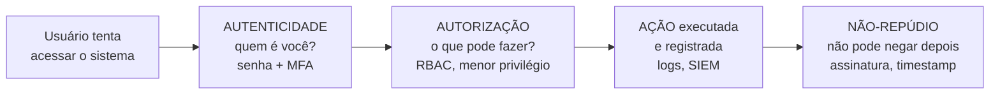
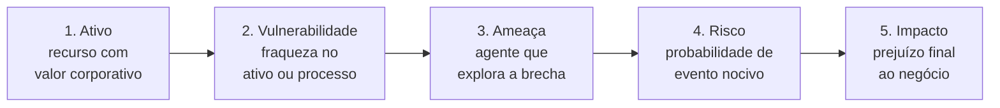

---

materia: Gestão de Serviços de TI 
fonte: Aula 06 - Princípios Globais de Segurança da Informação.pdf 
tags:

- resumo
- seguranca-da-informacao
- triade-cid
- riscos

---
# 📝 Tríade CID e Princípios de Segurança da Informação

## 👁️ Visão geral

Primeira aula da **Unidade 2 — Segurança & Privacidade**. Define **segurança da informação**, o que são **ativos de informação**, e apresenta a base de tudo: a **Tríade CID** — **Confidencialidade**, **Integridade** e **Disponibilidade**. Complementa com os atributos **autenticidade, autorização, não-repúdio e auditabilidade**, e fecha com a lógica de **risco**: um **ativo** tem uma **vulnerabilidade**, uma **ameaça** a explora, e daí vem o **risco** e o **impacto**. O material se apoia nas referências **ISO 27001**, **NIST** e **Security+**.

> [!info] Contexto externo
> 
> - Em inglês, a Tríade CID é a _**CIA triad**_ (_Confidentiality, Integrity, Availability_) — cuidado para não confundir com a agência americana.
> - **ISO 27001** é a norma internacional de sistemas de gestão de segurança da informação; **NIST** é o instituto de padrões dos EUA (ver [[Governança Corporativa de TI e COBIT 2019#Integração de frameworks]]); **Security+** é uma certificação de segurança da CompTIA.

---

## 🔐 Segurança da Informação

> [!info] Definição **Segurança da Informação (SI)** é o **conjunto de políticas, processos, tecnologias e controles** destinados a proteger as informações contra **acessos não autorizados**, **alterações indevidas** e **indisponibilidade**.

> [!tip] Objetivo principal Garantir que a informação permaneça **segura, confiável e disponível** durante **todo o seu ciclo de vida**.

Repare que as três ameaças da definição já são a Tríade CID ao contrário: **acesso não autorizado** fere a **confidencialidade**, **alteração indevida** fere a **integridade**, **indisponibilidade** fere a **disponibilidade**.

**Ciclo de vida da informação** é o caminho da informação desde que é criada, passando por armazenamento, uso, compartilhamento e arquivamento, até o descarte. Ela precisa estar protegida em todas essas fases — inclusive no descarte (um HD jogado fora sem apagar os dados é um vazamento).

### Importância da SI

|As organizações dependem da informação para:|Uma quebra de segurança pode provocar:|
|:--|:--|
|Tomar **decisões estratégicas** com precisão|**Perdas financeiras** diretas e severas|
|Atender **clientes e parceiros** comerciais|**Danos graves e irreversíveis à reputação**|
|**Cumprir legislações** e normas vigentes|**Interrupção prolongada** das operações|
|Manter a **vantagem competitiva** no mercado|**Sanções, multas e penalidades** legais|

Os impactos são os mesmos das falhas de TI vistas na aula 1 ([[Introdução à Gestão de Serviços de TI#💥 Impacto das falhas de TI nos negócios]]).

---

## 💼 Ativos de informação

> [!info] Definição Um **ativo de informação** é **qualquer recurso que possua valor para a organização** e que, portanto, **necessite de proteção adequada**.

O slide agrupa os ativos em três blocos:

|Grupo|Exemplos|
|:--|:--|
|**Dados & Sistemas**|Bancos de dados, sistemas ERP, documentos estratégicos e aplicações corporativas|
|**Infraestrutura**|Servidores, computadores, redes de comunicação, roteadores e dispositivos móveis|
|**Pessoas & Saber**|Conhecimento dos colaboradores, dados de clientes e propriedade intelectual|

### Classificação dos ativos

Em seguida, o material detalha em **seis categorias**:

|Categoria|Exemplos|
|:--|:--|
|**Ativos Físicos**|Instalações, data centers, servidores e equipamentos de hardware|
|**Ativos Digitais**|Bancos de dados, arquivos eletrônicos e fluxos de informação|
|**Ativos Humanos**|Colaboradores, especialistas e seu conhecimento acumulado|
|**Documentais**|Contratos em papel, manuais, políticas e relatórios físicos|
|**Software**|Sistemas operacionais, utilitários e aplicações de negócio|
|**Infraestrutura**|Links de internet, cabeamento, roteadores e switches|

> [!warning] Servidor: físico ou infraestrutura? No agrupamento de 3 blocos, **servidores** aparecem em **Infraestrutura**. Na classificação de 6 categorias, **servidores** estão em **Ativos Físicos**, e **Infraestrutura** fica com a parte de **conectividade** (links, cabeamento, roteadores, switches). Numa questão sobre as 6 categorias, use a segunda tabela.

Classificar ativos serve para a **proteção proporcional**: saber o que vale mais permite **investir mais onde o risco é maior**, em vez de proteger tudo igual.

---

## 🔺 A Tríade CID

A **Tríade CID** constitui a **espinha dorsal** da Segurança da Informação. Esses pilares **orientam a especificação de políticas e controles** de segurança.

|Pilar|Em uma frase|Pergunta que responde|
|:--|:--|:--|
|**Confidencialidade**|**Acesso restrito a autorizados**|Só quem pode está vendo?|
|**Integridade**|**Dados exatos e não alterados**|A informação está correta e completa?|
|**Disponibilidade**|**Acesso pontual quando necessário**|Está acessível quando preciso?|

### Confidencialidade (C)

> [!info] Conceito fundamental Garante que a informação seja acessível **exclusivamente por pessoas, processos ou sistemas devidamente autorizados**, prevenindo a **divulgação não autorizada**.

**Principais controles:**

- **Autenticação forte** e senhas seguras.
- **Criptografia** de dados — **em trânsito** e **em repouso**.
- **Controle de Acesso Baseado em Papéis (RBAC)**.
- **Autenticação Multifator (MFA)**.
- **Classificação formal de informações**.

> [!info] Contexto externo
> 
> - **Em trânsito** = enquanto a informação viaja pela rede (ex.: site com HTTPS). **Em repouso** = enquanto está armazenada (ex.: disco do notebook criptografado).
> - **Classificação da informação**: rotular cada informação conforme o sigilo (ex.: pública, interna, confidencial, restrita), para saber quem pode acessá-la.

**Exemplos de informações que exigem confidencialidade:**

|Área|Exemplos|
|:--|:--|
|**Dados Financeiros**|Dados bancários, transações de cartão e folha de pagamento corporativa|
|**Saúde e Privacidade**|Prontuários médicos, histórico do paciente e **dados sensíveis da LGPD**|
|**Segredos do Negócio**|Estratégias de mercado, projetos de **P&D** (pesquisa e desenvolvimento) e propriedade intelectual|

> [!info] Contexto externo Pela LGPD, dados de **saúde** são **dados pessoais sensíveis** — têm proteção reforçada, porque seu vazamento pode causar discriminação.

### Integridade (I)

> [!info] Conceito fundamental Assegura que a informação permaneça **exata, completa e protegida contra modificações ou exclusões não autorizadas ou acidentais**.

Note o "**ou acidentais**": integridade não é só contra ataque. Um funcionário que apaga uma linha da planilha sem querer também fere a integridade.

**Mecanismos de proteção:**

- **Funções hash criptográficas** (ex.: **SHA-256**).
- **Assinaturas e certificados digitais**.
- **Sistemas de controle de versão**.
- **Rotinas de validação de dados de entrada**.

> [!example] Como o hash protege a integridade _(exemplo meu, com hashes reais)_ Uma **função hash** transforma qualquer conteúdo numa "impressão digital" de tamanho fixo. Qualquer alteração, por menor que seja, gera um hash **completamente diferente**:
> 
> |Conteúdo|SHA-256 (início)|
> |:--|:--|
> |`NF-e 1234 - Valor: R$ 1.000,00`|`0f80a23b95657aaa…`|
> |`NF-e 1234 - Valor: R$ 9.000,00`|`58bfb04f164d7bf8…`|
> 
> Mudou um único dígito e o hash mudou por inteiro. Guardando o hash original, dá para provar se o documento foi adulterado — basta recalcular e comparar.

**Controle de versão** guarda o histórico de alterações (quem mudou o quê e quando), permitindo voltar a uma versão íntegra. **Validação de entrada** impede que dados errados ou maliciosos entrem no sistema (ex.: recusar uma data de nascimento no futuro).

**Exemplos de informações que exigem integridade:**

|Área|Exemplos|
|:--|:--|
|**Documentos Oficiais**|**Notas Fiscais Eletrônicas (NF-e)** e contratos digitais assinados|
|**Laudos e Exames**|Resultados laboratoriais que orientam **decisões médicas críticas**|
|**Registros Acadêmicos**|Históricos escolares e boletins que comprovam certificações|

### Disponibilidade (D)

> [!info] Conceito fundamental Garante que os dados e sistemas estejam **prontamente acessíveis para usuários autorizados** sempre que a **necessidade operacional** surgir.

**Controles de continuidade:**

- **Políticas de backup** e restauração regular.
- **Redundância** de hardware e links de rede.
- **Balanceamento de carga** (_Load Balancing_).
- **Plano de Continuidade de Negócios (PCN)**.

**Balanceamento de carga** distribui os acessos entre vários servidores, para nenhum ficar sobrecarregado — e, se um cair, os outros continuam atendendo. São os mesmos controles da prevenção da Black Friday na aula 1 ([[Introdução à Gestão de Serviços de TI#🛡️ Prevenção e boas práticas]]).

**Exemplos de sistemas que exigem disponibilidade:**

|Área|Exemplos|
|:--|:--|
|**Sistemas Críticos**|UTIs hospitalares e sistemas de controle de tráfego aéreo|
|**Plataformas Online**|E-commerce, Internet Banking e portais governamentais|
|**Serviços em Nuvem**|Datacenters resilientes com garantias elevadas de **SLA** (_Service Level Agreement_)|

A disponibilidade é justamente o que o SLA mede em percentual (ex.: 99,9% no mês — ver [[Problemas, Mudanças e Acordos de Nível de Serviço#SLA — Service Level Agreement]]).

> [!note] Ligação com Utilidade e Garantia Na aula 1, a **Garantia** de um serviço incluía **disponibilidade** e **segurança** ([[Introdução à Gestão de Serviços de TI#💎 Conceito de valor em serviços]]); na ITIL 4, **segurança da informação** ([[ITIL 4 e o Sistema de Valor de Serviço#💎 Valor na ITIL v4]]). A Tríade CID detalha o que "seguro" significa dentro dessa garantia.

### Interdependência da Tríade

Os três pilares **dependem diretamente um do outro** — a segurança exige **harmonia**, um **equilíbrio dinâmico e vital**.

> [!warning] Um pilar só não basta Se uma informação estiver **disponível**, mas for **modificada ilicitamente** (perda de **integridade**) ou **vazada** (perda de **confidencialidade**), ==seu valor organizacional é destruído==.

Os pilares também **competem** entre si: trancar demais (mais confidencialidade) pode atrapalhar o acesso (menos disponibilidade). Por isso o equilíbrio é **dinâmico** — ajustado ao que cada ativo precisa mais.

---

## 🧷 Atributos complementares

Além da Tríade CID, o material apresenta atributos que a complementam:

|Atributo|Definição|Como se garante|
|:--|:--|:--|
|**Autenticidade**|Garantia de que a entidade (usuário ou sistema) **é realmente quem alega ser**|Certificados digitais (ICP-Brasil), biometria, MFA|
|**Autorização**|Definição exata dos **direitos e permissões de acesso** concedidos a cada perfil|RBAC, princípio do menor privilégio, perfis direcionados|
|**Não-Repúdio**|**Impossibilidade** de um emissor **negar a autoria** de uma ação executada|Assinatura digital, carimbo do tempo, evidências auditáveis|
|**Auditabilidade**|Possibilidade de **registrar, monitorar e rastrear** todas as ações executadas|Logs, SIEM, trilhas de auditoria|

_(O slide de atributos complementares lista os três primeiros; a auditabilidade vem num slide próprio e entra na lista dos aprendizados da aula.)_

### Autenticidade

A **autenticidade** **valida a identidade** das partes envolvidas em uma transação ou comunicação digital.

- **Certificados digitais**: padrão **ICP-Brasil** para validação oficial.
- **Biometria**: leitura **facial** ou **datiloscópica** (impressão digital) para confirmação única.
- **Autenticação Multifator (MFA)**: combinação de algo que você **sabe**, **tem** e **é**.

|Fator do MFA|Exemplo|
|:--|:--|
|Algo que você **sabe**|Senha, PIN|
|Algo que você **tem**|Celular com app autenticador, token, cartão|
|Algo que você **é**|Impressão digital, rosto|

MFA exige fatores de **tipos diferentes**. Senha + pergunta secreta são dois fatores do **mesmo** tipo (ambos "algo que você sabe"), então não é MFA de verdade.

> [!info] Contexto externo **ICP-Brasil** (Infraestrutura de Chaves Públicas Brasileira) é a cadeia oficial de certificação digital do país; documentos assinados com certificado ICP-Brasil têm validade jurídica.

### Autorização

A **autorização** define o **escopo exato** do que um **usuário autenticado** pode **visualizar ou alterar**.

- **RBAC** (_Role-Based Access Control_): acesso atribuído por **papéis profissionais** (ex.: todo "analista financeiro" recebe o mesmo conjunto de acessos).
- **Princípio do Menor Privilégio**: conceder **o mínimo de privilégios necessários** para a pessoa fazer seu trabalho.
- **Perfis direcionados**: **separação rígida entre operadores e administradores**.

> [!warning] Autenticação × Autorização **Autenticação** (autenticidade) responde **"quem é você?"**. **Autorização** responde **"o que você pode fazer?"**. A ordem é sempre essa: primeiro o sistema confirma a identidade, **depois** aplica as permissões — por isso o slide fala em "usuário **autenticado**".

### Não-Repúdio

O **Não-Repúdio** (**Irretratabilidade**) **previne que um indivíduo negue falsamente ter realizado** uma transação.

- **Assinatura digital**: garante **autoria** e **vinculação jurídica** ao signatário.
- **Carimbo do tempo** (_timestamp_): prova o **exato momento** da operação.
- **Evidências auditáveis**: **registros imutáveis** aceitos legalmente.

> [!tip] Autenticidade × Não-repúdio **Autenticidade** confirma a identidade **no momento** da ação. **Não-repúdio** garante que, **depois**, a pessoa **não consiga negar** que fez. Exemplo: assinar um contrato com certificado digital prova quem assinou (autenticidade) e impede que o signatário diga depois "não fui eu" (não-repúdio).

> [!note] A assinatura digital aparece três vezes Nos slides, **assinaturas/certificados digitais** aparecem em **integridade** (o documento não foi alterado), em **autenticidade** (certificado ICP-Brasil) e em **não-repúdio** (autoria com vínculo jurídico). É o mesmo mecanismo garantindo três atributos.

### Auditabilidade

A **auditabilidade** possibilita **registrar, monitorar e rastrear** todas as ações executadas no ambiente técnico.

- **Logs de sistema**: registros detalhados de logins, acessos e erros.
- **SIEM** (_Security Information and Event Management_, Gerenciamento de Informações e Eventos de Segurança): **correlação inteligente de eventos** de segurança **em tempo real**.
- **Trilhas de auditoria**: suporte a **investigações periciais** e **conformidade**.

**Correlação de eventos** é juntar sinais que isolados parecem inofensivos: 50 senhas erradas num servidor e, minutos depois, um login bem-sucedido de outro país no mesmo usuário — o SIEM liga os dois e alerta.

_(Diagrama meu, encadeando os atributos numa sequência de acesso.)_

---

## 🧨 Ameaça, vulnerabilidade e risco

### Ameaça

> [!info] Definição Uma **ameaça** é **qualquer agente ou evento** com **potencial para explorar uma vulnerabilidade** e causar prejuízos.

**Exemplos frequentes:** malware, phishing, ransomware, sabotagem interna, falha humana e desastres naturais.

> [!info] Contexto externo
> 
> - **Malware**: software malicioso em geral (vírus, trojans, spyware).
> - **Phishing**: mensagem falsa que se passa por alguém confiável para roubar dados ou credenciais.
> - **Ransomware**: malware que criptografa os dados e cobra resgate.

### Vulnerabilidade

> [!info] Definição Uma **vulnerabilidade** é uma **fraqueza ou brecha** nos **sistemas, processos ou pessoas** que **pode ser explorada por uma ameaça**.

|Vulnerabilidade|Exemplo|
|:--|:--|
|**Senhas fracas**|Credenciais simples e **reutilização** de senhas entre serviços|
|**Desatualizações**|Sistemas **sem patches** de segurança e softwares obsoletos|
|**Falta de treino**|Equipes desinformadas e sujeitas a ataques de **Engenharia Social**|

**Engenharia social** é manipular pessoas para que entreguem informações ou acessos (ex.: ligar se passando pelo suporte e pedir a senha). É o que torna a "falta de treino" uma vulnerabilidade.

> [!warning] Ameaça × Vulnerabilidade A **ameaça** é **quem/o que ataca** (vem de fora do ativo). A **vulnerabilidade** é **a brecha** (está no ativo). Pegadinha clássica: **falha humana** é **ameaça** (um evento); **falta de treinamento** é **vulnerabilidade** (a fraqueza que torna a falha provável). Sem vulnerabilidade, a ameaça não tem por onde entrar.

### Risco

$$\text{Risco} = A \times V \times I$$

> [!info] Definição O **risco** representa a **possibilidade de uma ameaça concretizar a exploração de uma vulnerabilidade**, gerando **impactos** operacionais, financeiros ou reputacionais no negócio.

> [!warning] Letras não expandidas no slide O slide mostra só "**A × V × I**" com a legenda "**Probabilidade e Impacto**", sem dizer o que cada letra significa. Pela definição no mesmo slide, a leitura é:
> 
> - **A** = **Ameaça**
> - **V** = **Vulnerabilidade**
> - **I** = **Impacto**
> 
> **Ameaça × Vulnerabilidade** determinam a **probabilidade** de o evento acontecer; multiplicada pelo **impacto**, dá o risco. Por isso a legenda "probabilidade e impacto": é a forma mais comum da fórmula, $\text{Risco} = \text{Probabilidade} \times \text{Impacto}$.
> 
> ⚠️ **Atualização (Revisão da N1):** na questão 52 da Revisão, a professora escreve a fórmula como **Risco = Ativo × Ameaça × Vulnerabilidade** — ou seja, lá o **A** aparece como **Ativo**. As duas versões não batem letra a letra, então não vale a pena decorar o que cada letra significa. O que as questões cobram é a ideia completa (questão 29): **risco = probabilidade de uma ameaça explorar uma vulnerabilidade de um ativo, gerando um impacto ao negócio**.

A consequência prática da multiplicação: se **qualquer** fator for **zero**, o risco é zero. Um servidor sem vulnerabilidade conhecida, ou um ativo sem valor (impacto nulo), tem risco baixo mesmo com ameaças por perto. Reduzir risco é **atacar um dos fatores** — normalmente a vulnerabilidade (aplicar patch) ou o impacto (ter backup).

### Cadeia de risco de segurança

### Matriz de riscos na prática

|Ativo|Ameaça|Vulnerabilidade|Impacto esperado|Pilar CID atingido _(meu)_|Controle que reduziria _(meu)_|
|:--|:--|:--|:--|:--|:--|
|**Banco de Dados**|**Ransomware**|Inexistência de **backup offsite**|**Paralisação total das vendas**|Disponibilidade|Backup offsite testado e restauração regular|
|**Notebook Corporativo**|**Furto / Roubo**|**Disco rígido sem criptografia**|**Vazamento de dados (LGPD)**|Confidencialidade|Criptografia de disco (dados em repouso)|
|**Servidor Web**|**Ataque DDoS**|**Falta de redundância de link**|**Indisponibilidade do portal**|Disponibilidade|Redundância de links e proteção anti-DDoS|

> [!info] Contexto externo
> 
> - **Backup offsite**: cópia guardada **fora** do local principal (outro prédio, nuvem). Se o ransomware criptografar o servidor e os backups locais, a cópia externa salva a empresa.
> - **DDoS** (_Distributed Denial of Service_): milhares de máquinas enviando acessos ao mesmo tempo para derrubar um serviço.

Repare no padrão: a coluna **Vulnerabilidade** já aponta o controle — a brecha é justamente a **ausência** de um controle (sem backup, sem criptografia, sem redundância).

---

## ⚠️ Pegadinhas e erros comuns

|Confusão comum|O certo|
|:--|:--|
|Integridade = sigilo|**Integridade** = informação **exata e completa**. Sigilo é **confidencialidade**|
|Integridade só protege contra ataques|Protege contra modificações **não autorizadas ou acidentais**|
|Disponibilidade = acesso para qualquer um|Acessível **para usuários autorizados**, quando necessário|
|Criptografia só vale na transmissão|O slide cita criptografia **em trânsito e em repouso**|
|Hash serve para esconder dados|Hash serve para **verificar integridade** (detectar alteração); esconder é papel da **criptografia**|
|Basta garantir um pilar|Os pilares são **interdependentes**: disponível, mas alterado ou vazado, perde o valor|
|Autenticação = autorização|**Autenticação**: quem é você? **Autorização**: o que pode fazer? Primeiro autentica, depois autoriza|
|Autenticidade = não-repúdio|**Autenticidade** confirma a identidade; **não-repúdio** impede **negar a autoria** depois|
|Senha + pergunta secreta é MFA|São dois fatores do mesmo tipo (**sabe**). MFA combina **sabe, tem e é**|
|Menor privilégio = dar acesso de administrador "por garantia"|É conceder o **mínimo necessário**|
|Não-repúdio tem outro nome?|Sim: **irretratabilidade**|
|SIEM = antivírus|**SIEM** correlaciona **eventos de segurança** em tempo real (logs de várias fontes)|
|Falha humana é vulnerabilidade|**Falha humana** é **ameaça**; **falta de treino** é **vulnerabilidade**|
|Ameaça e vulnerabilidade são sinônimos|**Ameaça** = agente/evento que explora; **vulnerabilidade** = a brecha explorada|
|Decorar o que cada letra de "A × V × I" significa|O slide não expande as letras e a Revisão (Q52) usa **Ativo × Ameaça × Vulnerabilidade**. Guarde a ideia: **ameaça** explora **vulnerabilidade** de um **ativo** e gera **impacto**|
|A ordem da cadeia começa pela ameaça|**Ativo → Vulnerabilidade → Ameaça → Risco → Impacto**|
|Servidor é ativo de infraestrutura nas 6 categorias|Nas 6 categorias, servidor é **ativo físico**; infraestrutura = links, cabeamento, roteadores, switches|

---

## 📝 Questões

### 🏢 Estudo de caso organizacional

A empresa possui os seguintes ativos vitais:

- Banco de Dados de Clientes.
- Sistema ERP Central.
- Portal de Vendas Online.
- E-mail & Rede Wi-Fi Corporativa.

**Pergunta orientadora:** analisando as operações da empresa, quais desses ativos exigem o **maior nível de prioridade** em cada pilar?

**1.** Qual ativo exige maior prioridade em **Confidencialidade**?

> [!success]- Resposta **Banco de Dados de Clientes.** Um **vazamento** do BD de clientes gera **multas graves da LGPD** e **contaminação da imagem institucional**. É onde estão os dados pessoais — o ativo mais sensível ao acesso não autorizado.

**2.** Qual ativo exige maior prioridade em **Integridade**?

> [!success]- Resposta **Sistema ERP Central** (com o financeiro). Uma **alteração indevida** no ERP/financeiro **compromete relatórios fiscais e balanços societários** — números errados levam a declarações erradas ao fisco e a decisões erradas.

**3.** Qual ativo exige maior prioridade em **Disponibilidade**?

> [!success]- Resposta **Portal de Vendas Online.** Uma **queda** no portal **zera o faturamento por hora** e causa **migração para concorrentes** — o mesmo raciocínio do caso Black Friday da aula 1.
> 
> _Complemento meu:_ o gabarito não classifica **E-mail & Wi-Fi**. Eles são importantes, mas em geral ficam em nível **médio** nos três pilares: uma queda atrapalha a operação sem parar o faturamento, e o e-mail tem alguma exigência de confidencialidade (troca de documentos internos).

### 👥 Atividade prática em grupo

**Roteiro:**

1. Mapear os **ativos** de uma empresa do grupo.
2. Classificar a **Tríade CID** em **Alta, Média ou Baixa** para cada ativo.
3. Mapear **ameaças, vulnerabilidades e riscos** correspondentes.
4. Apresentar síntese e conclusões.

A empresa é escolhida pelo grupo, então não há resposta única. Abaixo, um exemplo completo com uma **clínica médica de pequeno porte**, para servir de modelo. Tente montar o seu antes de abrir.

**Passos 1 e 2.** Mapeie os ativos da clínica e classifique cada um na Tríade CID.

> [!question]- Resposta (resolvida por mim, confira)
> 
> |Ativo|Categoria|C|I|D|Justificativa|
> |:--|:--|:-:|:-:|:-:|:--|
> |**Prontuário eletrônico**|Digital|**Alta**|**Alta**|**Alta**|Dado sensível de saúde (LGPD); erro num dado clínico pode prejudicar o tratamento; o médico precisa dele durante a consulta|
> |**Sistema de agendamento**|Software|Média|Média|**Alta**|Sem agenda, a recepção não funciona|
> |**Sistema de faturamento / convênios**|Software|Média|**Alta**|Média|Valores errados geram glosa e prejuízo; uma queda curta pode esperar|
> |**Notebooks dos médicos**|Físico|**Alta**|Média|Média|Levam dados de pacientes para fora da clínica|
> |**Rede Wi-Fi**|Infraestrutura|Média|Baixa|**Alta**|Sem rede, os sistemas não funcionam|
> |**Contratos e fichas em papel**|Documental|**Alta**|Média|Baixa|Contêm dados pessoais; consulta esporádica|
> |**Recepcionistas e equipe**|Humano|Média|Média|Média|Conhecem a rotina e têm acesso aos sistemas|
> 
> **Glosa** é quando o convênio recusa pagar um procedimento — muitas vezes por dados inconsistentes na cobrança.

**Passo 3.** Mapeie ameaças, vulnerabilidades e riscos para os ativos mais críticos.

> [!question]- Resposta (resolvida por mim, confira)
> 
> |Ativo|Ameaça|Vulnerabilidade|Risco / impacto|Controle sugerido|
> |:--|:--|:--|:--|:--|
> |**Prontuário eletrônico**|Ransomware|Sem backup offsite; sistema sem patches|Consultas paradas e dados perdidos (**D** e **I**)|Backup offsite testado; atualização regular|
> |**Prontuário eletrônico**|Acesso indevido por funcionário|Todos usam o mesmo login|Vazamento de dados de saúde (**C**), multa LGPD|Logins individuais, RBAC, menor privilégio, logs|
> |**Notebooks dos médicos**|Furto|Disco sem criptografia|Vazamento de dados de pacientes (**C**)|Criptografia de disco e MFA|
> |**Recepcionistas**|Phishing|Falta de treinamento|Credenciais roubadas, porta de entrada para ataques (**C**)|Treinamento de conscientização e MFA|
> |**Rede Wi-Fi**|Falha do equipamento / da operadora|Link único, sem redundância|Agenda e prontuário fora do ar (**D**)|Segundo link e roteador reserva|

**Passo 4.** Qual a síntese do grupo?

> [!question]- Resposta (resolvida por mim, confira)
> 
> - O **prontuário eletrônico** é o ativo mais crítico: **Alta** nos três pilares. Deve concentrar a maior parte do investimento em segurança — é a **proteção proporcional**.
> - Os riscos mais prováveis vêm de **vulnerabilidades baratas de corrigir**: falta de backup offsite, login compartilhado, disco sem criptografia e equipe sem treinamento.
> - A combinação **backup offsite + criptografia + MFA + logins individuais com RBAC + treinamento** cobre a maior parte dos riscos mapeados, atuando nos três pilares da Tríade CID.

---

## 💡 Fechamento

Principais aprendizados da aula:

- **A SI protege ativos**: foco constante em **preservar o valor corporativo**.
- **CID como base**: **Confidencialidade, Integridade e Disponibilidade** regem os controles.
- **Atributos expandidos**: **autenticidade, autorização, não-repúdio e auditoria**.
- **Gestão de riscos**: identificar **ativo, ameaça, vulnerabilidade e impacto**.
- **Proteção proporcional**: **classificar ativos** orienta investimentos assertivos.

> [!quote] Mensagem final da aula "**A informação é um ativo vital.**" Proteger sua confidencialidade, integridade e disponibilidade assegura a **continuidade dos negócios**, a **confiança dos clientes** e a **longevidade da organização**.