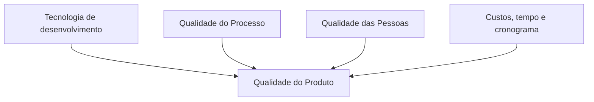
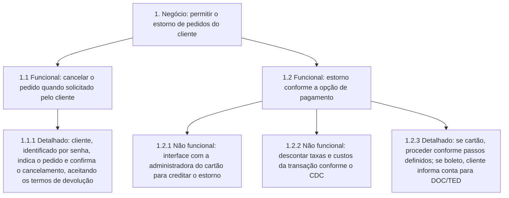

---

materia: Qualidade de Software 
fonte: Unidade_1_Fundamentos_e_Modelos_de_Qualidade_.pdf 
tags:

- resumo
- qualidade-software
- melhoria-continua
- requisitos

---
# 📝 Fundamentos e Modelos de Qualidade de Software

## 👁️ Visão geral

A unidade parte do **porquê** (falhas de software custam dinheiro, dados e até foguetes), define **o que é** qualidade de software e mostra as duas formas de evoluir um processo: **melhoria contínua** (Kaizen, apoiado pelo PDCA, 5S e pelas ferramentas da qualidade) e **salto radical** (Kaikaku / reengenharia). Depois separa **Garantia** de **Controle** da qualidade, apresenta os **custos da qualidade** e fecha em **requisitos**, que são a raiz da maioria dos projetos que fracassam.

## ⚠️ Por que a qualidade importa

### Impactos da baixa qualidade

| Para quem               | Impacto             | Como acontece                                                                            |
| :---------------------- | :------------------ | :--------------------------------------------------------------------------------------- |
| **Cliente**             | Perda de negócios   | Sistema sai do ar com frequência e o cliente não consegue fechar um negócio importante   |
| **Cliente**             | Perda de dados      | Uma falha corrompe o banco de dados e a empresa perde informações importantes            |
| **Cliente**             | Perda de tempo      | O software atrapalha as atividades, por exemplo, precisa ser (re)iniciado com frequência |
| **Cliente**             | Perda de dinheiro   | "No final tudo se reverte em dinheiro": os impactos anteriores viram perda financeira    |
| **Empresa de software** | Custos              | Suporte, manutenção, devolução do dinheiro ou pagamento de multas                        |
| **Empresa de software** | Processos judiciais | O cliente pode pedir indenização pelas perdas ocorridas                                  |

### Exemplos de falha de sistema

- **Sisu**: falha que permitiu a candidatos ver dados de outros candidatos, e divulgação indevida de resultados provisórios por 25 minutos (candidatos perderam vaga).
- **WannaCry** (2017): ataque de ransomware em massa.
- **Ariane-5 (1996)**: o caso clássico da aula.

> [!example] Ariane-5 (1996) O foguete **reutilizou um componente de software do Ariane-4**. Esse componente lançou uma **exceção ao converter um valor Double para Int**. Por causa dessa exceção, o **sistema de referência inercial** falhou e o foguete perdeu o controle e explodiu. Prejuízo: **US$ 500 milhões**. Lição: reaproveitar código sem revalidar no novo contexto é um risco de qualidade.

## 🎯 O que é Qualidade de Software

### Definição (IEEE 610, 1990)

> [!info] Definição — IEEE 610 (1990) Qualidade é **o grau em que o sistema, componente ou processo atende (1) os requisitos especificados e (2) as expectativas e necessidades do cliente ou do usuário**.

As duas partes da definição correspondem às duas visões citadas no slide:

| Parte da definição              | Visão                                     | Pergunta                                  |
| :------------------------------ | :---------------------------------------- | :---------------------------------------- |
| (1) Requisitos especificados    | **Visão da manufatura** (a especificação) | Construímos o que foi especificado?       |
| (2) Expectativas e necessidades | **Visão do usuário** (as metas)           | O que foi construído serve para quem usa? |

### Qualidade não surge por acaso

A qualidade é resultado de **bom planejamento** e de **práticas consistentes de engenharia de software** dentro de um **gerenciamento de projeto** bem estruturado:

- **Gerenciamento de projeto**: **planejar, organizar e controlar** as atividades.
- **Engenharia de software**: aplica técnicas que garantem a qualidade do **código, dos testes e dos processos**.

Juntas, as duas áreas criam o ambiente para entregar software que atende às necessidades dos usuários e aos requisitos técnicos.

### As duas dimensões da qualidade

Um processo de garantia da qualidade foca **simultaneamente** o **produto** de software e o **processo** que o desenvolve. Por isso a qualidade de software tem duas dimensões: ==**qualidade do processo** e **qualidade do produto**== (cai em prova, ver questão 1).

### Fatores que afetam a qualidade (Sommerville, 2011)

_Recriado do slide 11: os quatro fatores que influenciam a qualidade do produto de software._

### O que sustenta a qualidade do software

1. **Bom processo de desenvolvimento**, com metodologias adequadas e padrões como a **ISO/IEC 25010**.
2. **Código bem estruturado**, seguro e eficiente.
3. **Produto confiável e usável**, que atende às necessidades dos usuários.
4. **Facilidade de manutenção**, garantindo correções e evolução contínua.

> [!warning] CTFL (Certified Tester Foundation Level) **Não é possível identificar e testar todas as falhas** que um software pode ter: seria impraticável e desperdício de recursos. O que **é possível é medir a qualidade** do software.

## 🔄 Reengenharia

### Definição

> [!info] Reengenharia de processo É o **repensar fundamental** e a **reestruturação radical** de processos empresariais que visam alcançar **drásticas melhorias** em **indicadores críticos de desempenho**.

==Reengenharia é diferente da "simples" melhoria de processos==: não se ajusta o processo, **substitui-se**.

Tópicos que o material associa à reengenharia: processos (melhorar ou trocar?), a **tecnologia como alavanca** da reengenharia, a **qualidade como alavanca** da reengenharia, a realização da reengenharia e estudos de caso.

### Processos candidatos

- Bons candidatos são processos que **não valem a pena ser "arrumados", mas sim substituídos**.
- Normalmente são processos **fragmentados, intrincados, com falhas de qualidade** e **desalinhados** com a máxima adição de valor ao mercado.

### Exemplo: Laboratório de Análises Clínicas

| Etapa | Processo tradicional                                         | Processo reformulado (reengenharia)                         |
| :---- | :----------------------------------------------------------- | :---------------------------------------------------------- |
| 1     | Paciente vai ao laboratório para a coleta                    | Paciente vai ao laboratório para a coleta                   |
| 2     | Análise é realizada                                          | Análise é realizada                                         |
| 3     | Resultados são **datilografados**                            | Resultados são **passados para um computador**              |
| 4     | Paciente **volta ao laboratório** para retirar os resultados | Paciente **recebe envelope pelo correio** com os resultados |

A mudança nas etapas 3 e 4 reformula o processo de forma radical, com apoio de tecnologia.

### Outros exemplos

- **Metrô**: no Brasil a partir de **1974**. Combinou tecnologias já existentes e não tão sofisticadas (trem elétrico e galerias subterrâneas) e gerou um salto expressivo na **qualidade do transporte público**.
- **Construção civil**: a velha **prancheta deu lugar a sistemas 3D**, e a variedade de materiais, dispositivos e funcionalidades das construções aumentou muito.

### Evolução incremental × grandes avanços

A qualidade pode evoluir de forma **incremental** ou por **grandes avanços**. Os grandes avanços costumam ser impulsionados pela **tecnologia** e se inserem no contexto da **reengenharia**.

> [!tip] Importante O que caracteriza um **"novo e revolucionário patamar de qualidade"** é uma ==melhoria significativa que seja **claramente percebida pelos clientes**==.

Frase do material: **"Inovar não significa necessariamente criar algo novo"**. O metrô, por exemplo, combinou tecnologias que já existiam.

## 🔐 Qualidade da Informação e Segurança

Segundo **Sommerville (2016, p. 34)**, "o software precisa ser flexível e acomodar mudanças à medida que for sendo desenvolvido".

Em grandes sistemas há muita necessidade de análise da **especificação** e do **projeto**. Os documentos devem ser **completos**, porque corrigir problemas de segurança **na implementação** é geralmente muito caro.

### Pilares da Segurança da Informação (tríade CID)

| Pilar                 | Significado                                              |
| :-------------------- | :------------------------------------------------------- |
| **Confidencialidade** | Só quem é autorizado acessa a informação                 |
| **Integridade**       | A informação não é alterada ou destruída sem autorização |
| **Disponibilidade**   | A informação está acessível quando o autorizado precisa  |

> [!info] Contexto externo O slide mostra apenas os nomes dos três pilares. As explicações da tabela seguem a definição do NIST abaixo.

> [!info] Definição — NIST Segurança da informação é a **proteção dos sistemas de informação contra acesso, uso, divulgação, interrupção, modificação ou destruição não autorizados**, a fim de fornecer **confidencialidade, integridade e disponibilidade**.

O processo de **garantia de qualidade de software** também tem como atividade **validar os aspectos de segurança**. O slide ilustra com o mapa de ameaças cibernéticas em tempo real da Kaspersky (cybermap.kaspersky.com).

## 📐 Fatores de Qualidade de McCall

Em **1977, James A. McCall** propôs um modelo de avaliação da qualidade de software com **três fatores**, que avaliam o software sob **três pontos de vista distintos** (fonte: Pressman). A ideia de fundo: pessoas com interesses diferentes (**clientes, desenvolvedores, especialistas de software**) têm visões diferentes sobre qualidade.

![[mccall-triangulo-fatores-qualidade.png|450]] _Triângulo de McCall: Operação do produto na base, Revisão do produto à esquerda e Transição do produto à direita, cada um com seus critérios._

### Operação do Produto (uso no dia a dia)

| Critério           | Definição                                                                                                                                        |
| :----------------- | :----------------------------------------------------------------------------------------------------------------------------------------------- |
| **Corretitude**    | Medida em que o software **satisfaz as especificações** e os objetivos visados pelo cliente                                                      |
| **Confiabilidade** | Medida em que se pode esperar que o programa **execute sua função pretendida com a precisão exigida**                                            |
| **Eficiência**     | **Quantidade de recursos computacionais e de código** exigida para o programa executar sua função com total precisão                             |
| **Integridade**    | Medida em que se **controla o acesso** ao software e aos dados, bloqueando pessoas não autorizadas para que não haja perda de dados ou de código |
| **Usabilidade**    | **Facilidade** para utilizar o software                                                                                                          |

### Revisão do Produto (capacidade de sofrer mudanças)

| Critério             | Definição                                                                                            |
| :------------------- | :--------------------------------------------------------------------------------------------------- |
| **Manutenibilidade** | Esforço exigido para **localizar e reparar erros**                                                   |
| **Flexibilidade**    | Esforço para **realizar uma alteração** no software: quão fácil é alterá-lo de forma rápida e eficaz |
| **Testabilidade**    | Esforço exigido para **testar** o programa e garantir que ele execute a função pretendida            |

### Transição do Produto (adaptação a novos ambientes)

| Critério               | Definição                                                                                                 |
| :--------------------- | :-------------------------------------------------------------------------------------------------------- |
| **Portabilidade**      | Facilidade de **mover o produto para outra plataforma** ou software                                       |
| **Reusabilidade**      | Medida em que o software, ou parte dele, pode ser **reusado em outros softwares** (código reaproveitável) |
| **Interoperabilidade** | Capacidade de o software **ser acoplado a outro**                                                         |

> [!tip] Macete **Operação** = usar hoje. **Revisão** = mexer no código. **Transição** = levar para outro lugar.

## ⚖️ LGPD (Lei nº 13.709/2018)

A LGPD **não exige explicitamente o registro de logs**, mas **recomenda** que as organizações adotem medidas de segurança para proteger dados pessoais. Manter logs é uma boa prática porque permite **rastrear o acesso e o uso dos dados**, ajuda a **demonstrar conformidade** com a lei e a **identificar incidentes de segurança**.

> [!quote] Art. 37 O **controlador e o operador devem manter registro das operações de tratamento** de dados pessoais que realizarem, especialmente quando baseado no **legítimo interesse**.

Exemplo de log mostrado no slide (Log da Folha de Horários):

| Data                       | Log                                                                                       |
| :------------------------- | :---------------------------------------------------------------------------------------- |
| 8 de Maio de 2024 às 07:57 | O funcionário com NID 0123456 incluiu a frequência do dia 07-05-2024                      |
| 4 de Maio de 2024 às 11:00 | O funcionário com NID 0123456 solicitou autorização para banco de horas do dia 02-05-2024 |

> [!warning] Cuidado A lei não diz "guarde logs". O Art. 37 obriga a **manter registro das operações de tratamento**; o log é uma **forma recomendada** de cumprir isso.

## 📈 Kaizen e Kaikaku

Na evolução da qualidade de produtos e processos existem dois modelos principais: **Kaizen** (incremental) e **Kaikaku** (radical).

### Kaizen

> [!info] Definição **Kaizen** é um termo japonês que significa **"mudar para melhor"** (KAI = mudança, ZEN = para melhor). É a busca **constante** por melhorias: em vez de esperar uma grande mudança disruptiva, a inovação é feita de forma **incremental e constante**.

- Premissa central: **"Hoje melhor do que ontem, amanhã melhor do que hoje."**
- O Kaizen **envolve todas as pessoas**, sem distinção hierárquica.
- **Masaaki Imai**: "Kaizen é melhoria **diária**, melhoria de **todos**, melhoria em todos os **lugares**."
- Resultado do Kaizen: **processos melhorados** e **produtos evoluídos**.

### As 7 etapas do Kaizen

1. **Identificar** uma oportunidade de melhoria
2. **Mapear** o processo atual
3. **Desenvolver** uma solução
4. **Implementar**
5. **Analisar** os resultados
6. **Criar um padrão**
7. **Planejar** os próximos passos (e recomeçar)

### Kaikaku

- Evoluções **mais radicais**: **grandes saltos de qualidade**, muitas vezes motivados por **novas tecnologias**. Exemplos do material: a **invenção do transistor** e a **ida do homem à Lua**.
- São **eventos revolucionários** que fornecem recursos para uma **mudança dramática** na qualidade e na performance de produtos e processos.
- Resultado do Kaikaku: **reengenharia de processos** e **produtos revolucionários**.

| **Kaizen**      | **Kaikaku**                              |                                                     |
| :-------------- | :--------------------------------------- | :-------------------------------------------------- |
| Tipo de mudança | Incremental, gradual, constante          | Radical, rápida, grande salto                       |
| Motor           | Participação de todos, dia a dia         | Nova tecnologia ou reestruturação radical           |
| No gráfico      | Rampa suave                              | Degrau vertical                                     |
| Resultado       | Processos melhorados, produtos evoluídos | Reengenharia de processos, produtos revolucionários |

### Evolução combinada

![[kaizen-kaikaku-evolucao-combinada-grafico.png|550]] _Evolução ao longo do tempo: rampas de Kaizen intercaladas com degraus de Kaikaku, e a queda final quando o processo é abandonado._

- Na prática fazemos **melhorias contínuas** (Kaizen) e, **ocasionalmente**, damos um **grande salto** (Kaikaku), por nova tecnologia ou por reengenharia. As fases **se alternam**.
- **Efeito de um processo abandonado**: se não cuidarmos do processo, ele **retrocede**, perdendo melhorias ou ficando desatualizado. O mundo, os negócios e a tecnologia mudam sempre; sem evolução constante o processo fica **obsoleto**.

### Importância da padronização

![[padronizacao-cristalizacao-melhoria-grafico.png|550]] _Depois de cada melhoria vem uma fase plana de cristalização e manutenção. A linha tracejada mostra a queda quando a melhoria não vira padrão._

Toda melhoria, incremental ou disruptiva, precisa de uma fase de **cristalização e manutenção**: a melhoria é **transformada em padrão**, solidificada. Isso cria um **patamar adequado para a próxima melhoria**.

> [!warning] Cuidado **Sem padronizar, a melhoria se perde** (efeito de não tornar a melhoria um padrão sólido). Sempre solidifique antes de dar o próximo passo.

## 🔁 Ciclo PDCA

As **quatro etapas do PDCA** (**Plan, Do, Check, Act**) são a forma de **materializar o Kaizen** de maneira simples e objetiva.

- **Antes do PDCA**: as organizações gerenciavam atividades identificando apenas **ponto de início e fim** do processo.
- **Com o PDCA**: um **modelo circular**, que enfatiza a **melhoria contínua**.

![[ciclo-pdca-etapas-diagrama.png|600]] _As quatro fases do ciclo PDCA e o que se faz em cada uma._

| Fase                    | O que fazer (slide 44)                                                 | Pergunta-guia (slide 46)                                                                    | Implementação (slide 48)                                     |
| :---------------------- | :--------------------------------------------------------------------- | :------------------------------------------------------------------------------------------ | :----------------------------------------------------------- |
| **P — Plan / Planejar** | Identificar o problema, observá-lo, analisá-lo, elaborar plano de ação | Qual é o problema mais importante? Há dados? É preciso observar mais? **Planeje!**          | Definir o problema/objetivo e projetar planos/estratégias    |
| **D — Do / Fazer**      | Executar o plano de ação, analisar os resultados                       | Busque dados. Realize a mudança (ou teste), **de preferência em pequena escala**. **Faça!** | Implementar as ações necessárias para cumprir o planejamento |
| **C — Check / Checar**  | Checar os resultados obtidos                                           | Observe os efeitos da mudança (ou do teste). **Verifique!**                                 | Observar os resultados, escolher e usar as métricas certas   |
| **A — Act / Agir**      | Concluir o ciclo, analisar os resultados                               | Estude os resultados. O que ensinam? O que mudar? **Aja!**                                  | Adotar as mudanças que funcionaram e/ou adaptar os planos    |

### Pontos importantes (base de questão V/F)

1. No **Planejamento (P)**: identificar o problema, definir objetivos e escolher métodos é essencial.
2. O PDCA é importante na qualidade total, mas o ==**5S é um conceito separado**, que **não se aplica diretamente ao PDCA**==; pode ser usado como ferramenta dentro de processos de melhoria.
3. O PDCA é **contínuo**: depois das ações corretivas, **inicia-se um novo ciclo**.
4. É **flexível**: aplica-se a **qualquer organização**, de qualquer porte ou setor.
5. A etapa **A (Agir)** age de acordo com os resultados do Check e ==**não se limita à avaliação da eficácia**==: o PDCA serve para avaliar **eficácia** e também para melhorar a **eficiência**.

### Kaizen + PDCA na prática

> [!example] Nestlé — reduzir desperdício A Nestlé buscou **reduzir o desperdício** nos processos de produção. Usou o **Kaizen** (filosofia de melhoria contínua) aliado ao **PDCA** (estrutura detalhada, objetiva e assertiva), o que fez a filosofia sair do papel e ser implementada. Resumo: **Kaizen = melhoria contínua** (o quê); **PDCA = estrutura detalhada** (como).

> [!example] Aplicação: redução do tempo de um processo Antes de tudo: **definir metas e objetivos** e **alinhá-los às expectativas das pessoas consumidoras**. Depois: **criar o plano de ação** (o modo de alcançar o objetivo).
> 
> - **Meta**: reduzir o tempo do processo.
> - **Plano de ação**: trabalho de forma colaborativa.
> - **Execução**: monitorar o processo, coletar e registrar dados para comparar antes × depois.
> - **Checagem**: analisar os resultados. Com o trabalho colaborativo houve avanço significativo e o tempo foi reduzido, como era o objetivo.

## 🧹 5S

O **5S** e o **PDCA** estão relacionados à melhoria contínua, mas **são metodologias distintas**. O 5S é uma ferramenta focada na **organização e disciplina do ambiente de trabalho**, para torná-lo mais eficiente, limpo e organizado, melhorando a produtividade e reduzindo desperdícios.

| Senso        | Nome         | Ação-chave                                                                      |
| :----------- | :----------- | :------------------------------------------------------------------------------ |
| **Seiri**    | Utilização   | **Separar** o necessário do desnecessário                                       |
| **Seiton**   | Ordenação    | **Organizar** os itens necessários para que sejam facilmente acessíveis         |
| **Seisou**   | Limpeza      | **Manter** o ambiente limpo e arrumado                                          |
| **Seiketsu** | Padronização | **Estabelecer padrões** de organização e limpeza, mantendo as etapas anteriores |
| **Shitsuke** | Disciplina   | **Manter e revisar constantemente** os padrões, para o 5S durar a longo prazo   |

> [!tip] Macete da ordem **Separa → Ordena → Limpa → Padroniza → Disciplina.** Os três primeiros arrumam; os dois últimos fazem a arrumação durar.

## 🧰 Ferramentas da Qualidade

As organizações enfrentam problemas de qualidade e produtividade que afetam eficiência e satisfação dos clientes. As **sete ferramentas da qualidade do Kaizen** servem para **identificar a raiz dos problemas** e dar **estrutura para desenvolver soluções**. Têm **abordagem holística** (visão do todo, de todos os componentes da organização) e **prática** para resolver problemas.

### As 7 ferramentas

1. Diagrama de **Pareto**
2. Diagrama de **Ishikawa**
3. **Folha de Verificação**
4. **Histograma**
5. Diagrama de **Dispersão**
6. **Fluxograma**
7. **Carta de Controle**

> [!warning] Cuidado **Benchmarking** e **Matriz GUT** também aparecem na aula como ferramentas de qualidade, mas **não estão na lista das 7**.

### Definições do material

| Ferramenta               | Para que serve                                                                                                                                                                                                              |
| :----------------------- | :-------------------------------------------------------------------------------------------------------------------------------------------------------------------------------------------------------------------------- |
| **Benchmarking**         | Compara **atividades anteriores com as atuais** do projeto para determinar um **padrão de referência** para avaliar a qualidade de um produto ou processo                                                                   |
| **Diagrama de Pareto**   | Gráfico que **ordena as frequências** das ocorrências (da mais para a menos recorrente), permitindo **priorizar** problemas: ==os **20%** dos problemas mais relevantes representam **80%** das oportunidades de melhoria== |
| **Fluxograma**           | **Mapear** visualmente as etapas do processo para **identificar gargalos** e encontrar solução                                                                                                                              |
| **Carta de Controle**    | **Monitorar** o desempenho do processo e sua **variação ao longo do tempo**: coletar dados (ex.: tempo de resolução de problemas), **visualizar tendências**, **identificar desvios** e tomar medidas corretivas            |
| **Diagrama de Ishikawa** | **Identificar e priorizar causas** de um problema                                                                                                                                                                           |
| **Matriz GUT**           | **Priorizar** problemas ou causas por Gravidade × Urgência × Tendência                                                                                                                                                      |

> [!example] Estudo de caso — Atendimento ao cliente Uma empresa de atendimento ao cliente sofre **atrasos frequentes**, o processo é ineficiente e os clientes estão insatisfeitos. Como o material aplica as ferramentas:
> 
> - **Fluxograma** para mapear as etapas do atendimento e achar os **gargalos**.
> - **Carta de controle** para coletar o **tempo de resolução** dos problemas e acompanhar tendências e desvios.

### Diagrama de Ishikawa (Causa e Efeito / Espinha de Peixe)

O **Diagrama de Ishikawa**, também chamado **Diagrama de Causa e Efeito** ou **Espinha de Peixe**, serve para **identificar várias causas possíveis de um problema**. Permite que **todos os membros da equipe contribuam** com seu conhecimento para mapear as causas.

- É um **processo de grupo**, em ambiente de **brainstorming sem críticas** (sem julgamentos).
- ==**Não** é característica principal ser feito "no menor espaço de tempo possível"==: o foco é a **análise profunda das causas**, que pode levar tempo.

![[ishikawa-espinha-de-peixe-6m-modelo.png]] _Modelo 6M: o problema fica na "cabeça" do peixe e as causas se agrupam em seis categorias._

As seis categorias (**6M**): **Métodos, Meio Ambiente, Medida, Material, Mão de Obra, Máquinas**.

![[ishikawa-exemplo-produto-defeituoso.png]] _Exemplo do material para o efeito "Produto defeituoso"._

| Categoria     | Causas no exemplo "Produto defeituoso"                       |
| :------------ | :----------------------------------------------------------- |
| Máquinas      | Falta de manutenção; paradas excessivas                      |
| Materiais     | Especificações incorretas; quantidade incorreta              |
| Mão de obra   | Falta de treinamento; imprudência na execução                |
| Meio Ambiente | Layout mal definido; falta de organização                    |
| Métricas      | Má calibração de equipamento; má avaliação dos indicadores   |
| Método        | Procedimento não documentado; falta de controle de qualidade |

> [!example] Ishikawa aplicado a software: folha de frequência com erros O material pede o Ishikawa do problema **"sistema de folha de frequência com erros"** e já traz as causas por categoria:
> 
> |Categoria|Causas|
> |:--|:--|
> |**Métodos**|Falta de padronização nos procedimentos de cálculo de frequência; falta de procedimento de verificação dos dados inseridos|
> |**Meio Ambiente**|Problemas de comunicação entre time de desenvolvimento e usuários finais; mudanças nos requisitos do cliente após a implementação|
> |**Medida**|Falha na definição de indicadores de desempenho para monitorar a qualidade do sistema; dados de frequência não rastreados ou reportados corretamente|
> |**Material**|Dados incorretos ou incompletos no sistema; erro na importação de dados do código do funcionário|
> |**Mão de Obra**|Falta de treinamento dos funcionários para usar o sistema; falta de atenção dos usuários ao registrar a frequência|
> |**Máquinas**|Bugs ou falhas no software de cálculo (ex.: adicional noturno); sistema lento ou com falhas técnicas|

### Matriz GUT

Matriz de **priorização** de problemas (ou causas de problemas) com base em três fatores:

- **G — Gravidade**
- **U — Urgência**
- **T — Tendência**

Cada fator recebe **nota de 1 a 5**. Multiplicam-se as três notas:

$$\text{Prioridade} = G \times U \times T$$

onde $G$, $U$, $T \in {1, 2, 3, 4, 5}$. O valor varia de $1$ a $125$; **quanto maior, maior a prioridade**, e a ordenação sai automaticamente.

Exemplo do slide:

| Item | Problema                                                                                                     |  G  |  U  |  T  | G×U×T  |
| :--- | :----------------------------------------------------------------------------------------------------------- | :-: | :-: | :-: | :----: |
| 1    | Longo lead time para produtos e serviços                                                                     |  5  |  3  |  5  | **75** |
| 2    | Grande volume de estoque de matéria-prima (produto do cliente aguardando prestação de serviços)              |  5  |  4  |  3  | **60** |
| 3    | Baixa eficiência operacional em todos os processos de armazenamento e transporte                             |  4  |  3  |  3  | **36** |
| 4    | Baixa qualificação dos prestadores de serviço                                                                |  3  |  3  |  3  | **27** |
| 5    | Alto % de paradas das linhas de produção por falta de abastecimento                                          |  3  |  4  |  2  | **24** |
| 6    | Limitações de layout por erros de projeto afetando acesso a matérias-primas, produtos em processo e acabados |  3  |  3  |  2  | **18** |
| 7    | Ineficiência na comunicação entre a empresa e as contratadas                                                 |  2  |  2  |  3  | **12** |
| 8    | Limitações dimensionais por erros de projeto afetando o atendimento ao cliente                               |  2  |  3  |  1  | **6**  |

> [!tip] Leitura O item 1 é atacado primeiro (75). O item 2 tem a **maior urgência** (4) mas perde no produto, porque a **tendência** é menor: a GUT decide pelo **produto**, nunca por um fator isolado.

## 🛡️ Garantia × Controle da Qualidade

Na gestão da qualidade há dois conjuntos de processos básicos:

| **Garantia da Qualidade** | **Controle da Qualidade**                                                                                                                                   |                                                                                                                                                                                                                                     |
| :------------------------ | :---------------------------------------------------------------------------------------------------------------------------------------------------------- | :---------------------------------------------------------------------------------------------------------------------------------------------------------------------------------------------------------------------------------- |
| Busca garantir que...     | produtos e processo **sigam as cláusulas e os planos** estabelecidos                                                                                        | processos e produtos **cumpram os objetivos de qualidade**                                                                                                                                                                          |
| Analisa se...             | os ==**padrões**== estão sendo atendidos                                                                                                                    | os ==**requisitos** e as necessidades== estão sendo atendidos                                                                                                                                                                       |
| Natureza                  | **Função gerencial**: define um processo que **antecipa** as ações a planejar e executar para assegurar o sucesso do projeto                                | **Função de inspeção**: usa ferramentas para verificar se o trabalho **adere aos processos** pré-estabelecidos                                                                                                                      |
| Foco                      | **Prevenção** de defeitos e problemas; definição de padrões, metodologias, técnicas e ferramentas de apoio; prevenção de fatores que causam a não qualidade | **Produto final e subprodutos** em estágios intermediários; monitorar resultados contra os padrões; identificar formas de eliminar causas de resultados insatisfatórios; destacar procedimentos para política e melhoria da empresa |
| Palavra-chave             | **Prevenir**                                                                                                                                                | **Verificar e Validar (V&V)**                                                                                                                                                                                                       |

### Atividades da Garantia da Qualidade de Software (GQS)

- **Planejar** as atividades de GQS.
- **Avaliar produto/serviço**: se os produtos seguem os critérios definidos, contrato, padrões e regulamentações.
- **Avaliar processo**: se o processo segue o ciclo de vida, usa as ferramentas, o ambiente e o fornecedor definidos.
- **Gerenciar registros e relatórios** de GQ.
- **Tratar incidentes** e problemas.
- **Treinamento**: das equipes de GQS e da organização como um todo.

### Os 4 princípios de Crosby

1. Qualidade é definida como **conformidade com os requisitos**.
2. O sistema de qualidade é baseado em **prevenção**.
3. O padrão de desempenho deve ser **ZERO defeitos**.
4. A qualidade é **medida pelo custo da não-conformidade**.

## 💰 Custo da Qualidade

Há várias abordagens. O slide 12 resume em **Prevenção, Avaliação e Resolver falhas**; o **modelo de Juran** detalha as mesmas três categorias:

| Categoria (Juran)          | Equivale a (slide 12) | O que inclui                                                                                                                                                                                                 |
| :------------------------- | :-------------------- | :----------------------------------------------------------------------------------------------------------------------------------------------------------------------------------------------------------- |
| **Prevenção**              | Prevenção             | Esforços para **evitar** produtos e serviços defeituosos: maquinaria, tecnologia, **programas de treinamento**, gestão do Programa de Qualidade, coleta e análise de dados, **certificação de fornecedores** |
| **Inspeção (ou detecção)** | Avaliação             | **Avaliação** da qualidade: inspeção de entrada, testes e inspeções em todo o processo. Em software: **etapas de testes e garantia da qualidade do processo** de desenvolvimento                             |
| **Falha**                  | Resolver falhas       | Produtos **não-conformes e inoperantes**, de origem interna ou externa                                                                                                                                       |

A **falha** se divide em:

- **Falha interna**: defeito identificado **antes da expedição** (antes de chegar ao cliente).
- **Falha externa**: falha identificada **após a entrega ao cliente**.

### Custo da não qualidade

- Desperdício de tempo e material
- Retrabalho pela má qualidade
- Atrasos no cronograma (dinheiro adicional)
- Imagem ruim do produto e da empresa (perda de vendas futuras)
- Perda de clientes

## 📋 Requisitos de Software e Qualidade

O que se espera de um software de qualidade: **sem defeitos**, que **atende às especificações do cliente** e que possui **confiabilidade, usabilidade e manutenibilidade**. Como clientes, desenvolvedores e especialistas veem qualidade de formas diferentes, o **gerenciamento de requisitos** é o que alinha essas visões.

### Motivações para a Gestão de Requisitos

**CHAOS Manifesto 2015** (Standish Group):

- **29%** dos projetos são **bem-sucedidos**;
- **31%** dos projetos de **médio porte** foram **cancelados ou tiveram erros graves**;
- Apenas **69%** das características esperadas (requisitos não funcionais) e funcionalidades essenciais são **entregues** no produto.

| Resolução (todos os projetos) | 2011 | 2012 | 2013 | 2014 | 2015 |
| :---------------------------- | :--: | :--: | :--: | :--: | :--: |
| Successful (sucesso)          | 29%  | 27%  | 31%  | 28%  | 29%  |
| Challenged (com problemas)    | 49%  | 56%  | 50%  | 55%  | 52%  |
| Failed (fracasso)             | 22%  | 17%  | 19%  | 17%  | 19%  |

| Porte do projeto | Successful | Challenged | Failed |
| :--------------- | :--------: | :--------: | :----: |
| Grand            |     2%     |     7%     |  17%   |
| Large            |     6%     |    17%     |  24%   |
| Medium           |     9%     |    26%     |  31%   |
| Moderate         |    21%     |    32%     |  17%   |
| Small            |    62%     |    16%     |  11%   |
| **Total**        |    100%    |    100%    |  100%  |

> [!info] Contexto externo — leitura da segunda tabela Cada **coluna** soma 100%: o 31% significa que, **entre os projetos que fracassaram**, 31% eram de médio porte. Na prova, use a frase do slide; a observação serve só para você não se confundir lendo a tabela.

**Uso das funcionalidades entregues:**

| Uso                       |    %    |
| :------------------------ | :-----: |
| Nunca utilizadas          | **45%** |
| Raramente utilizadas      |   19%   |
| Utilizadas algumas vezes  |   16%   |
| Frequentemente utilizadas |   13%   |
| Sempre utilizadas         |   7%    |

Ou seja, quase metade do que se entrega **nunca é usado**: requisito mal levantado é esforço jogado fora.

**Os problemas principais não são tecnológicos.** A maior preocupação da indústria é a **previsibilidade de prazo e custo**, e a raiz está nos requisitos:

- **Especificação de requisitos inadequada**
- **Mudanças constantes em requisitos**

Pesquisa de Hussain, Mkpojiogu e Kamal (2016):

| Fatores de sucesso                  |  %   | Razões de falha                  |  %   |
| :---------------------------------- | :--: | :------------------------------- | :--: |
| Envolvimento do usuário             | 15,9 | **Requisitos incompletos**       | 13,1 |
| Apoio da alta gestão                | 13,9 | Falta de envolvimento do usuário | 12,4 |
| **Declaração clara dos requisitos** | 13,0 | Falta de recursos                | 10,6 |
| Planejamento adequado               | 9,6  | Expectativas irreais             | 9,9  |
| Expectativas realistas              | 8,2  | Falta de apoio executivo         | 9,3  |
| Marcos menores de projeto           | 7,7  | **Mudança de requisitos**        | 8,7  |
| Equipe competente                   | 7,2  | Falta de planejamento            | 8,1  |
| Senso de propriedade                | 5,3  | Não era mais necessário          | 7,5  |
| Visão e objetivos claros            | 2,9  | Falta de gestão de TI            | 6,2  |
| Equipe dedicada e focada            | 2,4  | Desconhecimento tecnológico      | 4,3  |
| Outros                              | 13,9 | Outros                           | 9,9  |

_Traduzido dos gráficos de pizza do slide 86. O rótulo "Falta de gestão de TI" está cortado no slide; 6,2% é o valor que fecha 100%._

### Custo de corrigir erros por fase (Boehm, 1981)

![[boehm-custo-correcao-erros-por-fase.png|600]] _Custo relativo para corrigir um erro conforme a fase em que ele é detectado (valores mínimos e máximos)._

| Fase em que o erro é detectado | Custo relativo |
| :----------------------------- | :------------: |
| Requisitos                     |       1×       |
| Desenho                        |      3–6×      |
| Codificação                    |      10×       |
| Testes de sistema              |     15–40×     |
| Aceite                         |     30–70×     |
| Operação                       |  **40–1000×**  |

Quanto **mais tarde** o erro é descoberto, **mais caro**. Por isso "o começo é a parte mais importante do trabalho" (Platão) e "bem começado, metade feito" (Aristóteles).

### Definição de requisito

> [!info] IEEE 610.12 (Glossário) Requisito é:
> 
> 1. uma **condição ou capacidade necessária para um usuário** resolver um problema ou alcançar um objetivo;
> 2. uma **condição ou capacidade que deve estar presente num sistema** para satisfazer um contrato, padrão, especificação ou outro documento formal;
> 3. uma **representação documentada** de uma condição ou capacidade conforme (1) ou (2).

> [!quote] Abbott (1986) "Requisito é uma **função, restrição ou outra propriedade** que precisa ser fornecida, encontrada ou atendida para satisfazer as necessidades do usuário do futuro sistema."

### Ambiguidade de requisitos

Um bom requisito é **específico e verificável**: dá para testar se foi cumprido.

| Ambíguo                                                                    | Específico                                                                                                                                                                                                                      |
| :------------------------------------------------------------------------- | :------------------------------------------------------------------------------------------------------------------------------------------------------------------------------------------------------------------------------ |
| A interface do usuário deverá ser **rápida**.                              | O sistema deve responder em, **no máximo, 0,5 segundos** a eventos acionados por mouse ou teclado, em **pelo menos 80%** de todas as interações dos usuários.                                                                   |
| O sistema deverá suportar **múltiplos idiomas** e conjuntos de caracteres. | Idiomas: **português do Brasil, espanhol, inglês, japonês básico (hiragana e katakana), russo e chinês simplificado**, com os conjuntos ISO Latin 1 (ISO-8859-1), ISO-2022-JP (japonês), KO18R (cirílico) e ISO-IR-58 (chinês). |
| O sistema deverá ser **fácil de navegar**.                                 | Navegação via **menu permanentemente visível na borda esquerda** da janela e por **teclas de função padronizadas** em todas as telas para buscas, consultas, rolagem e ajuda.                                                   |

> [!tip] Palavras que denunciam ambiguidade "rápido", "fácil", "múltiplos", "todos", "completo", "maior eficiência possível": termos sem número, lista ou critério de aceitação.

### Classificação dos requisitos (IREB, 2021)

| Tipo                        | Definição                                                                                                                              |
| :-------------------------- | :------------------------------------------------------------------------------------------------------------------------------------- |
| **Requisitos funcionais**   | Resultado ou **comportamento fornecido por uma função** do sistema; inclui requisitos de dados e a interação do sistema com o ambiente |
| **Requisitos de qualidade** | Quesitos de qualidade **não cobertos pelos funcionais**: desempenho, disponibilidade, segurança, confiabilidade                        |
| **Restrições**              | Requisitos que **limitam o espaço de solução** além do necessário para atender aos funcionais e de qualidade                           |

### Níveis de requisitos (IREB, 2021)

| Nível                          | O que expressa                                                              |
| :----------------------------- | :-------------------------------------------------------------------------- |
| **Requisitos de negócio**      | Metas e objetivos de negócio e necessidades da organização                  |
| **Requisitos de domínio**      | Propriedades do domínio (o assunto para o qual o sistema será desenvolvido) |
| **Requisitos de usuário**      | O que os usuários querem do sistema; a perspectiva dos usuários             |
| **Requisitos de stakeholders** | O que os stakeholders querem presente no sistema; a perspectiva deles       |
| **Requisitos do sistema**      | O que o sistema deve fazer; requisitos sistêmicos                           |

### Funcionais × não funcionais (ISO 25000)

![[atributos-qualidade-funcionais-nao-funcionais.png|600]] _Atributos de qualidade: Funcionalidade fica fora da elipse; os outros sete são os não funcionais._

Dos oito atributos de qualidade, ==só **Funcionalidade** é funcional==. **Não funcionais**: Compatibilidade, Confiabilidade, Manutenibilidade, Desempenho, Usabilidade, Segurança e Portabilidade.

A ISO 25000 define atributo de qualidade como o "conjunto de atributos que têm impacto na capacidade do software de manter o seu nível de desempenho dentro de condições e características estabelecidas por um dado período de tempo".

### Subcategorias de requisitos não funcionais

| Subcategoria              | Descrição                                                                                                               |
| :------------------------ | :---------------------------------------------------------------------------------------------------------------------- |
| **Operacionais**          | Como o sistema irá rodar; aspectos de interface com o usuário (layout de tela, estilo de linguagem, histórico de dados) |
| **Desempenho**            | **Valores numéricos** para variáveis mensuráveis (índice, frequência, capacidade, velocidade, precisão)                 |
| **Interface**             | Hardware, software ou bancos de dados com os quais o sistema deve **interagir ou se comunicar**                         |
| **Recursos**              | **Limites superiores** de recursos físicos: processamento, memória, disco (ex.: quotas de usuários)                     |
| **Manutenibilidade**      | Facilidade de **modificar** o sistema para corrigir falhas, melhorar performance ou adaptar-se a mudanças               |
| **Portabilidade**         | Dificuldade de **mover** o software de um ambiente (hardware, SO, banco de dados) para outro                            |
| **Escalabilidade**        | Continuar funcionando bem quando **ampliado**                                                                           |
| **Disponibilidade**       | Desempenhar suas funções em condições estabelecidas por um período específico (**24x7, 10x5**)                          |
| **Recuperação**           | O que fazer **antes e depois de uma falha** (processos, comunicações)                                                   |
| **Segurança**             | Proteger contra violações; confidencialidade, integridade e disponibilidade (backup, vírus, perda de dados)             |
| **Testabilidade**         | Funcionalidades permanentes que facilitam **preparar, executar ou evidenciar testes**                                   |
| **Políticos e culturais** | Fatores humanos, comportamentais e regras de conduta (política da empresa, código de ética, perfil dos usuários)        |

### Exemplo: da necessidade de negócio ao requisito detalhado

_Recriado do slide 95: um único requisito de negócio se desdobra em funcionais, não funcionais e detalhados._

## 📝 Questões

**1.** Um processo de garantia da qualidade deve focar simultaneamente o produto de software e o processo de desenvolvimento desse software. Dessa forma, a qualidade de software se divide em duas dimensões, quais sejam: A) Qualidade interna e qualidade externa. B) Processos fundamentais e processos de apoio. C) Qualidade do produto e qualidade em uso. D) Qualidade do processo e qualidade do produto.

> [!success]- Resposta **D.** O próprio enunciado entrega: se a garantia foca **produto** e **processo**, as dimensões são qualidade do **processo** e do **produto**. A e C são divisões que existem em normas de qualidade de produto, mas ficam só no produto; B fala de tipos de processo.

**2.** Um sistema acadêmico de graduação atende às necessidades de uma universidade há oito anos, período em que foi corrigido, adaptado e melhorado várias vezes, sem que as melhores práticas da Engenharia de Software tivessem sido aplicadas. Caracterizado como um sistema de baixa qualidade de manutenção, foi realizada uma análise de custo-benefício que decidiu pela sua reengenharia: A) em resposta ao seu alto valor de negócio corrente para a universidade. B) em função do seu reduzido custo de manutenção atual antes da reengenharia. C) devido à sua expectativa de vida menor, se comparada a outros sistemas legados. D) por causa da estimativa de longo prazo para concluir a sua reconstrução.

> [!success]- Resposta **A.** Só vale a pena fazer reengenharia de um sistema de **baixa qualidade** se ele tem **alto valor de negócio**: é importante demais para descartar e ruim demais para só manter. B contradiz o enunciado (baixa qualidade de manutenção = manutenção cara). C e D não justificam o investimento. _Contexto externo:_ Sommerville classifica sistemas legados em quatro quadrantes; **baixa qualidade + alto valor de negócio → reengenharia**.

**3.** Qual é a essência fundamental da filosofia Kaizen? A) "Grandes mudanças trazem grandes resultados." B) "Nada precisa ser mudado." C) "A busca por melhorias é uma perda de tempo." D) "Hoje melhor do que ontem. Amanhã melhor do que hoje."

> [!success]- Resposta **D.** É a premissa literal do Kaizen: melhoria **incremental e contínua**. A descreve o Kaikaku (grandes saltos); B e C negam a melhoria.

**4.** Assinale três alternativas que expressam ideias centrais do Kaizen: A) Propósito de longo prazo. B) Melhorias baseadas em tecnologias. C) Evoluções incrementais. D) Análise contínua e minuciosa.

> [!success]- Resposta **A, C e D.** Kaizen é contínuo (longo prazo), incremental e baseado em análise constante do processo. **B é Kaikaku**: saltos motivados por novas tecnologias.

**5.** Analise as afirmativas sobre o PDCA (V ou F): I. Na primeira etapa (P) deve ser identificado o problema, definidos objetivos e métodos para alcançar os resultados planejados. II. O Ciclo PDCA é a base para a implantação da qualidade total, que, por meio da metodologia 5S, consegue melhorar a qualidade de vida dos membros da equipe e do ambiente de trabalho. III. Com as ações corretivas ao final do primeiro Ciclo PDCA, é possível e desejável que seja criado um novo planejamento para a melhoria de determinado procedimento, iniciando-se um novo Ciclo PDCA, sendo esse novo ciclo, a partir do anterior, fundamental para o sucesso da utilização dessa ferramenta. IV. O ciclo PDCA é um método estruturado para implementação de processos de melhoria da qualidade, podendo ser aplicado em qualquer organização, independentemente de tamanho e ramo de negócio. V. A etapa (A) engloba apenas a avaliação da eficácia dos processos, por isso o ciclo PDCA não se constitui uma ferramenta adequada para avaliação da eficiência.

A) I, II e V — B) I, III e IV — C) I, III e V — D) II, III e IV

> [!success]- Resposta **B (I, III e IV verdadeiras).**
> 
> - I **V**: é o que se faz no Plan.
> - II **F**: o **5S é metodologia separada**, não é "por meio" do PDCA.
> - III **V**: o PDCA é contínuo; um ciclo puxa o próximo.
> - IV **V**: é flexível, serve para qualquer organização.
> - V **F**: o Agir não se limita à eficácia; o PDCA também melhora a **eficiência**.

**6.** A Toyota é famosa por usar o PDCA e o Kaizen para aperfeiçoar seus processos de fabricação. Qual é o propósito principal do ciclo PDCA na filosofia de melhoria contínua da Toyota? A) Executar ações corretivas imediatas. B) Padronizar procedimentos de trabalho. C) Planejar, implementar, verificar e agir para aprimorar os processos. D) Identificar os problemas operacionais.

> [!success]- Resposta **C.** É o ciclo inteiro a serviço da melhoria. A, B e D são **partes** do ciclo (Agir, padronização após melhoria, Planejar), não o propósito principal.

**7.** Avalie as asserções e a relação entre elas: I. O Diagrama de Ishikawa visa detectar diversas e possíveis causas do problema estudado, permitindo que cada participante contribua com o seu conhecimento específico PORQUE II. O Diagrama de Ishikawa é um processo de grupo em que os indivíduos emitem ideias de forma livre, sem críticas, no menor espaço de tempo possível.

A) I e II verdadeiras, e II justifica I. — B) I e II verdadeiras, mas II não justifica I. — C) I verdadeira e II falsa. — D) I falsa e II verdadeira.

> [!success]- Resposta **B** (gabarito do professor). I é a definição do Ishikawa. II descreve características do brainstorming em grupo (livre, sem críticas), que o gabarito aceita como verdadeira, mas isso **não explica** o objetivo de I: o diagrama busca as causas porque é uma ferramenta de **análise de causa e efeito**, não porque é rápido. ⚠️ O slide 63 afirma que "no menor espaço de tempo possível" **não é característica principal** do diagrama, o que permitiria defender a **C**. Vale confirmar com o professor.

**8.** A qualidade de software é o resultado de um bom gerenciamento de projeto e de uma prática consistente de engenharia de software. Uma das atividades tem o objetivo de fornecer ao pessoal técnico e administrativo os dados necessários para serem informados sobre a qualidade do produto, ganhando entendimento e confiança de que as ações para atingir a qualidade desejada estão funcionando. A que a descrição se refere? A) Técnicas de gerenciamento de software. — B) Métodos de engenharia de software. — C) Garantia de qualidade. — D) Controle de qualidade.

> [!success]- Resposta **C.** "Dar **confiança** de que as ações estão funcionando" e informar a gestão é papel da **Garantia**, que é função **gerencial** e olha os processos. O **Controle** inspeciona o produto para ver se cumpre requisitos; ele não tem o papel de dar essa visão gerencial.

**9.** Requisitos de um sistema acadêmico:

- R1: O sistema deve permitir que cada professor realize o lançamento de notas das turmas nas quais lecionou.
- R2: O sistema deverá ser desenvolvido de forma a possibilitar o seu transporte para outro sistema operacional em, no máximo, 60 dias.
- R3: O sistema deve permitir que um estudante realize a sua matrícula nas disciplinas oferecidas em um semestre letivo.
- R4: O sistema atualiza a nota do estudante, permitindo a sua visualização, em até dois segundos depois do momento que o professor a registra.
- R5: O sistema deve permitir que o auxiliar de serviços acadêmicos realize o cadastro de um estudante em não mais do que dez minutos de orientação.

São requisitos **não funcionais** apenas: A) R2, R4 e R5 — B) R1, R2 e R3 — C) R2, R3 e R5 — D) R1, R3 e R4

> [!success]- Resposta **A.** R2 = **portabilidade** (transportar para outro SO). R4 = **desempenho** (até 2 segundos). R5 = **usabilidade** (aprender em até 10 minutos de orientação). R1 e R3 descrevem **funções** (lançar notas, fazer matrícula), logo são funcionais.

**10.** Assinale a alternativa em que o item é um requisito **funcional**: A) O software deve ser operacionalizado no sistema Linux. B) O tempo de desenvolvimento não deve ultrapassar seis meses. C) O software deve emitir relatórios de compras a cada quinze dias. D) O tempo de resposta do sistema não deve ultrapassar 30 segundos. E) A base de dados deve ser protegida para acesso apenas de usuários autorizados.

> [!success]- Resposta **C.** Emitir relatório é uma **função** do sistema. ⚠️ O slide 98 marca "Resp: A", mas a análise do próprio slide 99 confirma que é **C**. O "A" do slide é erro de digitação. A = portabilidade (RNF); B = limitação de prazo do projeto (RNF/restrição); D = desempenho (RNF); E = segurança (RNF).

**11. (Para pensar)** Uma clínica realiza exames com coleta de amostras em domicílio e posta os resultados na internet. O processo inclui coleta, transporte, análise e disponibilização dos resultados. Os gestores perceberam que a entrega dos resultados está demorando mais que o esperado e que ocasionalmente ocorrem erros de registro no sistema. Aplique o PDCA para melhorar a eficiência e a qualidade do processo.

> [!question]- Resposta (resolvida por mim, confira)
> 
> - **Plan**: medir o tempo de cada etapa (coleta → transporte → análise → postagem) para achar o gargalo; levantar e classificar os erros de registro (Pareto, Ishikawa); definir meta mensurável, por exemplo "resultado online em até X horas e zero erros de registro"; montar o plano de ação (ex.: validação automática no cadastro, coleta registrada já no domicílio por aplicativo, rota de transporte otimizada).
> - **Do**: aplicar as mudanças **em pequena escala** (uma região ou uma equipe de coleta), registrando os dados de tempo e erro.
> - **Check**: comparar antes × depois com as métricas definidas (tempo médio de entrega, % de erros); usar carta de controle para ver se a melhoria se mantém.
> - **Act**: se funcionou, **padronizar** e expandir para toda a clínica; se não, ajustar o plano. Em seguida, iniciar um **novo ciclo** com o próximo problema.

**12. (Checagem de entendimento)** Identifique as ambiguidades e explique por que não são bons requisitos:

1. O sistema deverá registrar todas as manutenções ocorridas com os veículos da frota;
2. O sistema deverá indicar o fim da vida útil do veículo com a maior eficiência possível;
3. O sistema deverá manter um histórico completo de ocorrências dos veículos e identificar o condutor que originou cada uma delas.

> [!question]- Resposta (resolvida por mim, confira)
> 
> 1. "**Todas as manutenções**": preventivas, corretivas, externas? Quais dados registrar (data, custo, oficina, km)? Quem registra e quando? Sem isso, não há como testar se o requisito foi atendido.
> 2. "**Fim da vida útil**" não tem critério (anos, km, custo de manutenção acumulado?). "**Maior eficiência possível**" não é mensurável, então o requisito não é verificável.
> 3. "**Histórico completo**" e "**ocorrências**" não são definidos (multas, acidentes, avarias?). Além disso, junta **dois requisitos em um** (manter histórico + identificar condutor), o que dificulta rastrear e testar cada um.

## ⚠️ Pegadinhas e erros comuns

| Confusão                                                       | Como separar                                                                                                                                                                           |
| :------------------------------------------------------------- | :------------------------------------------------------------------------------------------------------------------------------------------------------------------------------------- |
| **Integridade** (McCall) × **Integridade** (CID)               | McCall: **controle de acesso** ao software e aos dados. CID: informação **não alterada/destruída** sem autorização. Mesmo nome, foco diferente                                         |
| **Manutenibilidade** × **Flexibilidade**                       | Manutenibilidade: esforço para **localizar e reparar erros**. Flexibilidade: esforço para **alterar** o software                                                                       |
| **Portabilidade** × **Interoperabilidade** × **Reusabilidade** | Mover para **outra plataforma** × **acoplar** a outro software × **reaproveitar** o código em outro software                                                                           |
| **Garantia** × **Controle**                                    | Garantia: **padrões**, prevenção, função gerencial, antecipa. Controle: **requisitos**, inspeção, V&V, produto final e intermediários                                                  |
| **Kaizen** × **Kaikaku** × **Reengenharia**                    | Kaizen = incremental. Kaikaku = salto radical (tecnologia). Reengenharia = reestruturação radical de processo, um tipo de Kaikaku. "Melhorias baseadas em tecnologia" **não** é Kaizen |
| **5S** × **PDCA**                                              | Ambos são melhoria contínua, mas o **5S é separado** e não faz parte do PDCA                                                                                                           |
| Etapa **A** do PDCA                                            | Não é só eficácia: o PDCA também melhora **eficiência**                                                                                                                                |
| **Testes** em custo da qualidade                               | Testes = custo de **inspeção/avaliação**. **Treinamento** = custo de **prevenção**                                                                                                     |
| **Falha interna** × **externa**                                | Interna: achada **antes da expedição**. Externa: achada **após a entrega** ao cliente                                                                                                  |
| **LGPD** e logs                                                | A lei **não exige** logs explicitamente; o Art. 37 exige **registro das operações de tratamento**                                                                                      |
| **CTFL**                                                       | Não dá para testar todas as falhas, mas **dá para medir** a qualidade                                                                                                                  |
| **GUT**                                                        | **Multiplica** (G×U×T), notas de **1 a 5**; não soma e não decide por um fator isolado                                                                                                 |
| **Pareto**                                                     | **20%** dos problemas = **80%** das oportunidades de melhoria (e não o contrário)                                                                                                      |
| **Ishikawa**                                                   | "Sem críticas" é correto; "no menor tempo possível" **não** é característica principal                                                                                                 |
| **7 ferramentas**                                              | Pareto, Ishikawa, Folha de Verificação, Histograma, Dispersão, Fluxograma, Carta de Controle. **Benchmarking e GUT ficam fora** da lista                                               |
| Requisito "rodar no Linux" ou "prazo de 6 meses"               | São **não funcionais** (portabilidade / restrição de prazo), mesmo parecendo "coisas que o sistema faz"                                                                                |
| **Novo patamar de qualidade**                                  | Só conta se for **percebido pelo cliente**                                                                                                                                             |

## 💡 Fechamento

Qualidade é atender **especificação e expectativa** (IEEE 610), e isso nasce nos **requisitos**: erro encontrado cedo custa 1×, em operação até 1000× (Boehm). Para melhorar, alterna-se **Kaizen** (PDCA, 5S e ferramentas da qualidade) com saltos de **Kaikaku/reengenharia**, sempre **padronizando** cada ganho. A **Garantia** previne pelo processo, o **Controle** verifica o produto, e o **custo da qualidade** (prevenção, inspeção e falha) mostra que prevenir sai mais barato que corrigir.