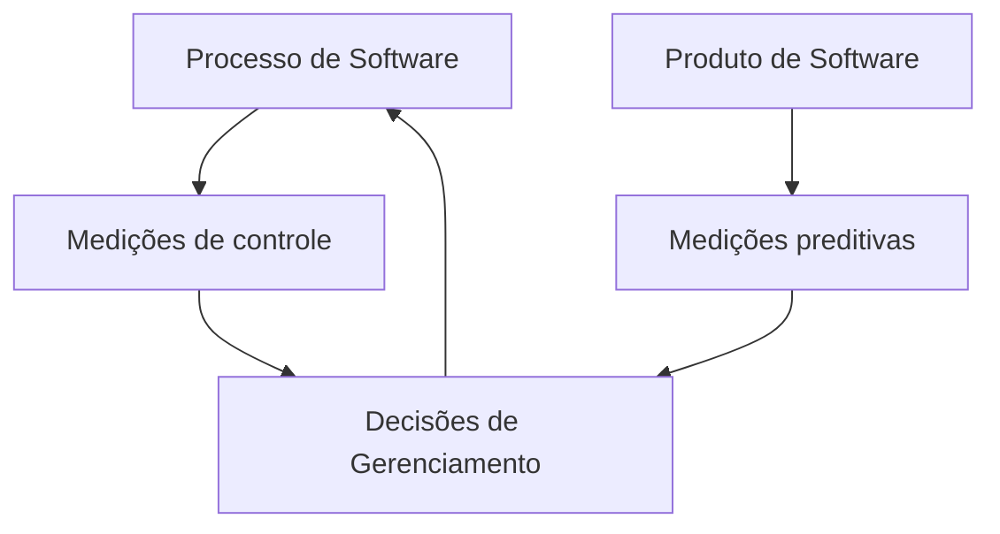
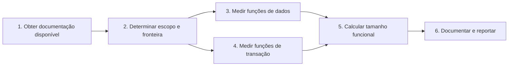
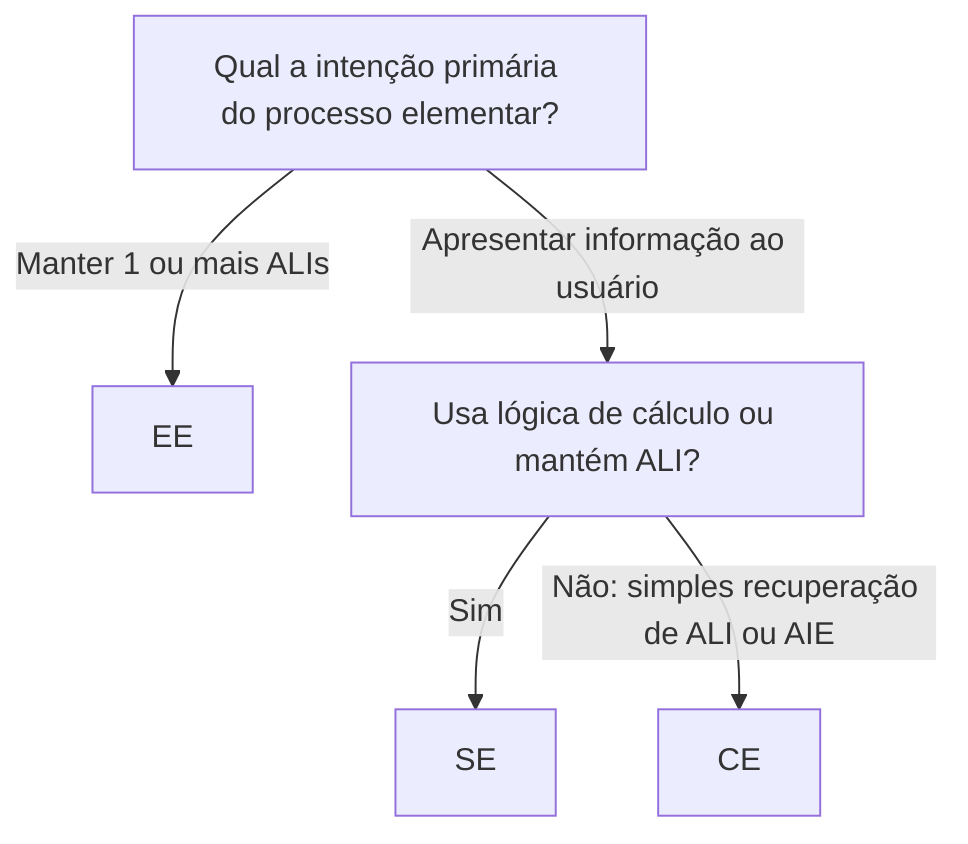
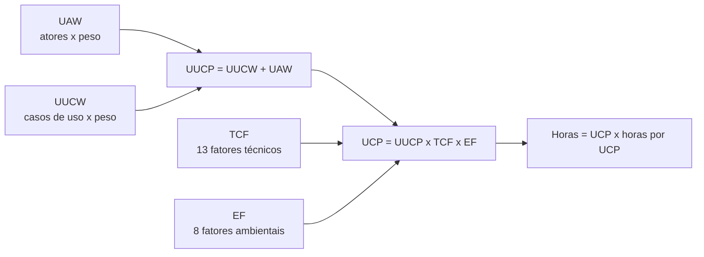

---

materia: Qualidade de Software 
fonte: Unidade_2_.pdf 
tags:

- resumo
- metricas
- pontos-de-funcao
- estimativas

---
# 📝 Métricas de Software e Estimativas

## 👁️ Visão geral

A unidade responde a duas perguntas: **como medir** software (métricas de produto, processo e projeto; LOC × pontos de função) e **como estimar** esforço, prazo e custo antes de construir. O centro da aula é a **Análise de Pontos de Função (APF/IFPUG)**, com as contagens rápidas da **NESMA**. Em volta dela vêm três outros modelos de estimativa: **COCOMO** (a partir de linhas de código), **Planning Poker** (ágil, relativo) e **Pontos de Caso de Uso** (a partir de atores e casos de uso). Continua a [[Fundamentos e Modelos de Qualidade de Software]]: lá vimos que requisito vago não é verificável; aqui vemos como transformar qualidade em número.

## 🧭 Antes de começar: processos de software

- **Nenhum processo é bala de prata.**
- Processo ajuda a **não cometer certos "grandes erros"**.
- Processos **não são adotados 100% igual ao manual**: **bom senso** e **experimentação** são importantes.

> [!quote] Fred Brooks "A parte mais difícil da construção de um software é a definição do que se deve construir."

### CMMI × ISO/IEC 12207

Os processos podem ser agrupados por natureza, objetivos e forma de aplicação:

|Modelo|Como organiza os processos|
|:--|:--|
|**CMMI**|**4 áreas**: Gerência de processos, Gerência de projetos, Engenharia, Suporte|
|**ISO/IEC 12207**|**3 grupos**: Fundamentais, De apoio, Organizacionais|

> [!info] CMMI — Modelo de Maturidade de Capacidades Integrado Modelo para **melhorar processos organizacionais** (desenvolvimento de software e serviços). Define **cinco níveis de maturidade**, dos processos **iniciais e desorganizados** até processos **bem definidos, controlados por dados e focados em melhoria contínua**. Objetivo: melhorar **eficiência, qualidade e controle** dos projetos, com **evolução gradual** baseada em **boas práticas e medições**.

|Processos de Engenharia de Software sob o CMMI|Processos de Apoio segundo a ISO 12207|
|:--|:--|
|Planejamento e Acompanhamento de Projetos|Documentação|
|Gerenciamento de Requisitos|Gerência de configuração|
|Gerenciamento de Configuração|**Garantia de qualidade**|
|Gerenciamento de Subcontratados|**Verificação**|
|Medição e Análise|**Validação**|
|**Garantia da Qualidade do Processo e do Produto**|**Revisão**|
||**Auditoria**|
||Resolução de problemas|

Os itens em negrito são os ligados diretamente à qualidade. Note que **Medição e Análise** é um processo do CMMI, o que justifica o resto da unidade.

## 📏 Por que medir

### Motivação: requisito não funcional precisa de número

**Usabilidade** (estética da interface): "o grau que a interface do usuário permite **interação agradável e satisfatória** para o usuário" (ISO, 2011, p. 12).

Como especificar isso? "A interface deve ser **muito** agradável para o usuário." Mas o que é muito, pouco, médio? ==A engenharia de software trabalha com **avaliação quantitativa**==: é preciso um número para dizer "atingiu", "não atingiu" ou "não atingiu o bom", e então tomar ações de melhoria.

### O que medir e para quê

Mede-se **produto, processo e projeto**:

- Métricas de **projeto**: usadas pelo **gerente de projeto para acompanhar as atividades**.
- Métricas de **processo**: usadas para **melhoria do processo**.

**Motivos para medir:**

1. Avaliar a **qualidade** do software
2. Descobrir e corrigir **problemas potenciais**
3. Ajudar a **estimar esforço**
4. **Controlar o andamento** do processo

### Definições de métrica

> [!info] Definição — IEEE (1990, p. 130) Métrica é a "**medida quantitativa do grau** que um sistema, componente ou processo **possui um determinado atributo**".

- É uma **forma quantitativa de avaliar a qualidade**.
- Métricas são usadas como **indicadores**: ajudam na **tomada de decisão**.
- Outra definição do material: métrica é um **indicador de um atributo** (ou conjunto de atributos, isto é, propriedades ou características) **de uma entidade** (**produto, processo ou recursos**), para obter uma **medida comparativa**.

**Exemplos de métricas:**

- Tamanho do produto (número de artefatos, linhas de código, tabelas, componentes)
- Número de pessoas necessárias para desenvolver o produto
- Número de defeitos encontrados em cada fase de desenvolvimento
- Esforço, tempo e custo para realizar uma tarefa
- Grau de satisfação do cliente (adequação ao propósito, conformidade com a especificação)

### Características de uma boa métrica

|#|Característica|Por quê|
|:-:|:--|:--|
|1|**Facilidade de cálculo**|Métrica muito complexa perde a praticidade|
|2|**Intuitiva**|Precisa ser facilmente compreendida, senão não é usada|
|3|**Não ambígua**|Deixa claro o que é bom e o que é ruim|
|4|**Consistência nas unidades**|Unidades e dimensões claras|
|5|**Independente de linguagem de programação**|Não deve depender da linguagem usada|
|6|**Útil**|Fornece informação útil sobre a qualidade do software|

> [!quote] Duas frases da aula "Não se pode gerenciar aquilo que não se pode medir." — **Tom DeMarco** "Se você não sabe para onde quer ir, você pode seguir qualquer caminho. Se você não sabe onde está, um mapa também não vai ajudá-lo." — **Roger Pressman**

### Os 4 objetivos da medição (Humphrey)

|Objetivo|Métricas servem para...|
|:--|:--|
|**Entender**|Entender o comportamento e funcionamento de processos, produtos e serviços de software|
|**Avaliar**|Tomar decisões e **estabelecer padrões, metas e critérios de aceitação**|
|**Controlar**|Controlar processos, produtos e serviços de software|
|**Prever**|**Prever valores de atributos**|

### Métricas de controle × métricas preditivas

_Recriado do slide 13: controle vem do processo, predição vem do produto, e as duas alimentam as decisões de gerenciamento, que voltam a atuar sobre o processo._

## 📦 Métricas do Produto

- Ajudam a **prever características de qualidade do produto** (métricas de **previsão**).
- Nem sempre dá para medir diretamente uma característica de qualidade. **Eficiência de execução** dá (comportamento no tempo), mas como medir **manutenibilidade** ou **usabilidade**? É preciso **relacionar a característica a propriedades que possam ser medidas**.

> [!example] Exemplo do material **Manutenibilidade → analisabilidade**, medida indiretamente por **número de linhas de código** e **número de filhos de uma classe**.

|Tipo|Definição|Exemplo|
|:--|:--|:--|
|**Métrica estática**|Analisada **sem executar** o software|Número de linhas de código|
|**Métrica dinâmica**|**Precisa executar** o software|Tempo de execução, memória utilizada|

## 🔢 Métricas Orientadas ao Tamanho (LOC)

|Projeto|Esforço|$|KLOC|Págs. doc.|Erros|Equipe|
|:--|:-:|:-:|:-:|:-:|:-:|:-:|
|projA-01|24|168|12.1|365|29|3|
|projB-04|62|440|27.2|1224|86|5|
|projC-03|43|314|20.2|1050|64|6|

**Métricas derivadas** (normalizadas pelo tamanho):

|Métrica|Fórmula|
|:--|:--|
|Produtividade|KLOC / pessoas-mês|
|Qualidade|erros / KLOC|
|Custo|$ / LOC|
|Documentação|págs. doc. / KLOC|

- **Esforço**: forma de criar um planejamento com **previsibilidade de tempo, custo, mão de obra** e outros fatores. Medido em **pessoas-mês**.
- **KLOC** (_Kilo Lines of Code_): **mil linhas de código**; a quantidade esperada de linhas a desenvolver, na ordem de milhares.

> [!example] Aplicando ao projA-01 (cálculo meu)
> 
> - Produtividade = 12,1 / 24 ≈ **0,50 KLOC/pessoa-mês**
> - Qualidade = 29 / 12,1 ≈ **2,40 erros/KLOC**
> - Documentação = 365 / 12,1 ≈ **30,2 págs./KLOC**
> - Custo = 168.000 / 12.100 ≈ **US$ 13,88/LOC**, considerando o $ em milhares.
> 
> _Contexto externo:_ o slide não informa a unidade do $. Na tabela original de Pressman, esforço está em pessoas-mês e custo em milhares de dólares.

### A métrica linha de código

|Vantagens|Problemas|
|:--|:--|
|**Fácil de medir**|**Dependente da linguagem** de programação|
|Muitos trabalhos sobre o assunto|==Produtividade com LOC **penaliza bons designs**==|
|Permite **normalizar** outras métricas (erros por KLOC, custo por KLOC)|O uso é **discutível**|

> [!tip] Por que LOC penaliza bom design Um programador que resolve o problema em 200 linhas limpas parece "menos produtivo" que outro que escreve 800 linhas repetidas para a mesma função. E LOC fere a característica nº 5 de uma boa métrica (independência de linguagem).

## 🧩 Métricas Orientadas à Funcionalidade

Indicam **quanto o software se adequa às exigências implícitas do cliente**. Objetivos: fornecer **medidas constantes** e medir a **funcionalidade que o usuário solicita ou recebe**.

|Vantagens|Desvantagens|
|:--|:--|
|**Menor dependência de tecnologias**|Cálculo tem **grau de subjetividade**|
|Baseadas em dados mais fáceis de observar e entender pelos usuários durante o projeto|Baseadas em **requisitos usualmente instáveis**|
||**Não é medida direta**, é apenas uma referência|

### Pontos de função

Os **pontos de função (PF)** medem o **tamanho funcional do software durante a análise de requisitos**, ==**antes** de ele ser implementado==. Com eles é possível **estimar tempo e custo** de desenvolvimento, **produtividade** e **prever a qualidade**.

- **Usos**: apoiar análises de produtividade e qualidade; estimar custos e recursos; prever o número de erros em testes; predizer o número de componentes ou linhas de código.
- **Baseado na medição de**: **transações** (funções transacionais) e **dados necessários** (funções de dados).

### Métodos de medição funcional

|ISO/IEC Functional Sizing Methods|Outros métodos|
|:--|:--|
|COSMIC (ISO/IEC 19761)|Story Points (SP), em projetos ágeis|
|**IFPUG (ISO/IEC 20926)**|Use Case Points (UCP)|
|Mark II (ISO/IEC 20968)|Complexity Points|
|**NESMA (ISO/IEC 24570)**|IBRA Points|
|FiSMA (ISO/IEC 29881)|Fast Function Points (FFPA), da Gartner|

IFPUG e NESMA estão destacados no slide: são os dois usados no resto da aula.

## 🧮 Análise de Pontos de Função (APF / IFPUG)

### O que é

- **APF** é um método para **medir o tamanho funcional** de um software **a partir da visão do usuário**.
- **Ponto de função** é a **unidade de medida**; objetivo: tornar a medição **independente da tecnologia**. ==A APF mede **o que o software faz**, não **como foi construído**.==
- Mede a funcionalidade que o software fornece ao usuário, primordialmente com base no **projeto lógico**.

Objetivos da APF: medir (1) a funcionalidade implementada que o usuário **solicita e recebe**; (2) a funcionalidade impactada pelo **desenvolvimento, melhoria e manutenção**, independentemente da tecnologia.

### Fronteira e usuário

A **fronteira da aplicação** é uma **interface conceitual** entre o software medido e seus usuários. Ela:

- define o que é **externo** à aplicação;
- atua como uma **"membrana"** pela qual os dados das transações (**EEs, SEs, CEs**) entram e saem;
- **envolve** os dados lógicos **mantidos** pela aplicação (**ALIs**);
- ajuda a identificar os dados **referenciados mas não mantidos** (**AIEs**).

**Usuário** é **qualquer pessoa ou coisa** que se comunica com o software: hardware, outras aplicações, outros sistemas. Se usuário fosse só pessoa, não daria para medir PF de sistemas sem interface gráfica.

### Os 6 passos da contagem

_Recriado do slide 21: dados e transações são medidos em paralelo e, a partir dos dois, calcula-se o tamanho funcional._

### Os 5 tipos de função

|Grupo|Sigla PT|Sigla EN|Definição|Exemplos|
|:--|:--|:--|:--|:--|
|Dados|**ALI** — Arquivo Lógico Interno|ILF|Dados que **o próprio software gerencia e mantém** (dentro da fronteira)|Pedido, Venda, Produto numa loja|
|Dados|**AIE** — Arquivo de Interface Externa|EIF|Dados **referenciados** pela aplicação, mas **mantidos por outra**|Cliente mantido pelo CRM|
|Transação|**EE** — Entrada Externa|EI|Recebe dados de fora para **manter/alterar** informações internas|Inclusão de clientes, alteração de cadastro|
|Transação|**SE** — Saída Externa|EO|Envia dados para fora **com processamento adicional** além da simples consulta|Relatórios, transferência de dados, faturas|
|Transação|**CE** — Consulta Externa|EQ|Envia dados para fora **principalmente para exibir** ao usuário|Consultas a cadastros, telas de login, menus|

> [!example] Loja virtual (slide 22) Pedido, Venda, Categoria e Produto são mantidos pela loja → **ALIs**. Cliente é cuidado por um sistema separado, o **CRM** → para a loja, é **AIE**.

### Exemplo completo: Sistema de Controle de Pedidos

![[apf-exemplo-sistema-controle-pedidos-funcoes.png]] _Escopo de contagem = Sistema de Controle de Pedidos. À direita, a classificação de todas as funções de dados e de transação._

|Tipo|Qtd|Funções|
|:--|:-:|:--|
|**ALI**|3|Pedidos, Carrinho, Clientes|
|**AIE**|2|Produtos, Estoque (mantidos pelo Sistema de Controle de Estoque)|
|**EE**|6|Inclusão de novo Cliente; Alteração de dados do Cliente; Inclusão de Produto no Carrinho; Alteração de Produto no Carrinho; Fechamento de Pedido; Cancelamento de Pedido|
|**SE**|5|Emissão de Fatura/NFe para Cliente; Envio de NFe para SEFAZ; Envio de pedido para Logística; Envio de pedido para Estoque; Pedido de fornecimento|
|**CE**|3|Consulta do Pedido; Consulta dados do Produto; Consulta posição de estoque|

Esses números são reutilizados nas contagens indicativa e estimada, mais abaixo.

### Passo 1: Reunir a documentação

Documentação útil: documentos de requisitos, diagrama de entidades, modelos de objetos, modelos de dados, layouts de arquivos, exemplos de relatórios e telas, demonstração da aplicação, especialistas/usuários, guia do usuário e manuais, especificações funcionais, casos de uso.

### Passo 2: Escopo, fronteira e propósito

|Conceito|Definição|
|:--|:--|
|**Escopo**|O (sub)conjunto do software medido: **quais funções entram** na medida|
|**Fronteira**|Interface conceitual entre a aplicação e seus usuários (a "membrana")|
|**Propósito da contagem**|Parágrafo que diz **por que** se está medindo. Ex.: medir o desenvolvimento de um novo software|

**Tipos de contagem:**

|Tipo|O que inclui|
|:--|:--|
|**Projeto de desenvolvimento**|Todas as funções impactadas pelas atividades do projeto|
|**Projeto de melhoria**|Todas as funções **incluídas, alteradas e excluídas**|
|**Aplicação**|Todas as funções da aplicação ou, se solicitado, só o que o usuário utiliza (caso de aplicação pronta de mercado)|

### Passo 3: Funções de dados

Procedimento: (1) **identificar** as funções de dados; (2) **classificar** cada uma como ALI ou AIE; (3) determinar a **complexidade** e a **contribuição** em PF.

A complexidade depende de dois números:

> [!info] RLR — Registro Lógico Referenciado / Tipo de Registro Elementar **Subgrupo de dados dentro de uma função de dados.**
> 
> - Conte **pelo menos 1 RLR** por função de dados.
> - Conte **1 RLR adicional** para cada subgrupo do RLR principal.
> - Conte **1 RLR adicional** para cada subtipo além do principal.

> [!example] RLR — Funcionário mensalista/diarista Numa aplicação de RH, Funcionário pode ser Mensalista ou Diarista. Em classes seriam 3 (superclasse + 2 subclasses), mas conta-se **1 ALI** (Funcionário) com **3 RLRs**: Funcionário (padrão), Funcionário Mensalista e Funcionário Diarista.

> [!info] DER — Dado Elementar Referenciado / Tipo de Dado Elementar **Campo único (na visão do usuário) e não repetido.**
> 
> - Em **ALI**: 1 DER por campo único, reconhecido pelo usuário, **mantido ou recuperado**.
> - Em **AIE**: 1 DER por campo único, reconhecido pelo usuário, **recuperado**.

> [!example] DER depende da visão do usuário
> 
> - Endereço: a aplicação A usa rua, cidade, estado e CEP → **4 DERs**; a aplicação B trata o endereço como um bloco → **1 DER**.
> - Data: dia, mês e ano → **3 DERs**; ou **1 DER** se os três sempre são manipulados juntos.
> - ALI com CPF, Nome, Rua, Caixa Postal, Cidade, Estado e CEP → **7 DERs**; outra aplicação que só usa Nome, Cidade e Estado → **3 DERs**.

**Dicas para decidir se é ALI, AIE ou nada:**

- Um ALI/AIE usado em vários processos é **contado uma única vez**.
- O mesmo arquivo lógico **não pode ser ALI e AIE** na mesma aplicação.
- ==Arquivo físico, tabela ou classe **não equivale automaticamente** a um arquivo lógico==.
- **Quem mantém os dados?** A aplicação sendo contada → **ALI**. Outra aplicação, eu só utilizo → **AIE**.

### Passo 4: Funções de transação

Cada função de transação (EE/SE/CE) deve ser um **processo elementar**, e cada processo elementar deve conter **pelo menos uma lógica de processamento**.

Procedimento: (1) identificar cada processo elementar; (2) determinar os processos elementares **únicos**; (3) classificar como EE, SE ou CE; (4) determinar a complexidade e a contribuição.

**Processo elementar** é a **menor unidade de atividade** que:

|Regra|Significado|
|:--|:--|
|Tem **significado para o usuário**|Foi solicitado por ele|
|Constitui uma **transação completa**|Tem início, meio e fim|
|É **autocontido**|Todo o processamento interno é executado (cálculos, consistências, atualizações)|
|Deixa o negócio num **estado consistente**|Completa todas as solicitações; o requisito foi atendido e não há mais nada a fazer|

**Processos elementares únicos**: um processo que aparece várias vezes é contado **uma vez só**. Dois processos são iguais se exigem o **mesmo grupo de DERs**, o **mesmo grupo de ALRs** e executam o **mesmo grupo de lógicas de processamento**.

**Classificação pela intenção primária:**

_Criado a partir do slide "Passo 4.3"._

A complexidade de uma transação também depende de dois números:

- **ALR — Arquivo Lógico Referenciado**: função de dados **lida e/ou mantida** pela transação. Conte 1 ALR para cada função de dados acessada.
- **DER** na transação:
    - 1 DER para cada campo único, reconhecido pelo usuário, apresentado na transação;
    - ==**+1 DER** pela capacidade de enviar **mensagem de erro/atenção**== (independente de quantas mensagens);
    - ==**+1 DER** pela capacidade de **executar a ação**== (ex.: o botão "Salvar").

### Tabelas de complexidade e contribuição

Na tabela do material, **TR** = tipos de registro (= RLR), **TD** = tipos de dado (= DER) e **AR** = arquivos referenciados (= ALR).

**ALI e AIE** (linhas = RLR, colunas = DER):

|RLR \ DER|< 20|20–50|> 50|
|:-:|:-:|:-:|:-:|
|**1**|Baixa|Baixa|Média|
|**2–5**|Baixa|Média|Alta|
|**> 5**|Média|Alta|Alta|

**EE** (linhas = ALR, colunas = DER):

|ALR \ DER|< 5|5–15|> 15|
|:-:|:-:|:-:|:-:|
|**< 2**|Baixa|Baixa|Média|
|**2**|Baixa|Média|Alta|
|**> 2**|Média|Alta|Alta|

**SE e CE** (linhas = ALR, colunas = DER):

|ALR \ DER|< 6|6–19|> 19|
|:-:|:-:|:-:|:-:|
|**< 2***|Baixa|Baixa|Média|
|**2–3**|Baixa|Média|Alta|
|**> 3**|Média|Alta|Alta|

* A **CE deve referenciar ao menos 1 ALI ou AIE**.

**Contribuição em PF:**

|Tipo|Baixa|Média|Alta|
|:--|:-:|:-:|:-:|
|**ALI**|7|10|15|
|**AIE**|5|7|10|
|**EE**|3|4|6|
|**SE**|4|5|7|
|**CE**|3|4|6|

> [!tip] Macete da tabela de contribuição ALI é o que mais pesa (7-10-15). AIE vale 5-7-10. **EE e CE são idênticas** (3-4-6); **SE é 1 ponto acima** delas (4-5-7), porque tem processamento adicional.

> [!example] Passo 3 aplicado — cadastro de clientes Requisitos: manter **52 informações** do cliente em **4 tipos de registro** (cliente, restrições, contatos, bens); cada transação grava **10 informações** num **Log**; recuperar **22 informações** de restrições do cliente na **Receita Federal**, incluindo o CPF; recuperar o endereço a partir do **CEP** (10 informações, além do CEP).
> 
> |Função|Tipo|RLR|DER|Complexidade|PF|
> |:--|:-:|:-:|:-:|:-:|:-:|
> |Cliente|ALI|4|52|Alta (2–5 RLR, > 50 DER)|15|
> |Log|ALI|1|10|Baixa (1 RLR, < 20 DER)|7|
> |Restrições do CPF|AIE|1|22|Baixa (1 RLR, 20–50 DER)|5|
> |CEP|AIE|1|10|Baixa (1 RLR, < 20 DER)|5|
> |**Total**|||||**32 PF**|
> 
> Log e Cliente são **ALI** porque a própria aplicação os mantém. Receita Federal e base de CEP são mantidas por outros sistemas → **AIE**.

> [!example] Passo 4 aplicado — mesmas regras
> 
> |Transação|Tipo|ALR|DER|Complexidade|PF|
> |:--|:-:|:-:|:-:|:-:|:-:|
> |Cadastrar Cliente|EE|4|54|Alta (> 2 ALR, > 15 DER)|6|
> |Consultar Log|CE|1|12|Baixa (< 2 ALR, 6–19 DER)|3|
> |**Total**|||||**9 PF**|
> 
> _Minha leitura dos números:_ 54 DERs = 52 campos do cliente **+1 mensagem +1 ação**; 12 DERs = 10 campos do log **+1 +1**. Os 4 ALRs são Cliente, Log, Restrições do CPF e CEP. O slide escreve "1 RLR" na consulta, mas em transação o termo correto é **ALR**.

### Passo 5: Calcular o tamanho funcional

|Tipo de contagem|Fórmula|Siglas|
|:--|:--|:--|
|**Projeto de desenvolvimento**|$DFP = ADD + CFP$|ADD = funções entregues ao usuário; CFP = funcionalidades de **conversão**|
|**Aplicação**|$AFP = ADD$|ADD = funções entregues|
|**Projeto de melhoria**|$EFP = ADD + CHGA + CFP + DEL$|ADD = incluídas; CHGA = alteradas (após a implementação); CFP = conversão; DEL = **excluídas**|

> [!example] Exemplos do material
> 
> - **Desenvolvimento**: dados 32 PF, transações 97 PF, conversão 3 PF → ADD = 32 + 97 = 129; DFP = 129 + 3 = **132 PF**.
> - **Aplicação** (a mesma, já entregue): AFP = ADD = 32 + 97 = **129 PF**. A conversão some porque roda só uma vez, durante a implantação.
> - **Melhoria**: adicionadas 5 + 15 = 20; alteradas 7 + 23 = 30; conversão 3; excluídas 5 + 5 = 10 → EFP = 20 + 30 + 3 + 10 = **63 PF**.

> [!warning] Cuidado No projeto de melhoria as funções **excluídas também somam** (DEL entra com sinal **+**): excluir dá trabalho e é cobrado.

### Passo 6: Documentar e reportar

|Nível|O que a documentação contém|
|:--|:--|
|**Simples**|Resultado da contagem; lista de funções de dados e de transação com a complexidade; data da contagem|
|**Média**|+ propósito e tipo da contagem; escopo e fronteira; detalhamento dos RLRs/ALRs e DERs de cada função|
|**Complexa**|+ diagrama da fronteira e das principais funcionalidades; imagem de cada transação (tela, relatório, layout de arquivo)|

### Pontos de função ajustados

A contagem até aqui dá os **PF brutos** (não ajustados). Para ajustar pela complexidade do sistema, pontua-se cada um dos **14 fatores de influência** (Características Gerais do Sistema, CGS) de **0 a 5**:

|0|1|2|3|4|5|
|:-:|:-:|:-:|:-:|:-:|:-:|
|nenhuma|pouca|moderada|média|significante|essencial|

|#|Fator|#|Fator|
|:-:|:--|:-:|:--|
|1|Comunicação de Dados|8|Atualização On-line|
|2|Processamento Distribuído|9|Complexidade de Processamento|
|3|Performance ou Desempenho|10|Reusabilidade|
|4|Configuração Altamente Utilizada|11|Facilidade de Instalação|
|5|Volume de Transações|12|Facilidade de Operação|
|6|Entrada de Dados On-line|13|Múltiplos Locais|
|7|Eficiência do Usuário Final|14|Facilidade de Mudança|

$$PF_{ajustados} = PF_{brutos} \times \left(0{,}65 + 0{,}01 \times \sum_{i=1}^{14} F_i\right)$$

onde $F_i$ = nota (0 a 5) de cada um dos 14 fatores, e $PF_{brutos}$ pode ser **DFP, AFP ou EFP**. Como $\sum F_i$ vai de 0 a 70, o fator de ajuste vai de **0,65 a 1,35** (±35%).

> [!example] Como pontuar um fator (Cartão de Referência da FATTO)
> 
> |Nota|CGS 01 — Comunicação de Dados|CGS 02 — Processamento Distribuído|
> |:-:|:--|:--|
> |0|Puramente batch ou estação de trabalho isolada|Não participa de transferência de dados ou processamento entre componentes|
> |1|Batch, com entrada de dados **ou** impressão remota|Dados preparados e transferidos para outro componente, **para** processamento pelo usuário|
> |2|Batch, com entrada de dados **e** impressão remota|Dados preparados e transferidos, **não** para processamento pelo usuário|
> |3|Coleta de dados on-line, front-end de teleprocessamento para batch ou consulta|Processamento distribuído e transferência on-line em **apenas uma** direção|
> |4|Mais que front-end, mas suporta **um** tipo de protocolo|On-line em **ambas** as direções|
> |5|Mais que front-end e suporta **mais de um** tipo de protocolo|On-line e executado dinamicamente no componente mais apropriado|

> [!example] Ajuste aplicado (exemplo criado por mim) Aplicação do exercício da aula (81 PF brutos) com soma dos 14 fatores = 40: $PF_{ajustados} = 81 \times (0{,}65 + 0{,}40) = 81 \times 1{,}05 = 85{,}05$ PF. Se a soma fosse 35, o fator seria exatamente 1,00 e o ajuste não mudaria nada.

## 🎯 Abordagem NESMA: contagens indicativa, estimada e detalhada

A **NESMA** (nesma.org) é uma organização **sem fins lucrativos, sediada na Holanda**, que promove a análise de pontos de função. Para projetos de **desenvolvimento e aplicação**, as diferenças entre NESMA e IFPUG são **pequenas**; para projetos de **melhoria**, as abordagens são **bem diferentes**.

|Contagem|Quando usar|Como conta|
|:--|:--|:--|
|**Indicativa**|Início do projeto, conhecimento mínimo|**Só funções de dados**: cada ALI vale **35** PF e cada AIE vale **15** PF|
|**Estimada**|Fase inicial, mas **já se conhece** processo, requisitos e funcionalidades|Identifica **todas** as funções; ==**ALI e AIE = Baixa**, **EE, SE e CE = Média**==|
|**Detalhada**|Requisitos detalhados|Complexidade real de cada função (RLR/ALR e DER), os passos 3 e 4 do IFPUG|

> [!info] Contexto externo O material mostra a indicativa só pela fórmula. Ela ignora as transações porque os pesos 35 e 15 já embutem, em média, as transações que costumam existir em torno de cada arquivo lógico.

A estimada dá uma visão **mais abrangente que a indicativa**, mas ainda **sem entrar na complexidade de cada função**. Pesos usados na estimada: **ALI 7, AIE 5, EE 4, SE 5, CE 4**.

> [!example] As duas contagens no Sistema de Controle de Pedidos Funções: 3 ALI, 2 AIE, 6 EE, 5 SE, 3 CE.
> 
> - **Indicativa**: $PF = 3 \times 35 + 2 \times 15 = 105 + 30 = 135$ PF (as transações são ignoradas).
> - **Estimada**: $PF = 3 \times 7 + 2 \times 5 + 6 \times 4 + 5 \times 5 + 3 \times 4 = 21 + 10 + 24 + 25 + 12 = 92$ PF.

## 📉 Margem de erro das estimativas

![[estimativas-margem-de-erro-conhecimento-sistema-grafico.png|550]] _Ao longo das fases (Requisitos → Conceitual → Detalhado → Codificação → Testes → Implantação), o conhecimento do sistema sobe e a margem de erro das estimativas cai._

1. **Início (Requisitos e Conceitual)**: conhecimento **baixo**, margem de erro **muito alta**; as informações são imprecisas.
2. **Meio (Detalhamento, Codificação e Testes)**: o conhecimento cresce e a margem de erro **diminui**.
3. **Fim (Implantação)**: conhecimento bem estabelecido, estimativas mais precisas, margem de erro **mínima**.

É por isso que existem contagens com níveis diferentes de detalhe: no começo só dá para fazer a indicativa; a detalhada exige conhecimento que só aparece depois.

## 🏗️ COCOMO (Constructive Cost Model)

Modelo para calcular de forma prática e rápida o **Esforço**, o **Prazo**, o **Tamanho** aproximado da equipe e a **Produtividade** esperada, **a partir do tamanho em KLOC**.

### Os 3 modos (tipos de projeto)

|Modo|Complexidade|Características|Exemplo|
|:--|:--|:--|:--|
|**Orgânico**|Baixa|Equipe **pequena** de bons profissionais com certa experiência; requisitos **não tão rígidos**||
|**Semi-destacado**|Média|Tamanho e complexidade **intermediários**; combinação de requisitos **rígidos e não rígidos**||
|**Embutido**|Alta|Projetos **grandes**, com conjunto **rígido de restrições operacionais** de hardware e software|Sistema de **controle de voo**|

### Os 3 estágios (nível de detalhe)

|Estágio|Como estima|Quando usar|
|:--|:--|:--|
|**Básico**|Esforço é função **só do número de linhas de código** e de constantes fixas, sem ajuste|Softwares de tamanho **pequeno ou médio**|
|**Intermediário**|Refina o básico com **15 fatores de ajustamento** de esforço e custo (atributos do produto e/ou do projeto)|Quando há **maior maturidade** em projetos|
|**Detalhado**|Avalia o efeito de cada um dos **15 fatores sobre cada etapa** do processo; o software é dividido em **módulos e etapas** (planejamento, requisitos, codificação, testes, integração)|Análise combinada de esforço e custo por fase|

Exemplos de **atributos direcionadores de custo** do modelo intermediário (destacados no slide): ==**práticas de programação modernas**, **tamanho da base de dados** e **nível de aptidão dos programadores**==.

### Fórmulas

$$Esforço = a_1 \times (KLOC)^{a_2} \quad \text{(pessoas-mês)}$$ $$Prazo = b_1 \times (Esforço)^{b_2} \quad \text{(meses)}$$ $$Equipe = \frac{Esforço}{Prazo} \quad \text{(pessoas)} \qquad Produtividade = \frac{KLOC}{Esforço} \quad \text{(KLOC / pessoa-mês)}$$

|Coeficiente|Orgânico|Semi-destacado|Embutido|
|:-:|:-:|:-:|:-:|
|$a_1$|2,4|3,0|3,6|
|$a_2$|1,05|1,12|1,2|
|$b_1$|2,5|2,5|2,5|
|$b_2$|0,38|0,35|0,32|

No **COCOMO intermediário**, só a fórmula do esforço muda: multiplica-se pelo **EAF** (_Effort Adjustment Factor_, Fator de Ajustamento do Esforço):

$$Esforço = a_1 \times (KLOC)^{a_2} \times EAF$$

O prazo continua $b_1 \times (Esforço)^{b_2}$, mas usando o esforço **já ajustado**. O material indica uma calculadora da NASA: strs.grc.nasa.gov/repositor/forms/cocomo-calculation/.

> [!tip] Macete dos coeficientes $a_1$ sobe de 0,6 em 0,6 (2,4 → 3,0 → 3,6). $b_1$ é **sempre 2,5**. $b_2$ **cai** (0,38 → 0,35 → 0,32). Quanto mais complexo o modo, maior o esforço.

> [!example] Exemplo do material — semi-destacado, 8.700 linhas, EAF = 1,18 KLOC = 8,7. EAF = 1,18 significa **18% a mais de esforço**.
> 
> ||COCOMO Básico|COCOMO Intermediário|
> |:--|:--|:--|
> |Esforço|$3{,}0 \times 8{,}7^{1,12} = 33{,}84$ ≅ 34 pessoas-mês|$3{,}0 \times 8{,}7^{1,12} \times 1{,}18 = 39{,}93$ ≅ 40 pessoas-mês|
> |Prazo|$2{,}5 \times 33{,}84^{0,35} = 8{,}57$ meses|$2{,}5 \times 39{,}93^{0,35} = 9{,}08$ ≅ 9 meses|
> |Equipe|$33{,}84 / 8{,}57 = 3{,}95$ ≅ 4 pessoas|$39{,}93 / 9{,}08 = 4{,}39$ pessoas|
> |Produtividade|$8{,}7 / 33{,}84 = 0{,}26$ KLOC/pessoa-mês|$8{,}7 / 39{,}93 = 0{,}22$ KLOC/pessoa-mês|
> 
> O slide arredonda o prazo básico para "≅ 8,5 meses" e a equipe intermediária para "≅ 4,5 pessoas".

> [!example] Mesmo tamanho, modos diferentes (cálculo meu, COCOMO básico, 8,7 KLOC)
> 
> |Modo|Esforço|Prazo|Equipe|
> |:--|:-:|:-:|:-:|
> |Orgânico|23,27 pessoas-mês|8,27 meses|2,81 pessoas|
> |Semi-destacado|33,84 pessoas-mês|8,57 meses|3,95 pessoas|
> |Embutido|48,28 pessoas-mês|8,64 meses|5,58 pessoas|
> 
> O **prazo quase não muda**; o que cresce é o **esforço**, e por isso a **equipe** precisa ser maior.

## 🃏 Planning Poker

Técnica de **métodos ágeis** (Scrum, XP e outros) para estimar o **esforço relativo** das tarefas. Usa um baralho com uma sequência de **Fibonacci modificada**. Na Fibonacci, o 1º e o 2º termos são 1 e cada termo seguinte é a soma dos dois anteriores. As cartas indicam o grau relativo de esforço ou o número de horas da tarefa.

**Dinâmica:**

1. As **histórias de usuário** (ou épicos) são lidas para o time.
2. Cada um escolhe uma carta com base no seu entendimento.
3. ==As cartas são **exibidas por todos ao mesmo tempo**==.
4. Se houver discrepância, quem pontuou com cartas divergentes **explica** o porquê.
5. Repete-se até a pontuação **convergir** ou até esgotar um número X de rodadas combinado no início.

**História de usuário**: descrição concisa de uma necessidade do usuário, **sob o ponto de vista desse usuário**. Segue o modelo **PAPEL → FUNÇÃO → BENEFÍCIO**:

|Padrão 1|Padrão 2|
|:--|:--|
|Eu, enquanto **(QUEM?)**|COMO um **(tipo de usuário ou persona)**|
|Quero **(O QUÊ?)**|Eu QUERO **(ação a ser realizada)**|
|Para **(POR QUE?)**|PARA QUE **(benefício/valor adquirido)**|

Exemplo: "Eu, como cliente da empresa X, quero efetuar o login na intranet desenvolvida pela empresa, para acessar as funcionalidades da plataforma."

|Carta|Significado|
|:-:|:--|
|**0**|Item já completado ou tão pequeno que não vale estimar|
|**½**|Itens muito pequenos|
|**1, 2, 3**|Itens pequenos|
|**5, 8, 13**|Itens médios|
|**20, 40**|Itens grandes. Na maioria das equipes ágeis, itens **maiores que 13 são quebrados** em itens menores|
|**100**|Muito grande|
|**?**|Tão grande que não há como estimar|
|**☕**|O membro está pedindo uma pausa|

> [!warning] Erro no slide O texto do slide diz "5, 8, **9** — itens médios", mas o baralho da foto tem **13** (e não tem 9), e o próprio slide fala em "itens maiores que 13". O correto é **5, 8, 13**.

## 🎭 Pontos de Caso de Uso (UCP)

A métrica **UCP** estima o **tamanho e o esforço** de construção do software considerando a **complexidade dos casos de uso e dos atores**.

- Desenvolvida por **Gustav Karner em 1993**.
- É uma **extensão da Análise de Pontos de Função**.
- Intimamente ligada ao ciclo baseado em **UML e UP**.

**Método em 4 passos:**

1. Cada **ator** e cada **caso de uso** é classificado por complexidade e recebe um **peso**.
2. **Pontos sem ajuste** = somatório dos pesos de atores e casos de uso.
3. Ajuste por **13 fatores técnicos** e **8 fatores ambientais**.
4. O UCP é multiplicado por um **valor de produtividade** (horas por UCP).

_Criado a partir dos slides 76–86: o caminho completo do cálculo._

### Passo 1a: atores → UAW

|Tipo|Quem é|Peso|
|:--|:--|:-:|
|**Simples**|Sistema que se comunica por **interface bem definida** (ex.: API)|1|
|**Médio**|Sistema que se comunica por **protocolo** (TCP/IP, HTTP) ou **linha de comando**|2|
|**Complexo**|==**Pessoa** interagindo por **interface gráfica**==|3|

$$UAW = \sum (\text{atores} \times \text{peso})$$

Exemplo: $1 \times 1 + 2 \times 2 + 4 \times 3 = 1 + 4 + 12 = 17$.

### Passo 1b: casos de uso → UUCW

|Tipo|Transações|Peso|
|:--|:-:|:-:|
|**Simples**|≤ 3|5|
|**Médio**|≥ 4 e < 7|10|
|**Complexo**|≥ 7|15|

- **Transação**: conjunto de atividades que são executadas **inteiramente ou não**. O nº de transações pode ser determinado **contando o nº de passos** do caso de uso.
- Outros mecanismos de classificar a complexidade:

|Critério|Simples|Médio|Complexo|
|:--|:-:|:-:|:-:|
|Classes de análise|< 5|≥ 5 e < 10|≥ 10|
|Entidades do banco de dados|1 (e interface simples)|2|3 ou mais|

$$UUCW = \sum (\text{UC} \times \text{peso}) \qquad UUCP = UUCW + UAW$$

Exemplo: $8 \times 5 + 12 \times 10 + 4 \times 15 = 40 + 120 + 60 = 220$; UUCP = 220 + 17 = **237**.

### Passo 3a: fatores técnicos → TCF

Cada fator recebe **valor de 0 a 5**; multiplica-se pelo peso.

|Fator|Descrição|Peso|Valor|Peso × Valor|
|:--|:--|:-:|:-:|:-:|
|T1|Sistema distribuído|2|0|0|
|T2|Tempo de resposta|1|3|3|
|T3|Eficiência para o usuário|1|5|5|
|T4|Complexidade de processamento|1|1|1|
|T5|Reuso|1|0|0|
|T6|Fácil de instalar|0,5|5|2,5|
|T7|Fácil de usar|0,5|5|2,5|
|T8|Portável|2|0|0|
|T9|Fácil de mudar|1|4|4|
|T10|Concorrência|1|0|0|
|T11|Segurança|1|3|3|
|T12|Acesso direto|1|5|5|
|T13|Treinamento especial|1|1|1|
||||**TFactor**|**27**|

$$TFactor = \sum (\text{valor} \times \text{peso}) \qquad TCF = 0{,}6 + 0{,}01 \times TFactor$$

Exemplo: $TCF = 0{,}6 + 0{,}01 \times 27 = 0{,}87$.

### Passo 3b: fatores ambientais → EF

|Fator|Descrição|Peso|Valor|Peso × Valor|
|:--|:--|:-:|:-:|:-:|
|E1|Familiaridade com o modelo usado|1,5|1|1,5|
|E2|Experiência na aplicação|0,5|4|2|
|E3|Experiência OO|1|1|1|
|E4|Capacidade do analista|0,5|5|2,5|
|E5|Motivação|1|5|5|
|E6|Requisitos estáveis|2|2|4|
|E7|Equipe em tempo parcial|**−1**|3|−3|
|E8|Linguagem de programação|**−1**|1|−1|
||||**EFactor**|**12**|

$$EFactor = \sum (\text{valor} \times \text{peso}) \qquad EF = 1{,}4 + (-0{,}03 \times EFactor)$$

Exemplo: $EF = 1{,}4 - 0{,}03 \times 12 = 1{,}4 - 0{,}36 = 1{,}04$.

> [!warning] Cuidado Os slides dos fatores E1–E8 têm o título "Determinando Fatores **Técnicos**", mas esses são os **ambientais**. E7 e E8 têm **peso negativo**: equipe em tempo parcial e linguagem difícil **pioram** o ambiente.

### Passo 4: UCP e esforço

$$UCP = UUCP \times TCF \times EF$$

Exemplo: $UCP = 237 \times 0{,}87 \times 1{,}04 = 214{,}4376$.

**Karner sugeriu 20 horas-homem por UCP**: $214{,}4376 \times 20 = 4.288{,}752$ horas-homem.

A experiência prática mostra esforço na faixa de **15 a 30 horas-homem por UCP**. **Adaptação de Schneider e Winters**, conforme o slide:

1. Conte quantos fatores de **E1–E6 têm valor > 3**.
2. Conte quantos fatores de **E7–E8 têm valor < 3**.
3. Some as quantidades:

|Total|Horas-homem por UCP|
|:-:|:-:|
|≤ 2|20|
|> 2 e ≤ 4|28|
|> 4|36|

> [!example] Schneider e Winters aplicado ao exemplo (cálculo meu) E1–E6 > 3: E2 = 4, E4 = 5, E5 = 5 → **3**. E7–E8 < 3: E8 = 1 → **1**. Total = 4 → **28 h/UCP**. Esforço = 214,4376 × 28 ≈ **6.004,25 horas-homem** (contra 4.288,75 com os 20 h de Karner).

> [!info] Contexto externo — confira com o professor Na formulação mais citada de Schneider e Winters a contagem é a **inversa**: E1–E6 **abaixo** de 3 e E7–E8 **acima** de 3. Faz sentido: nota baixa em experiência/motivação e nota alta em tempo parcial/linguagem difícil indicam ambiente pior, que deveria **aumentar** as horas. Neste exemplo as duas leituras dão total 3 ou 4, ou seja, **28 h/UCP** de qualquer forma. Na prova, use a versão do slide, a menos que o professor diga o contrário.

## 🧮 Fórmulas

|Fórmula|Uso|
|:--|:--|
|Produtividade = KLOC / pessoas-mês; Qualidade = erros / KLOC; Custo = $ / LOC; Documentação = págs. / KLOC|Métricas derivadas orientadas ao tamanho|
|$PF_{brutos} = \sum (\text{qtd} \times \text{contribuição})$|Contagem detalhada IFPUG|
|$PF = 35 \times ALI + 15 \times AIE$|Contagem **indicativa** (NESMA)|
|$PF = 7 \times ALI + 5 \times AIE + 4 \times EE + 5 \times SE + 4 \times CE$|Contagem **estimada** (NESMA)|
|$DFP = ADD + CFP$|Projeto de desenvolvimento|
|$AFP = ADD$|Aplicação|
|$EFP = ADD + CHGA + CFP + DEL$|Projeto de melhoria|
|$PF_{ajust} = PF_{brutos} \times (0{,}65 + 0{,}01 \times \sum F_i)$|Ajuste por **14** fatores (0–5)|
|$Esforço = a_1 \times KLOC^{a_2}$ ($\times EAF$ no intermediário)|COCOMO, pessoas-mês|
|$Prazo = b_1 \times Esforço^{b_2}$|COCOMO, meses|
|$Equipe = Esforço / Prazo$; $Produtividade = KLOC / Esforço$|COCOMO|
|$UAW = \sum \text{atores} \times \text{peso}$ (1, 2, 3)|UCP|
|$UUCW = \sum \text{UC} \times \text{peso}$ (5, 10, 15); $UUCP = UUCW + UAW$|UCP|
|$TCF = 0{,}6 + 0{,}01 \times TFactor$|UCP, **13** fatores técnicos|
|$EF = 1{,}4 - 0{,}03 \times EFactor$|UCP, **8** fatores ambientais|
|$UCP = UUCP \times TCF \times EF$; horas = UCP × (20, 28 ou 36)|UCP|

## 📝 Questões

**1.** Tendo como base a tabela abaixo, que apresenta as quantidades de funções e os respectivos níveis de complexidade de uma aplicação, e utilizando a contagem detalhada de pontos de função com base na IFPUG, assinale a quantidade de pontos de função brutos dessa aplicação.

|Função|Quantidade|Complexidade|
|:--|:-:|:-:|
|ALI (arquivo lógico interno)|2|alta|
|AIE (arquivo de interface externa)|3|baixa|
|EE (entrada externa)|3|baixa|
|SE (saída externa)|3|média|
|CE (consulta externa)|2|alta|

A) 69 — B) 71 — C) 75 — D) 81

> [!success]- Resposta **D (81 PF).** Multiplica-se cada quantidade pela contribuição da sua complexidade:
> 
> |Função|Qtd|PF unitário|Total|
> |:--|:-:|:-:|:-:|
> |ALI alta|2|15|30|
> |AIE baixa|3|5|15|
> |EE baixa|3|3|9|
> |SE média|3|5|15|
> |CE alta|2|6|12|
> 
> $30 + 15 + 9 + 15 + 12 = 81$. São PF **brutos**: nenhum fator de ajuste é aplicado.

**2. (Treino, criada por mim)** Um ALI tem 3 RLRs e 25 DERs. Uma SE referencia 2 arquivos lógicos e apresenta 20 DERs. Quantos PF cada uma contribui?

> [!question]- Resposta (resolvida por mim, confira)
> 
> - ALI: 3 RLR está na faixa **2–5**; 25 DER está em **20–50** → **Média** → **10 PF**.
> - SE: 2 ALR está na faixa **2–3**; 20 DER é **> 19** → **Alta** → **7 PF**.

**3. (Treino, criada por mim)** Um projeto **embutido** tem 8.700 linhas de código. Pelo COCOMO básico, quais são o esforço, o prazo e a equipe?

> [!question]- Resposta (resolvida por mim, confira)
> 
> - Esforço = $3{,}6 \times 8{,}7^{1,2} \approx 48{,}28$ pessoas-mês
> - Prazo = $2{,}5 \times 48{,}28^{0,32} \approx 8{,}64$ meses
> - Equipe = $48{,}28 / 8{,}64 \approx 5{,}58$ pessoas (≅ 6)

**4. (Treino, criada por mim)** Um sistema tem 2 atores humanos usando interface gráfica e 1 sistema externo via API; 5 casos de uso com até 3 transações e 3 com 5 transações. Considere TCF = 1,0, EF = 1,0 e 20 h/UCP. Qual o esforço?

> [!question]- Resposta (resolvida por mim, confira)
> 
> - UAW = $2 \times 3 + 1 \times 1 = 7$ (pessoa via GUI = **complexo**, peso 3; API = **simples**, peso 1)
> - UUCW = $5 \times 5 + 3 \times 10 = 55$ (5 transações = **médio**, peso 10)
> - UUCP = 55 + 7 = 62; UCP = 62 × 1,0 × 1,0 = 62
> - Esforço = 62 × 20 = **1.240 horas-homem**

## ⚠️ Pegadinhas e erros comuns

|Confusão|Como separar|
|:--|:--|
|Siglas em inglês × português|ILF = **ALI**; EIF = **AIE**; EI = EE; EO = SE; EQ = CE. Na tabela de complexidade: **TR = RLR**, **TD = DER**, **AR = ALR**|
|**ALI** × **AIE**|A pergunta é **quem mantém** o dado. A aplicação contada mantém → ALI; outra mantém e eu só leio → AIE. Nunca os dois ao mesmo tempo|
|Tabela = arquivo lógico?|**Não**. Arquivo físico, tabela ou classe não equivale automaticamente a um arquivo lógico|
|**SE** × **CE**|SE tem **cálculo/processamento adicional** (ou mantém ALI); CE é **simples recuperação** e precisa referenciar **pelo menos 1 ALI ou AIE**|
|**RLR** × **ALR**|RLR = subgrupos **dentro** de uma função de dados (ALI/AIE). ALR = arquivos **acessados** por uma transação (EE/SE/CE)|
|DER em transação|Soma **+1** pela mensagem de erro e **+1** pela ação, além dos campos|
|Contagem **estimada**|Dados = **Baixa**, transações = **Média**. Não inverter|
|Contagem **indicativa**|Só **dados**: 35 por ALI, 15 por AIE; transações não entram|
|**EFP**|As funções **excluídas somam** (DEL com sinal +)|
|**DFP** × **AFP**|A conversão (CFP) entra no projeto de desenvolvimento, **não** na aplicação|
|Quantos fatores?|PF ajustados: **14** fatores (0,65 + 0,01·Σ). COCOMO intermediário: **15** fatores. UCP: **13** técnicos (0,6 + 0,01·TFactor) + **8** ambientais (1,4 − 0,03·EFactor)|
|COCOMO intermediário|O **EAF** multiplica **só o esforço**; o prazo é calculado a partir do esforço já ajustado|
|COCOMO $b_1$|É **2,5 em todos** os modos|
|Controle × preditiva|Medições de **controle** vêm do **processo**; **preditivas** vêm do **produto**|
|Estática × dinâmica|Estática: **sem executar** (LOC). Dinâmica: **executando** (tempo, memória)|
|APF mede...|**O que** o software faz, não **como** foi construído. E mede **antes** de implementar|
|Usuário na APF|Qualquer pessoa **ou coisa**: hardware, outros sistemas|
|Ator em UCP|**Pessoa com interface gráfica** é o ator **complexo** (peso 3); API é o **simples**|
|UC em UCP|≤ 3 transações simples; **4 a 6** médio; ≥ 7 complexo|
|Planning Poker|Cartas exibidas **ao mesmo tempo**; estimativa **relativa**; itens > 13 são quebrados|
|Slides com erro|"9" nas cartas médias é **13**; E1–E8 são fatores **ambientais**, não técnicos|

## 💡 Fechamento

Medir transforma qualidade em número, e número permite decidir. A **APF** mede o tamanho funcional **antes** de programar, contando **dados** (ALI/AIE) e **transações** (EE/SE/CE) pela complexidade. A **NESMA** oferece versões rápidas (indicativa e estimada) para quando ainda se sabe pouco, já que a margem de erro cai à medida que o conhecimento cresce. Com o tamanho em mãos, **COCOMO** (via KLOC) e **UCP** (via casos de uso) viram esforço e prazo, enquanto o **Planning Poker** estima de forma relativa no mundo ágil.