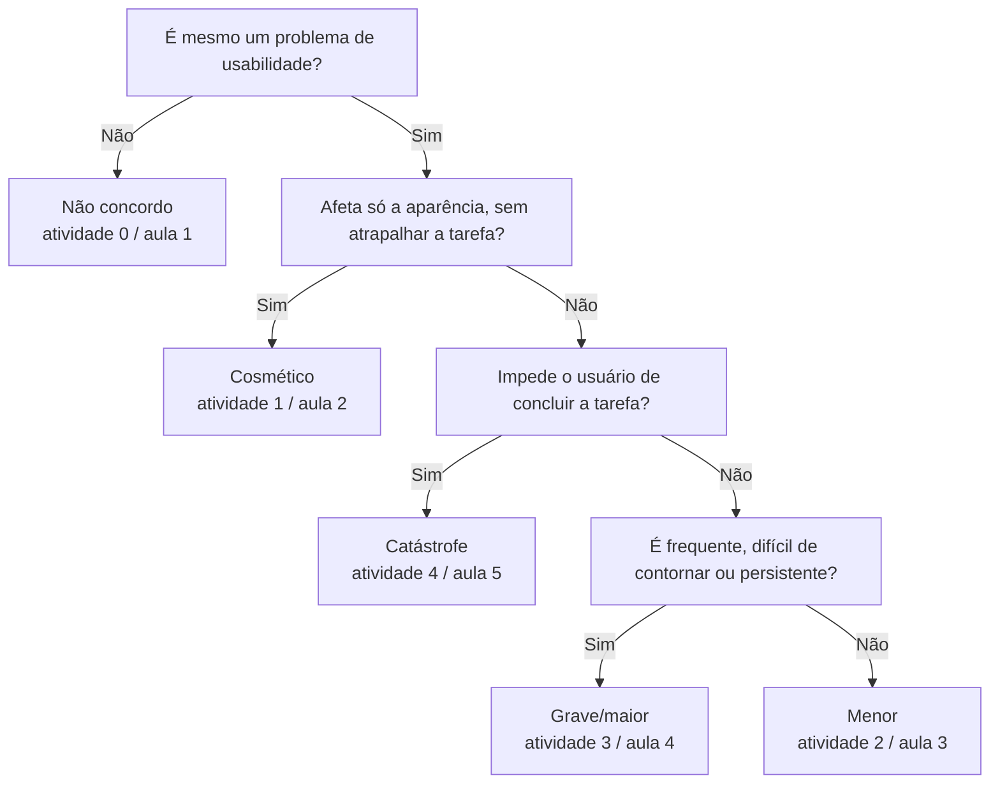
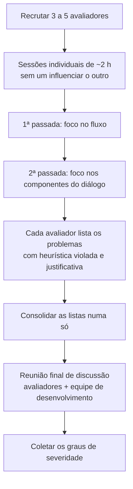

# 📝 Avaliação Heurística e Graus de Severidade

## 👁️ Visão geral

A **avaliação heurística** é um método de **inspeção** de usabilidade: especialistas percorrem a interface e apontam cada problema, dizendo **qual das 10 heurísticas de Nielsen** ele viola e **quão grave** ele é (grau de severidade). A aula apresenta o método, as heurísticas com exemplos reais e a escala de severidade. A atividade aplica tudo isso ao jogo educativo **Expedição Antártica**, em 19 telas. É a prática do atributo **usabilidade**, que já apareceu como critério de qualidade em [[Fundamentos e Modelos de Qualidade de Software]] e como requisito difícil de medir em [[Métricas de Software e Estimativas]].

> [!warning] Antes de tudo: a aula e a atividade numeram diferente
> A **aula** e a **atividade** usam **ordens diferentes para as heurísticas** e **escalas diferentes de severidade**. As tabelas de conversão estão nas seções "As 10 heurísticas" e "Graus de severidade". Na prova, use a numeração que o enunciado mostrar.

## 🔍 O que é a Avaliação Heurística

> [!info] Definição
> Método de **inspeção sistemática da interface**, baseado nas **heurísticas de usabilidade**, realizado por **avaliadores especialistas** (de **3 a 5**). Desenvolvido por **Nielsen e Molich**; o slide cita **1993**.

| Característica | O que diz o material |
| :--- | :--- |
| Quem avalia | **3 a 5 avaliadores**, trabalhando **individualmente** |
| Base da avaliação | **10 heurísticas** de usabilidade |
| Resultado | **Lista de problemas** de usabilidade, com os **princípios violados** e a **gravidade** de cada um |
| Quando usar | **Em qualquer etapa** do desenvolvimento, **mesmo com protótipo em papel** |
| Duração de uma sessão | **~2 horas** |

### Por que 3 a 5 avaliadores

- É difícil fazer com **um único avaliador**: uma pessoa **nunca encontra todos os problemas** de uma interface.
- A experiência mostra que **pessoas diferentes encontram problemas diferentes**; juntar vários avaliadores **melhora significativamente** o resultado.

### Individual primeiro, consolidado depois

1. Cada avaliador trabalha **sozinho**, sem que um influencie o outro. Percorre a interface **várias vezes**, inspecionando os componentes do diálogo, e relata cada problema **associando-o às heurísticas violadas**.
2. Depois, as listas de todos os avaliadores são **consolidadas numa só**.

### Regras para o avaliador

- ==Não basta dizer que **não gosta** de algo: é preciso **justificar com base nas heurísticas**==.
- Ser **o mais específico possível** e listar **cada problema separadamente**.
- Um mesmo componente pode ferir **mais de uma heurística**, e isso deve ser indicado.

## 🧭 As 10 heurísticas de Nielsen

A aula segue a ordem mais conhecida de Nielsen. A atividade troca a posição da heurística sobre erros:

| Nº na aula | Heurística | Código na atividade | Ideia central | Pergunta do avaliador |
| :---: | :--- | :---: | :--- | :--- |
| 1 | **Visibilidade do status do sistema** | **H1** | Feedback adequado em tempo razoável | O usuário sabe o que está acontecendo? |
| 2 | **Compatibilidade com o mundo real** | **H2** | Linguagem familiar ao usuário | Fala a língua de quem usa? |
| 3 | **Controle do usuário e liberdade** | **H3** | Saídas de emergência claras | Dá para desfazer/sair fácil? |
| 4 | **Consistência e padrões** | **H4** | Mesma coisa, mesmo nome, mesmo lugar | Preciso adivinhar? |
| 5 | **Prevenção de erros** | ==**H6**== | Design que evita o erro | O sistema impede o erro? |
| 6 | **Reconhecimento em vez de memorização** | ==**H7**== | Opções visíveis | Preciso lembrar de algo? |
| 7 | **Flexibilidade e eficiência de uso** | ==**H8**== | Atalhos para experientes | O experiente consegue ir mais rápido? |
| 8 | **Estética e design minimalista** | ==**H9**== | Nada irrelevante | Tem informação sobrando? |
| 9 | **Ajudar a reconhecer, diagnosticar e corrigir erros** | ==**H5**== | Mensagem clara com solução | A mensagem de erro ajuda a resolver? |
| 10 | **Ajuda e documentação** | **H10** | Ajuda fácil, focada e curta | Acho ajuda quando preciso? |

> [!tip] Macete da conversão
> H1 a H4 e H10 são iguais nas duas. Na atividade, a heurística de **erros (9 da aula) "subiu" para H5**, e as heurísticas 5 a 8 da aula **desceram uma posição** (viraram H6 a H9).

### 1. Visibilidade do status do sistema (H1)

O sistema deve **manter os usuários informados** sobre o que está acontecendo, com **feedback adequado dentro de um tempo razoável**.

![[heuristica-visibilidade-status-download-bom-ruim.png|600]]
*À esquerda (bom): a janela de download mostra arquivo, barra de progresso, tempo restante, quanto já foi copiado e a taxa. À direita (ruim): o assistente de hardware só tem uma barra e avisa que, se ela "parar por muito tempo", será preciso reiniciar.*

- **Bom**: download com tempo restante estimado (31 min 10 s), progresso (7,09 de 34,5 MB), taxa (15,2 KB/s) e opção de fechar ao concluir.
- **Ruim**: "Assistente para Adicionar Novo Hardware" diz que, se o indicador **parar por muito tempo**, será necessário reiniciar. Quanto é "muito tempo"? O usuário não tem como saber se travou.
- **J.Crew** (bom): ao passar o mouse sobre tamanhos com pouco estoque aparece "Apenas alguns restantes!"; tamanhos esgotados aparecem **riscados em cinza claro**.

### 2. Compatibilidade do sistema com o mundo real (H2)

O sistema deve **falar a linguagem do usuário**, com palavras, frases e conceitos **familiares**, em vez de termos orientados ao sistema. Resumo do slide: **"linguagem familiar"**.

- **Abacus** (ruim): produto **para advogados**, mas com linguagem **para "computeiros"**: "256-bit AES Encryption", "SOC1/SOC2/SSAE16", "99.999% Uptime Service Level Agreement".
- **Shopper**: o slide mostra, sem legenda, a página que explica em 3 passos como ganhar cashback. Pela posição, parece o contraponto positivo (explicação em linguagem do consumidor); a leitura é minha.

### 3. Controle do usuário e liberdade (H3)

Usuários frequentemente **escolhem funções por engano** e precisam de **"saídas de emergência" claras** para sair do estado indesejado **sem percorrer um diálogo extenso**.

![[heuristica-controle-liberdade-document-wizard.png|500]]
*"Conversion complete! Press View Result": o único botão é "View Result". E se o usuário não quiser ver o resultado?*

### 4. Consistência e padrões (H4)

O usuário **não precisa adivinhar** se palavras, situações ou ações diferentes significam a mesma coisa.

![[heuristica-consistencia-winzip-botoes-trocam-lugar.png|500]]
*WinZip: os botões "Quit" e "I Agree" trocavam de lugar a cada execução. O slide marca o caso como violação de 4 (Consistência e Padrões) e 5 (Prevenção de Erros).*

### 5. Prevenção de erros (H6 na atividade)

==Melhor que uma boa mensagem de erro é um **design cuidadoso que previne o erro** antes de ele acontecer.==

O mesmo WinZip ilustra: com os botões mudando de posição aleatoriamente, o usuário acostumado clica no lugar de sempre e **aceita a licença quando queria sair** (ou o contrário). O design **provoca** o erro em vez de evitá-lo.

### 6. Reconhecimento em vez de memorização (H7 na atividade)

- Tornar **objetos, ações e opções visíveis**.
- O usuário **não deve ter que lembrar** informação de uma parte do diálogo para outra.
- Instruções de uso devem estar **visíveis ou facilmente recuperáveis** quando necessário.

O slide não traz exemplo. Pense em menus visíveis (reconhecer) × comandos que é preciso decorar (lembrar).

### 7. Flexibilidade e eficiência de uso (H8 na atividade)

- **Novatos** devem conseguir se tornar **peritos** com o uso.
- Prover **aceleradores** para aumentar a velocidade da interação.
- Permitir a **usuários experientes "cortar caminho"** em ações frequentes.

Exemplos (bons): o **Mac OS** permite criar teclado personalizado e **comandos de atalho**; o app do **Itaú** tem **atalhos para as principais funcionalidades** (Pix e transferir, pagar, cartão virtual) e deixa o usuário **adicionar atalhos**.

### 8. Estética e design minimalista (H9 na atividade)

- Diálogos **não devem conter informação irrelevante** ou raramente necessária.
- **Qualquer informação extra compete** com as relevantes e **diminui sua visibilidade relativa**.

Exemplo (ruim): página da **Paytm** poluída, com banners (campanha de críquete), dezenas de ícones e ofertas disputando atenção.

![[heuristica-netscape-links-iguais-sair-de-tudo.png|550]]
*Ajuda do Netscape: "Contents", "Index", "Find" e a lista lateral são todos links, mas com aparências diferentes; e o X no canto inferior sai de tudo, não só fecha a janela. O slide marca 4 (Consistência), 5 (Prevenção de erros) e 8 (Estética).*

### 9. Ajudar os usuários a reconhecer, diagnosticar e corrigir erros (H5 na atividade)

Mensagens de erro devem ser em **linguagem clara (sem códigos)**, indicar **precisamente o problema** e **sugerir construtivamente uma solução**.

![[heuristica-mensagem-erro-pinterest-mailchimp.png|550]]
*Pinterest: "o e-mail não pertence a nenhuma conta", ou seja, só indica o erro. Mailchimp: "não encontramos essa conta; podemos ajudar a recuperar seu usuário?", ou seja, indica e ajuda a corrigir.*

- A primeira tela **apenas indica** o erro; a segunda **indica e ajuda na correção**.
- **Letras vermelhas** podem ser ruins para **daltônicos**: a cor não deve ser o único sinal do erro.

![[heuristica-mensagem-erro-disco-cheio.png|550]]
*Ao tentar excluir um arquivo em uso, a mensagem diz "Acesso negado" e manda verificar se o disco não está cheio. O que disco cheio tem a ver com excluir um arquivo?*

### 10. Ajuda e documentação (H10)

- O ideal é um sistema que se use **sem documentação**, mas ainda assim é preciso **prover ajuda**.
- A ajuda deve ser **fácil de encontrar**, **focada na tarefa** do usuário e **não muito extensa**.
- Documentação clara (ex.: **FAQ**) e canais de ajuda (**chat**) podem gerar sentimentos positivos. Pesquisas indicam que o usuário **prefere uma atendente humana** (não virtual).
- Exemplo (bom): **ajuda no lugar certo**. Página de roupa com o **guia de tamanhos** ao lado da seleção de tamanho e as informações de **envio e devolução** junto do botão de compra.

## ⚖️ Graus de severidade

A severidade de um problema combina **3 fatores**, mais o impacto no mercado:

| Fator | Pergunta |
| :--- | :--- |
| **Frequência** | O problema é **comum ou raro**? |
| **Impacto** | É **fácil ou difícil** para o usuário superá-lo? |
| **Persistência** | Acontece **uma vez só** (o usuário supera depois que aprende) ou **incomoda repetidamente**? |
| **Impacto no mercado** | Depende da **popularidade do produto** |

### As duas escalas

| Significado | Aula (adaptado de Nielsen, 1994) | Atividade |
| :--- | :---: | :---: |
| Não concordo que seja um problema de usabilidade | **1** | **0** |
| Problema **cosmético**: corrigir só se sobrar tempo no projeto | **2** | **1** |
| Problema **menor**: correção com **baixa prioridade** | **3** | **2** |
| Problema **grave/maior**: importante corrigir, **alta prioridade** | **4** | **3** |
| **Catástrofe**: correção **imperativa antes de liberar** o produto | **5** | **4** |

==**Atividade = aula − 1.**== O conteúdo de cada nível é o mesmo; só muda o número.

> [!info] Contexto externo
> A escala original de Nielsen vai de **0 a 4**, a mesma usada na atividade. A aula soma 1 a cada nível ("adaptado").

*Criado por mim como roteiro prático a partir dos fatores do slide; não é regra oficial, serve para você não travar na hora de escolher o número.*

## 🛠️ Como conduzir uma avaliação heurística

*Recriado a partir dos slides "componentes de uma avaliação heurística" e "Como conduzir?".*

- Os avaliadores devem percorrer a interface **pelo menos duas vezes**: a **primeira focada no fluxo**, a **segunda nos componentes individuais** do diálogo.
- O avaliador decide como conduzir a sessão, comparando o que vê com a lista de heurísticas.
- Inspecionar com base nas heurísticas, **justificando e detalhando ao máximo** cada problema.

## 📊 Resultados, limitações e benefícios

**Resultado**: uma **lista de problemas de usabilidade** com referência aos **princípios violados**.

O método tem duas limitações, e a reunião final existe para compensá-las:

| O método **não** faz | Como a reunião final compensa |
| :--- | :--- |
| ==Não objetiva **corrigir** os problemas (não propõe redesign)== | Com avaliadores **e** desenvolvedores juntos, o diagnóstico vira **soluções concretas de redesign** |
| ==Não levanta os **aspectos positivos** do design== | Na reunião também se discute **o que está bom** |

Mesmo sem ser o objetivo, **diagnosticar o problema e ligá-lo à heurística** já sugere possibilidades concretas de redesign.

**Benefícios:**

- Bom método para encontrar **tanto problemas graves quanto menores**.
- Melhora a interface analisada **e beneficia projetos futuros** (a equipe aprende); o material considera esse efeito colateral **extremamente importante**.
- **Custo-benefício**: custo de **US\$ 10.500** para um benefício de **US\$ 500.000**.
- Observar e analisar o design do ambiente cotidiano desenvolve **sensibilidade ao mundo desenhado** em que vivemos.

> [!warning] O "~48%" do slide
> O slide escreve "custo-benefício ~48%", mas a conta 500.000 ÷ 10.500 ≈ 47,6 dá uma **razão de ~48 vezes** (cada dólar investido retorna ~48), não 48%.

O último slide deixa a pergunta **"Onde encaixar IHC em seu projeto?"**: a ideia é aplicar o método no projeto da disciplina.

## 📋 Atividade: Expedição Antártica

**Objetivo**: praticar avaliação heurística para aplicar no projeto da disciplina, no mestrado ou como avaliador no mercado.

**Dinâmica**: explicação para a turma toda, divisão aleatória em **5 grupos**, cada grupo discute e registra os problemas, e depois todos voltam para a **correção conjunta**. Não era preciso enviar nada.

**O que fazer em cada tela** (slides 04 a 22): indicar o **código da(s) heurística(s)** violada(s) e o **grau de severidade**, com **justificativa**, no modelo do DOCX:

| Código Heurística | Código Severidade | Justificativa |
| :---: | :---: | :--- |
| H? | 0–4 | Qual é o problema, por que viola a heurística e por que esse grau (frequência, impacto, persistência) |

> [!tip] Como escrever uma boa justificativa
> **Problema observável** + **heurística** + **efeito no usuário**. Ex.: "O botão SAIR fecha o jogo sem confirmação (**H6**, prevenção de erros); um clique acidental perde todo o progresso, impacto alto → **3**."
> Evite "achei feio" ou "não gostei": a regra do método é justificar pela heurística.

As respostas abaixo usam **o sistema da atividade** (H1–H10 da atividade, severidade 0–4). Quando o slide trouxe o comentário do professor, a classificação parte dele; quando não trouxe, o problema foi identificado por mim. **Não há gabarito oficial** no material: tudo aqui é classificação minha para você conferir na correção.

### Tela 04 — Menu inicial com configurações

![[expedicao-antartica-tela-04-menu-configuracoes.png]]
*Menu inicial (Jogar, Ajuda, Configurações, Créditos, Sair) com o painel de volume, leitura de tela e alto contraste aberto. Sem comentário do professor.*

> [!question]- Minha classificação (confira)
> | Heurística | Severidade | Justificativa |
> | :---: | :---: | :--- |
> | H4 | 2 | O painel de configurações do menu inicial tem "Alto contraste" e o botão "VOLTAR"; o painel equivalente dentro do jogo (telas 06, 07, 20) não tem "Alto contraste" e usa "SAIR". Mesma função com opções e nomes diferentes. |
> | H1 | 2 | Se marcar "Alto contraste" não mudar visivelmente a tela (como parece no print), o usuário não sabe se a opção está ativa. |

### Tela 05 — Configurações por cima da mensagem da missão

![[expedicao-antartica-tela-05-configuracoes-botao-sem-rotulo.png]]
*Painel de configurações aberto sobre a caixa "Para realizar a missão é necessário concluir todos os...". O botão na base do painel aparece sem texto. Sem comentário do professor.*

> [!question]- Minha classificação (confira)
> | Heurística | Severidade | Justificativa |
> | :---: | :---: | :--- |
> | H7 | 3 | O botão da base está sem rótulo: o usuário não vê o que ele faz nem como fechar o painel. Nas telas 06 e 07 o mesmo botão aparece como "SAIR" (também fere H4). |
> | H9 | 2 | O painel abre por cima do texto da missão e os dois se misturam, prejudicando a leitura. |

### Tela 06 — Botão SAIR

![[expedicao-antartica-tela-06-botao-sair.png]]
*Comentário do professor: "O botão SAIR precisa solicitar confirmação do usuário."*

> [!question]- Minha classificação (confira)
> | Heurística | Severidade | Justificativa |
> | :---: | :---: | :--- |
> | H6 | 3 | Um clique acidental em SAIR encerra o jogo sem confirmação. Um "Deseja mesmo sair?" preveniria o erro. Impacto alto: o jogador perde o progresso. |
> | H3 | 2 | Sem confirmação, não existe saída de emergência para o clique por engano. |

### Tela 07 — Não dá para voltar ao jogo

![[expedicao-antartica-tela-07-voltar-ao-jogo-esc.png]]
*Comentário do professor: depois de ajustar o volume, não foi possível voltar ao jogo; só o ESC volta, mas o ESC deveria ser usado exclusivamente para sair do jogo, "ou não?". Está causando um problema de usabilidade.*

> [!question]- Minha classificação (confira)
> | Heurística | Severidade | Justificativa |
> | :---: | :---: | :--- |
> | H3 | 3 | Não há um botão "Voltar ao jogo": o usuário fica preso nas configurações, sem saída clara. |
> | H4 | 2 | O ESC tem significado ambíguo (volta ao jogo aqui, mas é esperado como "sair"), e o botão visível chama-se "SAIR". |
> | H7 | 2 | A única saída (ESC) não está indicada na tela: é preciso descobrir ou lembrar. |

### Tela 08 — Diálogo com a tecla E

![[expedicao-antartica-tela-08-tecla-e-dialogo.png]]
*Comentário do professor: "Uso da tecla E não é intuitivo. Usar ENTER? SPACE?"*

> [!question]- Minha classificação (confira)
> | Heurística | Severidade | Justificativa |
> | :---: | :---: | :--- |
> | H4 | 2 | A convenção para avançar diálogo é ENTER ou ESPAÇO; a tecla E foge do padrão. |
> | H7 | 2 | Nada na caixa de diálogo indica que é preciso apertar E: o jogador tem de lembrar. |

### Tela 09 — Aviso dos minijogos

![[expedicao-antartica-tela-09-aviso-minijogos.png]]
*Mensagem "Para realizar a missão é necessário concluir todos os minijogos." Sem comentário do professor.*

> [!question]- Minha classificação (confira)
> | Heurística | Severidade | Justificativa |
> | :---: | :---: | :--- |
> | H1 | 2 | A mensagem não diz quantos minijogos existem, quais já foram concluídos nem onde encontrá-los. |
> | H7 | 2 | O jogador precisa guardar de cabeça o que já fez. |

### Tela 10 — Minijogo 1: teia alimentar

![[expedicao-antartica-tela-10-teia-alimentar-barra.png]]
*Comentário do professor: "Conforme o jogador erra, a barra deve diminuir."*

> [!question]- Minha classificação (confira)
> | Heurística | Severidade | Justificativa |
> | :---: | :---: | :--- |
> | H1 | 3 | A barra de vida/pontuação não reage aos erros: o jogador não recebe feedback do próprio desempenho. Acontece em todas as jogadas (frequente) e não passa com o uso (persistente). |

### Tela 11 — Identificar a cauda da baleia

![[expedicao-antartica-tela-11-cauda-baleia.png]]
*Tela de fotoidentificação; a instrução manda excluir a foto (X vermelho) se não conseguir identificar. Sem comentário do professor.*

> [!question]- Minha classificação (confira)
> | Heurística | Severidade | Justificativa |
> | :---: | :---: | :--- |
> | H4 | 2 | O X vermelho, que quase sempre significa "fechar", aqui **exclui** a foto. |
> | H6 | 2 | Excluir é ação destrutiva; se não houver confirmação (o print não mostra), um clique por engano apaga a foto. |

### Tela 12 — Minijogo 2: jogo da memória

![[expedicao-antartica-tela-12-memoria-feedback-acerto.png]]
*Comentário do professor: é necessário criar um feedback visual quando o jogador acerta; um contorno verde pode ficar fixo nas cartas corretas.*

> [!question]- Minha classificação (confira)
> | Heurística | Severidade | Justificativa |
> | :---: | :---: | :--- |
> | H1 | 3 | Ao acertar um par nada muda visualmente; o jogador não distingue cartas resolvidas das que faltam ("Pares restantes" ajuda só em parte). |
> | H7 | 2 | Sem marcação, o jogador precisa lembrar quais pares já formou. |

### Tela 13 — Fim do minijogo 2

![[expedicao-antartica-tela-13-fim-minijogo-itens.png]]
*Dois comentários do professor: o botão sem uso deveria ficar acinzentado; e a tela deveria avisar se o jogador já tem todos os itens para completar a missão (ou se falta algum), aviso que também deveria aparecer no inventário.*

> [!question]- Minha classificação (confira)
> | Heurística | Severidade | Justificativa |
> | :---: | :---: | :--- |
> | H1 | 3 | Ao concluir o minijogo, o jogo não informa se o jogador já tem todos os itens da missão ou quantos faltam. |
> | H1 / H6 | 2 | O botão de reiniciar aparece ativo mesmo sem ter uso; acinzentado, mostraria o estado real e evitaria cliques inúteis. |
> | H7 | 2 | A informação sobre os itens deveria estar também no inventário, para o jogador não depender da memória. |

### Tela 14 — Modo câmera

![[expedicao-antartica-tela-14-camera-o-que-e-clicavel.png]]
*Comentário do professor: "O que é clicável ou não? Usar um padrão para destacar o que é clicável."*

> [!question]- Minha classificação (confira)
> | Heurística | Severidade | Justificativa |
> | :---: | :---: | :--- |
> | H4 | 2 | Ícones e textos ("Clique para dar zoom", "Clique para fechar", "Clique para fotografar") não seguem um padrão visual de elemento clicável; não dá para distinguir botão de decoração. |
> | H7 | 2 | Sem destaque, o jogador precisa testar ou lembrar onde clicar. |

### Tela 15 — Cadastro da baleia

![[expedicao-antartica-tela-15-cadastro-baleia-sem-nome.png]]
*Comentário do professor: "O jogo permite cadastrar a baleia sem ter preenchido o nome. O jogo deve impedir o cadastro."*

> [!question]- Minha classificação (confira)
> | Heurística | Severidade | Justificativa |
> | :---: | :---: | :--- |
> | H6 | 3 | O campo obrigatório "Nome" vazio é aceito; o botão ✓ deveria ficar bloqueado até o nome ser preenchido. |
> | H5 | 2 | Nenhuma mensagem avisa que falta o nome nem orienta a correção. |

### Tela 16 — Processo de pesquisa

![[expedicao-antartica-tela-16-processo-pesquisa-lista.png]]
*Lista com cerca de vinte cartões de texto (objetivos, metodologias, materiais, objetos de estudo) e "Tentativas restantes: 0/3". Sem comentário do professor.*

> [!question]- Minha classificação (confira)
> | Heurística | Severidade | Justificativa |
> | :---: | :---: | :--- |
> | H9 | 2 | Muitos cartões com texto pequeno e parecido numa só tela: excesso de informação competindo pela atenção. |
> | H1 | 2 | "Tentativas restantes: 0/3" é ambíguo: nenhuma tentativa restante de 3, ou nenhuma usada? |

### Tela 17 — Navio, com a missão em andamento

![[expedicao-antartica-tela-17-missao-baleia-sem-identificacao.png]]
*Comentário do professor: "Falta identificação de que o jogador está na missão da baleia."*

> [!question]- Minha classificação (confira)
> | Heurística | Severidade | Justificativa |
> | :---: | :---: | :--- |
> | H1 | 2 | Nada na tela indica a missão em andamento. |
> | H7 | 2 | O jogador precisa lembrar qual missão escolheu. |

### Tela 18 — Botão de informação

![[expedicao-antartica-tela-18-botao-info-sem-acao.png]]
*Comentário do professor sobre o botão "i": "Ao clicar, nada acontece..."*

> [!question]- Minha classificação (confira)
> | Heurística | Severidade | Justificativa |
> | :---: | :---: | :--- |
> | H1 | 3 | O botão não dá nenhum feedback ao ser clicado. |
> | H10 | 3 | O botão de informação/ajuda existe, mas não funciona: o jogador fica sem ajuda. |

### Tela 19 — Balão de pensamento

![[expedicao-antartica-tela-19-balao-pensamento-grande.png]]
*Comentário do professor: "O balãozinho está muito grande!! Está quase maior que o avatar."*

> [!question]- Minha classificação (confira)
> | Heurística | Severidade | Justificativa |
> | :---: | :---: | :--- |
> | H9 | 1 | Problema **cosmético** de proporção: chama atenção demais, mas não impede o uso. |

### Tela 20 — Leitura de tela

![[expedicao-antartica-tela-20-leitura-de-tela.png]]
*Comentário do professor: "Não está funcionando... Fica uma fala em inglês ditando números."*

> [!question]- Minha classificação (confira)
> | Heurística | Severidade | Justificativa |
> | :---: | :---: | :--- |
> | H2 | 4 | O leitor de tela fala em inglês e dita números sem sentido para um público brasileiro. Para quem depende dele (deficiência visual), o jogo fica **inutilizável**: impacto máximo e persistente. |
> | H1 | 3 | Ativar a opção não produz o resultado esperado e nada informa o que está acontecendo. |

### Tela 21 — Fóssil encontrado

![[expedicao-antartica-tela-21-fossil-sem-proximo-passo.png]]
*Comentário do professor: "Descubro o fóssil, mas não sei para onde ir (classificar e finalizar o jogo). Chego até aqui e paro."*

> [!question]- Minha classificação (confira)
> | Heurística | Severidade | Justificativa |
> | :---: | :---: | :--- |
> | H1 | 4 | Não há indicação do próximo passo depois de achar o fóssil: o jogador **trava e não consegue concluir o jogo**. Impede a tarefa, então é catástrofe. |
> | H10 | 3 | Falta instrução ou ajuda contextual sobre como classificar e finalizar. |

### Tela 22 — Itens equipados

![[expedicao-antartica-tela-22-itens-equipados.png]]
*Comentário do professor: não ficou claro o que mover de ferramentas e objetos para "itens equipados", nem quando se está perdendo pontos de saúde; esta parte poderia passar mais informações.*

> [!question]- Minha classificação (confira)
> | Heurística | Severidade | Justificativa |
> | :---: | :---: | :--- |
> | H10 | 3 | Falta instrução sobre a mecânica de mover itens para "itens equipados". |
> | H1 | 3 | A perda de pontos de saúde não é sinalizada com clareza. |
> | H7 | 2 | Os itens não mostram para que servem; o jogador precisa lembrar do texto do personagem. |

> [!abstract]- Visão consolidada da atividade (minha classificação)
> | Tela | Problema principal | Heurística(s) | Severidade |
> | :---: | :--- | :---: | :---: |
> | 04 | Configurações diferentes entre menu inicial e jogo | H4, H1 | 2 |
> | 05 | Botão sem rótulo e painel sobre a mensagem | H7, H9 | 3 |
> | 06 | SAIR sem confirmação | H6, H3 | 3 |
> | 07 | Sem saída para voltar ao jogo; ESC ambíguo | H3, H4, H7 | 3 |
> | 08 | Tecla E para avançar diálogo | H4, H7 | 2 |
> | 09 | Aviso sem progresso dos minijogos | H1, H7 | 2 |
> | 10 | Barra não diminui com os erros | H1 | 3 |
> | 11 | X que exclui em vez de fechar | H4, H6 | 2 |
> | 12 | Acerto sem feedback visual | H1, H7 | 3 |
> | 13 | Sem aviso de itens; botão sem uso ativo | H1, H6, H7 | 3 |
> | 14 | Não se sabe o que é clicável | H4, H7 | 2 |
> | 15 | Cadastro aceito sem nome | H6, H5 | 3 |
> | 16 | Excesso de texto; "0/3" ambíguo | H9, H1 | 2 |
> | 17 | Missão ativa não identificada | H1, H7 | 2 |
> | 18 | Botão "i" não faz nada | H1, H10 | 3 |
> | 19 | Balão grande demais | H9 | 1 |
> | 20 | Leitura de tela em inglês ditando números | H2, H1 | 4 |
> | 21 | Jogador trava sem saber o próximo passo | H1, H10 | 4 |
> | 22 | Mecânica de itens e saúde sem explicação | H10, H1, H7 | 3 |
>
> Repare que **H1 (visibilidade do status)** é, de longe, a heurística mais violada no jogo: falta feedback em quase toda tela.

## ⚠️ Pegadinhas e erros comuns

| Confusão | Como separar |
| :--- | :--- |
| Numeração das heurísticas | Na aula, **5 = prevenção** e **9 = erros**. Na atividade, **H5 = erros** e **H6 = prevenção**; reconhecimento, flexibilidade e estética também deslocam uma posição (H7, H8, H9) |
| Escala de severidade | Aula **1–5**; atividade **0–4** (a original de Nielsen). O nível "catástrofe" é 5 na aula e 4 na atividade |
| **Prevenção de erros** × **Ajudar a corrigir erros** | Prevenção atua **antes** (design que impede o erro: confirmação, campo obrigatório bloqueado). Ajudar a corrigir atua **depois** (mensagem clara com solução) |
| **Controle e liberdade** × **Prevenção** | Controle = **saída de emergência** depois do engano (cancelar, voltar, desfazer). Prevenção = **evitar** o engano |
| **Visibilidade do status** × **Reconhecimento** | Status = o sistema **informa o que está acontecendo** (feedback). Reconhecimento = **opções e instruções visíveis**, para não depender da memória |
| **Consistência** × **Mundo real** | Consistência = **coerência interna e com padrões** (mesmo nome, mesmo lugar). Mundo real = **linguagem do usuário**, não do sistema |
| Quantos avaliadores? | **3 a 5**, trabalhando **individualmente**; depois consolidam |
| Quantas passadas? | **Pelo menos duas**: 1ª **fluxo**, 2ª **componentes** |
| O que o método entrega | **Lista de problemas + heurísticas violadas + severidade**. **Não** entrega redesign e **não** aponta pontos positivos; a **reunião final** cobre isso |
| Justificativa | "Não gostei" não vale: é preciso **citar a heurística**, ser **específico** e listar **um problema por vez** |
| Um problema, várias heurísticas | Pode e deve indicar **todas** as que o componente fere (ex.: WinZip = 4 e 5; Netscape = 4, 5 e 8) |
| Quando aplicar | **Qualquer etapa**, até com **protótipo em papel** |
| "Custo-benefício ~48%" | É uma **razão de ~48** (500.000 ÷ 10.500), não uma porcentagem |

## 💡 Fechamento

A avaliação heurística é barata e rápida: 3 a 5 especialistas, cerca de 2 horas cada, duas passadas pela interface e uma lista justificada de problemas ligados às 10 heurísticas de Nielsen, cada um com seu grau de severidade (frequência, impacto e persistência). O método não corrige nem elogia, e para isso existe a reunião final com a equipe de desenvolvimento. Na prova e na atividade, o cuidado principal é **qual numeração e qual escala** o enunciado está usando.
