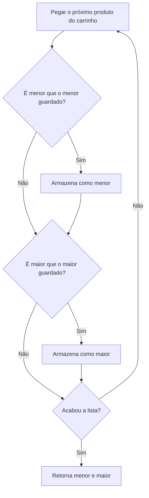

---

materia: Qualidade de Software 
fonte: Teste_de_Software___2_.pdf 
tags:

- resumo
- teste-de-software
- depuracao
- testes-unitarios

---
# 📝 Teste de Software — Bugs, Depuração e Testes de Unidade

## 👁️ Visão geral

O material tem três partes. A **Parte 01 (Motivação)** mostra quanto um bug pode custar, de foguetes a bancos. A **Aula 02 (Depuração)** separa os **três tipos de erro** (sintaxe, execução e lógico) e ensina a **depurar** com breakpoints no VS Code. A **Aula 03 (Testes de Unidade)** passa do teste manual ao **automatizado**, situa cada nível de teste no **Modelo V** e escreve um teste unitário com **Jest**. Conecta com [[Fundamentos e Modelos de Qualidade de Software]] (custo da falha, Ariane 5, Verificação e Validação).

## 💥 Quanto custa um bug

> [!quote] Paul R. Ehrlich "Errar é humano, mas para realmente estragar tudo, você precisa de um computador."

### Desastres famosos de software

| Caso                               | Custo                                      | O que aconteceu                                                                                                                                                         | Causa (o bug)                                                                                                                                                                                                 |
| :--------------------------------- | :----------------------------------------- | :---------------------------------------------------------------------------------------------------------------------------------------------------------------------- | :------------------------------------------------------------------------------------------------------------------------------------------------------------------------------------------------------------ |
| **Mariner 1 (1962)**               | US$ 18 milhões (≈ US$ 150 milhões em 2019) | Foguete com sonda para Vênus saiu da rota logo após o lançamento; o Controle da Missão o destruiu **293 segundos** depois                                               | Um programador **transcreveu errado uma fórmula manuscrita**, ignorando uma **barra sobrescrita** (o $\dot{\bar{R}}_n$ da fórmula, mostrado no slide)                                                         |
| **Hartford Coliseum (1978)**       | US$ 90 milhões (≈ US$ 346 milhões em 2019) | Horas depois de milhares de fãs saírem, o teto de treliça de aço desabou sob o peso da neve molhada                                                                     | O programador do **software CAD** assumiu que os suportes do telhado sofreriam **só compressão pura**; um suporte cedeu e iniciou uma reação em cadeia                                                        |
| **Alarme nuclear falso soviético** | Quase a 3ª Guerra Mundial                  | O sistema de alerta indicou que os EUA tinham lançado **cinco mísseis**; o oficial de serviço concluiu que um ataque real teria mais mísseis e tratou como falso alarme | O software **não filtrou falsas detecções** causadas pela **luz do sol refletindo nas nuvens**                                                                                                                |
| **Ariane 5 (1996)**                | US$ 500 milhões                            | O foguete foi destruído segundos após o primeiro voo, levando **quatro satélites científicos** (estudo do campo magnético da Terra e do vento solar)                    | O computador de orientação converteu a **velocidade lateral de 64 bits para 16 bits**; o número não coube (**estouro**). A **unidade redundante idêntica** também falhou, porque rodava **o mesmo algoritmo** |

> [!info] Contexto externo O alarme soviético é de **1983**, e o oficial que não confiou no sistema foi **Stanislav Petrov**. O slide não dá a data nem o nome.

> [!tip] A lição do Ariane 5 **Redundância com o mesmo software não protege contra bug**: as duas unidades tinham o mesmo código e falharam do mesmo jeito. O caso também aparece na Unidade 1 como exemplo de reuso de componente sem revalidação.

### Bugs do dia a dia

| Sistema                                                | O que o usuário viu                                                                                                                           | O problema                                                                  |
| :----------------------------------------------------- | :-------------------------------------------------------------------------------------------------------------------------------------------- | :-------------------------------------------------------------------------- |
| **CAIXA** (internet banking)                           | "Sistema temporariamente indisponível. [EGlrzWKg9R]"                                                                                          | Erro genérico com um **código interno** que não diz nada ao usuário         |
| **SCDP** (Sistema de Concessão de Diárias e Passagens) | No campo "Motivo da não emissão", uma **stack trace Java** (`java.net.SocketTimeoutException: Read timed out`), com 139 tentativas de emissão | **Detalhe técnico exposto** ao usuário em vez de uma mensagem compreensível |
| **Hipercard**                                          | Página "Server Error in '/BIS' Application", com `SecurityException` ("ViewState Original foi Alterado") e a **stack trace** inteira          | Página de erro do servidor **exposta em produção**                          |
| **SUAP** (sistema unificado de administração pública)  | Página de exceção do Python ("Exception at /almoxarifado/relatorio/..."), com versão do Python, caminhos do servidor e código                 | Página de **depuração ativa em produção**, revelando detalhes internos      |

> [!example] O bug "ridículo" do boleto na CAIXA
> 
> 1. O usuário tenta pagar um boleto e **erra a senha** ("Assinatura eletrônica inválida").
> 2. Poucos segundos depois, tenta de novo **com a senha certa**.
> 3. O sistema **nega o pagamento**: "Houve mais de uma tentativa de realizar esta transação em menos de 28 segundos, por favor cheque seu extrato para ver se a mesma já foi efetivada."
> 4. Depois da mensagem, o sistema **volta à tela inicial**, e o usuário precisa preencher tudo de novo.
> 
> **O erro**: a indicação de que houve uma tentativa válida de pagar aquele boleto (a sequência do código de barras) só deveria ser registrada **se o pagamento realmente ocorreu**. A tentativa com senha errada não foi pagamento, mas bloqueou a próxima.

### NullPointerException: o "erro de bilhões de dólares"

> [!quote] Charles Antony Richard Hoare (2009) "Eu chamo isso de meu erro de bilhões de dólares. Foi a **invenção da referência nula** em 1965... Isso levou a inúmeros erros, vulnerabilidades e falhas no sistema, que provavelmente causaram um bilhão de dólares de dor e danos nos últimos quarenta anos."

Em JavaScript, a versão desse erro é tentar acessar algo de `null` ou `undefined`, que gera o `TypeError` visto na próxima seção.

## 🐞 Tipos de erro

| Tipo         | Também chamado         | Quando aparece                                                     | O que acontece                                             |
| :----------- | :--------------------- | :----------------------------------------------------------------- | :--------------------------------------------------------- |
| **Sintaxe**  | Compilação / _parsing_ | Assim que o arquivo é carregado, **antes de qualquer linha rodar** | O interpretador **nem consegue começar** a ler o código    |
| **Execução** | _Runtime_              | **Durante** a execução, na linha problemática                      | O código roda, mas **quebra no meio do caminho** (exceção) |
| **Lógico**   | _Bug_                  | **Nunca dá mensagem**                                              | O programa roda até o fim, mas o **resultado está errado** |

### Erro de sintaxe

- O código **desrespeita as regras da linguagem**.
- O interpretador (_parser_) não consegue nem iniciar a execução.
- Exemplos comuns: **parêntese, chave ou aspas não fechados**; ponto e vírgula mal colocado; **palavra reservada** usada como identificador.

```javascript
function imprimeInvertido(nome) {
  const n = nome.length;
  for (let i = n; i > 0; i--) {
    console.log(nome[i]; // ← falta ")"
  }
}
```

Resultado: `Uncaught SyntaxError: missing ) after argument list` (nomes.js:4). O console do navegador ou do Node **aponta a linha exata** do problema.

### Erro de execução (runtime)

- O código é **sintaticamente válido** e começa a rodar.
- Uma operação específica **falha durante a execução**.
- Gera uma **exceção** que **interrompe o programa** (se não for tratada).
- Exemplos comuns: **chamar método em `undefined`/`null`**, acessar índice fora do array, operar tipos incompatíveis.

```javascript
function main() {
  let nome; // esqueceu de atribuir
  const n = nome.length;
  for (let i = n - 1; i >= 0; i--) {
    console.log(nome.charAt(i));
  }
}
```

Resultado: `TypeError: Cannot read properties of undefined (reading 'length')` (nomes.js:3).

O slide conduz o raciocínio com perguntas:

1. **Tem algum erro na linha `let nome;`?** Não: declarar sem atribuir é válido.
2. **Qual é o valor de `nome` nesse momento?** `undefined`.
3. Na linha seguinte, o código pede "JavaScript, pegue o **tamanho** do conteúdo de `nome`", mas `undefined` não tem `length`. **TypeError** = operação que **não faz sentido para aquele tipo de valor**.
4. **O `for` chega a executar?** Não: a exceção na linha 3 interrompe o programa antes.

### Erro lógico

- O código roda **do início ao fim, sem erro nenhum**.
- O resultado, porém, **não é o esperado**.
- É o tipo **mais difícil de encontrar**: não há mensagem de erro para seguir.

Objetivo do programa: imprimir o valor de `nome` **de trás para frente**.

```javascript
function main() {
  const nome = "Teste de Software";
  const n = nome.length;
  for (let i = n - 1; i > 0; i--) {
    console.log(nome.charAt(i));
  }
}
```

Saída: `erawtfoS ed etse`. Esperado: `erawtfoS ed etseT`. **Falta o primeiro caractere.**

**Teste de mesa** (seguir o loop à mão, olhando a condição `i > 0`):

|  `i`  |  `i > 0`   | Executa? |
| :---: | :--------: | :------: |
| ... 3 | verdadeiro |   Sim    |
|   2   | verdadeiro |   Sim    |
|   1   | verdadeiro |   Sim    |
|   0   | **falso**  | **Não**  |

O índice 0 (a letra "T") **nunca é impresso**. A correção é trocar a condição para `i >= 0`. Para percorrer uma string de trás para frente, a última posição visitada é a **0**.

> [!tip] Curiosidade do slide de sintaxe Mesmo depois de fechar o parêntese, o código de `imprimeInvertido` ainda teria **erros lógicos**: começa em `i = n` (posição que não existe, então imprime `undefined`) e para em `i > 0` (pula a posição 0). O certo seria `i = n - 1` até `i >= 0`.

## 🔍 Depuração (debugging)

**Erros lógicos são chamados de bugs.** **Depuração** (_debugging_) é o processo de **encontrar e corrigir** erros. Três formas de fazer:

1. **Lendo o código** e buscando o erro.
2. **Imprimindo** os valores das variáveis e o fluxo de execução (ex.: `console.log`).
3. **Usando a ferramenta de depuração da IDE**, a melhor escolha segundo o material.

### Recursos de um depurador

Editores como o **VS Code** e navegadores como o **Chrome** têm depuradores que permitem acompanhar o fluxo de execução:

| Recurso                            | O que faz                                                                      |
| :--------------------------------- | :----------------------------------------------------------------------------- |
| **Executar uma instrução por vez** | Roda _statement_ por _statement_                                               |
| **Step in / Step over**            | Entra na chamada de uma função (_in_) ou a executa inteira sem entrar (_over_) |
| **Inserir breakpoints**            | O programa **pausa** ao encontrá-los                                           |
| **Monitorar variáveis**            | Acompanha os valores durante a execução                                        |
| **Modificar variáveis**            | Altera valores **sem sair do modo debug**                                      |
| **Ver a call stack**               | Mostra o fluxo de chamadas de funções                                          |

### Depurando no VS Code

O exemplo da aula é um **desafio de entrevista**: corrigir a função `fibonacciIterativo` para que ela retorne o i-ésimo número da sequência de Fibonacci (1, 1, 2, 3, 5, 8, 13, 21, 34, …). O código e a correção estão na seção de questões.

**Passo 1: criar a chamada da função.** ==Criar a função não significa que ela será executada==: é preciso um ponto de entrada. No terminal (Node.js), usa-se `readline` para perguntar a posição, ou um valor fixo:

```javascript
const readline = require('readline');
const rl = readline.createInterface({
  input: process.stdin
});
rl.question('Posição: ', (resp) => {
  const n = Number(resp);
  const r = fibonacciIterativo(n);
  console.log(`Fibonacci(${n}) = ${r}`);
  rl.close();
});
```

No navegador, dá para usar `prompt()` ou chamar `fibonacciIterativo(10)` direto no console.

**Passo 2: adicionar um breakpoint.** Clique **à esquerda do número da linha**, na margem do editor; aparece uma **bolinha vermelha**. A execução vai **pausar exatamente ali, antes de rodar aquela linha**.

Com o código, a chamada e o breakpoint prontos, abre-se o depurador para acompanhar as variáveis durante a execução.

### Perspectiva de debug (as views do VS Code)

| View            | O que mostra                                                            |
| :-------------- | :---------------------------------------------------------------------- |
| **Variables**   | As variáveis **locais e globais** visíveis no ponto atual da execução   |
| **Watch**       | Lista de **expressões escolhidas por você**, recalculadas a cada pausa  |
| **Call Stack**  | A **pilha de chamadas**: qual função chamou qual, até o ponto atual     |
| **Breakpoints** | Todos os breakpoints do projeto, com opção de **habilitar/desabilitar** |

## 🧪 Testes de unidade

O material da Aula 03 é baseado no cap. 2 do livro _Test-Driven Development: Teste e Design no Mundo Real_.

### Testes manuais × testes automatizados

- O depurador da IDE deixa o **teste manual** mais produtivo.
- Mas para produzir código com **bem menos erros**, mais qualidade, **menor tempo e custo de manutenção** (e preservar a saúde de corpo e mente), ==**faça testes automatizados**==.

### O que é um teste de unidade

- Não se preocupa com o sistema todo: verifica **se uma pequena parte dele funciona**.
- Testa **uma única unidade** do sistema. Em sistemas **orientados a objetos**, essa unidade geralmente é a **classe**.

> [!example] Cenário: loja online Fluxo: o cliente põe o produto no carrinho e finaliza a compra. O sistema então fala com a **operadora do cartão**, **retira o produto do estoque**, **dispara um evento** para a logística e **envia e-mail** de confirmação. Há várias regras de negócio (carrinho, tipo de pagamento, fechamento da compra). Colocar tudo num único arquivo ou numa única classe? **De forma nenhuma!** O sistema é dividido em várias classes (`CarrinhoDeCompras`, `Pedido` etc.), e a ideia é ter **uma bateria de testes para cada classe**.

A loja precisa encontrar, no carrinho, o **produto de maior e o de menor valor**. Algoritmo possível: percorrer a lista, comparar um a um e guardar sempre o menor e o maior encontrados até então.



_Recriado do slide 62, que mostra os produtos P1, P2, P3, P4... passando pelas perguntas "É menor? Armazena." e "É maior? Armazena."_

Esse método é uma **unidade** típica: dá para testá-lo isolado, com carrinhos de entrada conhecidos e o resultado esperado.

## 🔺 Modelo V e níveis de teste

> [!info] Modelo V Representação do processo de **desenvolvimento e teste** de software. O **lado esquerdo** traz as atividades de **especificação, projeto e codificação**; o **lado direito**, os **níveis de teste** correspondentes. ==A ideia central é **planejar os testes desde as fases iniciais**==, e não só quando o sistema estiver pronto.

![[modelo-v-desenvolvimento-niveis-de-teste.png|600]] _Cada etapa de desenvolvimento (esquerda) já planeja o teste do mesmo nível (direita). O lado esquerdo desce como Verificação; o direito sobe como Validação._

| Etapa de desenvolvimento    | Nível de teste          | Pergunta que o teste responde                               |
| :-------------------------- | :---------------------- | :---------------------------------------------------------- |
| Especificação de requisitos | **Teste de Aceitação**  | O sistema atende às necessidades e aos critérios de aceite? |
| Projeto de alto nível       | **Teste de Sistema**    | O sistema completo atende aos requisitos definidos?         |
| Projeto detalhado           | **Teste de Integração** | Os módulos funcionam corretamente quando conectados?        |
| Codificação                 | **Teste Unitário**      | Cada unidade isolada funciona corretamente?                 |

### Os quatro níveis

| Nível          | Foco                    | Características                                                                                                                                                                                                                                  | Exemplo do material                                   |
| :------------- | :---------------------- | :----------------------------------------------------------------------------------------------------------------------------------------------------------------------------------------------------------------------------------------------- | :---------------------------------------------------- |
| **Unitário**   | **Unidade isolada**     | Testa pequenas partes isoladas (funções, métodos, classes, componentes); verifica se a unidade produz o resultado esperado; roda **antes** dos testes de integração                                                                              | `calcularIMC(70, 1.75)` → "Normal"                    |
| **Integração** | **Módulos em conjunto** | Verifica a **comunicação** entre partes; procura falhas nas **interfaces** e na **troca de dados**; ==um módulo pode funcionar sozinho e falhar quando integrado==                                                                               | Tela de compra → Pagamento                            |
| **Sistema**    | **Sistema completo**    | Avalia o software integrado **como um todo**; verifica funcionalidades completas e requisitos; pode simular o uso real **do ponto de vista do usuário**; ambiente de teste **representativo**; busca falhas em relação ao comportamento esperado | Login → Compra → Pagamento → Pedido (fluxo completo)  |
| **Aceitação**  | **Aceite do produto**   | Verifica se o software satisfaz os **critérios de aceitação** e as **necessidades de negócio**; ligado aos **requisitos do início do projeto**; pode envolver **cliente, usuário, representante do negócio**                                     | Requisitos → Critérios de aceite → Aceitar o produto? |

> [!tip] Resumo para memorizar **Código → Unidade → Integração → Sistema → Aceitação.** Unidade = uma parte. Integração = partes juntas. Sistema = produto completo. Aceitação = atende ao que foi solicitado?

> [!warning] "Ponto de vista do usuário" pode confundir O **Teste de Sistema** também pode avaliar fluxos completos sob a perspectiva de uso do produto. O **Teste de Aceitação** enfatiza **critérios de aceite, necessidades do negócio e a decisão de aceitar** o produto. **Sistema** = encontrar **falhas** no produto completo. **Aceitação** = verificar se o produto **pode ser aceito**.

## 🧰 Teste unitário com Jest

**Jest** é uma ferramenta de **testes automatizados para JavaScript**. Ele:

- executa a função com **entradas definidas** pelo teste;
- **compara o resultado obtido com o esperado**;
- informa automaticamente se o teste **passou ou falhou**;
- ajuda a detectar **regressões** quando o código é alterado.

### A função testada: cálculo do IMC

$$IMC = \frac{\text{massa}}{\text{altura} \times \text{altura}}$$

onde a massa está em kg e a altura em metros.

| Classificação        | IMC (kg/m²)    |
| :------------------- | :------------- |
| Muito abaixo do peso | Menor que 18,5 |
| Normal               | 18,5 – 24,9    |
| Acima do peso        | 25 – 29,9      |
| Obesidade grau I     | 30 – 34,9      |
| Obesidade grau II    | 35 – 39,9      |
| Obesidade grau III   | Maior que 40   |

O slide mostra só o começo da função:

```javascript
function calcularIMC(peso, altura) {
    let imc = peso / (altura * altura);
    let classificacao = "";

    if (imc < 18.5) classificacao = "Muito abaixo do peso";
    else if (imc < 25) classificacao = "Normal";
    // ...

    return [imc, classificacao];
}
```

Ela **recebe peso e altura**, calcula o IMC, classifica e **retorna um vetor** `[imc, classificacao]`. Por isso a classificação fica em `resultado[1]`.

Versão completa, seguindo a tabela (escrita por mim, para você conseguir rodar os testes):

```javascript
function calcularIMC(peso, altura) {
  let imc = peso / (altura * altura);
  let classificacao = "";

  if (imc < 18.5) classificacao = "Muito abaixo do peso";
  else if (imc < 25) classificacao = "Normal";
  else if (imc < 30) classificacao = "Acima do peso";
  else if (imc < 35) classificacao = "Obesidade grau I";
  else if (imc < 40) classificacao = "Obesidade grau II";
  else classificacao = "Obesidade grau III";

  return [imc, classificacao];
}

module.exports = calcularIMC; // para o Jest conseguir importar
```

### Anatomia de um teste

```javascript
test("descrição do que deve acontecer", () => {
  const resultado = funcaoTestada(entradas);   // executa
  expect(resultado).toBe(valorEsperado);       // compara
});
```

| Peça              | Significado                                               |
| :---------------- | :-------------------------------------------------------- |
| `test(...)`       | Cria o **caso de teste** (descrição + função com o teste) |
| `expect(valor)`   | "Eu espero que **este valor**..."                         |
| `.toBe(esperado)` | "...seja **exatamente igual** a este valor."              |
| Resultado         | Se forem iguais, **PASS**; se não, **FAIL**               |

**Quando o teste falha**, o Jest mostra o esperado e o obtido. Exemplo do slide: o teste esperava "Normal", mas a função retornou **"Obesidade grau I"** → **teste falhou**. A falha indica que o **comportamento real não corresponde ao esperado**, e o desenvolvedor deve investigar **a implementação ou o próprio caso de teste**. Detectar isso automaticamente é uma das principais vantagens da automação.

> [!tip] Receita de um teste completo **Cenário** (dados que caem na faixa desejada) + **execução** (chamar a função) + **resultado esperado** (`expect(...).toBe(...)`). O teste não precisa validar o vetor inteiro se a questão pede só a classificação.

## 📝 Questões

**1. (CESPE — 2011 — BRB — Analista de TI, adaptada)** No VS Code, a perspectiva de Debug possui várias views para depuração de um programa JavaScript: uma delas é a view Variables, que exibe as variáveis locais e globais visíveis no ponto de execução atual.

( ) Certo ( ) Errado

> [!question]- Resposta (resolvida por mim, confira) **Certo.** É a definição da view **Variables** na perspectiva de debug: variáveis **locais e globais** visíveis no ponto atual. As outras views são Watch, Call Stack e Breakpoints.

**2. (CESPE — 2012 — Banco da Amazônia — Técnico Científico, adaptada)** Um depurador é um ambiente especializado para controlar e monitorar a execução de um programa. Sua funcionalidade básica é a inserção de pontos de parada (breakpoints), permitindo verificar o valor corrente das variáveis.

( ) Certo ( ) Errado

> [!question]- Resposta (resolvida por mim, confira) **Certo.** O depurador controla e monitora a execução; o **breakpoint** pausa o programa num ponto, e ali se inspeciona o **valor corrente das variáveis**.

**3. (Questão da aula)** "Os testes planejados e executados pela equipe de teste, cujo objetivo é executar o sistema sob ponto de vista de seu usuário final, varrendo as funcionalidades em busca de falhas em relação aos objetivos originais."

A definição corresponde a qual nível de teste: unitário, integração, sistema ou aceitação?

> [!success]- Resposta **Teste de Sistema.** As pistas: **sistema** inteiro sendo executado, **funcionalidades** varridas, **equipe de teste** executando e **busca de falhas**. Sistema completo + funcionalidades + busca de falhas = Teste de Sistema. "Ponto de vista do usuário final" puxa para Aceitação, mas a aceitação foca em **critérios de aceite e na decisão de aceitar o produto** (com cliente ou representante do negócio), não em a equipe de teste varrer funcionalidades atrás de falhas.

**4. (Questão da aula)** Desenvolva um teste unitário utilizando o framework Jest que replique um cenário que retorna a classificação do IMC **Normal**. Escolha valores de peso e altura; o IMC deve ficar entre 18,5 e 24,9; o teste deve confirmar que a classificação retornada é "Normal".

> [!success]- Resposta **Cenário**: peso = 70 kg, altura = 1,75 m. $IMC = 70 \div (1{,}75 \times 1{,}75) \approx 22{,}86$, e $18{,}5 \le 22{,}86 < 25$ → classificação esperada: **Normal**.
> 
> ```javascript
> test("Deve retornar a classificação Normal", () => {
>   const resultado = calcularIMC(70, 1.75);
>   expect(resultado[1]).toBe("Normal");
> });
> ```
> 
> `calcularIMC` retorna `[22.857..., "Normal"]`; `resultado[1]` é a classificação; o Jest compara com "Normal" → **PASS**. Conferi rodando no Jest.

**5. (Exercício 1)** Escreva programas em JavaScript que contenham bugs referentes aos tipos de erros ou exceções que podem ocorrer durante a execução de uma aplicação:

1. `ReferenceError` — acessar variável ou função não definida.
2. `TypeError` — operação incompatível com o tipo do valor.
3. `SyntaxError` — erro na sintaxe do código.
4. `RangeError` — valor fora do intervalo permitido.
5. `URIError` — erro nas funções de codificação/decodificação de URI.
6. Erro de conversão numérica (`NaN`) — converter um valor inválido para número.
7. Acesso a propriedade de `null` ou `undefined`.
8. `JSON.parse()` com conteúdo inválido.

> [!question]- Resposta (resolvida por mim, confira) Rodei cada caso no Node.js (v22); as mensagens abaixo são as reais.
> 
> ```javascript
> // 1. ReferenceError
> console.log(totalVendas);            // totalVendas is not defined
> 
> // 2. TypeError
> const idade = 25;
> idade.toUpperCase();                 // idade.toUpperCase is not a function
> 
> // 3. SyntaxError (impede o arquivo inteiro de rodar)
> console.log("oi";                    // missing ) after argument list
> 
> // 4. RangeError
> const lista = new Array(-1);         // Invalid array length
> 
> // 5. URIError
> decodeURIComponent('%');             // URI malformed
> 
> // 6. NaN (não lança exceção!)
> const n = Number("abc");
> console.log(n + 10);                 // NaN, sem nenhum aviso
> 
> // 7. Propriedade de null/undefined
> const usuario = null;
> console.log(usuario.nome);           // TypeError: Cannot read properties of null (reading 'nome')
> 
> // 8. JSON.parse inválido
> JSON.parse("{nome: 'Ana'}");         // SyntaxError: Expected property name or '}' in JSON
> ```
> 
> Para ver os casos 1, 2, 4, 5, 7 e 8 no mesmo arquivo, envolva cada um em `try { ... } catch (e) { console.log(e.name, e.message); }`. O 3 não dá para capturar no próprio arquivo, porque o parser recusa o código antes de rodar; para demonstrar, use `eval('console.log("oi";')` dentro de um `try`. Pontos de atenção:
> 
> - O **NaN não é exceção**: o programa segue com um valor inválido, o que o torna um **erro lógico** silencioso. Detecte com `Number.isNaN(n)`.
> - O caso 7 lança **TypeError** e o caso 8 lança **SyntaxError**; não existem tipos de erro próprios para eles.

**6. (Desafio de entrevista da aula)** A função abaixo deveria retornar o i-ésimo número da sequência de Fibonacci (1, 1, 2, 3, 5, 8, 13, 21, 34, …). Encontre e corrija o bug.

```javascript
function fibonacciIterativo(n) {
    let a = 1;
    let b = 1;
    let fib = 0;
    if (n === 1 || n === 2) {
      return 1;
    } else {
      for (let i = 2; i <= n; i++) {
        fib = a + b;
        a = b;
        b = fib;
      }
    }
    return fib;
}
```

> [!question]- Resposta (resolvida por mim, confira) **Bug**: o laço começa em `i = 2`, mas as posições 1 e 2 já estão em `a` e `b`. Ele faz **uma volta a mais** e devolve o número **da posição seguinte**: `fibonacciIterativo(3)` dá 3 em vez de 2.
> 
> Teste de mesa para `n = 5` (esperado: 5):
> 
> |`i`|`fib = a + b`|`a`|`b`|
> |:-:|:-:|:-:|:-:|
> |2|2|1|2|
> |3|3|2|3|
> |4|5|3|5|
> |5|**8**|5|8|
> 
> Retorna **8**, que é o 6º termo.
> 
> **Correção**: começar o laço em 3.
> 
> ```javascript
> for (let i = 3; i <= n; i++) {
> ```
> 
> Conferi no Node: antes, posições 1 a 10 davam 1, 1, 3, 5, 8, 13, 21, 34, 55, 89; depois da correção, 1, 1, 2, 3, 5, 8, 13, 21, 34, 55. No depurador, o bug aparece pondo um breakpoint dentro do `for` e olhando `i` e `fib` na view Variables.

**7. (Atividade para entregar — Questão 1)** Desenvolva um teste unitário utilizando o framework Jest que replique um cenário que retorna a classificação do IMC **Obesidade grau II**.

> [!question]- Resposta (resolvida por mim, confira) Obesidade grau II = IMC entre **35 e 39,9**. Cenário: peso = **110 kg**, altura = **1,70 m**.
> 
> ```javascript
> const calcularIMC = require("./imc"); // arquivo com a função completa
> 
> test("Deve retornar a classificação Obesidade grau II", () => {
>   const resultado = calcularIMC(110, 1.70);
>   expect(resultado[1]).toBe("Obesidade grau II");
> });
> ```
> 
> Rodei no Jest com a versão completa de `calcularIMC` desta nota: **PASS**. O texto em `toBe` precisa ser **idêntico** ao que a função retorna (maiúsculas, acentos e espaços); qualquer diferença faz o teste falhar.

**8. (Atividade para entregar — Questão 2)** Descreva um cenário que retorna a classificação do IMC Obesidade grau II.

> [!question]- Resposta (resolvida por mim, confira) **Cenário**: uma pessoa com **110 kg** e **1,70 m** de altura. $IMC = 110 \div (1{,}70 \times 1{,}70) = 110 \div 2{,}89 \approx 38{,}06$. Como $35 \le 38{,}06 < 40$, a classificação esperada é **Obesidade grau II**. Outros pares que também funcionam: 100 kg e 1,65 m (IMC ≈ 36,73); 120 kg e 1,80 m (IMC ≈ 37,04).

## ⚠️ Pegadinhas e erros comuns

| Confusão                                | Como separar                                                                                                                        |
| :-------------------------------------- | :---------------------------------------------------------------------------------------------------------------------------------- |
| **Sintaxe** × **execução**              | Sintaxe: o programa **nem começa**. Execução: **começa e quebra** numa linha                                                        |
| **Execução** × **lógico**               | Execução dá **mensagem de erro**. Lógico **não dá mensagem**: o resultado é que sai errado                                          |
| Erro mais difícil de achar              | O **lógico**, justamente por não ter mensagem                                                                                       |
| Variável declarada sem valor            | `let nome;` **não é erro**: `nome` vale `undefined`. O erro vem quando se usa `nome.length` (TypeError)                             |
| Laço de trás para frente                | Começa em `n - 1` e vai **até 0 inclusive** (`i >= 0`); `i > 0` perde o primeiro caractere                                          |
| Criar × chamar a função                 | Declarar a função **não a executa**: é preciso chamá-la                                                                             |
| Breakpoint                              | Pausa **antes** de executar a linha marcada                                                                                         |
| **Variables** × **Watch**               | Variables mostra **todas** as variáveis visíveis; Watch mostra só as **expressões que você escolheu**                               |
| **NaN**                                 | Não lança exceção; propaga em silêncio. Teste com `Number.isNaN`                                                                    |
| `JSON.parse` inválido / acesso a `null` | Lançam **SyntaxError** e **TypeError**, respectivamente                                                                             |
| Unidade em OO                           | Geralmente a **classe**                                                                                                             |
| **Integração**                          | Módulos que passam no teste unitário **ainda podem falhar juntos**                                                                  |
| **Sistema** × **Aceitação**             | Sistema: equipe de teste **busca falhas** no produto completo. Aceitação: **critérios de aceite**, decisão de **aceitar** o produto |
| Modelo V                                | Os testes são **planejados desde o início** (cada etapa planeja o seu nível), não só no fim                                         |
| Ordem dos níveis                        | Unitário → Integração → Sistema → Aceitação                                                                                         |
| `toBe` com texto                        | Compara **exatamente**: "Normal " (com espaço) ≠ "Normal"                                                                           |
| Faixa do IMC                            | O limite de cima é **exclusivo**: 25 já é "Acima do peso", e 40, pela função completa, já é grau III                                |

## 💡 Fechamento

Um bug pode custar de um formulário preenchido de novo a um foguete de US$ 500 milhões. Erros de **sintaxe** e de **execução** se anunciam; o **lógico** só aparece comparando o resultado com o esperado, com **teste de mesa** ou com o **depurador** (breakpoints e views Variables, Watch, Call Stack). Como depurar à mão não escala, o passo seguinte é **automatizar**: o **teste unitário** (Jest: `test`, `expect`, `toBe`) verifica cada unidade, e o **Modelo V** encaixa os níveis seguintes (integração, sistema e aceitação), todos planejados desde o começo do projeto.