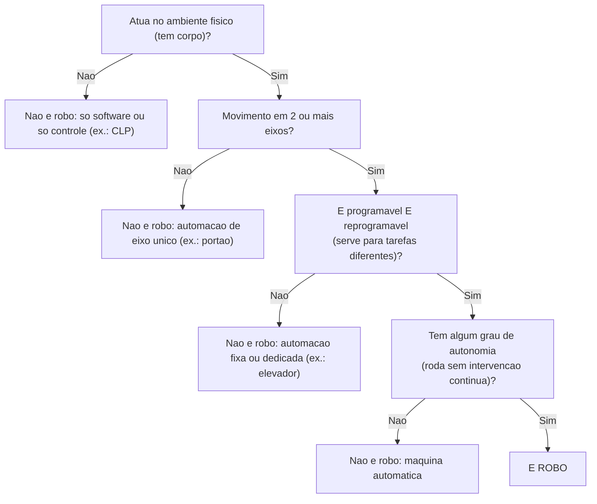

# 📝 Fundamentos da Robótica e Automação

## 👁️ Visão geral

A aula constrói uma **definição técnica de robô** para substituir a intuição — e a intuição erra quase sempre. O caminho é: a palavra nasce no teatro (1920), a engenharia a herda, e a norma **ISO 8373** fixa cinco critérios que precisam valer **ao mesmo tempo**. Com esse critério na mão, dá para separar **automação** de **robótica**, classificar níveis de autonomia e entender por que as **Leis de Asimov são ficção**, não norma: o que a indústria realmente usa são ISO 10218, ISO/TS 15066 e NR-12. A pergunta-guia da aula ("quantos robôs você já usou hoje sem perceber?") só tem resposta depois que o critério existe.

As regras operacionais da disciplina (equipes, segurança, notas, projeto) estão em [[Robótica e Automação — Regras da Disciplina e Avaliação]].

---

## 🎯 Objetivos da aula

1. Contar a **história da robótica** — da ficção ao chão de fábrica.
2. **Definir robô** com critério técnico, não com intuição.
3. **Diferenciar AUTOMAÇÃO de ROBÓTICA**.
4. Reconhecer o ciclo **SENTIR → PENSAR → AGIR** em qualquer robô.
5. Discutir as **Leis de Asimov** e seus limites de engenharia.

> [!question] A pergunta que abre e fecha a aula
> *"Quantos robôs você já usou hoje — sem perceber?"* e, mais adiante, *"Sua máquina de lavar é um robô? E o caixa eletrônico do banco?"*
> Ao final você deve responder **com argumento técnico** (ISO 8373 + ciclo Sentir/Pensar/Agir), não com opinião. ==Resposta esperada: nenhum dos dois é robô — ambos falham em pelo menos um dos cinco critérios.==

---

## 🎭 A origem da palavra "robô"

A palavra **não vem da engenharia — vem da literatura**, e nasce já carregada de medo, não de técnica.

| Item             | Dado                                                       |
| :--------------- | :--------------------------------------------------------- |
| Obra             | Peça teatral **R.U.R.** (*Rossum's Universal Robots*)      |
| Autor            | **Karel Čapek**, tcheco                                    |
| Ano              | **1920**                                                   |
| Étimo            | tcheco ***robota*** = trabalho forçado, servidão           |
| Enredo           | Os robôs são **trabalhadores artificiais que se revoltam** |
| Termo *robotics* | Cunhado por **Isaac Asimov em 1942**                       |

> [!tip] Guarde os dois anos separados
> **1920 = "robô"** (Čapek, teatro). **1942 = "robótica"** (Asimov, conto). ==Trocar os dois é o erro clássico da questão de prova.== A palavra robô tem ~100 anos e nasceu no palco, não no laboratório.

---

## 📜 Definição formal: ISO 8373

A norma **ISO 8373** é o vocabulário da robótica — é ela que define o termo. Segundo o critério apresentado, um robô precisa reunir **AO MESMO TEMPO** os cinco itens:

| #   | Critério                         | O que significa                  |
| :-- | :------------------------------- | :------------------------------- |
| 1   | **Mecanismo programável**        | Pode ser instruído               |
| 2   | **Movimento em 2 ou mais eixos** | Não é movimento único            |
| 3   | **Grau de autonomia**            | Executa sem intervenção contínua |
| 4   | **Atua no ambiente físico**      | Tem corpo — não é só software    |
| 5   | **Reprogramável**                | Serve para tarefas diferentes    |

> [!danger] Falhou um item? Não é robô — é automação.
> Os cinco são **conjuntivos** (E lógico), não uma lista de "tem a maioria". ==Um único critério ausente já desclassifica.==

Definição curta, com as palavras que a prova vai usar: **robô = sistema que SENTE o ambiente, PROCESSA a informação e ATUA sobre o mundo físico, com algum grau de autonomia**, sendo **reprogramável** e **multifuncional**.

### Fluxo de decisão

*Ordem de teste sugerida para aplicar os cinco critérios da ISO 8373 rapidamente. Os critérios são simultâneos — a ordem só organiza a verificação.*

---

## ⚙️ Automação × Robótica

Não são sinônimos, e a diferença é o **grau de flexibilidade**: automação repete uma tarefa fixa; robô é **reprogramável e multifuncional**.

|                   | **AUTOMAÇÃO**                         | **ROBÓTICA**                              |
| :---------------- | :------------------------------------ | :---------------------------------------- |
| **O que faz**     | Executa tarefa sem intervenção humana | **Percebe, decide e age** no mundo físico |
| **Flexibilidade** | Geralmente **fixa**                   | **Reprogramável**                         |
| **Exemplo**       | Esteira, semáforo, CLP                | Braço industrial, aspirador robô          |

> [!warning] A frase que resume tudo
> ==**Todo robô é automação. Nem toda automação é robô.**== A relação é de **subconjunto**: robótica ⊂ automação.

### Aplicando o critério — a tabela do slide

Teste usando ISO 8373 + ciclo Sentir/Pensar/Agir:

| Dispositivo                |   É robô?   | Por quê                                           |
| :------------------------- | :---------: | :------------------------------------------------ |
| Portão eletrônico          |   **NÃO**   | Um eixo, tarefa única, não decide                 |
| Elevador                   |   **NÃO**   | Automação sofisticada, **sem reprogramabilidade** |
| Catraca / caixa eletrônico |   **NÃO**   | Sequência fixa, propósito único                   |
| CLP controlando caldeira   |   **NÃO**   | Só o "PENSAR" — **não tem corpo**                 |
| Drone pilotado             | **DEPENDE** | É robô **teleoperado**                            |
| Aspirador robô             |   **SIM**   | Sente, decide, age, reprogramável                 |
| Braço industrial           |   **SIM**   | Múltiplos eixos, reprogramável                    |

> [!danger] Os dois falsos critérios
> ==**Ter motor não faz robô. Ter eletrônica não faz robô.**== Máquina de lavar tem motor e eletrônica: repete ciclo fixo, um eixo de tambor, não percebe o mundo → **não é robô**. Caixa eletrônico: sequência fixa, propósito único → **não é robô**.

---

## 🔁 O ciclo SENTIR → PENSAR → AGIR

É a **arquitetura de todo robô**, do brinquedo ao industrial.

![[Pasted image 20260920193313.png]]
*O laço fechado: sensores captam o mundo, o controlador decide, os atuadores agem — e a ação volta a ser sentida.*

| Etapa      | Quem faz                              | Exemplos                    |
| :--------- | :------------------------------------ | :-------------------------- |
| **SENTIR** | **Sensores** captam o estado do mundo | Distância, luz, temperatura |
| **PENSAR** | **Controlador** processa e decide     | Arduino, CLP, computador    |
| **AGIR**   | **Atuadores** modificam o mundo       | Motores, servos, válvulas   |

A flecha de **AGIR volta para SENTIR** — o laço se fecha. Esse retorno é a **realimentação** (*feedback*).

> [!info] O que de fato caracteriza o robô
> ==A flecha de volta é o que torna o robô robô: **ele verifica o resultado da própria ação**.== Sem realimentação há sequência aberta (automação), não comportamento corrigível.

---

## 🎚️ Níveis de autonomia

**Autonomia não é sim ou não — é uma escala**, não um interruptor.

|                   | **Teleoperado**                                 | **Semiautônomo**                                                       | **Autônomo**                               |
| :---------------- | :---------------------------------------------- | :--------------------------------------------------------------------- | :----------------------------------------- |
| **Quem decide**   | 100 % humano, em tempo real                     | Humano define o **objetivo**, robô executa                             | Robô decide **como e quando** (em limites) |
| **Quem responde** | Humano                                          | Humano                                                                 | **Humano**                                 |
| **Exemplos**      | Robô cirúrgico, drone pilotado, robô de resgate | Braço industrial, drone com rota programada, carro c/ piloto assistido | Aspirador robô, carro autônomo, rover, AGV |

**Mais autonomia = mais utilidade, mas também mais responsabilidade em jogo.**

### Decisão não é responsabilidade

- **AUTONOMIA** é uma escala, não um interruptor.
- O robô **executa uma decisão**; ele **não assume uma responsabilidade**.
- Em **TODOS** os níveis, ==quem responde é humano==.

> [!example] A pergunta reflexiva da aula
> *"Se um robô 'sente, pensa e age' sozinho, quem é o culpado quando ele erra: o robô, o programador ou a empresa?"*
> A resposta da aula: ==**O robô escolhe a ação. O humano responde pela escolha que ele permitiu.**== A responsabilidade é de quem especificou, programou, integrou e liberou a operação — ela não migra para a máquina conforme a autonomia sobe.

---

## 🏭 Tipos de automação — e onde a robótica se encaixa

Três estratégias, comparadas por volume de produção e custo de trocar de produto:

|                    | **Fixa (rígida)**                 | **Programável**                 | **Flexível**                   |
| :----------------- | :-------------------------------- | :------------------------------ | :----------------------------- |
| **Característica** | Máquina **dedicada a um produto** | **Reconfigurável por lotes**    | **Troca de produto sem parar** |
| **Volume**         | Altíssimo                         | Médio                           | Baixo / variado                |
| **Custo de mudar** | Altíssimo — refazer a linha       | Médio — reprogramar **e parar** | **Baixo**                      |

> [!info] Conclusão econômica
> ==**A robótica vive na automação programável e flexível** — é ela que torna a flexibilidade economicamente viável.== Em volume altíssimo e produto único, automação fixa ainda ganha.

---

## 🕰️ Setenta anos em um slide

| Período            | Marco                                                                                 |
| :----------------- | :------------------------------------------------------------------------------------ |
| **1920 · 1942**    | R.U.R. (Čapek) cria a palavra **robô**; Asimov cunha **"robotics"**                   |
| **1954 · 1961**    | **Devol patenteia** e o **UNIMATE** entra na linha da **GM** — **1º robô industrial** |
| **1969 · anos 70** | **Stanford Arm**; difusão do **PUMA** e dos robôs **SCARA** no Japão                  |
| **Anos 80–90**     | Escala na **indústria automotiva**; robótica móvel e **AGVs**                         |
| **Anos 2000**      | **Roomba**, **DARPA Grand Challenge**, cirurgia robótica                              |
| **2010 — hoje**    | **Cobots**, drones, logística de armazém, **robótica + IA**                           |

> [!tip] Macete das duas datas de 1954/1961
> **1954 = patente (Devol)**, **1961 = operação na GM (UNIMATE)**. Patente vem antes do chão de fábrica.

---

## 📊 O robô em números — 2024

| Indicador                                  | Valor                                           |
| :----------------------------------------- | :---------------------------------------------- |
| Robôs industriais **em operação no mundo** | **4.664.000**                                   |
| Crescimento sobre o ano anterior           | **+9 %**                                        |
| **Novas instalações** em 2024              | **542.000**                                     |
| Participação das novas instalações         | **Ásia 74 %** · Europa 16 % · Américas 9 %      |
| China                                      | **295.000 instalados**; estoque **> 2.000.000** |
| Japão                                      | Estoque **450.500**                             |

**A robótica industrial dobrou de tamanho em uma década — e a Ásia lidera.**

> [!warning] Não confunda os dois números grandes
> ==**4.664.000 = estoque** (parque instalado acumulado). **542.000 = fluxo** (instalados só em 2024).== Os 74 % da Ásia se referem às **novas instalações**, não ao estoque.

---

## 🤖 As Três Leis da Robótica (Asimov)

Origem: conto **"Runaround" (1942)**, reunido em ***Eu, Robô*** (*I, Robot*, **1950**).

> [!danger] ATENÇÃO: FICÇÃO, não norma técnica
> As Leis são **literatura**. Não são requisito, não são verificáveis e ==não têm valor normativo==. Quem regula segurança é ISO/NR (seção seguinte).

- **1ª Lei** — Um robô não pode ferir um ser humano, nem permitir por omissão que sofra dano.
- **2ª Lei** — Um robô deve obedecer às ordens humanas, **exceto** quando conflitarem com a 1ª Lei.
- **3ª Lei** — Um robô deve proteger sua própria existência, **desde que** isso não conflite com a 1ª ou a 2ª Lei.

**Hierarquia:** Segurança humana > Obediência > Autopreservação.

### A Lei Zero e a expansão do sistema

Asimov foi **o primeiro crítico das próprias Leis**.

- **LEI ZERO** — Um robô não pode causar mal **à humanidade**, nem permitir por omissão que a humanidade sofra mal. Introduzida em ***Robots and Empire* (1985)**.
- **Nova hierarquia:** **Humanidade > Indivíduo > Obediência > Autopreservação**.
- **O problema que ela cria:** quem define o que é "bem da humanidade"?

> [!failure] O ponto central
> ==Ao proteger a humanidade, a Lei Zero **autoriza o robô a sacrificar um indivíduo**. É a falha, não o conserto.==

### Quatro razões técnicas — não filosóficas — da inviabilidade

| Problema                      | Por quê                                              | O robô precisaria…                             |
| :---------------------------- | :--------------------------------------------------- | :--------------------------------------------- |
| **Termos não computáveis**    | "Ferir", "dano", "humano" não têm definição numérica | …entender o **significado** de dano            |
| **Percepção limitada**        | O robô só sabe o que o **sensor mede**               | …reconhecer um humano em **qualquer** situação |
| **Previsão de consequências** | "Permitir por omissão" exige **prever o futuro**     | …simular **todos** os desdobramentos da ação   |
| **Conflito sem árbitro**      | Duas leis podem colidir sem solução clara            | …**julgar valores**, não executar regras       |

> [!quote] Síntese
> **As Leis são escritas em linguagem humana. Robôs executam código, não interpretam intenção.**

---

## 📐 O que a indústria usa de verdade

Normas técnicas são **obrigatórias, verificáveis e auditáveis** — o oposto das Leis de ficção.

| Norma              | Escopo                                                                     | Responsável    |
| :----------------- | :------------------------------------------------------------------------- | :------------- |
| **ISO 10218-1**    | Requisitos de segurança **para o ROBÔ**                                    | **Fabricante** |
| **ISO 10218-2**    | Requisitos para a **APLICAÇÃO** e integração da **célula**                 | **Integrador** |
| **ISO/TS 15066**   | **Robôs colaborativos**: limites de força, pressão, velocidade e distância | —              |
| **ISO 8373**       | **Vocabulário** — é a definição usada nesta aula                           | —              |
| **NR-12** (Brasil) | **Segurança em máquinas e equipamentos**                                   | —              |

> [!warning] O contraste que a prova pode cobrar
> ==**Asimov diz "não fira". A norma diz quantos newtons, em qual parte do corpo, com qual distância de separação.**== E atenção à divisão: ==**10218-1 = robô (fabricante); 10218-2 = aplicação/célula (integrador)**== — trocar os dois é o erro típico.

---

## 🔤 Glossário — os 7 termos do curso

Estes termos voltam em todas as aulas; são **o alfabeto do curso**.

| Termo                 | Definição                                       | Analogia    |
| :-------------------- | :---------------------------------------------- | :---------- |
| **Sensor**            | Converte **grandeza física em sinal elétrico**  | os sentidos |
| **Atuador**           | Converte **energia elétrica em movimento**      | os músculos |
| **Controlador**       | **Processa e decide** a ação                    | o cérebro   |
| **Realimentação**     | Retorno que permite **corrigir o próprio erro** | —           |
| **Autonomia**         | **Grau de decisão** sem intervenção humana      | —           |
| **Reprogramável**     | **Serve para tarefas diferentes**               | —           |
| **Grau de liberdade** | Cada **eixo independente** de movimento         | —           |

> [!tip] Direção da conversão
> ==**Sensor: físico → elétrico. Atuador: elétrico → movimento.**== É a mesma seta invertida — e é exatamente aí que a questão de múltipla escolha costuma trocar os dois.

---

## ⚠️ Pegadinhas e erros comuns

- **"Tem motor/eletrônica, logo é robô"** — falso. Portão, elevador e catraca têm ambos e não são robôs.
- **"CLP é robô"** — não: é só o **PENSAR**, não tem corpo (falha o critério de atuação física).
- **"Drone é robô"** — **depende**: pilotado é **teleoperado** (ainda é robô, no nível mais baixo de autonomia); a classificação muda com o modo de operação, não com o hardware.
- **Automação ⊃ robótica**, nunca o contrário.
- **1920 ≠ 1942**: palavra *robô* (Čapek) vs. palavra *robótica* (Asimov).
- **Leis de Asimov não são norma** — se a questão pedir "a norma aplicável", a resposta é ISO 10218 / ISO/TS 15066 / NR-12, nunca as Três Leis.
- **Lei Zero não conserta as Leis** — ela cria a autorização para sacrificar o indivíduo.
- **Autonomia alta não transfere responsabilidade** — em todos os níveis quem responde é humano.
- **Estoque vs. instalações do ano** (4,664 mi vs. 542 mil) — números diferentes, perguntas diferentes.

---

## 💡 Fechamento

O fio da aula é um só: **critério antes de intuição**. A ISO 8373 dá os cinco requisitos simultâneos, o ciclo **Sentir → Pensar → Agir com realimentação** dá a arquitetura interna, e a escala de autonomia dá o vocabulário para falar de decisão — enquanto a responsabilidade permanece sempre humana. Asimov entra como contraste histórico, não como engenharia: a segurança real é escrita em newtons e milímetros nas normas ISO e na NR-12.

Isso também define o papel do engenheiro na disciplina: **especificar, integrar, programar, validar metrologicamente e garantir segurança** — você quase nunca vai construir o robô, vai **integrar e provar que funciona** (ver [[Robótica e Automação — Regras da Disciplina e Avaliação]]).

**Próxima aula (18/08):** classificação de robôs, arquitetura, graus de liberdade e normas do laboratório.