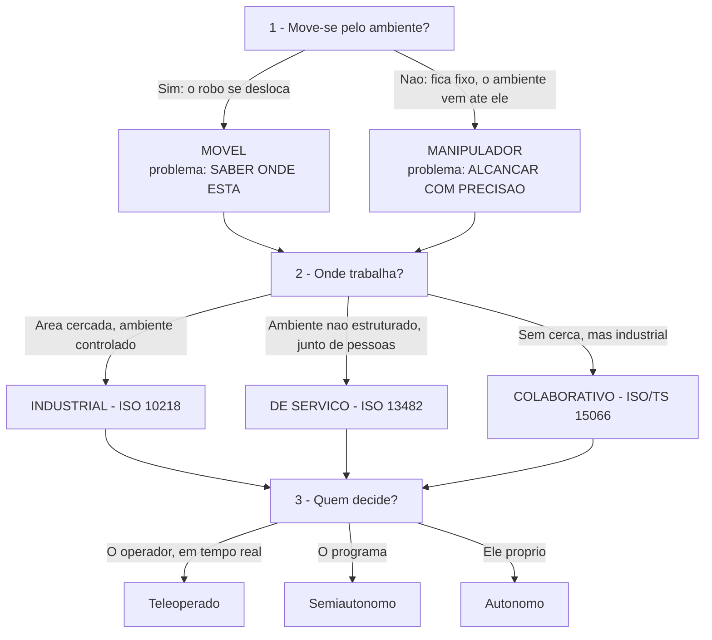

# 📝 Classificação de Robôs, Graus de Liberdade e Arquitetura

## 👁️ Visão geral

Se a Aula 1 respondeu **o que é** um robô ([[Fundamentos da Robótica e Automação]]), esta responde **de que tipos** eles são, **como se descreve o movimento** de um e **como a arquitetura se organiza por dentro**. São três blocos encadeados: (1) classificação por **três perguntas** — move-se ou fica fixo, onde trabalha, quem decide —, que separa móveis de manipuladores e industriais de serviço; (2) **graus de liberdade**, que quantificam o que o robô consegue e o que não consegue fazer *antes de qualquer programação*; (3) a **cadeia física real** — sensor, condicionamento, A/D, controlador, driver, atuador, realimentação — e a distinção entre **malha aberta e malha fechada**. Encerra a parte teórica da **Unidade 1**; a próxima aula é na bancada.

> [!question] A pergunta que abre o bloco 1
> *"Um aspirador robô e um braço de solda são a mesma coisa?"* — **os dois passam no critério da ISO 8373 e os dois sentem, pensam e agem. Então por que ninguém confundiria um com o outro?**
> A resposta se monta peça por peça: eles respondem **diferente nas três perguntas** de classificação.

---

## 🔍 Classificação: as três perguntas

Uma **família de robôs** é definida **menos pelo que ele faz e mais por três respostas**:

1. **ELE SE MOVE PELO AMBIENTE**, ou fica fixo e move o ambiente?
2. **ONDE ELE TRABALHA** — chão de fábrica, ou junto de pessoas?
3. **QUEM DECIDE** — o operador, o programa, ou ele próprio?

> [!info] Hierarquia das perguntas
> **A primeira pergunta é a que gera a divisão mais importante da robótica** (móvel × manipulador). As outras duas refinam a família dentro dessa divisão.

*Árvore de classificação montada a partir das três perguntas. A terceira pergunta reaproveita a escala de autonomia da Aula 1.*

> [!warning] Classificação não é gaveta
> ==**Nenhuma classificação é gaveta fechada — importa saber POR QUE.**== Um drone pilotado é móvel, trabalha em campo aberto e é teleoperado; o mesmo drone com rota programada muda a terceira resposta sem mudar o hardware.

---

## 🚗 Móveis × Manipuladores

|                      | **MÓVEL**                                     | **MANIPULADOR**                                          |
| :------------------- | :-------------------------------------------- | :------------------------------------------------------- |
| **Quem se desloca**  | O **robô se desloca**; o ambiente fica parado | O **robô fica fixo**; o ambiente vem até ele             |
| **Problema central** | ==**SABER ONDE ESTÁ**==                       | ==**ALCANÇAR COM PRECISÃO**==                            |
| **Exemplos**         | Aspirador, AGV de armazém, rover, drone       | Braço de solda, braço de pintura, o **Dobot** da bancada |

> [!info] Por que isso importa para o curso
> **Duas famílias, dois problemas diferentes — e por isso duas matemáticas diferentes na Unidade 3.** Localização/navegação para o móvel; cinemática de posicionamento para o manipulador.

---

## 🏭 Industriais × De serviço

|                | **INDUSTRIAL**                                     | **DE SERVIÇO**                                         |
| :------------- | :------------------------------------------------- | :----------------------------------------------------- |
| **Ambiente**   | Controlado, **cercado**, com trajetória repetitiva | **Não estruturado**, muitas vezes **junto de pessoas** |
| **Prioridade** | **Repetibilidade e velocidade**                    | **Segurança e adaptação**                              |
| **Norma**      | **ISO 10218**                                      | **ISO 13482**                                          |

O **robô colaborativo (cobô)** fica **entre os dois**: é um industrial que trabalha **sem cerca** — e por isso tem norma própria, a **ISO/TS 15066**.

### Por que o cobô tem norma própria: a cerca virou comportamento

A **ISO 10218 pressupõe uma cerca**: ninguém entra na área enquanto o robô se move. O colaborativo **abre mão dessa cerca** — alguém pode estar ao lado dele, com o robô ligado. Precisa então de **regras que substituam a cerca**:

- **Limite de força e potência** no contato
- **Monitoramento de velocidade e distância**
- **Guiamento pela mão do operador**

> [!tip] A frase para guardar
> **Proteção física trocada por proteção de comportamento** — é exatamente isso que a **ISO/TS 15066** acrescenta.

### Aplicando às três perguntas

Exercício proposto em aula com seis equipamentos reais: aspirador robô doméstico · braço de solda numa linha de montagem · AGV que transporta caixas num centro de distribuição · robô cirúrgico teleoperado · drone de inspeção de linha de transmissão · o Dobot Magician da bancada.

| Equipamento                   | 1 · Move-se?    | 2 · Onde trabalha                      | 3 · Quem decide                       |
| :---------------------------- | :-------------- | :------------------------------------- | :------------------------------------ |
| Aspirador robô doméstico      | **Móvel**       | Serviço — junto de pessoas             | Ele próprio (autônomo)                |
| Braço de solda                | **Manipulador** | Industrial — cercado                   | O programa                            |
| AGV de centro de distribuição | **Móvel**       | Industrial, mas partilhado com pessoas | O programa (rota)                     |
| Robô cirúrgico teleoperado    | **Manipulador** | Serviço — junto de pessoas             | O **operador**, em tempo real         |
| Drone de inspeção             | **Móvel**       | Não estruturado, campo aberto          | Operador ou programa, conforme o modo |
| Dobot Magician                | **Manipulador** | Didático — bancada, sem cerca          | O programa                            |

> [!question]- Fechando a pergunta de abertura (resolvida por mim, confira)
> **Aspirador × braço de solda:** o aspirador é **móvel**, de **serviço**, e decide **ele próprio**; o braço de solda é **manipulador**, **industrial cercado**, e quem decide é **o programa**. Respondem diferente nas **três** perguntas — por isso ninguém os confunde, mesmo os dois sendo robôs pela ISO 8373.

---

## 🔧 Graus de liberdade (GDL)

> [!info] Definição
> **Grau de liberdade = cada movimento independente que um corpo pode executar.** ==**Independente** significa: você pode alterá-lo **sem alterar nenhum dos outros**.==

**Para que serve:** o número de graus de liberdade diz o que o robô **CONSEGUE** e o que **NÃO CONSEGUE** fazer — ==**antes de qualquer programação**==. É limite mecânico, não de software.

**No espaço livre:** um **corpo rígido tem 6** — três de **translação** (X, Y, Z) e três de **rotação** (giro em torno de cada eixo).

| Objeto                       |  GDL  |
| :--------------------------- | :---: |
| Corpo rígido no espaço       | **6** |
| Porta comum                  | **1** |
| Gaveta                       | **1** |
| Braço humano, do ombro à mão | **7** |

> [!tip] Como contar (slide 14)
> **Olhe o manipulador e conte. Não os motores. Não as peças. Os MOVIMENTOS que não dependem uns dos outros.**

### De onde vem o número: as juntas

Cada junta contribui com um **número fixo**, conforme o movimento que permite:

![[Pasted image 20260920193932.png]]
*Os cinco tipos de junta e o número de graus que cada uma contribui (Carrara, Introdução à Robótica Industrial, 2015, p. 9–10).*

| Junta          | Movimento                                    | Graus |
| :------------- | :------------------------------------------- | :---: |
| **Prismática** | Desliza em linha reta                        | **1** |
| **Rotativa**   | Gira em torno de um eixo, como uma dobradiça | **1** |
| **Cilíndrica** | Desliza **e** gira                           | **2** |
| **Planar**     | Desliza em duas direções                     | **2** |
| **Esférica**   | Gira em três eixos, como o ombro             | **3** |

$$\text{GDL}_{\text{robô}} = \sum \text{graus das juntas da cadeia}$$

> [!danger] O erro clássico
> ==**Contar juntas não é contar motores: uma esférica sozinha já vale três.**== Uma cadeia com 4 juntas pode ter 4, 6 ou mais graus, dependendo do tipo de cada uma.

### Quantos graus são necessários?

| Objetivo                                    | GDL necessários |
| :------------------------------------------ | :-------------: |
| **Posicionar** um ponto no espaço (x, y, z) |      **3**      |
| **Posição e orientação** completas          |      **6**      |

Para colocar a mão em um lugar exato no espaço tridimensional são necessárias **3 coordenadas de posição** (x, y, z) e **3 de orientação** (inclinação, rotação e direção).

| Relação com a tarefa       | Consequência                                                                       |
| :------------------------- | :--------------------------------------------------------------------------------- |
| **Menos** que o necessário | ==A tarefa é **impossível**, e **nenhum programa resolve**==                       |
| **Exato**                  | Existe uma **única forma** de chegar a cada ponto                                  |
| **Mais** que o necessário  | Existem **infinitas formas**; o robô é **REDUNDANTE** e pode desviar de obstáculos |

> [!example] O exemplo do corpo
> **Seu braço tem 7 graus de liberdade para uma tarefa de 6.** É por isso que você alcança o mesmo copo com o cotovelo em várias posições. Esse "grau sobrando" é a definição prática de **redundância**.

### Redundância tem preço

Parece só ganho — mais formas de chegar ao mesmo ponto, mais chance de desviar de obstáculo. Mas:

- Cada grau a mais é **um motor a mais, um sensor a mais, um elo a mais** → **mais peso, mais custo, mais coisa que pode falhar**.
- **Custo de cálculo:** com graus a mais existem **infinitas soluções** para a mesma tarefa, e o controlador precisa de um **critério para escolher** — **deixa de ser conta direta**.

> [!info] Regra de projeto
> ==**O projetista escolhe o grau de liberdade pela TAREFA, não pelo máximo.**== O **Dobot tem 4** porque pegar e colocar peças é tarefa de 4.

---

## 🔗 A cadeia real de um sistema robótico

O ciclo conceitual **SENTIR → PENSAR → AGIR** da Aula 1, aberto em **componentes reais** — os mesmos que serão montados, ligados e programados a partir da Unidade 2.

![[Pasted image 20260920194150.png]]
*Cada etapa do ciclo com seus blocos físicos e o caminho de realimentação voltando do atuador ao controlador.*

| Etapa             | Cadeia de componentes                                      |
| :---------------- | :--------------------------------------------------------- |
| **SENTIR**        | **sensor → condicionamento de sinal → conversor A/D**      |
| **PENSAR**        | **controlador** (Arduino, CLP, computador) → **algoritmo** |
| **AGIR**          | **driver de potência → atuador** (motor, servo, válvula)   |
| **REALIMENTAÇÃO** | **encoder** ou **sensor de posição** volta ao controlador  |

> [!danger] A frase-chave do bloco
> ==**O controlador nunca aciona o motor diretamente: entre eles há sempre um estágio de potência.**==

### Por que existe sempre um estágio de potência

**Decidir não é ter força.** O controlador **decide O QUE fazer**, mas **não tem força elétrica para fazer**.

- A **corrente que um motor puxa é muito maior** que a que um pino de controlador entrega.
- **Ao desligar, o motor devolve energia pelo próprio fio** — **corrente reversa** que o controlador não foi feito para receber.
- O **estágio de potência separa as duas coisas**: o controlador manda um **sinal de baixa corrente**; o **driver amplifica e protege**.

> [!danger] O erro que queima o Arduino
> ==**Ligar o motor direto no pino não economiza um componente** — queima a placa.== Vale tanto para a corrente de acionamento quanto para a corrente reversa do desligamento.

Falta ainda uma pergunta: **como o controlador sabe se o motor obedeceu?** É a **malha de controle**.

---

## 🔄 Malha aberta × malha fechada

![[Pasted image 20260920194206.png]]
*Malha aberta: controlador → motor de passo, sem retorno. Malha fechada: controlador → amplificador → servo motor, com encoder/sensor de posição realimentando.*

|                             | **MALHA ABERTA**                                                       | **MALHA FECHADA**                                                                                       |
| :-------------------------- | :--------------------------------------------------------------------- | :------------------------------------------------------------------------------------------------------ |
| **O que o controlador faz** | Manda **e não confere**                                                | Manda, **mede o resultado e corrige**                                                                   |
| **Elementos extras**        | —                                                                      | **Amplificador**, **sensor de posição**, **encoder**, caminho de **realimentação (posição/velocidade)** |
| **Custo/complexidade**      | Mais **simples**, mais **barato**                                      | Mais **preciso**, mais **caro**                                                                         |
| **Exemplo**                 | **Motor de passo sem encoder** — se perder passos, **ninguém percebe** | **Servo com encoder** — sabe onde está e **corrige o erro**                                             |

> [!info] Definição de servo-motor
> **"Servo-motor" já nasce assim: motor + sensor de posição + controle realimentado** (Carrara, 2015, p. 23). Não é um motor melhor — é um **conjunto** que inclui a malha.

### Você já usa os dois, sem perceber

- **Termostato:** mede a temperatura, compara com o alvo, liga e desliga para corrigir a diferença.
- **Piloto automático:** mede a velocidade, compara com a programada, corrige a aceleração.

Ambos são **malha fechada com outro nome** — é a **flecha de volta do ciclo da Aula 1, agora com nome de engenharia**. O padrão é sempre o mesmo: ==**medir → comparar com o alvo → corrigir**==.

### Precisão por construção, não por correção

Se malha fechada é mais precisa, por que um **motor de passo** é preciso em **malha aberta**? Não é contradição:

- A precisão do motor de passo **vem de outro lugar**: **cada passo é um ângulo fixo, conhecido de fábrica**, e o motor **mantém torque mesmo parado** (Carrara, 2015, p. 25–26).
- **Se a carga não exigir mais torque nem mais velocidade do que ele aguenta, o motor nunca perde um passo** — e ==**sem passo perdido, não existe erro para uma malha fechada corrigir**==.

> [!warning] Malha fechada não é "sempre melhor"
> É o que se usa **quando o sistema pode acumular um erro que precisa ser medido**. Onde a precisão é garantida pela construção (e a carga respeita os limites), a malha aberta basta — e sai mais barata.

---

## 📋 AF1 — Atividade avaliada

**Primeira Avaliação Formativa do semestre.** Conta nota **como entrega, não como acerto**: **tentativa completa em todas as questões vale nota integral**.

- **Individual ou em dupla**, a critério do aluno
- **15 a 20 minutos**
- O professor passa recolhendo ao final
- **Gabarito comentado na próxima aula**, com uma pergunta curta de retomada antes da devolução

### Questões

**1.** Classifique estes três equipamentos pelas três perguntas de hoje — move-se ou fica fixo, onde trabalha, quem decide: **robô de entrega autônomo em calçada** · **guindaste automatizado de porto** · **exoesqueleto de reabilitação**.

> [!question]- Resposta (resolvida por mim, confira)
> **Robô de entrega em calçada** — (1) **móvel**: ele se desloca, o ambiente fica parado; (2) **de serviço**, ambiente **não estruturado** e junto de pessoas → norma de referência ISO 13482; (3) **ele próprio decide** (autônomo), com supervisão remota eventual.
> **Guindaste automatizado de porto** — (1) **manipulador**: a base é fixa e a carga vem até ele (o carro/spreader move-se dentro de um envelope, não pelo ambiente); (2) **industrial**, área controlada e interditada → ISO 10218 / NR-12; (3) **o programa**, com operador supervisionando.
> **Exoesqueleto de reabilitação** — (1) **híbrido, mas classificado pelo uso**: move-se pelo ambiente **junto com o usuário** — é vestível, não se desloca sozinho; (2) **de serviço**, ambiente não estruturado, em **contato físico permanente com a pessoa** → prioridade é segurança, ISO 13482 e princípios de limite de força da ISO/TS 15066; (3) decisão **compartilhada**: o humano inicia o movimento e o controle assiste. É o caso que mostra por que "classificação não é gaveta fechada".

**2.** Um manipulador hipotético tem **2 juntas rotativas, 1 junta prismática e 1 junta esférica**. Quantos graus de liberdade ele tem, e por quê?

> [!question]- Resposta (resolvida por mim, confira)
> $$2\times 1 + 1\times 1 + 1\times 3 = \mathbf{6\ \text{graus de liberdade}}$$
> Porque o total é a **soma dos graus das juntas da cadeia**: rotativa vale **1** cada (2), prismática vale **1**, esférica vale **3**. São 4 juntas e 6 graus — a esférica sozinha vale três, então contar juntas não é contar graus (nem motores). Com 6 GDL ele consegue, em princípio, **posição e orientação completas** no espaço, sem redundância.

**3.** Um sistema liga uma resistência de aquecimento por um **tempo fixo definido no código do Arduino** e desliga depois — **sem nenhum sensor medindo a temperatura** durante o processo. É malha aberta ou fechada? Se fosse transformar em malha fechada, o que precisaria acrescentar, e onde entraria o estágio de potência entre o Arduino e a resistência?

> [!question]- Resposta (resolvida por mim, confira)
> **É malha aberta.** O controlador **manda e não confere**: não há nenhuma medição do resultado (temperatura) voltando para ele, então variações de tensão, de massa aquecida ou de temperatura ambiente **não são corrigidas** — o sistema só sabe contar tempo.
> **Para fechar a malha** é preciso acrescentar: (a) um **sensor de temperatura** (NTC, LM35, DS18B20 ou termopar com módulo); (b) o **condicionamento/leitura** desse sinal por uma entrada do Arduino — analógica com **conversor A/D**, ou digital se o sensor já entregar valor digital; (c) no código, a **comparação com o valor-alvo (setpoint)** e a decisão de manter ou cortar o aquecimento (liga-desliga com histerese, ou PWM/PID). Isso cria o caminho de **realimentação** da cadeia.
> **O estágio de potência entra entre o pino do Arduino e a resistência**, nos dois casos — ==malha aberta ou fechada, ele é obrigatório==: o pino não entrega a corrente que a resistência exige. Na prática, um **relé, relé de estado sólido (SSR) ou MOSFET com driver**, acionado pelo sinal de baixa corrente do Arduino; o sensor fica do lado da leitura (entrada), e o driver do lado do acionamento (saída). O sensor **não** substitui o driver — são ramos diferentes da malha.

---

## ⚠️ Pegadinhas e erros comuns

- **Contar motores em vez de movimentos independentes** — a junta esférica vale 3 com um único conjunto mecânico.
- **"Mais graus é melhor"** — redundância custa peso, dinheiro, confiabilidade e, sobretudo, **cálculo** (infinitas soluções exigem critério de escolha).
- **Confundir "posicionar" com "posicionar e orientar"** — ==**3 GDL** para posição; **6 GDL** para posição + orientação==.
- **Menos GDL que a tarefa exige não se resolve com software** — é limite mecânico.
- **ISO 10218 ≠ ISO 13482 ≠ ISO/TS 15066** — industrial / serviço / colaborativo. O cobô não tem norma "extra por ser moderno": tem porque **abriu mão da cerca**.
- **"Malha fechada é sempre melhor"** — falso. Motor de passo dentro dos limites de torque e velocidade é **preciso por construção**.
- **Ligar motor direto no pino do Arduino** — queima; o estágio de potência é obrigatório **mesmo em malha aberta**.
- **Confundir realimentação com estágio de potência** — a realimentação é o caminho de **volta** (encoder → controlador); o estágio de potência é o caminho de **ida** (controlador → driver → atuador).
- **Móvel × manipulador não é sobre tamanho nem sobre autonomia** — é sobre **quem se desloca**: o robô ou o ambiente.

---

## 💡 Fechamento

Os três blocos da aula respondem em sequência às perguntas que sobram depois da definição de robô: **de que tipo** (três perguntas, duas famílias principais, três regimes normativos), **quanto ele consegue mexer** (graus de liberdade = soma das juntas, comparada com os 3 ou 6 da tarefa) e **do que ele é feito** (sensor → A/D → controlador → driver → atuador, com ou sem a flecha de volta). A ideia que costura tudo é que cada escolha é ditada pela **tarefa**, não pelo máximo técnico disponível: 4 graus no Dobot porque pick-and-place é tarefa de 4; malha aberta no motor de passo porque não há erro acumulando.

Isso **encerra a parte teórica da Unidade 1 — Fundamentos**. A próxima aula é na bancada, com o equipamento desenergizado e as regras de [[Robótica e Automação — Regras da Disciplina e Avaliação]]