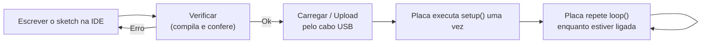

# 📝 Arduino Uno — Blocos, Pinos e Estrutura do Sketch

## 👁️ Visão geral

Esta aula **abre a caixa do bloco do meio**. A Aula 2 descreveu a arquitetura por fora — **Sensor → Processamento → Atuação** ([[Classificação de Robôs, Graus de Liberdade e Arquitetura]]); aqui o **Processamento** é aberto e ganha nome, pinos e tensões. O fio condutor é a pergunta *"o que faz uma placa de circuito conseguir 'pensar' e reagir ao mundo?"*, e a resposta tem duas metades que aparecem em quase todo slide: a **placa** (hardware) e a **IDE** (software). Fecha com a estrutura mínima de um programa Arduino — `setup()` e `loop()` — e com a **AF2**, respondida em formulário no Google Classroom.

> [!question] Retomada do início da aula (sem consultar nada)
> 1. Quais são as **três etapas da arquitetura** de um robô? → **Sentir → Pensar → Agir** (sensor, processamento, atuação).
> 2. Que **critério separa um robô de uma máquina automática**? → Os cinco requisitos simultâneos da **ISO 8373** (ver [[Fundamentos da Robótica e Automação]]); na prática, **reprogramável e multifuncional**, com ≥2 eixos, corpo físico e autonomia.
> 3. Um **Arduino Uno** é sensor, processamento ou atuação? → ==**Processamento**== — é o controlador da cadeia, não o sensor nem o atuador.

---

## 🇮🇹 O que é o Arduino

Em **2005**, um grupo de **pesquisadores italianos** criou uma plataforma para que **qualquer pessoa pudesse montar um sistema autônomo, sem precisar ser engenheiro**. O resultado foi o Arduino.

**Por que ficou popular:** a vantagem sobre outras plataformas é a **facilidade de uso** — pessoas sem formação técnica aprendem o básico e criam projetos próprios em pouco tempo.

> [!info] Os dois componentes — a ideia central da aula
> O Arduino é formado por **dois** componentes:
> - **Hardware** — a **placa**, que roda o projeto;
> - **Software / IDE** — onde se **escreve o que a placa deve fazer**.
>
> ==Placa sem sketch carregado não é "um Arduino funcionando" — é metade da plataforma.==

---

## 🧱 Os quatro blocos de funcionamento

**Qualquer placa com microcontrolador** se organiza nos mesmos blocos de função:

| Bloco | Função |
| :--- | :--- |
| **Alimentação** | Fornece **energia** |
| **Processamento** | O **microcontrolador** — decide o que fazer |
| **Entrada e saída (I/O)** | Conecta com **sensores e atuadores** |
| **Comunicação** | **Troca dados** com outro sistema |

> [!example] Exercício feito em aula
> Classifique cada item no bloco certo:
>
> | Item | Bloco |
> | :--- | :--- |
> | O pino que liga a um LED | **Entrada / Saída** |
> | O cabo USB | **Comunicação** |
> | O chip ATmega328 | **Processamento** |
> | O pino de alimentação externa | **Alimentação** |
>
> ⚠️ A pegadinha é o **cabo USB**: ele também pode **alimentar** a placa, mas sua função de bloco é **comunicação**. E o **pino do LED** é I/O mesmo entregando corrente — não é "alimentação".

---

## 🔌 Anatomia da placa Uno

A placa Uno é organizada em blocos: **microcontrolador, conector USB, pinos de entrada e saída, pinos de alimentação, botão de reset e conversor serial-USB**.
![[Pasted image 20261004135430.png]]
*Os blocos físicos da placa: portas digitais, portas analógicas, microcontrolador, conector e pinos de alimentação, conector USB.*

### O microcontrolador

É **"o cérebro" do Arduino — um computador inteiro dentro de um chip pequeno**. O **Arduino Uno usa o ATmega328**.

> [!warning] Microcontrolador ≠ microprocessador
> O slide rotula o chip como "microprocessador", mas o termo técnico correto para o ATmega328 é **microcontrolador**: ele reúne **CPU + memória + periféricos de I/O no mesmo chip**. Um microprocessador (o de um PC) é só a CPU e depende de memória e periféricos externos. ==Na prova, "computador inteiro dentro de um chip" = microcontrolador.==

### Pinos de entrada e saída

Pinos **programáveis para agir como entrada ou saída**, conectando o Arduino ao mundo externo — sensores, LEDs, motores.

| Recurso | Quantidade no Uno |
| :--- | :---: |
| Portas digitais (I/O) | **14** |
| Entradas analógicas | **6** |
| Saídas **PWM** | **6** |

> [!tip] O número que confunde
> ==As **6 saídas PWM não são pinos extras**: são algumas das 14 digitais que também sabem gerar PWM.== E as 6 entradas analógicas são um conjunto separado das digitais.

### Conector USB, reset e comunicação serial

- O **conector USB** liga o Arduino ao computador — **comunicação** e, **opcionalmente, alimentação**.
- O botão de **reset** reinicia a placa.
- Os **LEDs TX/RX** piscam quando a placa **transmite ou recebe** dados.

### Pinos de alimentação

Os pinos de alimentação **fornecem tensão para os componentes do projeto** — **5V, 3.3V, GND e Vin**. Devem ser usados **com cuidado, sem exceder a corrente suportada pela placa**.

---

## ⚡ Grandezas digitais × analógicas

| | **Digital** | **Analógica** |
| :--- | :--- | :--- |
| Como varia | **Em saltos** | **Continuamente** |
| Analogia do slide | A **escada** | A **rampa** |

### Como isso aparece no Arduino

![[arduino-uno-faixas-de-tensao.png]]
*As três faixas de tensão que convivem na placa: níveis lógicos, faixa analógica de leitura e alimentação externa.*

| Grandeza | Valor |
| :--- | :--- |
| **Nível lógico alto** | **5 V** |
| **Nível lógico baixo** | **0 V** |
| **Faixa analógica** | **0 V a 5 V** |
| **Conector de alimentação externa** | **7 V a 20 V** |

> [!danger] O número que cai na AF2
> ==**O conector de alimentação externa aceita no máximo 20 V.**== Acima disso, arrisca **danificar a placa** — e tensão maior **não deixa o Arduino mais rápido**.

### Por que usar resistor

**Cada componente tem uma corrente máxima de funcionamento.** O **resistor limita a corrente do circuito** — ==**protege o componente e protege o próprio Arduino**==. É a mesma lógica do estágio de potência da Aula 2, na escala do pino: o pino não foi feito para entregar corrente sem limite.

---

## 💻 A IDE e o sketch

A **IDE Arduino** é um programa simples de usar e entender, com **bibliotecas prontas para baixar**. É onde se **escreve, confere e envia** o código para a placa.

| Botão | O que faz |
| :--- | :--- |
| **Verificar** | **Confere** o código |
| **Carregar (Upload)** | **Envia** o código para a placa |
| **Editor de código** | Onde o código é escrito |

**Carregar o código:** escrito o código na IDE, o botão **Upload/Carregar transfere o programa da IDE para a placa, pelo cabo USB**.


*Caminho do código, da IDE até a execução na placa.*

### A estrutura de um sketch

```cpp
void setup() {
  // roda UMA ÚNICA VEZ, ao ligar ou reiniciar a placa
  // aqui vai a configuração: pinMode, Serial.begin, etc.
}

void loop() {
  // roda EM CICLO, repetidamente, enquanto a placa estiver ligada
  // aqui vai o que precisa reagir ao mundo: ler sensor, decidir, acionar
}
```

| Função | Quando roda | O que colocar dentro |
| :--- | :--- | :--- |
| **`void setup()`** | **Uma única vez**, ao ligar ou **reiniciar** a placa | Configuração que não muda |
| **`void loop()`** | **Em ciclo, repetidamente**, enquanto a placa estiver ligada | Tudo que precisa **reagir a mudanças** |

> [!tip] O critério de decisão
> ==Pergunte: "isso precisa **se repetir** para reagir ao ambiente?" Se sim → `loop()`. Se é ajuste feito uma vez → `setup()`.==
> Leitura de sensor **sempre** vai no `loop()`: o mundo muda, e o `setup()` não roda de novo.

---

## 🧠 Voltando à pergunta de hoje

> [!success] A resposta
> Uma placa **"pensa" porque tem um microcontrolador programável**, e **"reage" porque tem pinos que sentem e agem sobre o mundo** — ==tudo escrito e enviado pela IDE==.

> [!quote] Fecho da aula
> **"O Arduino não é mágica — é um computador pequeno, com portas para o mundo, esperando que alguém escreva o que ele deve fazer."**

---

## 📋 AF2 — Atividade avaliada (formulário no Google Classroom)

Quatro perguntas, cada uma em uma seção do formulário (S1 a S4), sempre com **resposta + o porquê em uma frase**. Versão completa com as alternativas na ordem do formulário em [[Avaliação Formativa 2 — Gabarito (Arduino Uno)]]. ==**O envio do formulário, com todas as seções respondidas, é a entrega da atividade da aula.**==

**1.1 (seção S1).** Você monta o circuito de um Arduino Uno numa protoboard, com todos os fios e componentes no lugar certo — mas ainda não escreveu nem carregou nenhum código. Esse circuito, sozinho, já é "um Arduino funcionando"?
( ) Sim — a placa sozinha já executa funções por padrão, sem precisar de código.
( ) Não — falta instalar um sistema operacional na placa antes de qualquer coisa.
( ) Sim, desde que esteja conectada à internet.
( ) Não — falta o programa (o sketch), escrito e carregado pela IDE, que é a outra metade da plataforma, junto com a placa.
**1.2.** Em uma frase: por que você respondeu assim?

> [!question]- Resposta (resolvida por mim, confira)
> ✅ ***Não — falta o programa (o sketch), escrito e carregado pela IDE.***
> **Porquê:** a plataforma Arduino tem **duas metades — placa e IDE** —, e sem o programa carregado o microcontrolador não executa a lógica do projeto.
> As outras caem por: a placa **não** vem com funções do projeto por padrão; Arduino Uno **não usa sistema operacional** (o sketch roda direto no microcontrolador); e **internet não tem relação** — o Uno nem tem conectividade nativa.

**2 (seção S2).** Após o exercício de classificação nos quatro blocos: a resposta que vocês escreveram estava de acordo com a da lousa? Se não batia, onde errou? Se batia, algum deles gerou dúvida e quase fez errar? **Duas ou três frases.**

> [!question]- Como abordar (resolvida por mim, confira)
> É uma questão **metacognitiva** — não tem gabarito, avalia a reflexão. O gabarito do exercício é: LED → **Entrada/Saída**; cabo USB → **Comunicação**; ATmega328 → **Processamento**; pino de alimentação externa → **Alimentação**.
> Um bom candidato a "quase errei": ==o **cabo USB**, porque ele **também alimenta** a placa — mas o bloco é definido pela **função principal** (trocar dados), não por um efeito colateral.==

**3.1 (seção S3).** Você tem uma fonte de alimentação de 24 V sobrando em casa e quer ligar direto no conector de alimentação do Arduino, para não depender do cabo USB. Isso é seguro?
( ) Sim — quanto maior a tensão da fonte, mais rápido o Arduino processa.
( ) Não — o conector só aceita corrente contínua abaixo de 100 mA, e a preocupação é a corrente, não a tensão.
( ) Não — o conector de alimentação aceita no máximo 20 V; acima disso arrisca danificar a placa.
( ) Sim, desde que a fonte também tenha uma porta USB.
**3.2.** Em uma frase: por que você respondeu assim?

> [!question]- Resposta (resolvida por mim, confira)
> ✅ ***Não — o conector de alimentação aceita no máximo 20 V.***
> **Porquê:** a faixa do conector de alimentação externa é de ==**7 V a 20 V**==, e 24 V ultrapassa o limite, arriscando danificar o regulador e a placa.
> As outras caem por: **tensão não aumenta velocidade de processamento** (isso é função do clock); o problema aqui é **tensão**, não o limite de corrente; e ter porta USB na fonte **não muda** o que chega ao conector.

**4.1 (seção S4).** No código de um Arduino, tudo dentro de `void setup()` roda uma única vez, ao ligar a placa; tudo dentro de `void loop()` roda em ciclo, repetidamente. Você quer que o Arduino **leia um sensor de temperatura o tempo todo e ligue um LED sempre que o valor passar de um limite**. Dentro de qual das duas funções esse código deveria ficar?
( ) `void setup()` — a leitura do sensor só precisa ser configurada uma vez.
( ) `void loop()` — a leitura precisa se repetir, para reagir a mudanças no ambiente.
( ) Nenhuma das duas — leitura de sensor não é código de Arduino.
( ) Metade em cada uma, dividido igualmente.
**4.2.** Em uma frase: por que você respondeu assim?

> [!question]- Resposta (resolvida por mim, confira)
> ✅ **`void loop()`** — a leitura precisa se repetir, para reagir a mudanças no ambiente.
> **Porquê:** a temperatura **muda ao longo do tempo**, então a leitura e a comparação com o limite precisam **se repetir continuamente** — e só o `loop()` executa em ciclo.
> ⚠️ Detalhe fino: a **configuração** do pino do LED (`pinMode`) e da serial fica no `setup()`; o que vai para o `loop()` é a **leitura, a comparação e o acionamento**. A alternativa do `setup()` confunde **configurar** com **executar**.

---

## ⚠️ Pegadinhas e erros comuns

- **"Circuito montado = Arduino funcionando"** — falso. ==Sem o **sketch** carregado, falta a outra metade da plataforma.==
- **Arduino não tem sistema operacional** — o sketch roda direto no microcontrolador.
- **Confundir microcontrolador com microprocessador** — o ATmega328 é um **computador inteiro num chip**.
- **Tensão maior ≠ mais velocidade.** O limite do conector externo é **20 V**; a faixa útil é **7–20 V**.
- **Não confundir as três faixas:** níveis lógicos **0 V / 5 V** · faixa analógica **0–5 V** · alimentação externa **7–20 V**.
- **Somar 14 + 6 + 6 como se fossem 26 pinos** — as **6 PWM estão dentro das 14 digitais**.
- **Esquecer o resistor no LED** — ele protege **o componente e a placa**; é a versão de bancada do "o controlador não tem força".
- **Classificar o cabo USB como alimentação** — a função de bloco é **comunicação** (a alimentação é opcional).
- **Colocar leitura de sensor no `setup()`** — só configuração vai lá; o que reage ao mundo vai no `loop()`.

---

## 💡 Fechamento

A aula amarra três camadas do mesmo objeto: **funcional** (os quatro blocos que qualquer placa com microcontrolador tem), **física** (onde cada bloco está na Uno, com seus 14 + 6 + 6 pinos e suas faixas de tensão) e **lógica** (a IDE, o upload pelo USB e a divisão `setup()` / `loop()`). O conceito que atravessa tudo é o mesmo da Aula 2 em escala menor: ==**o controlador decide, mas tem limites elétricos**== — por isso existem o resistor, o limite de corrente dos pinos e a faixa de 7 a 20 V.

**Próxima aula (01/09):** a **AP1 — inspeção do manipulador Dobot**. A frente de embarcados continua depois, com **pinagem na prática e os primeiros programas**. Regras da bancada em [[Robótica e Automação — Regras da Disciplina e Avaliação]].