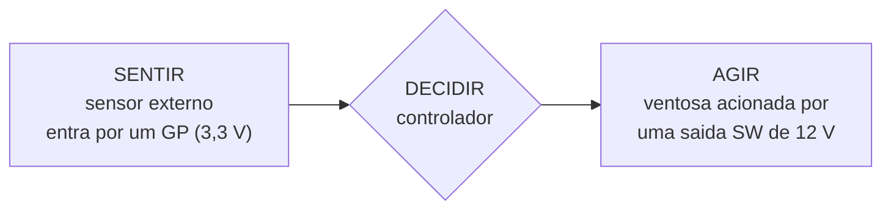

---

materia: Robótica e Automação 
fonte: Aula 05 — Atuadores, sensores e a interface do braço (USCS, 22/09/2026) 
tags:

- resumo
- atuadores
- sensores
- dobot
- arduino

---
# 📝 Atuadores, Sensores e a Interface do Braço

## 👁️ Visão geral

A aula responde **como um robô sabe onde está — e o que acontece quando ele não sabe**. São três blocos. (1) **Atuadores:** motor DC, servo de hobby e motor de passo, separados por uma única pergunta — _o motor sabe a própria posição?_ (2) **Sensores:** o que eles de fato entregam (quase nunca um número), como a resistência vira tensão por um **divisor** e como a tensão vira número pelo **ADC**. (3) **Interface:** o painel de conectores do Dobot, onde **cada pino fala uma tensão** — 3,3 V, 5 V ou 12 V — e ligar no errado queima a placa.

É a teoria que a **prova N1 de 20/10** cobra (Unidades 1 e 2) e a base da **AP2** no braço. Pré-requisitos: [[Classificação de Robôs, Graus de Liberdade e Arquitetura|malha aberta × malha fechada]] e [[Arduino Uno — Blocos, Pinos e Estrutura do Sketch|os pinos do Arduino]].

> [!question] A pergunta de abertura No dia em que o Dobot é ligado pela primeira vez, **antes de obedecer qualquer comando ele gira sozinho até um canto e volta**, com o LED azul piscando — e o manual exige isso toda vez. Um **motorzinho de brinquedo de R$ 15 vai direto para o ângulo pedido, sem procurar nada**. _Por que um braço de milhares de reais precisa se procurar antes de trabalhar?_

---

## 🕯️ A analogia que atravessa a aula

**Luz apagada.** Você está na porta e precisa chegar à mesa do professor.

|Situação|O que acontece|Equivale a|
|:--|:--|:--|
|**Sem nenhum método**|Te empurram numa cadeira de rodinhas — você se move, mas **não conta nem vê**|**Motor DC** puro|
|**Jeito 1: contar passos** desde a porta|Tropeçou numa mochila e perdeu a conta? **Não sabe mais onde está, e ninguém avisa.** Volta à parede e recomeça do zero|**Motor de passo** (+ homing)|
|**Jeito 2: acender a luz e olhar**|Você **mede** onde está, não conta|**Encoder**|

**Mais três peças** que reaparecem ao longo da aula:

- **Uma trena presa à porta, de 3 m** — mede com precisão, **mas só até ali** → o **servo de hobby**.
- **A faixa de luz que o olho aguenta** — nem clara demais, nem escura demais → a **faixa do ADC**.
- **Falar no volume certo** — nem alto demais, nem baixo demais → **a tensão de cada pino**.

---

## ⚙️ Bloco 1 — Atuadores

### Motor DC: gira, mas não sabe quanto

- **Tensão maior → gira mais rápido.** **Inverteu a tensão, inverte o sentido.**
- **PWM** (modulação por largura de pulso): o pino **liga e desliga centenas de vezes por segundo**; a **fração do tempo ligado vira a tensão média** que o motor sente.
- **O que ele não tem:** **nenhuma noção de posição**. Girou — quanto? Ninguém sabe.

### Ponte H: separar quem comanda de quem empurra

Um **pino do Arduino fornece dezenas de miliampères**; um **motor pequeno pede centenas**. Ligar direto queima o pino — e o pino sozinho não inverte o sentido.

- **Ponte H:** quatro **chaves eletrônicas** em volta do motor. Fechando duas, a corrente passa num sentido; fechando as outras duas, no oposto.
- O **comando** (baixa corrente) fica de um lado; a **potência** (alta corrente, **fonte própria**) do outro.

> [!info] É o estágio de potência da Aula 2, com nome Resolvido o **empurrão**. Falta saber **onde o motor parou**.

### Servo de hobby: sabe onde está, mas só até ali

O motorzinho de R$ 15 da abertura. **Dentro dele:**

1. um **motor DC**;
2. um **redutor** (engrenagens que **trocam velocidade por força**);
3. um **sensor de posição**;
4. um **circuito que compara o alvo com a posição real e corrige**.

É uma ==**malha fechada embutida**==: você pede um ângulo (**0 a 180°**) e ele vai.

**Custo:** **curso curto** e **torque pequeno** — não sustenta uma junta com carga. É a **trena presa à porta**: mede com precisão, mas só até 3 m.

### Motor de passo: não mede, conta

- Avança em **incrementos angulares fixos, um por pulso elétrico** — **não gira livremente** como o DC.
- **Sem sensor nenhum:** a posição é o **número de pulsos que o controlador mandou**. A precisão vem da **construção do motor**.
- **Parado, segura a posição com torque** — bom para junta que precisa ficar imóvel sob carga.

> [!danger] O risco embutido É **contar passos no escuro**: a posição **não está no motor** — é uma **variável na memória do controlador**, e **ninguém verifica se o que foi mandado é o que de fato aconteceu**.

### Os três lado a lado

||**Motor DC**|**Servo de hobby**|**Motor de passo**|
|:--|:--|:--|:--|
|**Sabe a posição?**|**Não sabe**|**Sabe**, por sensor interno|**Sabe contando**|
|**Como**|—|Malha fechada embutida|Nº de pulsos na memória do controlador|
|**Limites**|Barato e forte; precisa de **ponte H** e de um **sensor por fora**|Curso de **0 a 180°**, **torque pequeno**|**Segura a posição parado**, mas **confia que nenhum passo se perdeu**|

> [!tip] No Dobot da bancada ==As **juntas 1, 2 e 3 são motores de passo**; a **junta 4 é um servo**.== Num braço de linha industrial a resposta é outra.

> [!success] Síntese do bloco 1 **O Dobot conta; o industrial mede. Contar é barato; medir custa um sensor.**

---

### 🛑 PARADA 1 — Qual motor?

> Uma junta precisa **manter posição fixa sob carga**, **sem sensor externo**, com **repetibilidade conhecida**. Entre motor DC, servo de hobby e motor de passo: qual você escolhe? Por que os outros dois não servem?

> [!success]- Resposta dada em aula **Motor de passo:** segura a posição parado, **com torque**, e repete o mesmo incremento **sem precisar medir**. O **motor DC sozinho não sabe onde parou**. O **servo de hobby sabe, mas não sustenta a carga**. ⚠️ _"Quem escolheu servo pelo sensor interno **acertou o critério e errou o limite**."_ — o critério "saber a posição" estava certo; o que elimina o servo é o **torque**.

---

## 📍 Perder a conta, e como voltar

### O passo perdido

O controlador **manda o pulso**; o eixo, **travado por obstáculo ou carga demais, não avança** — mas ==**o contador avança mesmo assim**==.

**Resultado:** o software acredita numa posição que o braço não ocupa — **e nada avisa**. É o tropeço na mochila: a conta continua, a posição está errada. Cada passo perdido é **erro que se acumula**.

### Homing: voltar à parede

**Homing (referenciamento):** o braço **gira até a posição limite, encosta no batente físico e zera o contador ali**. Depois volta ao ponto inicial.

|No Dobot||
|:--|:--|
|Durante|**LED azul piscando**|
|Ao terminar|**Bipe + LED verde**|
|Quando executar|**Ao ligar** e **sempre que houver passo perdido** (exigência do manual)|

> [!info] Por que funciona O batente é **a parede**: um ponto que **existe fisicamente, independente da contagem**. **Mas zerar na parede resolve o erro passado.** Como saber que um passo se perdeu **no meio do caminho**?

### Encoder: medir, não contar

**Encoder** = **sensor de posição no eixo**. Devolve ao controlador **quanto o eixo girou de verdade** — **malha fechada fora do motor**.

- É **a luz acesa**: você **mede** onde está.
- É o que um **braço de linha industrial usa em cada junta**. **Custo: um sensor por junta.**
- ==O **Dobot é híbrido**: as juntas **contam passos**, mas a **base e o braço têm sensores de ângulo**. O **DobotStudio compara contador e sensor** e **acusa passo perdido acima de um limite — padrão 5°**.==

> [!tip] A fórmula do Dobot **Contar e conferir.** Nem só contar (cego), nem um encoder por junta (caro).

---

## 🌡️ Bloco 2 — Sensores

### O que um sensor entrega?

|Grandeza|O que o sensor entrega|
|:--|:--|
|**Presença**|**Sim ou não** — um **nível digital**|
|**Distância**|O **tempo que um pulso de som leva para ir e voltar** (ultrassom)|
|**Luz e temperatura**|Uma **resistência que muda** — o **LDR** (resistor dependente de luz) e o **termistor**|
|**Cor**|A **intensidade da luz refletida em três filtros**|

> [!warning] O ponto do bloco ==**Nenhum desses sensores entrega um número pronto. Entregam um sinal — e o controlador só lê um tipo de sinal.**==

### O controlador só lê tensão

Uma entrada analógica **lê tensão**. O **LDR muda resistência** — ligar o LDR direto no pino **não diz nada**.

**Condicionamento: divisor de tensão.** LDR entre **5 V e o pino**; resistor fixo de **10 kΩ** entre o **pino e o terra**.

![[divisor-de-tensao-ldr.png]] _Divisor com o LDR em cima: quanto mais resistência no LDR, menos tensão sobra no pino._

$$V_{\text{pino}} = 5,\text{V} \times \frac{10}{R_{\text{LDR}} + 10} \quad (\text{resistências em } \text{k}\Omega)$$

|Situação|R do LDR|Conta|Tensão no pino|
|:--|:-:|:--|:-:|
|Luz forte|**1 kΩ**|5 × 10/11|**4,55 V**|
|Escureceu|**100 kΩ**|5 × 10/110|**0,45 V**|

**Resistência virou tensão.** Agora a tensão precisa virar número.

### ADC: a tensão vira número

|Característica do ADC do Arduino|Valor|
|:--|:--|
|Resolução|**10 bits**|
|Níveis|**1024** (de **0 a 1023**)|
|Faixa|**0 a 5 V**|
|Passo|**cerca de 4,9 mV por nível**|

$$\text{analogRead()} \approx \frac{V_{\text{pino}}}{5,\text{V}} \times 1023$$

**4,55 V vira 930; 0,45 V vira 93.** É o `analogRead()` de sempre.

> [!warning] A faixa de luz que o olho aguenta Sinal **acima de 5 V cega o conversor**; **abaixo de um nível, some no ruído**. No laboratório, **todo sensor termina assim: sinal na faixa certa, lido como número.**

> [!success] Síntese do bloco 2 **Sensor bom não é o que mede melhor — é o que entrega tensão na faixa que o controlador enxerga.**

---

### 🛑 PARADA 2 — O LDR no escuro

> LDR entre 5 V e o pino; resistor fixo de **10 kΩ** entre o pino e o terra. Com luz o LDR vale **2 kΩ**; no escuro, **80 kΩ**. A tensão no pino **aumenta ou diminui**? Estime o valor e o número que o `analogRead()` devolve. **Desafio:** e se trocar o LDR de lugar com o resistor?

> [!success]- Resposta dada em aula **Diminui:** o LDR fica **em cima** e, quanto mais resistência nele, **menos tensão sobra no pino**.
> 
> ||Conta|Tensão|`analogRead()`|
> |:--|:--|:-:|:-:|
> |**Com luz** (2 kΩ)|5 × 10/12|**4,17 V**|**≈ 853**|
> |**Escuro** (80 kΩ)|5 × 10/90|**0,56 V**|**≈ 115**|
> 
> **Desafio:** **LDR embaixo, resistor em cima — a tensão passa a subir no escuro.** O circuito escolhe o sentido da leitura.

> [!note]- Conferindo a conta do escuro Partindo da tensão arredondada: 0,56 ÷ 5 × 1023 ≈ **115** (o valor do slide). Sem arredondar, 5 × 10/90 = 0,5556 V → **≈ 114**. A diferença de um nível é só arredondamento — não vale discussão, mas ajuda a não achar que errou a conta.

---

## 🔌 Bloco 3 — A interface do braço

### O painel da AP1 é a interface I/O

![[painel-io-dobot-magician.png]] _O painel inventariado na AP1: GP1–GP5, SW1–SW4 e STEPPER1/2, na base e no antebraço._

- **Interface I/O multiplexada: 20 pontos** de entrada e saída, e **cada conector tem várias funções** — bomba, sensor de cor, sensor infravermelho, porta geral.
- **Sensor de fora entra por aqui. Atuador de fora sai por aqui.**
- **Só que cada pino fala uma tensão.**

### Cada pino fala uma tensão

|Pino|Função|Detalhe|
|:--|:--|:--|
|**3,3 V**|**Entrada e saída** de nível|Alguns com **PWM**, outros com **ADC** — é onde um **sensor analógico** entra|
|**5 V**|**Só saída** de nível|—|
|**SW 12 V**|==**Só saída**== — alimentam bomba, ventoinha, laser|**Sem PWM, sem ADC**|

> [!danger] Os dois erros simétricos
> 
> - **Sensor de 5 V num pino de 3,3 V pode queimar a entrada.**
> - **Saída de 3,3 V não aciona uma carga de 12 V.**
> 
> ==É **falar no volume certo**: alto demais estoura o microfone; baixo demais ninguém ouve.==

### Onde isso aparece: o E5

Célula de manipulação (**E5, dezembro**): um **sensor externo entra por um GP**, o **controlador decide**, e a **ventosa é acionada por uma saída SW de 12 V**.

_Sentir, decidir, agir — a cadeia da Aula 2, agora com os pinos certos._

> [!success] Síntese do bloco 3 ==**Pino errado não é detalhe: é a diferença entre o projeto funcionar e a placa queimar.**==

---

### 🛑 PARADA 3 — No painel que vocês inventariaram

> Na folha da AP1 da sua equipe: **qual conector vocês usariam para ligar um sensor com saída de 5 V ao Dobot?** Por que **não pode ser uma das saídas SW de 12 V**? E **o que fariam para não queimar um pino de 3,3 V**?

> [!success]- Resposta dada em aula
> 
> - ==**Nenhum pino recebe 5 V: os de 5 V são só saída.**== O sensor entra num **GP de 3,3 V**, com **entrada de nível ou ADC**.
> - Os **SW de 12 V só alimentam carga — não leem nada**.
> - **Para não queimar:** **baixar o sinal de 5 V para 3,3 V antes do pino — um divisor de tensão, o mesmo do LDR**.

---

## 🧠 De volta ao braço que se procura

> [!success] A resposta da pergunta de abertura As **juntas do Dobot contam passos**: a posição é **um número no controlador**, verdadeiro **só enquanto nenhum passo se perde**. Por isso o **homing ao ligar** — encostar no batente e zerar a conta. E o **sensor da base confere a conta no meio do caminho**. Tudo que for ligado nesse braço **fala a tensão do pino — ou não fala**.
> 
> ==**Contar, conferir, e falar no volume certo.**==

---

## ⚠️ Pegadinhas e erros comuns

- **"Motor de passo é preciso, logo sabe a posição"** — não sabe. ==A posição está **na memória do controlador**, não no motor.== Se perder um passo, ninguém avisa.
- **Servo de hobby ≠ servo industrial.** O de hobby tem malha fechada embutida, mas **0–180°** e **torque pequeno**.
- **Confundir homing com encoder** — homing **corrige o erro passado** (zera na parede); encoder **detecta o erro no meio do caminho**.
- **"O Dobot tem encoder em cada junta"** — não. É **híbrido**: juntas contam, **base e braço** têm sensores de ângulo; o DobotStudio acusa divergência **acima de 5°**.
- **Ligar motor direto no pino** — dezenas de mA contra centenas; é para isso que existe a **ponte H**.
- **"PWM muda a tensão da fonte"** — não: muda a **fração do tempo ligado**, que vira **tensão média**.
- **Ligar o LDR direto no pino** — o pino lê **tensão**, não resistência; sem o **divisor** não há leitura.
- **Esquecer que o divisor tem sentido** — ==LDR em cima, a tensão **cai** no escuro; LDR embaixo, **sobe**==.
- **Sensor de 5 V em pino de 3,3 V** — queima. **Saída de 3,3 V em carga de 12 V** — não aciona.
- **Procurar um pino que "receba" 5 V no Dobot** — não existe: os de 5 V são **só saída**.

---

## 📋 Avaliações e agenda

|Item|Detalhe|
|:--|:--|
|**Atividade de casa — AF5 + AF7**|Lista no Classroom sobre atuadores, encoders, sensores e a interface do braço. **Individual.** Resolver em folha à parte, fotografar e enviar pelo Classroom **até terça, 29/09**. Gabarito comentado **depois** da entrega|
|**Terça, 29/09**|**Grupo B: AP2 no braço** — energizar, ler o LED, fazer o **homing**, coordenadas de **junta e cartesianas**, modos de movimento · **Grupo A: E2 no Arduino** (prof. Agnaldo)|
|**06/10**|Os grupos **trocam**|
|**20/10**|**Prova N1** — cobra **Unidades 1 e 2**|
|**08/12**|**Projeto Integrador**|

> [!info] Projeto Integrador = AF15 Trabalho em equipe, **trilha de manipulação**: uma **célula automatizada no Dobot**, com sensoriamento, lógica de decisão e sequência programada. **Construído sobre AP2, AP3, E4 e E5** — não é trabalho extra, é o **fecho** do que essas entregas já constroem. ==**Peso: 20 % da nota de avaliações formativas**; as outras **14 AFs dividem os 80 % restantes**.==

> [!warning] Na bancada **A configuração do braço chega montada. Vocês operam, não montam.** Regras em [[Robótica e Automação — Regras da Disciplina e Avaliação]].

---

## 💡 Fechamento

A aula inteira é uma escolha entre **contar e medir**. Contar é barato e funciona enquanto nada dá errado — o motor de passo, o Dobot, a variável na memória. Medir custa um sensor por junta, mas sobrevive ao tropeço — o encoder, o braço industrial. O **homing** é o meio-termo honesto: não evita o erro, mas dá um ponto físico para recomeçar do zero. E a interface fecha o raciocínio na escala do fio: ==**um sinal só existe para o controlador se chegar como tensão, na faixa que aquele pino específico entende**== — do divisor do LDR ao GP de 3,3 V do painel.