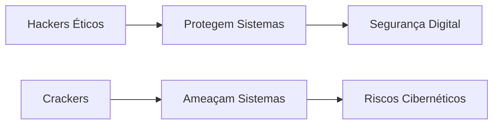

**1 – Quais os Direitos de primeira geração (individuais ou negativos), e indique quais aquele que não são direitos relacionados às pessoas, individualmente.**
Os direitos de primeira geração são aqueles ligados às liberdades individuais e à limitação do poder do Estado. São chamados de "negativos" porque exigem uma abstenção do Estado (não interferência). Entre eles estão:
- Direito à vida
- Direito à liberdade (liberdade de expressão, religiosa, locomoção)
- Direito à propriedade privada 
- Pessoas jurídicas de direito público internacional (como outros Estados ou organizações internacionais), pois os direitos fundamentais são garantidos principalmente a pessoas físicas e, em alguns casos, a pessoas jurídicas de direito privado.
- Entidades que não possuem personalidade jurídica reconhecida (como grupos informais não registrados).
- Indivíduos que, por atos ilícitos, tenham seus direitos restringidos judicialmente (ex.: condenados por crimes graves podem ter alguns direitos limitados, como a liberdade).
- Direito à igualdade perante a lei
- Direito à segurança jurídica

Dentre esses, o direito que não se relaciona diretamente com as pessoas individualmente é o direito à propriedade privada, pois pode ser atribuído também a pessoas jurídicas (empresas, organizações), não apenas a indivíduos.

**2 – Indique quais são os Direito de segunda geração ou aqueles que são impostos ao Estado:**
Os direitos de segunda geração exigem uma ação positiva do Estado para sua concretização, sendo relacionados ao bem-estar social e à justiça distributiva. Entre eles estão:
- Direito à educação
- Direito à saúde
- Direito ao trabalho e à justa remuneração
- Direito à previdência social
- Direito à moradia
- Direito à cultura e ao lazer

Esses direitos são impostos ao Estado, que deve criar políticas públicas para garanti-los.

**3 – Diante do descrito na Constituição Federal em seu artigo 1º quais pessoas não podem ser titulares desses direitos.**
- Pessoas jurídicas de direito público internacional (como outros Estados ou organizações internacionais), pois os direitos fundamentais são garantidos principalmente a pessoas físicas e, em alguns casos, a pessoas jurídicas de direito privado.
- Entidades que não possuem personalidade jurídica reconhecida (como grupos informais não registrados).
- Indivíduos que, por atos ilícitos, tenham seus direitos restringidos judicialmente (ex.: condenados por crimes graves podem ter alguns direitos limitados, como a liberdade).

- Pessoas jurídicas (empresas, associações, ONGs etc.) têm direitos específicos (como propriedade, liberdade de iniciativa econômica), mas não são titulares de direitos como dignidade humana, vida ou saúde, que são inerentes ao ser humano.
	- Exemplo: Uma empresa tem direito à propriedade (art. 5º, XXII), mas não tem "direito à vida" ou "direito à saúde".
- O próprio Estado não é titular desses direitos, pois ele é o garidor (dever de proteger e promover), e não o destinatário.
- Animais e entidades não humanas também não são titulares desses direitos fundamentais, pois a CF/88 os reconhece apenas para pessoas naturais (humanas).

**Sancionada a LGPD, em seu texto ela estabelece que os titulares de dados passarão a ter maior controle sobre todo o processamento dos seus dados pessoais (assim entendidos como qualquer informação que identifique diretamente ou torne identificável uma pessoa natural), do que decorrem diversas obrigações para controladores (a quem competem as decisões sobre o tratamento dos dados) e operadores (aqueles que tratam os dados por ordem dos controladores).” Através de emenda constitucional, os dados são considerados direitos fundamentais constitucionalizados. Tendo como base o texto acima indique quando os dados pessoais poderão ser revelados sem autorização dos seus titulares?**
   - Cumprimento de obrigação legal ou regulatória (ex.: compartilhamento com órgãos fiscais ou judiciais).
   - Execução de políticas públicas (previstas em leis ou contratos).
   - Realização de estudos por órgãos de pesquisa (dados anonimizados quando possível).
   - Exercício regular de direitos (ex.: defesa em processos judiciais).
   - Proteção da vida ou incolumidade física do titular ou terceiro.
   - Prevenção à fraude e segurança do titular (ex.: bancos verificando dados para evitar golpes).
   - Segurança pública, investigação criminal ou defesa nacional 

**4 - Os piratas virtuais enganam os internautas e se apoderam de suas informações pessoais para fazer compras on-line ou realizar transferências financeiras indevidamente.  Segundo o IPDI (Instituto de Peritos em Tecnologias Digitais e Telecomunicações), pessoas que usam a informática para roubar identidades podem responder por estelionato, furto mediante fraude, intercepção de dados, quebra de sigilo bancário e formação de quadrilha. Segundo a doutrina nacional, os crimes cibernéticos (também chamados de eletrônicos ou virtuais), dividem-se em puros (ou próprios), ou impuros (ou impróprios). Definir os crimes puros e impuros diante da doutrina penal.**
Crimes Cibernéticos Puros (Próprios):
São delitos que só existem em razão da tecnologia, ou seja, não teriam como ser cometidos sem o ambiente digital. São tipificados especificamente na legislação penal, como:
- Invasão de dispositivo informático (hacking)
- Interceptação ilegal de comunicações digitais 
- Falsificação de cartões de crédito/débito 
- Difusão de malware

Crimes Cibernéticos Impuros (Impróprios):
São crimes tradicionais cometidos por meios digitais, ou seja, a internet ou sistemas informatizados são apenas o meio utilizado. Exemplos:
- Estelionato – como phishing ou golpes de compras online.
- Furto mediante fraude – roubo de dados bancários.
- Calúnia, difamação e injúria – em redes sociais.
- Formação de quadrilha – grupos de hackers.

Diferença-chave:
- Puros: Requerem o ambiente digital para existir (ex.: hacking).
- Impuros: São crimes comuns praticados via tecnologia (ex.: fraude online).

**5 - Um hacker, por ter conseguido subtrair previamente a senha de acesso, invadiu o tablet do vice-Presidente da Câmara dos Deputados e, sem este saber, adulterou informações importantes relativas ao funcionamento da Casa Parlamentar, trazendo grande prejuízo político. Identificada a pessoa, o aludido congressista ajuizou queixa-crime. Ao final do processo penal, o hacker foi condenado com aumento de pena de um terço, por conta do sujeito passivo do delito. Responda se houve crime e quem deverá deflagrar a ação penal, o particular ou o Ministério Público?**
1. Houve crime?
Sim, o hacker praticou ao menos dois crimes:
- Invasão de dispositivo informático (Art. 154-A, CP) – Acesso não autorizado ao tablet.
- Adulteração de dados/sistema (Art. 266, CP – sabotagem informática) – Modificação de informações críticas.
- Possivelmente outros crimes (como dano qualificado – Art. 163, §1º, CP – devido ao prejuízo político).

1. Quem deve deflagrar a ação penal?
Ação penal pública condicionada à representação (Art. 154-A, §2º, CP):
- O crime de invasão de dispositivo exige queixa do ofendido (vice-presidente).
- Uma vez apresentada a queixa-crime, o Ministério Público (MP) assume a ação penal.

Resumo:
- O particular (vice-presidente) deve representar (formalizar a queixa).
- O MP então promove a ação penal.

**6 - Manuela, atriz famosa, teve seu computador invadido e seus arquivos pessoais subtraídos, vendo suas fotos íntimas expostas na rede mundial de computadores. O caso relata a situação criminosa, amparada pelo crime que condena quem invade dispositivo informático alheio para obter, adulterar ou destruir dados ou informações ou para instalar vulnerabilidades que lhe possam proporcionar vantagem ilícita. Qual crime praticado em desfavor de Manoela?**
O criminoso que invadiu o computador de Manuela e vazou suas fotos íntimas cometeu principalmente dois crimes previstos na Lei 12.737/2012 (Lei Carolina Dieckmann) e no Código Penal:
- Invasão de Dispositivo Informático (Art. 154-A, CP)
	- Acessou o computador dela sem permissão para roubar arquivos.
- Divulgação de Imagens Íntimas sem Consentimento (Art. 218-C, CP)
	- Espalhou as fotos pessoais dela na internet (crime específico contra a intimidade sexual).

Outros crimes que podem se aplicar:
- Extorsão (se o hacker ameaçou vazar as fotos para obter algo).
- Dano moral (pela exposição pública, com direito a indenização na Justiça Cível).

Resumo:
O criminoso invadiu o computador (crime digital) + vazou fotos íntimas (crime contra a honra/intimidade). Manuela pode processá-lo criminalmente (ação do MP) e ainda entrar com ação cível por danos morais.

**7 - Com base no depoimento a seguir, que possui relação direta com a criação da Lei nº 12.737/2012, como esta lei ficou conhecida: “Em 2011 eu passei por um processo doloroso. A minha intimidade foi invadida e isso gerou uma grande discussão pública. Eu tive fotos roubadas e fui extorquida: ou eu pagava ou as minhas fotos seriam publicadas. Eu me recusei a pagar o dinheiro pedido pelos criminosos e eu tive essas fotos íntimas divulgadas na internet. Tudo isso gerou tanta discussão, que se fez urgente a criação de uma lei que protegesse as pessoas, principalmente as mulheres porque são as principais vítimas de crimes na internet”.**
A Lei nº 12.737/2012 ficou conhecida como Lei Carolina Dieckmann em referência à atriz brasileira que sofreu um ataque hacker em 2011, quando criminosos invadiram seu computador, roubaram fotos íntimas e tentaram extorqui-la. Como ela se recusou a pagar, as imagens foram vazadas na internet, causando grande comoção pública.

**8– É correto afirmar, com base na Lei Federal 12.737/2012, que : Quem interrompe serviço telemático ou de informação de utilidade pública, ou impede ou dificulta-lhe o restabelecimento, comete infração penal equiparada ao crime de interrupção ou perturbação de serviço telegráfico, telefônico, informático, telemático ou de informação de utilidade pública, previsto no art. 266 do Código Penal Brasileiro.**
A Lei 12.737/2012 expandiu a proteção penal para incluir ataques a sistemas digitais de utilidade pública, equiparando-os aos crimes tradicionais contra serviços essenciais.

Exemplos de aplicação:
- Derrubar um site governamental (ex.: portal de serviços públicos).
- Atacar servidores de bancos ou hospitais, tornando-os inacessíveis.
- Bloquear sistemas de emergência (como redes de polícia ou defesa civil).

**9 - Em 2021, o governo brasileiro sancionou a Lei nº 14.155, que pune com mais rigor os crimes cibernéticos. “A iniciativa foi motivada pelo fato de as ameaças cibernéticas terem crescido em escala mundial. Organizações públicas e privadas de diversos países têm reforçado suas políticas de segurança da informação e de segurança cibernética e elevado o nível de proteção dos sistemas computacionais por eles utilizados, especialmente no âmbito da gestão estatal.”**
Principais Mudanças:
- Agravamento de Penas (Art. 154-A, CP):
	- Invasão de dispositivos com dano econômico ou risco à vida: pena aumentada em 1/3 a 2/3.
	- Se o alvo for serviço público essencial (saúde, energia, transporte): pena em dobro.
- Novos Tipos Penais (Art. 154-B, CP):
	- Falsificação de cartões (crédito/débito): pena de 2 a 6 anos.
	- Uso malicioso de dados financeiros roubados: até 8 anos de prisão.
- Foco em Infraestruturas Críticas:
	- Ataques a sistemas de água, energia, telecomunicações ou segurança nacional agora têm penas mais severas.

Motivação da Lei:
- Crescimento de crimes como ransomware, vazamentos de dados e espionagem digital.
- Alinhamento com padrões internacionais (ex.: Diretiva NIS da UE).

Impacto Prático:
- Empresas e órgãos públicos devem reforçar segurança cibernética.
- Criminosos que atacarem serviços essenciais enfrentam penas mais duras.

Exemplo: Um hacker que derruba o sistema de um hospital pode pegar até 10 anos de prisão (ante 3 anos antes da lei).

**10 - No que diz respeito aos crimes cibernéticos, está correto dizer que?**

**Os Crimes cibernéticos são aqueles que utilizam computadores ou dispositivos eletrônicos conectados para praticar ações que geram danos a indivíduos ou patrimônios, por meio de extorsão financeira, estresse emocional ou danos à reputação de vítimas expostas na internet.**

**Os Crimes cibernéticos podem ocorrer de diversas maneiras, mas os dois tipos mais comuns são: 1. os ataques a computadores, para obtenção de dados, senhas, extorsão ou somente causar prejuízo; 2. crimes que usam computadores para realizar atividades ilegais.**

**A adequação das empresas à LGPD, além de uma premente necessidade, é sem dúvida uma**
vantagem competitiva para as empresas.

Todas estão corretas

Definição de Crimes Cibernéticos:
- São condutas ilícitas praticadas através de dispositivos eletrônicos conectados
- Podem causar:
	- Danos financeiros (extorsão, fraudes)
	- Danos emocionais (cyberbullying, exposição indevida)
	- Danos à reputação (vazamento de informações, difamação digital)

Classificação dos Crimes Cibernéticos:
a) Crimes contra sistemas computacionais:
- Invasão de dispositivos (hacking)
- Roubo de dados/senhas
- Sabotagem de sistemas

b) Crimes convencionais praticados via meios digitais:
- Estelionato online
- Calúnia/difamação em redes sociais
- Pirataria digital

c) Sobre a LGPD:
- A adequação é obrigatória (exigência legal)
- Constitui vantagem competitiva por:
	- Aumentar a confiança dos clientes
	- Reduzir riscos de multas e processos
	- Melhorar a governança de dados corporativos

**11 - A proteção da privacidade e dos dados pessoais é certamente um investimento crucial para aquelas sociedades que pensam no seu futuro a médio e longo prazo. A nível empresarial, estamos falando sobre a importância dos dados (de pessoas físicas ou jurídicas) nas decisões de um negócio.**

**Com base no texto supra, responda: Ana teve fotos suas de cunho íntimo divulgadas para colegas de seu curso na universidade por um ex-namorado que, inconformado com o término do relacionamento, invadiu o computador de Ana e subtraiu as fotos. O aumento de casos dessa natureza motivou a promulgação de qual lei? E qual preceito Constitucional que protege direitos fundamentais estará sendo violado. Explique.** 
Lei Aplicável:
O caso descrito está amparado pela Lei 13.718/2018, conhecida como Lei de Importunação Sexual, que incluiu no Código Penal o:
- Art. 218-C: Criminaliza a divulgação não autorizada de cena de nudez, ato sexual ou pornografia sem consentimento.
- Pena: 1 a 5 anos de prisão (aumentada em 1/3 se o crime for cometido por ex-cônjuge ou namorado).

Complementarmente, aplica-se também:
Lei 12.737/2012 (Lei Carolina Dieckmann): Pela invasão do computador (Art. 154-A, CP).

Preceito Constitucional Violado:
O ato viola o Art. 5º, X, da Constituição Federal, que protege:
- Intimidade
- Vida privada
- Honra
- Imagem das pessoas como direitos fundamentais invioláveis.

Explicação do Caso:
O ex-namorado cometeu dois crimes:
	a) Invasão de dispositivo informático (Art. 154-A, CP) para roubar as fotos.
	b) Divulgação de imagens íntimas (Art. 218-C, CP) como forma de vingança (revenge porn).
A motivação da Lei 13.718/2018 foi justamente coibir o aumento de casos como o de Ana, onde mulheres são as principais vítimas de violência digital.

Conclusão:
Ana pode:
- Registrar um BO na delegacia (crimes digitais).
- Ação penal: Pública incondicionada (não depende de representação, Art. 225, CPP).
- Processar civilmente por danos morais.

**12 Definir hacker e craker.**
# Definições de Hacker e Cracker

## 1. Hacker (Ético/White Hat)
- **Definição**: Especialista em segurança digital que:
  - Identifica vulnerabilidades em sistemas
  - Desenvolve soluções de proteção
  - Realiza testes de invasão autorizados (pentesting)
- **Atuação**: Legal, com consentimento do proprietário do sistema
- **Finalidade**: Melhorar a segurança cibernética
- **Exemplo**: Profissional contratado para testar a segurança bancária

## 2. Cracker (Black Hat)
- **Definição**: Indivíduo que utiliza técnicas para:
  - Invadir sistemas ilegalmente
  - Burlar mecanismos de segurança
  - Cometer crimes digitais
- **Atuação**: Ilegal, sem autorização
- **Finalidade**: Ganhos financeiros, causar danos ou roubo de dados
- **Exemplo**: Criminoso que invade contas bancárias

## Diferença Fundamental
| Característica | Hacker            | Cracker         |
| -------------- | ----------------- | --------------- |
| Legalidade     | Legal             | Ilegal          |
| Intenção       | Protetora         | Maliciosa       |
| Autorização    | Com consentimento | Sem autorização |

## Enquadramento Legal (Brasil)
- **Artigos aplicáveis**:
  - Art. 154-A CP (invasão de dispositivos)
  - Lei 12.737/2012 (crimes cibernéticos)
  - Art. 171 CP (estelionato digital)

## Relação com Segurança da Informação

